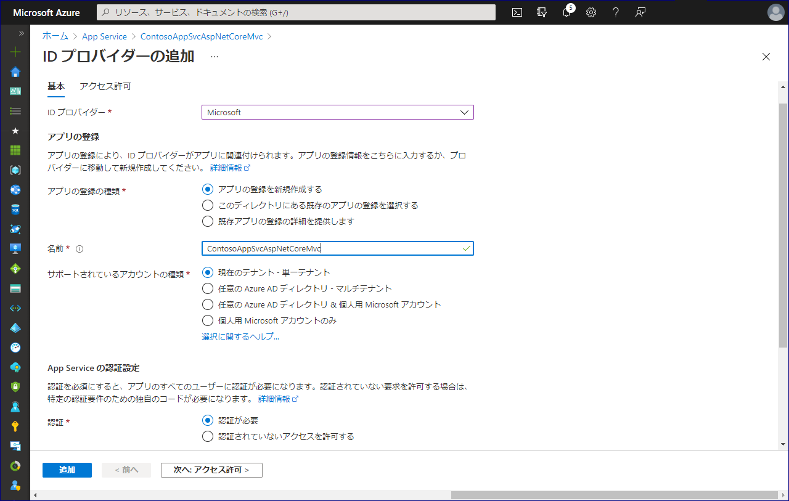

# App Service 認証を利用して複数のテナントの Azure AD ユーザーをサインインさせる方法

こんにちは、Azure & Identity サポート チームの高田です。今回は、App Service 認証を利用して複数のテナントの Azure AD ユーザーを App Service にサインインさせる方法について案内いたします。

まず、App Service は Web サイトや REST API など HTTP ベースのサービスを公開するための Azure のサービスです。例えば Visual Studio で開発した ASP.NET Core アプリケーションを Azure を用いて公開したい場合、Visual Studio の Publish 機能を用いることで非常に簡単に実現できます。またお客様によっては、そのようにして公開した Web サイトに対し認証機能を組み込みたい場合もあると思います。この場合に活用いただけるのが App Service 認証です (Easy Auth という名称で呼ばれることもあります)。

以下では、App Service 認証を利用して複数の Azure AD テナントのユーザーを App Service 上の Web サイトにサインインさせる方法をご紹介します。Web サイトの公開範囲ごとにシナリオを分けて解説していきます。

- シナリオ 1: App Service の Web サイトを自テナントのユーザーだけに公開したい。
- シナリオ 2: 主に自テナントのユーザー向けに提供している App Service の Web サイトを別テナントの一部ユーザーにもアクセスさせたい
- シナリオ 3: App Service の Web サイトを複数の Azure AD テナントのユーザーにアクセスさせたい

以下にシナリオごとに順に解説していきます。以下のシナリオは、全て ASP.NET Core Web アプリケーションなどを Visual Studio などから App Service に Publish 済みであるということを前提とします。App Service へ ASP.NET Core アプリケーションを展開する方法については、[Azure App Service に ASP.NET Core アプリを展開する](https://docs.microsoft.com/ja-jp/aspnet/core/host-and-deploy/azure-apps/?view=aspnetcore-5.0&tabs=visual-studio) などのページをご覧ください。

## シナリオ 1: App Service の Web サイトを自テナントのユーザーだけに公開したい

まず最も基本的なパターンとして、App Service のサイトを自テナントのユーザーだけに公開したい場合を考えます。この場合、必要なのは、App Service 認証の設定のみです。App Service 認証の設定を行うだけで、アプリへのアクセス時に Azure AD での認証が求められるようになります。また認証が求められた際には、そのアプリが登録されている Azure AD テナントのユーザーのみがサインイン可能です。

App Service を構成するため以下の手順を進めます。以下の手順は [チュートリアル: Azure App Service で実行されている Web アプリに認証を追加する](https://docs.microsoft.com/ja-jp/azure/app-service/scenario-secure-app-authentication-app-service#configure-authentication-and-authorization) でも解説がありますので、よろしければ併せてご参照ください。

1. Auzre ポータルに App Service の管理者でサインインし、App Service を開きます。
2. App Service 認証を構成したい Web アプリを選びます。
3. [認証] を選択して、[ID プロバイダーを追加] を選択します。
4. [ID プロバイダー] として [Microsoft] を選択します。
5. [アプリの登録の種類] が [アプリの登録を新規作成する] であることを確認します。
6. [サポートされているアカウントの種類] が [現在のテナント - 単一テナント] であることを確認します。
7. [認証] が [認証が必要] に設定されていることを確認します。
8. [追加] を選択します。

以上で操作は可能です。Web サイトの URL にアクセスいただくと、Azure AD の認証画面が表示されるようになります。上記操作を行った Azure AD テナントのユーザーを指定すれば、アプリにサインインできます。

なお、ユーザーが App Service 認証を経由して Web アプリにアクセスすると、Web アプリには以下のような値を含む HTTP ヘッダーが渡されます。Web アプリはこのヘッダーの値を確認することで、どのようなユーザーがサインインしてきたかを識別可能です。詳細については [Azure App Service 上での認証と承認の高度な使用方法 - ユーザー要求へのアクセス](https://docs.microsoft.com/ja-jp/azure/app-service/app-service-authentication-how-to#access-user-claims) もご参照ください。

| HTTP ヘッダーの名前 | ヘッダーの値 (例) |
| ------ | ------|
| X-MS-CLIENT-PRINCIPAL-NAME | test@contoso.com |
| X-MS-CLIENT-PRINCIPAL-ID | bfef01fb-9b32-457a-b488-690de651bf7f |

## シナリオ 2: 主に自テナントのユーザー向けに提供している App Service の Web サイトを別テナントの一部ユーザーにもアクセスさせたい

このシナリオの場合、Azure AD が提供する B2B ゲスト招待機能を利用することが適切です。App Service 認証はシナリオ 1 と同様に単一テナントとして構成し、自テナントに外部テナントのユーザーをゲスト招待します。外部テナントのユーザーを都度招待するということが手間でなければ (事前にこのユーザーは App Service の Web サイトアクセスさせたいというのがわかっていれば)、Azure AD の観点でも適切な方法になります。

上述のとおり、このシナリオの場合は App Service 認証の観点では特に構成変更の必要はありません。シナリオ 1 に加えて、以下の Azure AD 側の対応 (ゲストの招待操作) を実施いただければと思います。

1. Auzre ポータルにアクセスします。
2. App Service を構成しているテナントに Azure AD のグローバル管理者やゲスト招待元のディレクトリ ロールを持つユーザーでサインインします。
3. Azure Active Directory ブレードに進み、[ユーザー] を開きます。
4. [+ 新しいゲスト ユーザー] を押します。
5. 招待したい外部校テナントのユーザーの E メール アドレス (test@fabrikam.com) を入力して、招待ボタンを押します。
6. 指定されたユーザーで招待メールが届いているかを確認します。
7. 招待メールを受け取ったユーザーは、メールに従い招待の処理を完了します。

以上の操作を行うことで、招待処理を完了したユーザーは、App Service を構成している Azure AD テナントにゲストとして Azure AD アカウントが作成されます。これにより、そのゲスト ユーザーは App Service を構成している Azure AD テナント上のユーザーとして認識されます。このため App Service 認証の設定が単一テナントのままでも、その Web サイトにサインインが可能になります。招待していないユーザーで Web サイトにアクセスしようとするとそのユーザーはアクセスがブロックされます。

## シナリオ 3: App Service の Web サイトを複数の Azure AD テナントのユーザーにアクセスさせたい

上記シナリオ 2 では、App Service の Web サイトに外部のユーザーをアクセスさせるにあたり個別にゲスト ユーザーの招待が必要でした。個別に招待を行うのではなく、複数の Azure AD テナントのユーザーに Web サイトへのアクセスを許可したい場合は、App Service 認証を単一テナントではなく、マルチテナントとして構成します。これにより、どの Azure AD テナントからでもその Web サイトにアクセスさせることができるようになります。

まず、既に単一テナントで App Service 認証を構成している場合は、以下の手順に沿って既存の構成を一旦削除ください。

1. Auzre ポータルに App Service の管理者でサインインし、App Service を開きます。
2. App Service 認証を構成したい Web アプリを選びます。
3. [認証] を選択して、[認証の設定] の隣にある [編集] を選択します。
4. [認証されていないアクセスを許可する] を選択して、[保存] を押下します。
5. [ID プロバイダー] から Microsoft を探して、削除のアイコンをクリックします。
6. 確認画面で [削除] を選択します。

続いて、マルチテナントとして構成するため ID プロバイダーを追加しなおします。

1. [ID プロバイダーを追加] を選択します。
2. [ID プロバイダー] として [Microsoft] を選択します。
3. [アプリの登録の種類] が [アプリの登録を新規作成する] であることを確認します。
4. [サポートされているアカウントの種類] で [任意の Azure AD ディレクトリ - マルチテナント] を選択します。
5. [認証] が [認証が必要] に設定されていることを確認します。
6. [追加] を選択します。

なお、[追加] を押下した際に、同じ名前のアプリケーションが既に存在するメッセージが表示されるかと思います。これは先に単一テナントで App Service 認証を構成したときのアプリケーション オブジェクトが Azure AD 側に残っているためです。メッセージを回避するには名前を別のものに変更するか、以下の手順で Azure AD から該当のアプリケーション オブジェクトを削除して再度同じ名前で追加を実施ください。

1. Azure Active Directory ブレードを開き、[アプリの登録] を開きます。
2. 検索ボックスにアプリケーションの名前を入力します。
3. 結果が表示されたらそれをクリックします。
4. [削除] を選択します。
5. 確認が求められたら [削除] を再度押下します。

ID プロバイダーの追加が完了したら、さらに以下の操作を行います。

1. [ID プロバイダー] から Microsoft を探して、編集のアイコンをクリックします。
2. [発行者の URL] を <https://login.microsoftonline.com/common/v2.0> に変更します。
3. [保存] を選択します。

以上で操作は完了です。

Azure AD ではアプリケーション オブジェクト側の構成とログオン時の URL の指定内容によって、どのユーザーがアプリケーションにサインイン可能かを制御しています。元々上記 [発行者の URL] にはテナント ID を含む値が指定されていました。この場合、アプリケーションがマルチテナントで構成されていても、そのアプリにサインインできるのはその指定されたテナント上のユーザーのみとなります。発行者の URL を <https://login.microsoftonline.com/common/v2.0> に書き換えると、URL としてもマルチテナントを受け入れるようになるため、複数のテナントのユーザーからサインインが可能となります。

なお、上記状態では構成したとおり様々な Azure AD テナントから Web アプリにアクセスが可能となります。もしアプリを特定の数テナントだけにアクセスさせたいという場合は、アプリケーション側で X-MS-CLIENT-PRINCIPAL-NAME ヘッダーの値を確認し、サインインしたユーザーのドメイン名が意図したものでなければアクセスを拒否するなどの対応をご検討ください。
