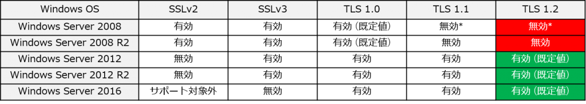
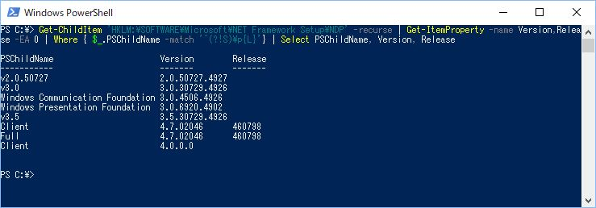
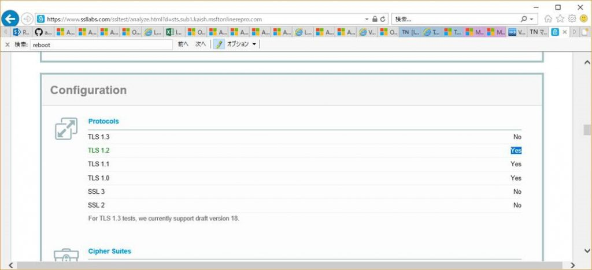
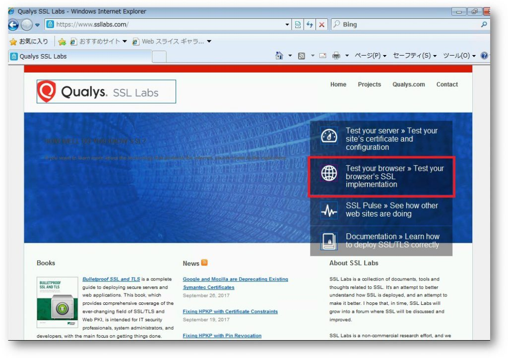
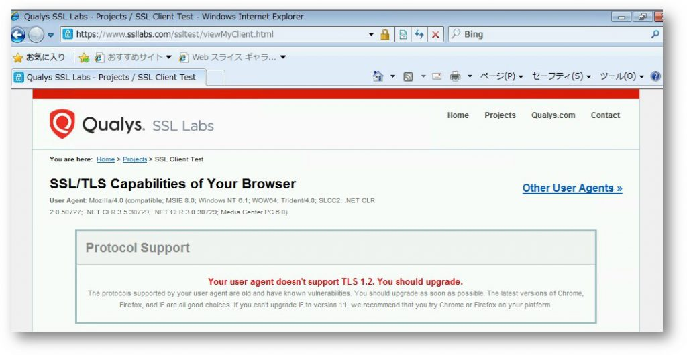

> 本記事は Technet Blog の更新停止に伴い https://blogs.technet.microsoft.com/jpazureid/2018/01/10/adfs-tls12/ の内容を移行したものです。
> 元の記事の最新の更新情報については、本内容をご参照ください。

# Office 365 の TLS 1.0/1.1 無効化に伴う AD FS / WAP (AD FS Proxy) の対応

2018/02/15: TLS 1.2 の必須化は当初予定していた 2018/3/1 から 2018/10/31 に延期になりました。  

こんにちは、 Azure ID の三浦です。  
今回は Office 365 での TLS 1.0 と 1.1 のサポート無効化に伴う AD FS / WAP (AD FS Proxy) での対応についてまとめました。  
次の情報にありますように 2018/10/31 に Office 365 では TLS 1.0 と 1.1 のサポートを無効化することを予定しています。  

Office 365 への TLS 1.2 の実装に対する準備  
https://support.microsoft.com/ja-jp/help/4057306/preparing-for-tls-1-2-in-office-365  

フェデレーション環境では、 AD FS および WAP (Windows Server 2012 以前は AD FS Proxy) で TLS 1.2 による接続を有効にする必要があります。以下の表のとおり最近の OS (Windows Server 2012 以降) であれば既定で TLS 1.2 を利用できるようになっており、AD FS / WAP の機能自体については特別な対処は必要ありません。  
(例 AD FS および WAP が Windows Server 2012 R2 で構成されている場合)  

AD FS サーバーでサポートされるセキュリティ プロトコル一覧  
  

- Windows Sever 2008 はパッチ適用した上でのレジストリ設定が必要です。  

この記事では次の順番で確認方法、設定方法について記載しています。  

1. TLS 1.2 設定状況の確認、設定方法  
OS で TLS 1.2 が利用できるようになっているかの確認です。基本的に Windows Server 2008 R2  でのみ対応が必要です。  

2. PowerShell モジュールの確認  
Azure AD への操作で利用する PowerShell モジュールの確認手順です。OS によらず確認ください。ただ、対応できていなくともクライアントからの認証に問題が生じるということは想定されず、管理のための操作ができないなどの影響が生じる見込みです。  

3. .NET Framework の確認  
AD FS は .NET Framework を利用します。OS によらず確認ください。こちらについても、対応できていなくともクライアントからの認証に問題が生じるということは想定されず、管理のための操作ができないなどの影響が生じる見込みです。  

4. TLS 1.0 / TLS 1.1 を無効にする  
AD FS で TLS 1.0 / TLS 1.1 を無効にするための手順です。無効にすることは必須ではありませんが、セキュリティ観点から無効にしたいという要件がある場合に実施ください。1、2、3 の確認および設定が完了していることが前提です。  

5. クライアントの確認  
AD FS ではありませんが、クライアント側の TLS 1.2 対応について確認ポイントをまとめています。

6. その他  
クライアントが TLS 1.2 を利用してアクセスしているか確認する方法などについてまとめています。  

## 1. TLS 1.2 設定状況の確認、設定方法  

Windows Server 2012 以降の OS であれば、特に明示的に TLS 1.2 を無効にするようにレジストリ設定を変えていなければ対処は不要です。  
本当に大丈夫かは HKEY_LOCAL_MACHINE\SYSTEM\CurrentControlSet\Control\SecurityProviders\Schannel\Protocols キー配下に何も設定が無い (既定の状態)、もしくは以下のような設定がされているかで判断でき、この状態では TLS 1.2 が利用できます。  
Windows Server  2008 R2 で構成された AD FS / AD FS Proxy の場合には、既定では TLS 1.2 は利用されないため、対処が必要です。このとき次のように値を設定します。  
値を変更した場合には、システムの再起動も必要です。  

```reg
キー：  HKEY_LOCAL_MACHINE\SYSTEM\CurrentControlSet\Control\SecurityProviders\Schannel\Protocols\TLS 1.2\Server  
名前：Enabled  
タイプ: REG_DWORD  
値：1  

名前：DisabledByDefault  
タイプ: REG_DWORD  
値：0  
```

正確に言うと Windows Server 2008 R2 でも Enabled については、特に値を設定していなくても 1 を設定したときと同様となっています。ただ  AD FS が TLS 1.2 を利用できるかは Enabled が 1 になっていることに加えて DisabledByDefault が 0 になっている必要がありますが Windows Server 2008 R2 では 1 です (値は既定では存在しませんが、何もなければ Windows Server 2008 R2 では 1 相当の動作になります)。対応としては DisabledByDefault のみの設定でも構いませんが、上記のように両方とも明示的にレジストリを設定しておくことをお勧めします。  

なお、管理者権限で次の PowerShell コマンドを実行することで一括して上記設定が可能です。

```powershell
New-Item 'HKLM:\SYSTEM\CurrentControlSet\Control\SecurityProviders\SCHANNEL\Protocols\TLS 1.2\Server' -Force | Out-Null  
New-ItemProperty -path 'HKLM:\SYSTEM\CurrentControlSet\Control\SecurityProviders\SCHANNEL\Protocols\TLS 1.2\Server' -name 'Enabled' -value '1' -PropertyType 'DWord' -Force | Out-Null  
New-ItemProperty -path 'HKLM:\SYSTEM\CurrentControlSet\Control\SecurityProviders\SCHANNEL\Protocols\TLS 1.2\Server' -name 'DisabledByDefault' -value '0' -PropertyType 'DWord' -Force | Out-Null  
Write-Host 'TLS 1.2 has been enabled.'  
```

AD FS / WAP (AD FS Proxy) の機能という意味では、確認、対応が必要な項目は以上です。しかし、 AD FS / WAP (AD FS Proxy) から PowerShell を利用して Office 365 (Azure AD) に対して設定を変更するようなこともあると思います。この時には PowerShell が利用する .NET Framework で TLS 1.2 を利用するよう、設定を行っておく必要があります。これは Schannel のレジストリの場合と異なり、Windows Server 2008 R2 だけでなく Windows Server 2012 / 2012 R2 / 2016 でも必要です。  

## 2. PowerShell モジュールの確認  

AD FS の構成変更のために Azure AD PowerShell モジュール (Connect-MsolService など) を利用するようなケースがあります。このときの接続でも TLS 1.2 が利用されるように構成する必要があります。

注意事項:  
Azure AD に接続するために利用される Azure AD PowerShell モジュールは更新されています。ご案内する TLS 1.2 を利用するための対処策は 1.1.166.0 以降の Azure AD PowerShell を利用していることが前提となります。利用している Azure AD PowerShell のバージョンは次の PowerShell のコマンドで確認できます。  

```powershell
(get-item C:\Windows\System32\WindowsPowerShell\v1.0\Modules\MSOnline\Microsoft.Online.Administration.Automation.PSModule.dll).VersionInfo.FileVersion  
```

このコマンドで実行結果が表示されない場合には次のコマンド実行します。  

```powershell
(get-Item "C:\Program Files\WindowsPowerShell\Modules\MSOnline\Microsoft.Online.Administration.Automation.PSModule.dll").VersionInfo.FileVersion  
```

このコマンドでも表示されない場合には次のコマンドを実行します。  

```powershell
get-module -name MSOnline  
```

実行結果として 1.1.166.0 以降が表示されれば最新バージョンを利用していますので問題ありません。  
(2018/10/15 時点で最新版は 1.1.183.17)  
1.1.166.0 よりも前のバージョンが表示される場合には一旦 Azure AD PowerShell モジュールをプログラムの追加と削除でアンインストールした上で  リンクにある手順で MSOnline (Azure AD v1) のインストールを実施し、以降の作業を実施します。  

## 3. .NET Framework の確認  

AD FS および WAP (AD FS Proxy) サーバーで .NET Framework に関するレジストリを設定します。このとき .NET Framework 4.6 より前か、それ以降かによって必要な作業が変わってきます (Azure AD PowerShell の最新版を利用するためには .NET Framework 4.5 以上が必要ですので 4.5 以降であることを前提としています)。  
.NET Framework のバージョン番号は次の PowerShell コマンドを実行することで確認できます。  

```powershell
Get-ChildItem 'HKLM:\SOFTWARE\Microsoft\NET Framework Setup\NDP' -recurse | Get-ItemProperty -name Version,Release -EA 0 | Where { $_.PSChildName -match '^(?!S)\p{L}'} | Select PSChildName, Version, Release  
```

以下の例では 4.7.02046 という結果から 4.7 がインストールされていることが確認できます。  


**.NET Framework 4.5.x (4.5、4.5.1 など) の場合:**  
セキュリティ アドバイザリ 2960358 で紹介されている修正プログラムが必要ですので適用します。  

マイクロソフト セキュリティ アドバイザリ 2960358  
https://technet.microsoft.com/library/security/2960358  

この更新プログラムのインストール時に発生する可能性のある既知の問題が報告されていますので、併せてご確認ください。  
(.NET Framework を使用している製品は多くあります。 AD FS / WAP 以外の役割を兼ねている場合には、更新プログラムの適用、 TLS 1.2 を利用させるように変更する際に他に影響が無いかの動作確認が必要です)  

セキュリティ更新プログラム 2960358 をインストールした後に、Internet Explorer でホストされるマネージ コントロールを含むアプリケーションとノータッチ デプロイメントが正しく機能しないことがある  
https://support.microsoft.com/ja-jp/kb/2978675  

更新プログラムが適用されると以下のレジストリが設定されます。設定されていることを確認し、もし設定されていなければ変更します。  

```reg
キー：HKEY_LOCAL_MACHINE\SOFTWARE\Microsoft\.NETFramework\v4.0.30319  
名前：SchUseStrongCrypto  
タイプ: REG_DWORD  
値：1  

キー：HKEY_LOCAL_MACHINE\SOFTWARE\Wow6432Node\Microsoft\.NETFramework\v4.0.30319  
名前：SchUseStrongCrypto  
タイプ: REG_DWORD  
値：1  
```

**.NET Framework 4.6 以降の場合:**  
特に修正プログラムの適用は不要ですが、レジストリを手動で設定する必要があります。設定後のシステムの再起動は不要です (PowerShell を起動している場合は設定を反映させて TLS 1.2 を利用させるためには PowerShell の再起動が必要です)。Windows Server 2016 は既定で .NET Framework 4.6 が含まれています。  

```reg
キー：HKEY_LOCAL_MACHINE\SOFTWARE\Microsoft\.NETFramework\v4.0.30319  
名前：SchUseStrongCrypto  
タイプ: REG_DWORD  
値：1  
キー：HKEY_LOCAL_MACHINE\SOFTWARE\Wow6432Node\Microsoft\.NETFramework\v4.0.30319  
名前：SchUseStrongCrypto  
タイプ: REG_DWORD  
値：1  
```

## 4. TLS 1.0 / TLS 1.1 を無効にする  

Office 365 の TLS 1.2 必須化に伴い、 AD FS やアクセスするクライアントで TLS 1.0 / 1.1 を無効にすることは必須ではありません。ただ、セキュリティ観点から TLS 1.0 /1.1 を無効にしたいという要件もあると思います。しかし、このとき注意が必要です。AD FS と WAP (AD FS Proxy) 間でも PowerShell の場合と同様に .NET Framework を利用した通信を実施し、この通信が TLS 1.0 を利用します。AD FS で TLS 1.0/1.1 を無効にするには事前に 3 でまとめました手順で .NET Framework で TLS 1.2 を利用するように構成済みであることが前提です。  
.NET Framework の設定を変更しておけば、AD FS と WAP (AD FS Proxy) で TLS 1.0/1.1 を無効にしても、このバージョンのみを使用できるクライアントからのアクセスができなくなる以外に基本的には想定される影響はありません。ただ、過去に TLS 1.0 を無効にした場合にいくつか発生する問題も報告されており、ご使用の環境では TLS 1.0/1.1 を無効にすると問題が発生し、再度有効にする必要がある場合もありますので、以下の公開情報も参照ください。  

Considerations for disabling and replacing TLS 1.0 in ADFS  
https://support.microsoft.com/en-us/help/3194197/considerations-for-disabling-and-replacing-tls-1-0-in-adfs  

**TLS 1.0 / 1.1 無効化方法**  
事前に PowerShell の設定として記載の手順で .NET Framework で TLS 1.2 が利用されるように構成します。Windows Server  2008 R2 および 2012 では AD FS と AD FS Proxy 間の通信で .NET Framework 3.5 を利用するため以下のように v2.0.50727 キー配下への設定も実施します。  

```reg
 キー：HKEY_LOCAL_MACHINE\SOFTWARE\Microsoft\.NETFramework\v2.0.50727  
 名前： SchUseStrongCrypto  
タイプ: REG_DWORD  
 値：1  
```

.NET Framework の設定が完了しましたら TLS 1.0/1.1 をレジストリ設定により無効にします。TLS 1.0/1.1 を無効にする際のレジストリは以下です。レジストリを変更しましたら、システムを再起動します。  

```reg
キー：HKEY_LOCAL_MACHINE\SYSTEM\CurrentControlSet\Control\SecurityProviders\Schannel\Protocols\TLS 1.0\Server  
名前：Enabled  
タイプ: REG_DWORD  
値：0  

名前：DisabledByDefault  
タイプ: REG_DWORD  
値：1  

キー：HKEY_LOCAL_MACHINE\SYSTEM\CurrentControlSet\Control\SecurityProviders\Schannel\Protocols\TLS 1.1\Server  
名前：Enabled  
タイプ: REG_DWORD  
値：0  

名前：DisabledByDefault  
タイプ: REG_DWORD  
値：1  
```

なお、管理者権限で次の PowerShell コマンドを実行することで一括して上記設定が可能です。

```powershell
New-Item 'HKLM:\SYSTEM\CurrentControlSet\Control\SecurityProviders\SCHANNEL\Protocols\TLS 1.0\Server' -Force | Out-Null  
New-ItemProperty -path 'HKLM:\SYSTEM\CurrentControlSet\Control\SecurityProviders\SCHANNEL\Protocols\TLS 1.0\Server' -name 'Enabled' -value '0' -PropertyType 'DWord' -Force | Out-Null  
New-ItemProperty -path 'HKLM:\SYSTEM\CurrentControlSet\Control\SecurityProviders\SCHANNEL\Protocols\TLS 1.0\Server' -name 'DisabledByDefault' -value 1 -PropertyType 'DWord' -Force | Out-Null  
Write-Host 'TLS 1.0 has been disabled.'  
New-Item 'HKLM:\SYSTEM\CurrentControlSet\Control\SecurityProviders\SCHANNEL\Protocols\TLS 1.1\Server' -Force | Out-Null  
New-ItemProperty -path 'HKLM:\SYSTEM\CurrentControlSet\Control\SecurityProviders\SCHANNEL\Protocols\TLS 1.1\Server' -name 'Enabled' -value '0' -PropertyType 'DWord' -Force | Out-Null  
New-ItemProperty -path 'HKLM:\SYSTEM\CurrentControlSet\Control\SecurityProviders\SCHANNEL\Protocols\TLS 1.1\Server' -name 'DisabledByDefault' -value 1 -PropertyType 'DWord' -Force | Out-Null  
Write-Host 'TLS 1.1 has been disabled.'  
```

## 5. クライアントの確認  

今回は AD FS / WAP (AD FS Proxy) 観点での対処をまとめましたのでサーバー側の観点で説明してきましたが、実際のところ TLS ではクライアント側の設定も存在し、Office 365 の TLS 1.2 必須化に伴いクライアントの対処も必要です。例えば Outlook についてはリンクのように情報をまとめています。クライアント側で必要な設定としては次のような項目があります。  

1. OS の Schannel クライアント レジストリ設定
1. WinHTTP のレジストリ設定  
1. Internet Explorer の設定  
1. .NET Framework の設定  

4) についてはすでに PowerShell のところで言及していますので、そちらを参照ください。4) 以外の項目についてそれぞれ説明します。  

**1) OS の Schannel クライアント レジストリ設定**  
多くのケースで設定しなくても大丈夫ですが、Windows 7 / Windows Server 2008 R2 を利用している場合には変更をお勧めします。  
AD FS / WAP (AD FS Proxy) では HKEY_LOCAL_MACHINE\SYSTEM\CurrentControlSet\Control\SecurityProviders\Schannel\Protocols\TLS 1.2\Server キーで設定する Schannel の受け側としての設定がありましたが、通信を開始する側でも同様の設定があります。 Windows 7 / Windows Server 2008 R2 では、既定で TLS 1.2 自体は有効ですが、 TLS の有効・無効を設定する以外にそのバージョンを既定で利用するかを意味する DisabledByDefault という値が 1 に設定されています (それより後の OS では 0 です)。Internet Explorer、 WinHTTP を利用するアプリケーション、.NET Framework では、それぞれの構成で TLS 1.2 が有効でさえあれば、 DisabledByDefault が 1 であっても TLS 1.2 を利用します。しかし、一部のケースでこの OS の DisabledByDefault 値を見るものがあるため、 Windows 7 / Windows Server 2008 R2 では値を次のように変更しておいてください。  

```reg
キー：HKEY_LOCAL_MACHINE\SYSTEM\CurrentControlSet\Control\SecurityProviders\Schannel\Protocols\TLS 1.2\Client  
名前：Enabled  
タイプ: REG_DWORD  
値：1  

名前：DisabledByDefault  
タイプ: REG_DWORD  
値：0  
```

**2) WinHTTP のレジストリ設定**  
Outlook などのアプリケーションでは HTTP / HTTPS 接続に WinHTTP というコンポーネントを利用します。これらのアプリケーションの通信が TLS 1.2 を利用するためには、 WinHTTP で TLS 1.2 を利用するように構成する必要があります。設定内容についてはリンクを参照ください。  

**3) Internet Explorer の設定**  
Internet Explorer では、どのバージョンの TLS を利用するかの設定があります。ここで TLS 1.2 を使用するようにチェックがオンになっている必要があります。  
  

この設定は一括してグループ ポリシーでおこなうことも可能です。  
[コンピューターの構成] - [管理用テンプレート] – [Windows コンポーネント] – [Internet Explorer] – [インターネット コントロール パネル] – [[詳細設定] ページ] – [暗号化サポートを無効にする]  

## 6. その他

その他、接続元のブラウザーが Internet Explorer 以外であれば、そのブラウザーが TLS 1.2 を利用するように構成されているか、モバイル端末など Windows 以外から Office 365 を利用するような場合、そこで利用する OS、 アプリケーションが TLS 1.2 に対応しているかの確認も必要です。  

## TLS 1.2 を実際に利用しているか確認する方法

AD FS / WAP (AD FS Proxy) が実際のところ TLS 1.2 に対しての要求に応答できているかは、 TLS 1.2 のみを利用するように構成したブラウザーからアクセスする方法があります。それ以外には、WAP (AD FS Proxy) であれば Qualys SSL Labs のサイトで Test your server >> から AD FS のサービス名 (sts.xxxxx.xxx など) を指定して Submit することでサーバー側の TLS の対応状況を確認できます。  
TLS 1.0、 1.1、 1.2 に対応している場合の表示結果例です。  
  

クライアント ブラウザーが TLS 1.2 を利用しているかも  Qualys SSL Labs のサイト でテストできます。テスト手順は次のとおりです。  

注: このテストはあくまでもブラウザーを利用したテストになります。TLS 1.2 を利用するかは OS 自体での設定に加えてアクセスするコンポーネント側の設定にも依存します。Office 365 に対してブラウザー以外のアプリケーション、例えば Outlook でアクセスする場合には、ブラウザーが利用する wininet というコンポーネントではなく winhttp というコンポーネントが利用されているため、この方法では確認できません。確認のためにはリンクにあるように Network Monitor を利用する必要があります。  

アクセスすると以下の画面が表示されますので、画面赤枠の [Test your browser >>] をクリックします。
  

※ 実行した結果、「Your user agent supports TLS 1.2, which is recommended protocol version at the moment.」 と表示された場合には TLS 1.2 を利用している状態です。  
  

※ 以下のように表示された場合には、TLS 1.2 の設定状況の確認と設定方法に従って有効化します。  
  

## 参考情報

Solving the TLS 1.0 Problem  
https://www.microsoft.com/en-us/download/details.aspx?id=55266  

Managing SSL/TLS Protocols and Cipher Suites for AD FS  
https://docs.microsoft.com/en-us/windows-server/identity/ad-fs/operations/manage-ssl-protocols-in-ad-fs  

Transport Layer Security (TLS) registry settings  
https://docs.microsoft.com/en-us/windows-server/security/tls/tls-registry-settings  

[IT 管理者向け] TLS 1.2 への移行を推奨しています  
https://blogs.technet.microsoft.com/jpsecurity/2017/07/11/tlsmigration/  

- 更新履歴
    - 2018/01/10: 新規作成  
    - 2018/01/12: TLS の設定についてクライアント側とサーバー側の設定についての記載を分離  
    - 2018/01/17: 無効にする設定の誤りを修正  
    - 2018/01/29: PowerShell についての考慮事項を追加、クライアントとして必要な設定を大幅に変更  
    - 2018/02/15: TLS 1.2 必須化の日付について更新、.NET Framework のバージョンによる対応の違い、 PowerShell のバージョンについて追記  
    - 2018/10/15: 目次を追加しました。1.1.166.0 以降の PowerShell モジュールについて追記  
