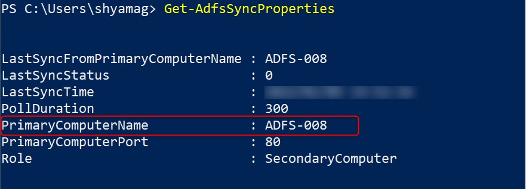
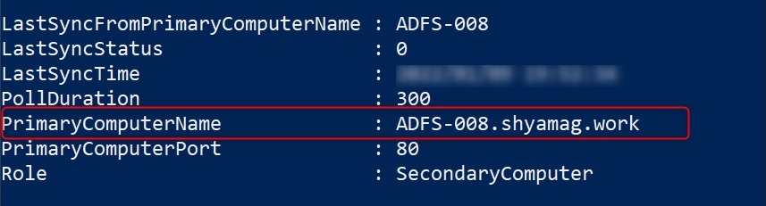
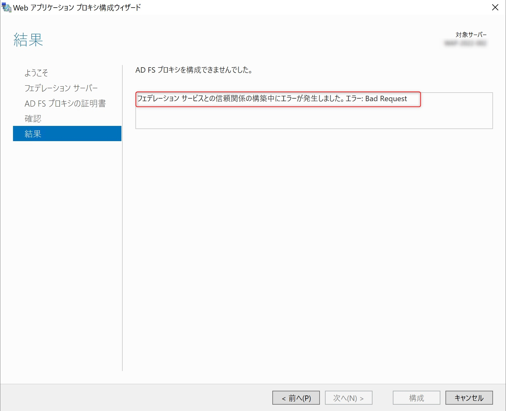
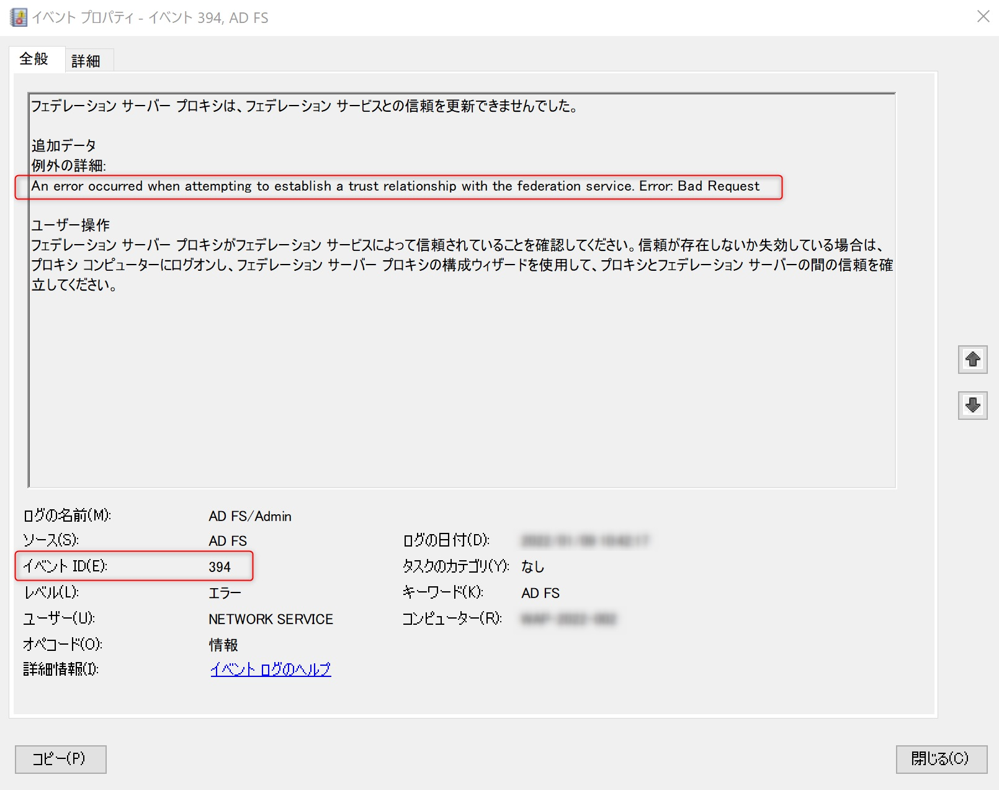
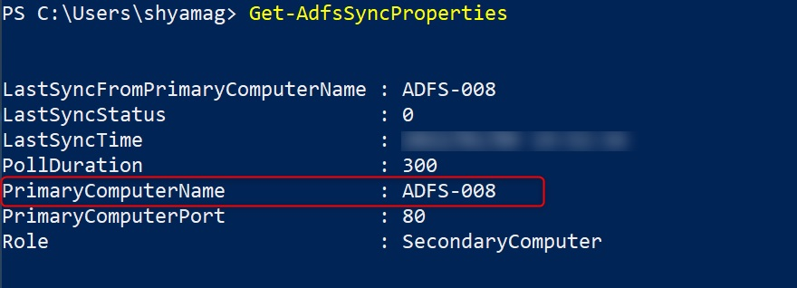
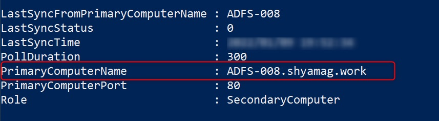

# AD FS 2019 以降でセカンダリ AD FS をホスト名のみで構成すると WAP の構成および信頼関係の更新に失敗する

こんにちは、Azure Identity サポート チームの山口です。

AD FS ファームを Windows Server 2019 以降 のサーバー (複数) で構成している環境において、WAP サーバーの新規構成および信頼関係の更新に失敗する事象について紹介します。
この事象は次の 2 つの条件を満たした場合に発生します。

1. AD FS ファームのセカンダリ サーバーを構成する際、プライマリ サーバーを FQDN ではなくホスト名のみで構成している
2. WAP を新規構成する際に発生する通信、あるいは信頼関係の更新処理に伴う通信がセカンダリ AD FS に対して行われる場合

本事象の影響を受ける環境か確認する方法、発生する事象の詳細と具体的な対処方法は以下のとおりです。

## 影響を受ける構成かどうかを確認する方法

AD FS 2019 以降でセカンダリ サーバーが存在する場合、セカンダリ サーバーで以下の Powershell コマンドレットを実行します。

```powershell
Get-AdfsSyncProperties
```

以下のように、PrimaryComputerName がホスト名のみで構成されている場合に該当します。



以下のように、FQDN で構成されている場合には該当いたしません。



## 発生する事象

以下のような事象が発生します。

1. AD FS 2019 以降の環境で WAP の新規構成に失敗する。
2. AD FS 2019 以降の環境に OS をアップグレードした後に、WAP と AD FS 間の信頼関係の更新に失敗するようになり、(結果として) WAP 経由の認証に失敗するようになる。

上記 1. については以下画面ショットのように Web アプリケーション プロキシ構成ウィザードより新規構成を試行した結果、**フェデレーション サービスとの信頼関係の構築中にエラーが発生しました。エラー: Bad Request** と表示され WAP の構成に失敗している場合に本事象に該当する可能性があります。

※エラー内容が Bad Request と表示されている場合に本事象に該当している可能性が高いです。



上記 2. については WAP サーバーのイベント ビューアー「アプリケーションとサービス ログ」→「AD FS」→「Admin」ログ内に、下記画面ショットのように ID 394 が定期的に記録されている場合に場合に該当する可能性があります。

※エラー内容が Bad Request と表示されている場合に本事象に該当している可能性が高いです。



## なぜ発生するのか

AD FS 2019 以降の Windows Server OS より、AD FS は所定のエンドポイントで HTTP リクエストを受信した際に、明確に FQDN を指定しないとエラーを返す (HTTP 400 エラーを返す) 実装が追加されたためです。

## 対処方法について

セカンダリ AD FS サーバー上で以下の PowerShell コマンドレットを実行し、プライマリ AD FS サーバーをホスト名ではなく FQDN に変更します。

1. セカンダリ AD FS サーバー上で管理者として PowerShell を起動します。
2. 以下の PowerShell コマンドレットを実行し、「PrimaryComputerName」がプライマリ AD FS サーバーのホスト名のみになっていることを確認します。

```PowerShell
Get-AdfsSyncProperties
```

画面ショット例  


3. 以下の PowerShell コマンドレットを実行し、「PrimaryComputerName」をプライマリ AD FS サーバーの FQDN に変更します。

```Powershell
Set-AdfsSyncProperties -Role SecondaryComputer -PrimaryComputerName <プライマリ AD FS サーバーの FQDN>

(例)
Set-AdfsSyncProperties -Role SecondaryComputer -PrimaryComputerName ADFS-008.shyamag.work
```

4. 以下の PowerShell コマンドレットを実行し、「PrimaryComputerName」がプライマリ AD FS サーバーの FQDN に変更されていることを確認します。

```Powershell
Get-AdfsSyncProperties
```

画面ショット例  


WAP サーバーを新規に構成ができない、もしくは信頼関係が切れている場合 (WAP 経由の認証ができない場合) は、上記の作業実施後に WAP を再構築します。また、信頼関係が切れていない場合 (WAP 経由の認証ができている場合) は、作業実施後に WAP サーバー上の AD FS サービス (Active Directory フェデレーション サービス) を再起動することで正常に WAP と AD FS 間の信頼環境を更新できるようになります。

### Q. AD FS 2016 や AD FS 3.0 (Windows Server 2012 R2) の環境では影響は出ないのか。

A. はい、影響を受けません。

### Q. AD FS 間の構成情報の同期に影響は出ないのか。

A. AD FS 間の同期については影響を受けません。
