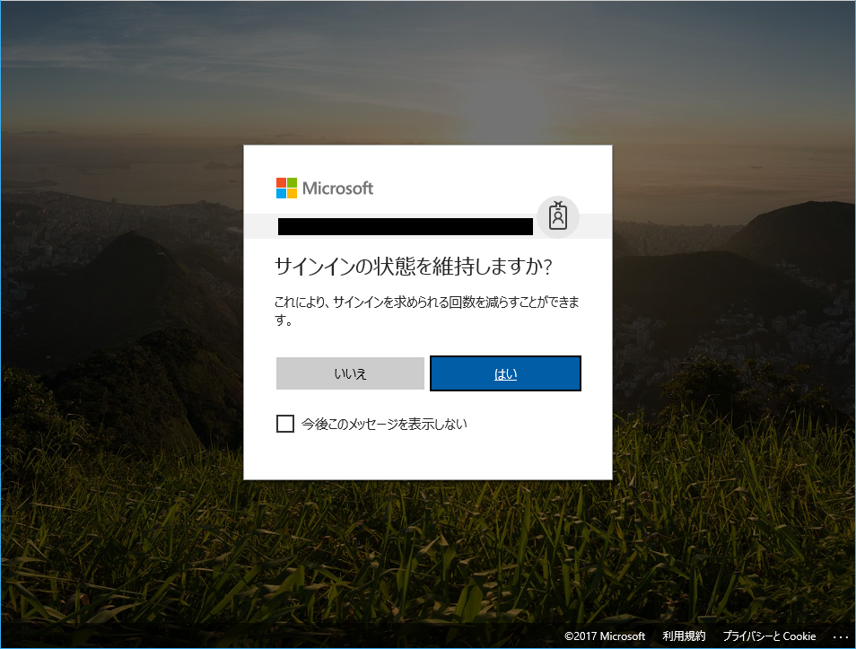

> 本記事は Technet Blog の更新停止に伴い https://blogs.technet.microsoft.com/jpazureid/2017/12/14/kmsi-wia/ の内容を移行したものです。
> 元の記事の最新の更新情報については、本内容をご参照ください。

# フェデレーション環境 (Windows 統合認証) で [サインインの状態を維持しますか？] の画面が表示されない

こんにちは、Azure ID サポートチームの高田です。
本日は、Azure AD のサインイン画面の変更とそれに伴うフェデレーション環境への影響についておまとめしました。

## 現在と以前のサインイン エクスペリエンス

まず、Microsoft では、11 月より Azure AD のサインイン画面にいくつか変更を加えております。具体的には、新しいサインイン エクスペリエンスが導入されており、Azure AD へのサインイン時に以下のような画面が表示されることにお気づきの方もいらっしゃると思います。

▼古いサインイン エクスペリエンス


▼新しいサインイン エクスペリエンス




※画面遷移の説明は、下記ブログを参照ください。

Fewer login prompts: The new “Keep me signed in” experience for Azure AD is in preview  
https://cloudblogs.microsoft.com/enterprisemobility/2017/09/19/fewer-login-prompts-the-new-keep-me-signed-in-experience-for-azure-ad-is-in-preview/

この [サインインの状態を維持しますか？] の画面は、古いサインイン画面の [サインインしたままにする] チェックボックスと同じ設定を表しています。Azure AD の [会社のブランド] から構成できる [サインインしたままにするオプションを表示する] の設定が [はい] の場合に表示されます。

既定ではこのオプションは [はい] の状態で、明示的に [いいえ] にしていない限り、基本的に上記の [サインインの状態を維持しますか？] の画面が表示されることとなります (オプションを [いいえ] にした場合、[サインインの状態を維持しますか？] の画面は表示されず、サインイン状態は維持されない動作です)。

※ [会社のブランド] を構成する手順につきましては、下記の公開情報を参照ください。

クイック スタート: Azure AD のサインイン ページに会社のブランドを追加する  
https://docs.microsoft.com/ja-jp/azure/active-directory/customize-branding

※ 以下は、上記設定画面における既知の問題と対処方法を案内している公開情報です。

「サインインしたままにするオプションを表示する」 の設定が保存できない  
https://answers.microsoft.com/thread/e8a32fbe-8d80-43f3-b99c-af585b4c57b

この [サインインの状態を維持しますか？] の画面は、 [サインインしたままにするオプションを表示する] オプションを [はい] にしていても、以下の場合に表示されません。

1. Azure AD がユーザーのサインインをリスクある状態と判断した場合
2. フェデレーション ユーザーにてサインインを試行し、AD FS にて Windows 統合認証が用いられた場合

上記 1 については、同一のマシンを複数人で共有していたり、短時間に長距離を移動したユーザーが該当します。
リスクの高いサインインについては以下の資料も参考にしていただければと思います。

Azure Active Directory ポータルのリスクの高いサインイン レポート  
https://docs.microsoft.com/ja-jp/azure/active-directory/active-directory-reporting-security-risky-sign-ins

上記 2 は、社内にいるユーザーが AD FS を利用してサインインする場合を示しています。
Windows 統合認証を用いてサインインする場合、ユーザーから見るとアプリケーションへのアクセスから Azure AD へのリダイレクト、さらに AD FS へのリダイレクト後の Windows 統合認証がすべて自動的に完了する流れとなります。[サインインの状態を維持しますか？] の画面は、一連の処理の流れを止めることとなるため、Windows 統合認証の場合に表示されないよう実装されました。AD FS にて Windows 統合認証が用いられたとき、[サインインの状態を維持しますか？] の選択は表示されませんが、選択としては [いいえ] の状態で認証が完了しています。このため、サインインの状態は維持されません (Azure AD から永続的なクッキーは発行されません)。

AD FS を利用する場合でも、社内からではなく外部から WAP (Web Application Proxy) を介してアクセスするような場合や、社内からのアクセスであっても、Firefox 等、AD FS の標準設定では Windows 統合認証が使用できないブラウザーをお使いの場合は、フォーム認証が用いられます。このときは、1 に合致していない状況であれば [サインインの状態を維持しますか？] の画面が表示されます。

## Windows 統合認証が行われた場合もサインインの状態を維持させる方法

フェデレーション環境をお持ちのお客様において、AD FS で Windows 統合認証が行われた場合もサインインの状態を維持したい (Azure AD から永続的なクッキーを発行したい) とお考えのお客様においては、後述の対応を実施いただければと思います。

以下では AD FS 側でクレーム ルールを変更し、組織内からの認証の場合は、psso (Persistent SSO) と呼ばれるクレームをトークンに含めるように構成します。これを受け取った Azure AD は、サインイン状態を維持させるよう永続的なクッキーをクライアントに発行します。この際、「サインイン状態を維持しますか？」画面は表示されませんが、サインイン状態を維持するクッキーが発行されます ([サインインの状態を維持しますか？] 画面で手動にて [はい] を押下したのと同じ状態となります)。

AD FS サーバー上の手順を以下におまとめいたしましたので、ご確認いただけますと幸いです。

1. AD FS サーバーに管理者でログオンします。
2. AD FS の管理コンソールを開きます。
3. 画面左側のツリーから [証明書利用者信頼] を選択します。
4. [Microsoft Office 365 Identity Platform] を右クリックし、[要求規則の編集] を選択します。
5. [発行変換規則] で [規則の追加] をクリックします。
6. 変換要求規則の追加ウィザードでドロップダウンから [カスタム規則を使用して要求を送信] を選択し、[次へ] をクリックします。
7. [要求規則名] の下のボックスに Keep Users Signed In と入力し、次に進みます。
8. [カスタム規則:] ボックスに次のように入力します。

    ```txt
    c:[Type == "http://schemas.microsoft.com/ws/2012/01/insidecorporatenetwork", Value == "true"]
    => issue(Type = "http://schemas.microsoft.com/2014/03/psso", Value = "true");
    ```

9. [完了]をクリックし、ウィザードを終了します。

上記クレーム ルールを追加しますと、社内からの (WAP を経由しない) アクセスの場合は、http://schemas.microsoft.com/2014/03/psso のクレームがトークンに追加されます。Azure AD はこのクレームを確認し、永続的なクッキーをクライアントに発行します。AD FS ファーム全体 (全ユーザー) が対象となるルールですが、新しく psso のクレームを追加するだけですので、既存のクレーム ルールに影響を及ぼすことはありません。また、上記ウィザードの完了後すぐに効果が及びます。

なお、クレームルールの追加により予期しない動作が生じた場合は、追加したルールを削除すれば元に戻すことが可能ですので、その際は、追加したルールを削除することで対応ください。

### 2018/02/21 追記:

上記設定は、発行変換規則に対するものです。アクセス制御に影響する発行承認規則には変更を加えません。このため、上記設定を行っても既存のクレーム ルールでのアクセス制御に影響を及ぼすことはありません。上記設定を実施後に、これまで動作していたアクセスがブロックされるなどの影響が起きることはないとお考えください。影響が及ぶのは Azure AD が永続的なクッキーをクライアントに発行し、サインイン状態が維持されるという点のみです。

### 2018/02/26 追記:

クレーム ルールを制御することで、http://schemas.microsoft.com/2014/03/psso のクレームを有効にする対象ユーザーを制御することが可能です。例えば以下のようにしてクレーム ルールを指定すれば、社内からのアクセスで、さらに指定したグループにユーザーが含まれている場合のみ psso を有効にできます。

```txt
c1:[Type == "http://schemas.microsoft.com/ws/2012/01/insidecorporatenetwork", Value == "true"]
&& c2:[Type == "http://schemas.microsoft.com/ws/2008/06/identity/claims/groupsid", Value == "S-1-5-21-4118385845-2129555445-158388420-1121"]
=> issue(Type = "http://schemas.microsoft.com/2014/03/psso", Value = "true");
```

上記のうち、S-1-5-21-4118385845-2129555445-158388420-1121 の箇所にご要望のグループの SID を指定ください。グループの SID は、[Active Directory ユーザーとコンピューター] や PowerShell の Get-ADGroup コマンドレットからご確認いただけます。

### 2018/03/06 追記:

**以上の内容は、Windows Server 2012 R2 以降の AD FS を対象とした手順です。**

Windows Server 2008 R2 および 2012 の AD FS をご利用の場合は以下のようにします。

```txt
NOT exists([Type == "http://schemas.microsoft.com/2012/01/requestcontext/claims/x-ms-proxy"])
=> issue(Type = "http://schemas.microsoft.com/2014/03/psso", Value = "true");
```

なお、Windows Server 2008 R2 で x-ms-proxy クレームを利用するには AD FS 2.0 ロールアップ 3 の適用が必要です (要 OS 再起動)。

Description of Update Rollup 3 for Active Directory Federation Services (AD FS) 2.0  
https://support.microsoft.com/ja-jp/help/2790338/description-of-update-rollup-3-for-active-directory-federation-service

上記内容が少しでもお客様の参考となりますと幸いです。
