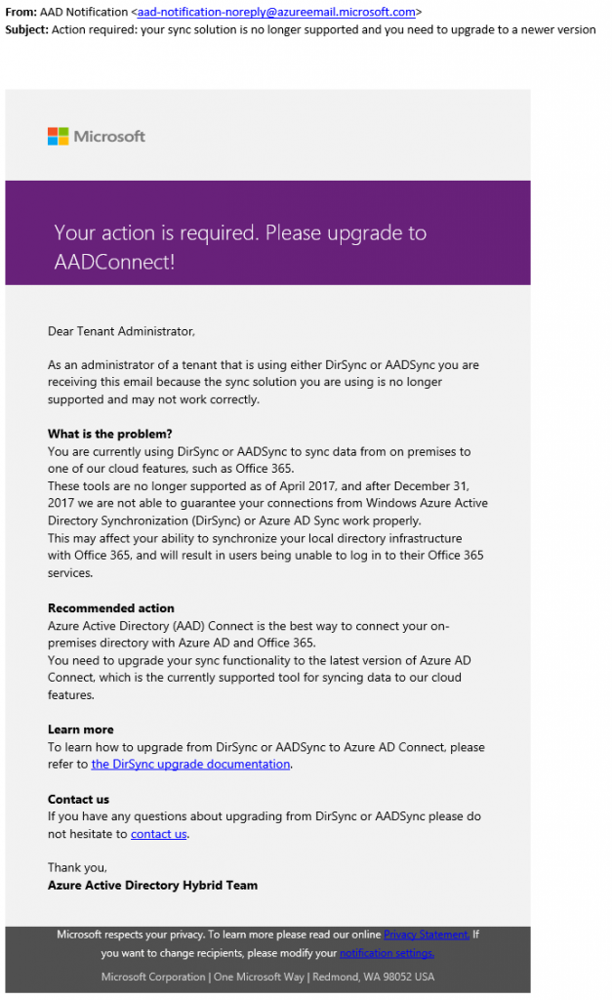

> 本記事は Technet Blog の更新停止に伴い https://blogs.technet.microsoft.com/jpazureid/2018/04/18/aad-notification/ の内容を移行したものです。
> 元の記事の最新の更新情報については、本内容をご参照ください。

# "AAD Notification" から送られた DirSync に関するメールについて

Azure Identity サポートの橋本です。

日本時間の 4 月 18 日に、一部の Azure AD Connect のご利用者様  (テナント管理者) 宛に、以下のような、"Action required: your sync solution is no longer supported and you need to upgrade to a newer version " という件名のメールが AAD Notification <aad-notification-noreply@azureemail.microsoft.com> より配信されました。

本メールは弊社システムにより誤って配信されてしまったメールであることが確認できました。

DirSync や ADSync をご利用の場合はアップグレードいただく必要がございますが、Azure AD Connect をすでにご利用の場合は必要ございません。

そのため、もしこのようなメールを受信されている場合は、大変申し訳ございませんが本メールは無視くださいますようお願いいたします。

ご不明な点等がありましたら、恐れ入りますが弊社サポート サービスまでお問い合わせください。

よろしくお願いします。
