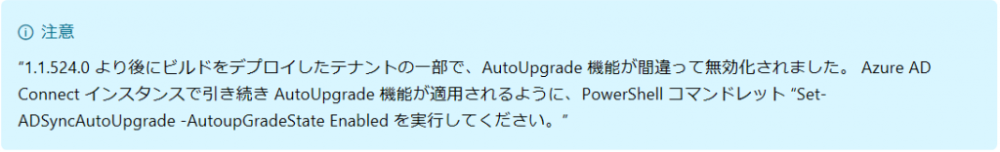
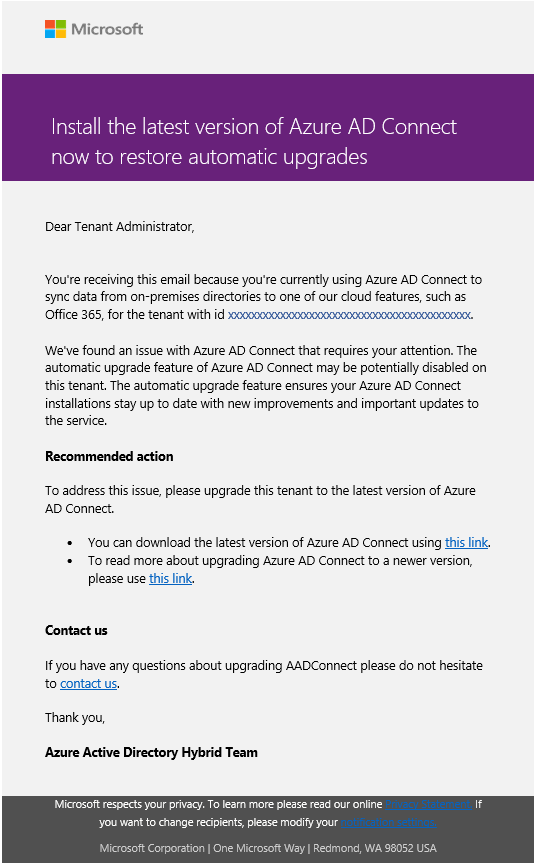
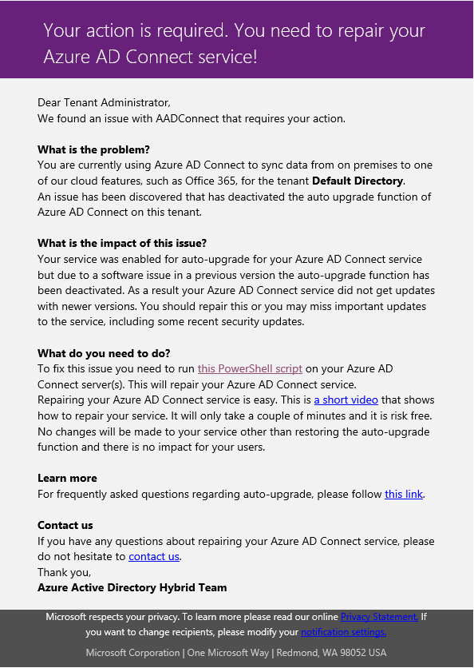

> 本記事は Technet Blog の更新停止に伴い https://blogs.technet.microsoft.com/jpazureid/2018/04/23/problemofautoupgrade/ の内容を移行したものです。
> 元の記事の最新の更新情報については、本内容をご参照ください。

# 自動アップグレード機能の問題

皆さん、こんにちは。Azure AD Connect (AADC) のサポートを担当している福島です。

今回のブログは、AADC で発生する 「本来行われるべき AADC の自動アップグレードが実施されない問題」 に関する投稿です。**"バージョン 1.1.524.0 以降 1.1.750.0 未満" の Azure AD Connect を利用している場合**、気づかない間に本問題事象に該当している可能性がありますため一読ください。

## 概要

バージョン 1.1.524.0 を一度でもインストールしたことがある環境では、本来行われるように設定している自動アップグレードが行われていない可能性があります。

既定で AADC は自動アップグレードが有効になっています。しかし、バージョン 1.1.524.0 を新規でインストールした、あるいはそれ以前のバージョンを利用しており自動アップグレードを利用して 1.1.524.0 がインストールされた環境では、その後自動アップグレード設定を有効にしていても 1.1.524.0 以降のバージョンにアップグレードが行われていない可能性があります。

問題となるシナリオを整理すると次の通りです。

- シナリオ 1. バージョン 1.1.524.0 よりも前の AADC をインストールし、自動アップグレードを有効な状態としていた

  このケースでは、1.1.524.0 までは自動アップグレードによる更新が行われていました。
しかし、 1.1.524.0 のアップグレード機能に問題が存在していたため、1.1.524.0 以降への自動アップグレードが行われない状態となります。

- シナリオ 2. 新規でバージョン 1.1.524.0 をインストールした

  本バージョン自体に問題が存在しているため、自動アップグレードを有効にしていてもアップグレードが行われません。

- シナリオ 3. 新規でバージョン 1.1.524.0 をインストール後、手動で 1.1.750.0 未満にアップグレードした

  この状態でも、引き続き自動アップグレードは行われません。

この問題は、バージョン 1.1.750.0 で解消しています。

そのため、反対に 1.1.524.0 -1.1.749.0 を利用している間自動アップグレードが (製品の期待される動作とは反対に) 動作していなかった状態のものが、 1.1.750.0 のインストールにより自動アップグレードが正しく機能するようになることにも注意ください。

## 対象の確認方法

下記 2 つの条件を "両方" 満たしている AADC サーバーで、本事象は発生している可能性があります。

- 条件 1. UpdateCheckEnabled レジストリに 0 が設定されている
- 条件 2. 自動アップグレード機能の実行状態が、Enabled または Suspended である

条件 1. のレジストリ値の設定状態は下記コマンドで確認することが可能です。(管理者権限が必要)

```cmd
reg query HKEY_LOCAL_MACHINE\SOFTWARE\Microsoft\ADHealthAgent\Sync /v UpdateCheckEnabled
```

出力結果例)

```cmd
HKEY_LOCAL_MACHINE\SOFTWARE\Microsoft\ADHealthAgent\Sync
    UpdateCheckEnabled    REG_DWORD    0x0
```

条件 2. の自動アップグレード機能の実行状態 (Enabled または Suspended であるか) は、Get-ADSyncAutoUpgrade コマンドで確認することが可能です。

コマンド実行例)


なお、Suspended (保留) 状態にある場合も、自動アップグレード処理 (モジュールのダウンロードおよびインストール) は試行されます。
Suspended は [自動アップグレード機能は有効だが、システムにより一時的に保留された状態] を意味し、システムの判断により自動アップグレード処理が行われる可能性がある状態となります。

Azure AD Connect: 自動アップグレード  
https://docs.microsoft.com/ja-jp/azure/active-directory/connect/active-directory-aadconnect-feature-automatic-upgrade

運用の要件として、AADC の自動アップグレードを無効化したい場合は、[Set-ADSyncAutoUpgrade -AutoUpgradeState Disabled] コマンドを AADC サーバー上で実行して、明示的に自動アップグレード機能を無効にする必要がありますのでご留意ください。
(もちろん弊社としては、様々な問題の修正や機能追加が行われているため、最新の AADC をご利用いただくことを推奨しております。)

## 原因

バージョン 1.1.524.0 の AADC を一度でもインストールした場合、自動アップグレード機能に関連するレジストリ情報に誤った値が設定されてしまうためです。

キーパス : HKEY_LOCAL_MACHINE\SOFTWARE\Microsoft\ADHealthAgent\Sync  
名前 : UpdateCheckEnabled  
値 : 0 (無効)  <<<<<★ 無効 (0x0) が誤って設定されてしまいます。  

当該レジストリが設定されている状態では、自動アップグレード機能の実行状態に Enabled または Suspended が設定されていた場合でも、実際のアップグレード処理が行われなくなります。

## 解決策

本問題の解決策は下記 2 つです。

### 解決策 1. 手動アップグレートを利用して AADC のバージョンを 1.1.750.0 以降にアップグレードする

バージョン 1.1.750.0 以降の AADC では、本問題が修正されています。執筆時 (2018/4/23 時点) は、バージョン 1.1.750.0 以降の AADC がダウンロードページに掲載されていますので、こちらをダウンロードします。

Microsoft Azure Active Directory Connect  
https://www.microsoft.com/en-us/download/details.aspx?id=47594

AADC サーバー上でダウンロードしたインストーラー (.msi) を起動し、手動でアップグレードを行います。

### 解決策 2. Powershell スクリプトを利用してレジストリの値を修正する

弊社が提供している下記スクリプトを利用することで、該当のレジストリ値の修正を含めて一括して問題箇所を修正することが可能です。

AAD Connect - Repair AutoUpgrade Suspended state  
https://gallery.technet.microsoft.com/AAD-connect-Repair-f4a2094a

なお、このスクリプトの処理内容は対象レジストリ値と自動アップグレードの有効 (Enabled,Suspended) /無効 (Disabled) をチェックし、前述の 2 つの条件を満たす構成だった場合に、レジストリを修正して AADC の Health Sync Monitor サービスを再起動しています。
※ディレクトリ同期を行う本体サービスの再起動を行っているわけではないので、同期処理への影響はありません。

> (補足)
> AADC のバージョン情報を纏める公開資料では、 "Set-ADSyncAutoUpgrade -AutoupGradeState Enabled" コマンドを案内していますが、当該手順を実行後に AADC サーバーの Health Sync Monitor サービスを再起動する必要があります。
> そのため、これらを一括して実行できる上述スクリプトを利用することを推奨しています。

Azure AD Connect: バージョンのリリース履歴  
https://docs.microsoft.com/ja-jp/azure/active-directory/connect/active-directory-aadconnect-version-history



## 管理者への通知

テナントの管理者に対しては、Azure AD Connect のアップグレード機能に問題があり、最新版へ手動アップグレードすることを促すメールが通知されます。
本メールを受け取った管理者は、本ブログに記載された [対象の確認方法] を参照し、現在の AADC 設定を確認いただきますようお願いいたします。

※送信元 : AAD Notification [aad-notification-noreply@azureemail.microsoft.com]



> **2017/6/8 追記**

「本件問題事象が解消していない可能性のあるテナント」 の管理者様には、下記内容で追加のメールが送付されております。



## 関連情報

自動アップグレードに関しては、当チームによる以下 Blog もぜひ併せてご参照ください。

Azure AD Connect ビルド 1.1.749.0 の注意点  
https://blogs.technet.microsoft.com/jpazureid/2018/02/26/azure-ad-connect-117490/

## FAQ

Q1. バージョン 1.1.524.0 以降 1.1.750.0 未満の AADC (1.1.749.0 など) を利用していますが、アップグレードが実施できているように見受けられます。対処が必要ですか？

A1. 冒頭の [対象の確認方法] に記載された条件に合致している、且つ自動アップグレードを実施したい場合には対処が必要です。
もし条件に合致している場合、ご利用中の AADC では 「自動アップグレード」 ではなく、「手動アップグレード (インプレースアップグレード)」 が行われていることが考えられます。
自動アップグレード機能を利用するためには本ブログに記載された解決策を実施してください。

Q2. バージョン 1.1.524.0 以降 1.1.750.0 未満の AADC (1.1.749.0 など) を利用していますが、問題の バージョン 1.1.524.0 を経由せずに本バージョン (1.1.749.0 など) を利用しています。対処が必要ですか？

A2. いいえ。バージョン 1.1.524.0 を一度でもインストールしていない環境 (1.1.524.0 からインプレイスアップグレードをしていない環境) では、本問題について考慮する必要はありません。

## 最後に

その他、ご不明な点等がありましたら、ぜひ弊社サポート サービスをご利用ください。
※本情報の内容（リンク先などを含む）は、作成日時点でのものであり、予告なく変更される場合があります。
