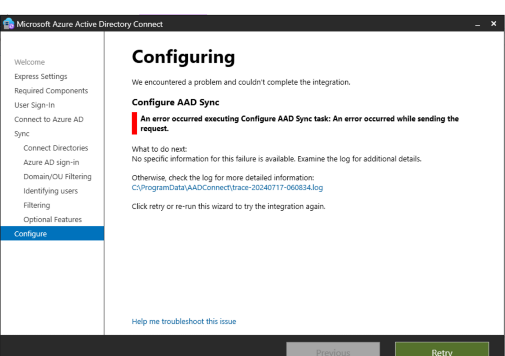
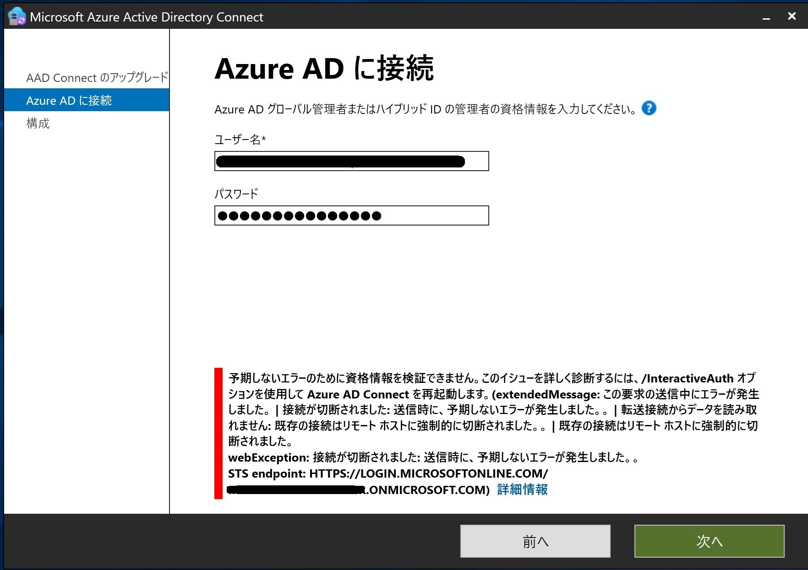
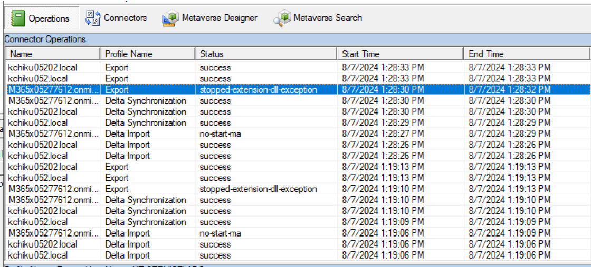
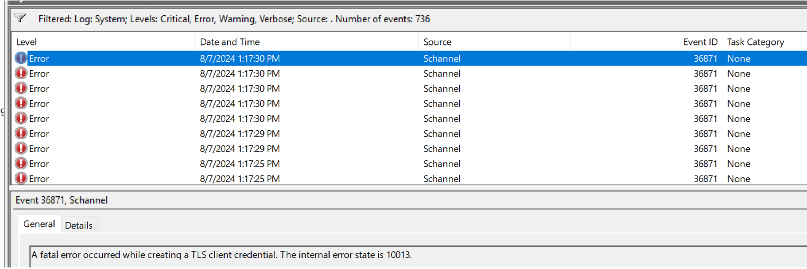
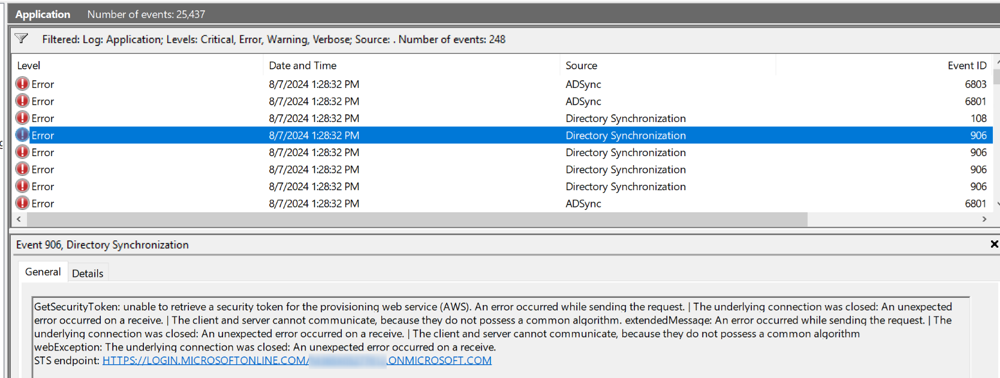
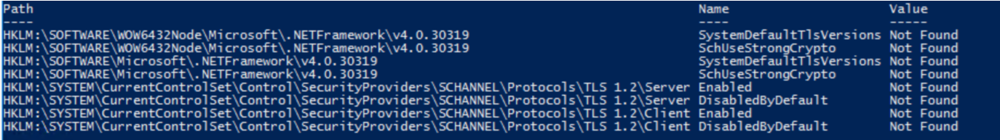
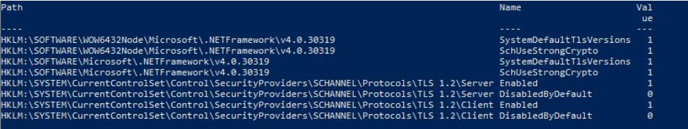

# Microsoft Entra Connect 2.3.20 のインストールおよびアップグレードに失敗する際の対応方法

こんにちは、Azure & Identity サポート チームの野呂です。弊社サポートチームでは、特定の環境において Microsoft Entra Connect 2.3.20 のインストールおよびアップグレードに失敗する、またはアップグレード後に同期に失敗するお問い合わせを多数お寄せいただいております。本記事では、これらの一般的な原因と対処方法をご紹介します。

##  事象の概要

Microsoft Entra Connect 2.3.20 のインストールおよびアップグレードを試みた際にエラーが出力され、インストールおよびアップグレードに失敗します。もしくは、インストールおよびアップグレードには成功しますが、その後の同期処理に失敗します。これは　Microsoft Entra Connect と Microsoft Entra ID の間で TLS 1.2 にて通信を行えていない事が原因です。以下に、問題が発生した場合に出力される可能性のあるエラー例をお伝えします。

### インストール時およびアップグレード時のエラー

インストールを試みた際に、インストール ウィザードの構成画面にて、"An error occurred executing Configure AAD Sync task: An error occurred while sending the request." のエラーが表示されインストールに失敗する事象が確認されております。

インストール時のエラー画面例:

また、アップグレードを試みた際に、インストール ウィザードの資格情報入力画面にて、正しい権限を持つ有効なアカウントを入力したのにも関わらず、エラーが出力される事象が発生するとのお問い合わせを多数お寄せいただいております。

アップグレード時のエラー画面例:

### アップグレード後の同期エラー

アップグレード以降の同期サイクルにおいて、Microsoft Entra ID のコネクタにおける Import 処理や Export 処理が、"no-start-ma" や "stopped-extension-dll-exeption", "stopped-server" などが記録されて失敗する事象を確認しています。

Synchronization Service Manager の例:

システム イベント ログの例:

アプリケーション イベント ログの例:

##  原因

Microsoft Entra Connect と Microsoft Entra ID の間で TLS 1.2 にて通信を行えていない事がエラー発生の原因です。Microsoft Entra Connect のバージョン 1.2.65.0 以降では、 Microsoft Entra ID との通信に対して TLS 1.2 のみの使用が完全にサポートされております。また、Microsoft Entra Connect 2.3.20 では、導入サーバーにてレジストリにて TLS 1.2 を明示的に有効化することがインストールの要件となっております。

##  対応方法

Microsoft Entra Connect 2.3.20 のインストールおよびアップグレードを行う前に、導入サーバーにてレジストリに TLS 1.2 を有効化する値を登録して明示的に有効化する必要がございます。以下に、TLS 1.2 のレジストリ登録状況の確認方法と TLS 1.2 のレジストリ登録方法を記載いたします。

###  TLS 1.2 のレジストリ登録状況の確認方法

まず、Microsoft Entra Connect を導入するサーバーで PowerShell を管理者権限で開き、下記のドキュメントに記載された [TLS 1.2 をチェックするための PowerShell スクリプト] を実行し、TLS 1.2 のレジストリ登録状況を確認します (スクリプトを実行した結果、Value が Not Found となっている場合は、TLS 1.2 用のレジストリが構成されていないと判断可能です)。

[Microsoft Entra Connect に対する TLS 1.2 の強制 | TLS 1.2 をチェックするための PowerShell スクリプト](https://learn.microsoft.com/ja-jp/entra/identity/hybrid/connect/reference-connect-tls-enforcement#powershell-script-to-check-tls-12)

TLS 1.2 が構成されていないことを示す出力の例:

適切な TLS 1.2 構成を示す出力の例:

###  TLS 1.2 のレジストリ登録方法

まず、下記のドキュメントに記載された [TLS 1.2 を有効にする PowerShell スクリプト] を実行し、レジストリに TLS 1.2 を登録して明示的に有効化します。

[Microsoft Entra Connect に対する TLS 1.2 の強制 | TLS 1.2 を有効にする PowerShell スクリプト](https://learn.microsoft.com/ja-jp/entra/identity/hybrid/connect/reference-connect-tls-enforcement#powershell-script-to-enable-tls-12)
 
次に、導入サーバーを再起動します。これらのレジストリを登録することにより、これまで .NET Framework アプリケーションが TLS 1.2 以外を用いて通信を行っていた場合には TLS 1.2 を用いて通信を行うようになります。一般的には TLS 1.2 が推奨されており、 TLS 1.2 を用いて通信を行うことに問題はございませんが、もし問題が生じた際にはこれらのレジストリを削除頂いた上で、再度再起動頂くことで元の状態に戻すことが可能です。

TLS 1.2 のレジストリを設定後も同期が行えない、インストールが行えない場合には弊社サポートまでお問い合わせください。
