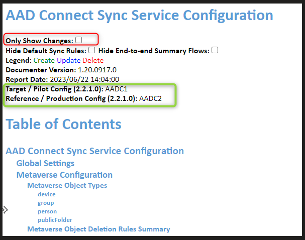

# Azure AD Connect Sync Configuration Documenter 使用方法

こんにちは、Azure Identity サポート チームの小出です。

今回は、 Azure AD Connect Sync Configuration Documenter 使用方法をご案内します。
[こちら](https://github.com/Microsoft/AADConnectConfigDocumenter/blob/master/README.md) に記載されている手順の解説となります。

本ツールは 2 台の Azure AD Connect サーバーの設定をレポート上で差分比較する際に利用するツールとなります。

本ブログでは出力されたレポートについて、具体的にどのような観点を確認すべきかを追記しておりますので、参考となれば幸いです。  


## Azure AD Connect Sync Configuration Documenter とは

2 台の Azure AD Connect の設定内容や同期ルールを比較するためのツールです。
各 Azure AD Connect にて設定情報を XML ファイルとしてエクスポートし、HTML レポート ファイルで比較情報を表示することができます。

同じバージョンで 2 台目以降の Azure AD Connect サーバーをステージングモードとして構築した際に両者の設定に差分がないかをレポートとして確認することが可能です。

特に、2 台目以降の Azure AD Connect サーバーを手動でインストールした場合は手作業によるミスを発見することに役立ちますので是非ご活用ください。

> [!WARNING]
> ・このツールは 2 台の Azure AD Connect の設定値を比較するものとなりますため、サーバー名や次回同期の時刻など、必ず差異が発生する項目がありますのでご留意ください。
> 
> ・ 2 台の Azure AD Connect サーバーが異なるバージョンで動作している場合も差分をレポート出力することは可能ですが、バージョンが異なる場合は差分項目が非常に多くなります。可能であれば同一バージョンの設定を比較することご検討いただけますと幸いです。
>
> ・ このツールを使用して取得した設定値について、それぞれの項目がどのようなものであるかを網羅的にご案内したり、出力された結果について影響がないかの判断をしたりするご支援は、現在弊社サポートでは承っておりません。レポートの出力結果をもとに、最終的にはお客様側で設定値の比較・判断を実施ください。
  
## 使用方法

1. 比較情報を確認するサーバーにて [Azure AD Connect Configuration Documenter](https://github.com/Microsoft/AADConnectConfigDocumenter/releases) をダウンロードします。  
   ページ内の AzureADConnectSyncDocumenter.zip をクリックしてダウンロードします。  
2. ダウンロードした AzureADConnectSyncDocumenter.zip を任意のディレクトリに展開します。
3. 展開した AzureADConnectSyncDocumenter フォルダー配下の Data フォルダーに各サーバー用のフォルダーを作成します。

```text 
　 例) C:\temp\AzureADConnectSyncDocumenter\Data\AADCServer001 , C:\temp\AzureADConnectSyncDocumenter\Data\AADCServer002  
```

1. 各 Azure AD Connect サーバーにて設定ファイルを取得します。

```PowerShell 
Get-ADSyncServerConfiguration -Path "出力先へのパス"
```

(実行例)  

```PowerShell 
Get-ADSyncServerConfiguration -Path "C:\temp\AADC001"
```

5. 手順 4. で出力した下記のフォルダーを 3. で作成したフォルダーにサーバー毎にコピーします。  
     Connectors  
     GlobalSettings  
     SynchronizationRules  

6. 手順 2. で展開したフォルダー内の AzureADConnectSyncDocumenter-contoso.cmd をテキスト エディターで開きます。

7. 下記箇所を手順 3. で作成したフォルダー名に合わせて、保存します。

```text 
   AzureADConnectSyncDocumenterCmd.exe "Contoso\Pilot" "Contoso\Production"  
   例) AzureADConnectSyncDocumenterCmd.exe "AADCServer001" "AADCServer002"  
```

8. AzureADConnectSyncDocumenter-contoso.cmd のファイル名を AzureADConnectSyncDocumenter.cmd に変更します。  

9.  下記コマンドを実行します。
   
```PowerShell 
.\AzureADConnectSyncDocumenter.cmd
```

10. コマンド実行後に AzureADConnectSyncDocumenter\Report 配下に HTML ファイルが生成されます。
11. レポート内の Create / Update / Delete 項目で差分内容を確認します。  
    
    下記の "Only Show Changes" チェックを有効にすることで差分のみ表示可能となります。緑枠部分に、各サーバーのバージョンが表示されますので確認します。


  
  
## 差分内容につきまして

上記にて表示された差分内容のファイルの中で、特に注意して確認してほしい点は、「現行のサーバーには設定されているのに、新しいサーバーでは削除されている・設定値が異なっている」パターンの差異です。
主な確認ポイントについては下記を参考ください。

### 端末固有の値のため、一般的に無視してもよいもの

・ ステージングモードの有効・無効
・ 次回同期の日時やサーバー名など、サーバーによって異なる値

### 設定を改めて確認してほしいもの

・上記以外で何等かの設定差異がある場合は、改めて設定の見直しをお願いします

## 参考情報

2 台目以降の Azure AD Connect サーバーを手動でインストールする場合は、本ツールで差分比較を行うことを推奨します。

なお、Azure AD Connect サーバーでは設定情報を JSON ファイルとしてエクスポートして別のサーバーにインストールすることも可能です。
この場合手作業による設定ミスがなくなりますので、[こちら](https://jpazureid.github.io/blog/azure-active-directory-connect/aadc-import-export-config/) もご活用ください。
