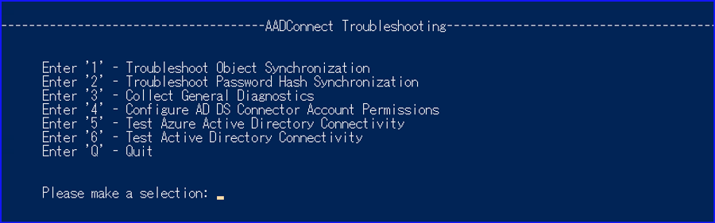

# [情報採取] Azure AD Connect に関わる問題などの際に採取、提供いただきたい情報

こんにちは、日本マイクロソフトの金子です。

本記事は、 2020 年に初回投稿された記事を、現在の情報採取手順やご案内に見直し更新いたしております。

Azure AD Connect に関わる問題が発生した場合にテクニカル サポートにお問い合わせいただく際、下記の情報をご提供いただくことで問い合わせがスムーズに行われますので、予め採取をお願いいたします。

調査過程で追加で採取いただく情報が増える可能性がありますので、予めご了承ください。

ここでご案内しました情報を事前に取得し、お問い合わせと合わせてご提供いただくことで次のようなメリットがあります。

- お問い合わせに対する回答・問題解決をよりはやくできます。
- 後々、再現できなくなり、問題発生時の情報がないために、問題の発生要因を追及できなくなるケースが減らせます。
- サポート エンジニアより情報採取を案内される分のやり取りを減らせます。
- 情報があるため、サポート エンジニアがより事象についてより把握した状態でお客様とゴール設定ができます。

Azure AD Connect トラブルシューティングは大区分として、Azure AD Connect サーバー全般に関わる問題か、特定のオブジェクトに関わる問題かにより調査に必要な情報が異なります。
上記内容をスクリプトで一括採取する方法につきましてもご用意させていただいていますので、こちらをもとにシナリオごとに情報を採取してください。

 AADC サーバー情報一括採取ツール
 
 https://github.com/jpazureid/aadconnect-diagnostic

なお、シナリオにかかわらず、以下の情報も一括採取ログと併せてお送りいただくと、よりスムーズな対応が可能です。

a. エラーの画面またはログ抜粋

　 オブジェクト同期に関わる問題につきましては、Synchronization Service Manager のステータスや詳細が確認できる画面キャプチャなど
  
b. テナント名   (例 contoso.onmicrosoft.com)

c. 発生日時

d. 現在の状況 (事象が継続中 or 断続的に発生 or 解消済み)

e. 事象発生前後の状況 (構成変更やアップグレードをした場合には具体的なバージョンなど)

### 運用環境にて見慣れないエラーやイベントが発生した場合
まず、上記の "簡易取得" を実行して取得し、お問い合わせ起票時に下記の情報と合わせて取得済みの旨お知らせください。

### 特定のオブジェクトが同期できない・エラーが発生している場合
上記 "簡易取得" と "オブジェクト情報 (AD/CS/MV) 取得" を実行してください。オブジェクト情報の取得を行うスクリプトを実行する際には、問題が発生しているオブジェクトの情報を指定して実行してください。

### パスワード ハッシュ同期に失敗している・ユーザーのパスワード ライトバックができない場合
上記 "簡易取得" と "シナリオトレース (オブジェクト同期、パスワードハッシュ同期、パスワードライトバック)" を実行してください。

### パススルー認証に関する問題の場合
上記 "簡易取得" と ”シナリオトレース (パススルー認証)” を実行してください。

### Azure AD Connect Health がうまく稼働しない場合
”シナリオトレース (Azure AD Connect Health for Sync)” を実行してください。

### Azure AD Connect インストール ウィザードが開けない・ウィザードの先の画面に進めない場合
”シナリオトレース (構成ウィザード、またはその他のシナリオ)” を実行してください。

### 接続面に問題があるようなエラーが発生している場合
Azure AD Connect の構成ウィザードでは、Active Directory や Azure AD への接続に問題が起きている場合にエラーが発生します。
接続の問題が疑われる場合は、 Azure AD Connect 構成ウィザード上のトラブルシューティングを実行し通信面の問題を確認することが可能です。
 
Azure AD Connect Sync を使用したオブジェクト同期のトラブルシューティング

https://learn.microsoft.com/ja-jp/azure/active-directory/hybrid/connect/tshoot-connect-objectsync

1. Azure AD Connectインストール サーバー上で PowerShell を管理者として起動します。
2. Set-ExecutionPolicy RemoteSigned または Set-ExecutionPolicy Unrestricted を実行します。
3. 続いてスタート メニューより [Azure AD Connect] を選択し、 Azure AD Connect 構成ウィザードを起動します。
4. [追加のタスク] – [トラブルシューティング] に移動し、 [次へ] を選択します。
5. PowerShell ウィンドウが起動するので、 Azure AD の通信状況を確認したい場合には「5」、オンプレミス AD の通信状況を確認したい場合には「6」を入力して Enter を押します。

 

6. 結果が表示されます。通信に問題がある場合にはエラーが表示されるので内容を基にトラブルシューティングを実施ください。

また、弊社までお問い合わせ頂く際に合わせてエラー内容をお知らせ頂けますと調査をスムーズに行うことができる可能性がありますので、お問い合わせ時に共有いただけますと幸いです。

