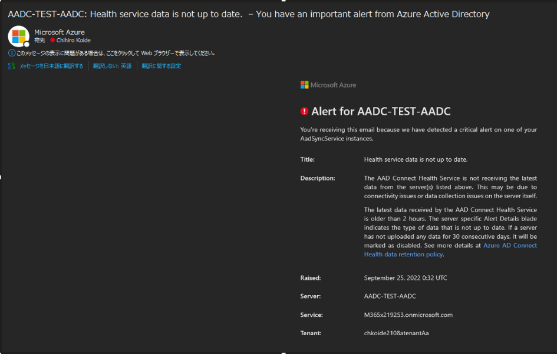

> [!NOTE]
> 本記事は Technet Blog の更新停止に伴い https://blogs.technet.microsoft.com/jpazureid/2018/03/01/aadc-health-notification/ の内容を移行したものです。
> 元の記事の最新の更新情報については、本内容をご参照ください。
> 
> 2018 年 3 月 1 日に「Azure AD Connect Health Notification メールについて」 として公開しておりましたが、情報が古くなってまいりましたので、 2023 年 7 月 25 日時点の最新情報として改めて更新のうえ公開しております。

# Azure AD Connect Health Notification メールについて

こんにちは！ Azure Identity サポートの小出です。  

Azure AD Connect を利用してオンプレミスと Azure AD を連携している環境で最近 (2018 年 2 月) 突然次のような通知メールが届いているケースがあると思います。
この通知メールについて Q&A 形式で纏めました。  

<本文サンプル>



## Q. このメールは何を通知しているのか？

A. Azure AD Connect Health Agent による Azure データセンターへの正常性データのアップロードが RAISED (発生日時) から RESOLVE (解決日時) まで行われていなかったことを通知しています。
Azure AD Connect はオンプレミスの Active Directory のユーザー情報を Azure AD に同期しますが、その他にもオンプレミスのサーバーの監視をおこなう Azure AD Connect Health Agent というエージェントがあります。  
このエージェントは定期的にオンプレミスの監視対象とするサーバーの情報を Azure AD にアップロードします。  
今回の通知は、そのアップロードが一定期間  RAISED (発生日時) から RESOLVE (解決日時) まで、行えていなかったことを管理者に通知しています。  
Azure AD Connect Health Agent サービスによるアップロードが 2 時間以上行われていないと Azure Portal 上にそのことを示す通知が行われます。  
Azure Portal : URL:https://aka.ms/aadconnecthealth  

メールは上記サンプルのように、基本的には発生した時と解消した時の2回通知されます。


## Q. [Resolved] だが、監視通信は正常な状態になっているのか？

A. "監視通信が行えていない" という情報が削除された結果であり、実際に監視通信が正常ではない状態が継続している可能性があります。  

例えば、Azure AD Connect (AADC) サーバーを数時間程度シャットダウンした場合には、停止後から約 2 時間で監視通信が行えていない内容の通知メールが送付され、起動後から約 2 時間で監視通信が再開できた (今回の通知メールと同じ内容の) 通知メールが送付されます。  
そのため、1 つの目安として通知メール内の "RAISED (問題発生日時)" と "RESOLVE (問題解決日時)" を参照し、メンテナンスや意図した作業に伴い AADC サーバーから Azure AD に向けた通信が行えないような状態に心当たりがないか確認します。


## Q. 通知メールはどのタイミングで配信されるのか？

A. データセンター側では約 2 時間おきにアップロード状況の確認が行われています。

確認が行われるまでに 2 時間以上アップロードされていない場合にメールで通知されるため、アップロードがされなくなってから、通知メールが配信されるまでは少なくとも 2 時間、場合によっては 4 時間ほど要します。

## Q. 監視通信が行えていないが、Azure Active Directory との同期処理は問題ないか？

A. オンプレミスのサーバーを監視する Agent による通信に関してであり、ディレクトリ同期ができているか、できていないかとは関係しません。  

## Q. 監視通信を使用していないので、無効化する手順は？

A. 下記のサービスを停止することで無効化することが可能です。

- Azure AD Connect Health Sync Insights Service  
- Azure AD Connect Health Sync Monitoring Service  

## Q. 監視通信が正常に行えているか確認する方法は？

A. Azure AD Connect サーバーにて、上述の 2 つのサービスが稼働していることを確認します。  
Azure AD Connect サーバーにて、下記のコマンドを実行します。  

```powershell
Test-AzureADConnectHealthConnectivity -Role Sync -ShowResult  
```

コマンド実行例)

```powershell
PS C:\> Test-AzureADConnectHealthConnectivity -Role Sync -ShowResult  Test-AzureADConnectHealthConnectivity's execution in details are as follows:  
Starting Test-AzureADConnectHealthConnectivity ...  
Connectivity Test Step 1 of 3: Testing dependent service endpoints begins ...  
AAD CDN connectivity is skipped.  
Connecting to endpoint https://login.microsoftonline.com  Endpoint validation for https://login.microsoftonline.com is Successful.  
Connecting to endpoint https://login.windows.net  Endpoint validation for https://login.windows.net is Successful.  
Connecting to endpoint https://policykeyservice.dc.ad.msft.net/clientregistrationmanager.svc  
Endpoint validation for https://policykeyservice.dc.ad.msft.net/clientregistrationmanager.svc is Successful.  
Connecting to endpoint https://policykeyservice.dc.ad.msft.net/policymanager.svc  
Endpoint validation for https://policykeyservice.dc.ad.msft.net/policymanager.svc is Successful.  
Connectivity Test Step 1 of 3 - Testing dependent service endpoints completed successfully.  
Connectivity Test Step 2 of 3 - Blob data upload procedure begins ...  
Tenant Id is successfully collected during agent registration.  
Connectivity Test Step 2 of 3 - Blob data upload procedure completed successfully.  

Connectivity Test Step 3 of 3 - EventHub data upload procedure begins ...  
Tenant Id is successfully collected during agent registration.  
Connectivity Test Step 3 of 3 - EventHub data upload procedure completed successfully.  
Test-AzureADConnectHealthConnectivity completed successfully...  
```

- 3 つの確認ステップが実行されますので、それぞれ "completed successfully" となるかを確認ください。  

Title : Azure AD Connect Health サービスへの接続テスト  
URL:https://docs.microsoft.com/ja-jp/azure/active-directory/connect-health/active-directory-aadconnect-health-agent-install#test-connectivity-to-azure-ad-connect-health-service

## Q. 監視通信の通知メールの宛先を変更方法は？

A. Azure Portal 画面より変更、無効化することが可能です。  

1. Azure ポータル（http://portal.azure.com）にサインインします。  
2. 左側のメニューから [Azure Active Directory] – [Azure AD Connect] - [Connect 同期] をクリックします。  
3. [正常性と分析] の下にある [Azure AD Connect Health] をクリックします。  
4. [Azure Active Directory Connect (Sync)] の枠内にある [同期サービス] をクリックし、対象テナントをクリックします。  
5. [操作] の枠内をクリックします。  
6. [通知設定] をクリックします。  
  通知を無効化する場合 : "新しいアラートの通知を電子メールで受け取ります。" 項目のチェックをオフに設定します。  
  通知先を変更する場合 : 変更を行うメールアドレス欄を選択し、変更後のアドレスを入力します。  
7. [保存] をクリックします。  

Title : Azure Active Directory Connect Health の操作  
URL:https://docs.microsoft.com/ja-jp/azure/active-directory/connect-health/active-directory-aadconnect-health-operations
