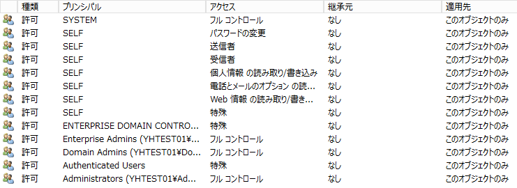
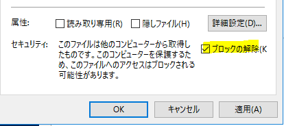

> 本記事は Technet Blog の更新停止に伴い https://blogs.technet.microsoft.com/jpazureid/2017/12/14/azure-ad-connect-mc125948/ の内容を移行したものです。
> 元の記事の最新の更新情報については、本内容をご参照ください。

# Azure AD Connect サービスアカウントに関するセキュリティ アドバイザリについて (MC125948)  

こんにちは。Azure Identity サポートチームの橋本です。  
先日 12 月 12 日に公開された Azure AD Connect で利用するアカウントのセキュリティ強化に関する下記セキュリティ アドバイザリについて補足情報をお知らせします。  

[Microsoft Security Advisory 4056318](https://docs.microsoft.com/en-us/security-updates/securityadvisories/2017/4056318)  
Guidance for securing AD DS account used by Azure AD Connect for directory synchronization  

- セキュリティ アドバイザリの概要について  
- 対処策について  

## セキュリティ アドバイザリの概要について

Azure AD Connect (AADC) はオンプレミスの Active Directory に接続するためのアカウントをインストール時に作成します。  

このアカウントは、同期処理を実施するためにオンプレミス AD に対してパスワードリセットなど (Exchange ハイブリッドを構成した場合はディレクトリ オブジェクトへの書き込みや、パスワードの書き戻しを構成している場合はパスワードのリセット) などの比較的強い権限を持ちます。  

この権限を持つこと自体は AADC の動作上、必要なことであり、今回のアドバイザリでも、このことを問題にしているわけではありません。  

※ アカウントに必要な権限の詳細については、Azure AD Connect: アカウントとアクセス許可 をご確認ください。  

このように比較的強い権限を保持するアカウントであるため、しっかりアクセス権を設定して保護を実施しましょうということが、このセキュリティ アドバイザリ情報です。本アドバイザリでは AADC により作成されたアカウントそのもののパスワードを変更することができるアクセス権のセキュリティ強化ですので、AADC により作成されたアカウントがオンプレミス AD に対してできることには特に変更はなく、同期処理そのものへの影響はありません。  

## 具体的に問題になるシナリオについて

具体的に問題になるシナリオの例を紹介します。  

Account Operators グループのメンバーは Users コンテナに存在するアカウントの管理権限を持ちます。そのため AADC により作成されたアカウントに対しても権限を持ち、そのアカウントのパスワードをリセットすることができます。結果として AADC により作成されたアカウントの資格情報を利用してこのアカウントが保持する権限を利用することができてしまいます。  

なお、Account Operators グループを利用する (このグループにユーザーを所属させ、そのユーザーに管理を任せる) ことはリンクにあるように、Account Operators はドメイン コントローラーのコンピューター オブジェクトを削除できるなど実際はドメイン全体に影響を及ぼす操作ができてしまうため、セキュリティ上推奨していません。  
シナリオの例としては Account Operators の場合ですが、それ以外にも明示的にあるユーザーに対して AADC により作成されたアカウントに対して Account Operators と同等の権限を与えていると同じような懸念が生じます。 セキュリティ アドバイザリでは、推奨される対処として AADC が作成する同期のためのアカウント オブジェクトに対してアクセス権を設定して保護を強力にする方法について記載しています。  

## 対処策について

AADC のオンプレミス AD に接続する際に使用するアカウントへのアクセス権を限定したものに変更します。  

### これから新規インストールする場合

バージョン 1.1.654.0 以降を利用して新規でインストールする場合には、AADC のインストール時に自動生成される接続用アカウントについては限定されたアクセス許可が付与された形で生成されるように改善されましたので対処は不要です。ただし、新規インストール時であっても、構成時に [必須コンポーネントのインストール] 画面にて、 既存のサービス アカウントを接続用アカウントとして指定する場合は、以下の手順にて別途アクセス許可を変更する必要があります。  

### 既に Azure AD Connect が構成されている場合  

多くのお客様はこちらに該当するかと思います。  
1.1.654.0 に含まれるアップグレードは新規インストール時に自動生成される接続用アカウントのみが対象となります。既存の AADC に対してアップグレードを行った場合や、再インストール時に既存のアカウントを指定した場合はアクセス許可は変更されないため、別途以下でご案内しているスクリプトなどによる直接の変更が必要です。  

既存の構成へ対処が必要な場合は、以下の手順にてセキュリティ設定を変更します。  

この手順を実施することで、[Active Directory ユーザーとコンピューター] から当該サービス アカウントのプロパティを開き、[セキュリティ] - [詳細設定] から確認できる、サービス アカウントへのアクセス許可設定が以下のように限定されたものに変更されます。  

スクリプトによるアクセス許可の変更後の設定:  


## 設定手順

1. AADC サーバー上で、デスクトップ上のショートカットなどより AADC の構成ウィザード ("C:\Program Files\Microsoft Azure Active Directory Connect\AzureADConnect.exe") を実行します。  
2. [構成] をクリックします。  
3. [現在の構成を表示する] を選択し、[次へ] をクリックします。  
4. [同期されたディレクトリ] 配下の [ACCOUNT] に表示されているアカウントを確認します。  
このアカウントがオンプレミス AD への接続用のサービス アカウントです。  
例: contoso.local\MSOL_546eeedf0b95  
5. [終了] をクリックし、画面を閉じます。  
6. ドメイン コントローラーに管理者権限でログオンします。  
7. PowerShell を管理者として実行し、以下のコマンドなどを実行し、手順 4 で確認したアカウントの DistinguishedName を確認します。

```powershell
Get-aduser <アカウント名>例:  Get-aduser MSOL_546eeedf0b95出力例: DistinguishedName : CN=MSOL_546eeedf0b95,CN=Users,DC=contoso,DC=local  
```

1. AdSyncConfig.psm1 をダウンロードします。※ もしファイルのダウンロード時に警告が表示された場合、ダウンロードしたファイルのプロパティを開き、以下のチェックが行われているかご確認ください。  
チェックが行われている場合は、チェックを外して [OK] をクリックしてください。  
  

1. 管理者として実行している PowerShell にて、AdSyncConfig.psm1 をダウンロードしたディレクトリに移動し、以下のコマンドを実行します。  

```powershell
import-module .\AdSyncConfig.psm1  
```

1. 続けて以下のコマンドを実行します。  
認証ダイアログが表示されるので、オンプレミス AD のエンタープライズ管理者等、アカウントの設定を変更できる権限を持つアカウントの資格情報を入力します。  

```powershell
Set-ADSyncRestrictedPermissions -ObjectDN "<AD 接続用サービスアカウントの DistinguishedName>" -Credential $credential  
```

例: Set-ADSyncRestrictedPermissions -ObjectDN "CN=MSOL_546eeedf0b95,CN=Users,DC=contoso,DC=local" -Credential $credential  

11. スクリプトを続行するか確認が行われる場合は、"Y" キーを押して ENTER キーを押します。  
以下のメッセージが表示されていれば成功です。  

```powershell
Setting Restricted permissions on <アカウントの DistinguishedName> completed successfully.
```

## 関連情報

Microsoft Security Advisory 4056318  
https://docs.microsoft.com/en-us/security-updates/securityadvisories/2017/4056318  

ご不明な点等がありましたら、ぜひ弊社サポート サービスをご利用ください。  
※本情報の内容（リンク先などを含む）は、作成日時点でのものであり、予告なく変更される場合があります。  
