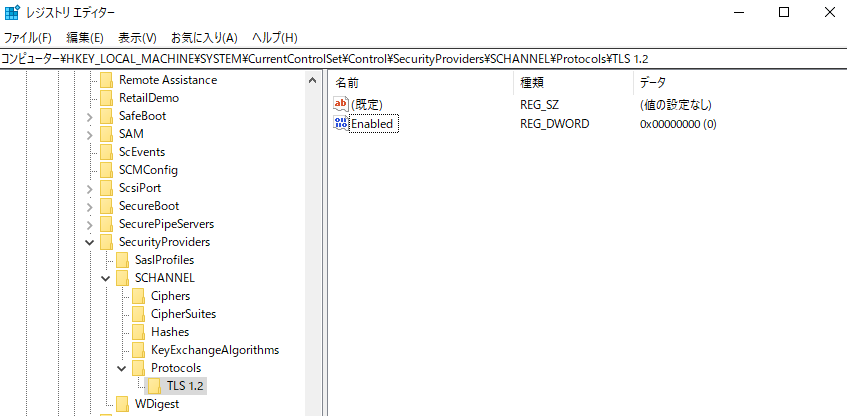

# Azure AD Connect における TLS 1.2 の対応について

こんにちは。 Azure Identity サポート チームです。

こちらのブログでは、MC246440 にて案内している Azure AD における TLS 1.0 および TLS 1.1 の無効化における Azure AD Connect の対応ついてご案内いたします。

## MC246440 の詳細

この度、2021 年 6 月 30 日をもって TLS 1.0 /1.1 , 3DES 暗号スイート (TLS_RSA_WITH_3DES_EDE_CBC_SHA)  のプロトコルおよび暗号のサポートが終了いたします。
それに伴い Azure AD にて 上記プロトコルが無効化されますので、Azure AD Connect でも TLS 1.2 への対応が必要となります。

## TLS 1.2への対応

主な対応は以下の 3 点です。

1. Azure AD Connect を TLS 1.2 に対応している バージョン (1.4.38.0 以降) にバージョンアップを行う。
2. Windows Server (OS レベル) で TLS 1.2 が無効化されていないことを確認する。
3. パススルー認証エージェントが 1.5.389.0 以上であることを確認する。

なお、こちらは TLS 1.2 が既定で有効になっている Windows Server 2012 以降をご利用いただいている前提でのご説明となります。
古いバージョンの Windows Server をご利用いただいている場合には、別途 TLS 1.2 を有効にする手順が必要となります。

それぞれ、以下に詳細を記載いたします。

### 1. Azure AD Connect を TLS 1.2 に対応している バージョン (1.4.38.0 以降) にバージョンアップを行う。

古い Azure AD Connect を利用している場合には OS の設定に関わらず、TLS 1.0 もしくは TLS1.1 が利用される場合があります。
そのため、安全に Azure AD Connect を利用するためには、バージョンアップをご検討ください。
バージョンアップの手順については、以下の公開情報やブログに詳細をおまとめしておりますので、こちらをご参照ください。

- Title:Azure AD Connect:旧バージョンから最新バージョンにアップグレードする
https://docs.microsoft.com/ja-jp/azure/active-directory/hybrid/how-to-upgrade-previous-version
- Title:Azure AD Connect アップグレード手順詳細
https://jpazureid.github.io/blog/azure-active-directory-connect/how-to-upgrade-details/

なお、バージョンは以下の手順にて確認することが可能です。

コマンドでの確認:

```cmd
wmic product list > %userprofile%\desktop\product.txt
```


画面での確認:

[コントロールパネル] - [プログラム] - [プログラムと機能] で ”Microsoft Azure AD Connect” のバージョンを確認します。


### 2. Windows Server （OS レベル）で TLS 1.2 が無効化されていないことを確認する。

Azure AD Connect が新しいバージョンであっても、OS にて TLS 1.2 が無効化されていれば、Azure AD Connect は TLS 1.0 /1.1 を利用する可能性があります。

TLS 1.2 が無効化されていないことは 以下のレジストリで確認が可能です。

レジストリ: HKEY_LOCAL_MACHINE\SYSTEM\CurrentControlSet\Control\SecurityProviders\Schannel\Protocols

以下のように Protocols 配下に TLS 1.2 に関する設定がなければ 、既定通り TLS 1.2 が有効であるため 、対応は不要です。


一方、以下のように TLS 1.2 のキーが存在し、かつ Enabled の値が 0 (無効) である場合には、OS レベルで TLS 1.2 が無効化されています。
キーを削除するか Enabled を 1 (有効) にする必要があります。



### 3. パススルー認証エージェントが 1.5.389.0 以上であることを確認する。

Azure AD Connect でサインイン方式としてパススルー認証が選択されており、Azure AD Connect サーバー以外にパススルー認証エージェントを別途インストールされている場合は、1.5.389.0 以降のエージェントがインストールされていることを確認ください。

[コントロールパネル] - [プログラム] - [プログラムと機能] で ”Microsoft Azure AD Connect Authentication Agent” のバージョンを確認します。


古い場合は、Azure ポータルにサインインし、[Azure Active Directory] - [Azure AD Connect] - [パススルー認証] - [ダウンロード] より最新のエージェントをダウンロードし、インストールします。

## よくあるご質問

### Q. バージョンアップをしなかった場合の影響について教えてください。

A. 恐縮ながら、ご利用の各バージョンにおける 影響についてはご案内することができません。2021 年 6 月 30 日以降 は Azure AD Connect  1.4.38.0 以降のバージョンであればご利用いただけることを確認しております。古いバージョンの Azure AD Connect を 6 月 30 日以降もご利用の場合に何らかの事象が発生した場合も、サポート チケットを発行いただくことは可能です。ただし調査の結果、発生している事象が古いバージョンに起因している可能性が考えられる場合は、最新版へのアップデートや、ご利用の環境での最新版を用いた動作確認をご案内させていただく点にご留意ください。

### Q. TLS 1.0 /1.1 を無効化した際の影響はありますか。

A. Azure  や Office 365 など弊社のクラウドサービスは すでに TLS 1.2 にて動作をしておりますので影響ございません。また、社内のサーバー間での通信におきましても、上記 TLS 1.2 の無効化がされていなければ 影響はありません。その他 ご利用いただいている Web サービス 等がある場合には、それぞれ サービス提供元にご確認ください。

上記内容が少しでも参考となりますと幸いです。なお、製品動作に関する正式な見解や回答については、お客様環境などを十分に把握したうえでサポート部門より提供させていただきますので、ぜひ弊社サポート サービスをご利用ください。
