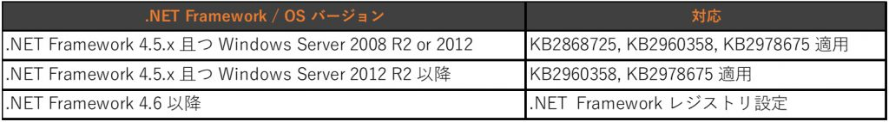

> 本記事は Technet Blog の更新停止に伴い https://blogs.technet.microsoft.com/jpazureid/2018/09/13/azure-ad-connect-tls/ の内容を移行したものです。
> 元の記事の最新の更新情報については、本内容をご参照ください。

# Office 365 の TLS 1.0/1.1 無効化に伴う Azure AD Connect の対応

こんにちは。 Azure Identity サポートの谷です。  
以下のサイトで案内している Office 365 での TLS 1.0 と 1.1 の無効化に伴う、Azure AD Connect での対応についてまとめました。  

Office 365 への TLS 1.2 の実装に対する準備  
https://support.microsoft.com/ja-jp/help/4057306/preparing-for-tls-1-2-in-office-365  

Azure AD Connect でも TLS 1.2 による接続を有効にする必要があります。  
Azure AD Connect では、Azure AD Connect、OS (および更新プログラムの適用状況)、.Net Framework のバージョンに依存し、それぞれ対応が異なります。  
TLS 1.2 を Azure AD Connect の通信で使用するためのサマリは以下の通りです。  

## 各バージョン毎での対応  

### OS として TLS 1.2 を利用するために必要な対応

- 各 OS バージョンの場合
  

### Azure AD Connect の通信 (.NET Framework) を TLS 1.2 にするために必要な対応

- Azure AD Connect がバージョン 1.1.614.0 未満の場合
  

- Azure AD Connect がバージョン 1.1.614.0 以上の場合  
対応は不要です。  
アップグレードを行う場合、下記をご確認ください。  

**Azure AD Connect アップグレード手順**  
https://blogs.technet.microsoft.com/jpazureid/2018/08/10/azure-ad-connect-upgrade/  

- 以上をまとめると次のようになります。  
  

**各バージョンの確認方法**

- OS のバージョンの確認  
- 修正モジュール適用状況の確認  
- Azure AD Connect のバージョンの確認  
- .Net Framework のバージョンの確認  

### OS のバージョンの確認  

Azure AD Connect がインストールされたサーバーにログインします。  
コマンド プロンプトを管理者権限で起動します。  
以下のコマンドを実行します。  

```cmd
# ver  
```

上記コマンド実行結果より、OS バージョンを特定することができます。  

### 修正モジュール適用状況の確認  

Windows Server 2012 R2 未満の OS にて、後述 .Net Framework 更新プログラム適用の前提条件となる更新プログラムが適用されていることを確認します。  

**マイクロソフト セキュリティ アドバイザリ 2868725**  
https://technet.microsoft.com/ja-jp/library/security/2868725.aspx  

バージョン情報は下記のファイルのプロパティ - 詳細 タブ内のファイル バージョンより確認できます。  

- ファイル パス : C:\Windows\System32  
- ファイル名 : schannel.dll  

確認結果より下記より新しいバージョンであれば、適用作業を実施する必要はなく、対応は不要となります。  

- Windows Server 2008 R2 : 6.1.7601.18270  
- Windows Server 2012    : 6.2.9200.16722  

### Azure AD Connect のバージョンの確認

Azure AD Connect のバージョンの確認方法は、Azure AD Connect の Help – About からなど何通りかありますが、以下の方法で確認できます。  

Azure AD Connect がインストールされたサーバーにログインします。  
コマンド プロンプトを管理者権限で起動します。  
以下のコマンドを実行します。  

```cmd
wmic product list > %userprofile%\desktop\product.txt  
```

デスクトップ上に作成された product.txt を開き、"Microsoft Azure AD Connect" の欄の "Version" の項目を確認します。  

### .Net Framework のバージョンの確認

下記弊社技術情報の手順にて確認ます。  

**インストールされている .NET Framework バージョンを確認する**
  https://docs.microsoft.com/ja-jp/dotnet/framework/migration-guide/how-to-determine-which-versions-are-installed  

## 対応方法

### OS バージョン毎での対応方法

#### Windows Server 2008 での対応方法

Windows Server 2008 で TLS 1.2 を利用するためには、Update for Windows Server 2008 (KB4019276) を適用する必要があります。  

**Update to add support for TLS 1.1 and TLS 1.2 in Windows Server 2008 SP2 and Windows Embedded POSReady 2009**  
https://support.microsoft.com/en-us/help/4019276/update-to-add-support-for-tls-1-1-and-tls-1-2-in-windows  

#### Windows Server 2008 R2 での対応方法  

Windows Server 2008 R2 では下記のレジストリ値が明示的に設定されているか確認し、未設定の場合には、設定後に OS 再起動を実施します。  

```txt
  キー：HKEY_LOCAL_MACHINE\SYSTEM\CurrentControlSet\Control\SecurityProviders\Schannel\Protocols\TLS 1.2\Server  
　名前：Enabled  
　タイプ: REG_DWORD  
　値：1  

  名前：DisabledByDefault  
 　タイプ: REG_DWORD  
 　値：0
```

#### Windows Server 2012 以降での対応方法  

OS としては既定で TLS 1.2 を利用するため OS にて対応は不要です。  

### Azure AD Connect がバージョン 1.1.614.0 未満の場合の対応  

#### .NET Framework 4.5.x (4.5、4.5.1 など) の場合  

セキュリティ アドバイザリ 2960358 で紹介されている修正プログラムが必要ですので適用します。  

**マイクロソフト セキュリティ アドバイザリ 2960358**  
https://technet.microsoft.com/library/security/2960358  

この更新プログラムのインストール時に発生する可能性のある既知の問題が報告されていますので、併せてご確認ください。  
(.NET Framework を使用している製品は多くあります。 Azure AD Connect 以外の役割を兼ねている場合には、更新プログラムの適用、 TLS 1.2 を利用させるように変更する際に他に影響が無いかの動作確認が必要です)  

**セキュリティ更新プログラム 2960358 をインストールした後に、Internet Explorer でホストされるマネージ コントロールを含むアプリケーションとノータッチ デプロイメントが正しく機能しないことがある**  
https://support.microsoft.com/ja-jp/kb/2978675  

更新プログラムが適用されると以下のレジストリが設定されます。設定されていることを確認し、もし設定されていなければ変更します。 

```txt
 　キー：HKEY_LOCAL_MACHINE\SOFTWARE\Microsoft\.NETFramework\v4.0.30319  
 　名前：SchUseStrongCrypto  
 　タイプ: REG_DWORD  
 　値：1  

  キー：HKEY_LOCAL_MACHINE\SOFTWARE\Wow6432Node\Microsoft\.NETFramework\v4.0.30319  
　名前：SchUseStrongCrypto  
　タイプ: REG_DWORD  
　値：1  
```

#### .NET Framework 4.6 以降の場合  

特に修正プログラムの適用は不要ですが、レジストリを手動で設定する必要があります。  
設定後のシステムの再起動は不要です (PowerShell を起動している場合は設定を反映させて TLS 1.2 を利用させるためには PowerShell の再起動が必要です)。  
Windows Server 2016 は既定で .NET Framework 4.6 が含まれています。 

```txt
  キー：HKEY_LOCAL_MACHINE\SOFTWARE\Microsoft\.NETFramework\v4.0.30319  
  名前：SchUseStrongCrypto  
  タイプ: REG_DWORD  
  値：1  

  キー：HKEY_LOCAL_MACHINE\SOFTWARE\Wow6432Node\Microsoft\.NETFramework\v4.0.30319  
　名前：SchUseStrongCrypto  
　タイプ: REG_DWORD  
　値：1  
```  

### TLS 1.2 を利用しているか確認方法  

設定後に実際に TLS1.2 での通信が行われるか確認を行う場合、下記の手順にて確認を行うことが可能です。  

#### 手順:  

1. Azure AD Connect サーバーにて、コマンド プロンプトを管理者として実行します。  
2. 以下のコマンドを実行します。  

```cmd
netsh trace start capture=yes  maxSize=2000M  
ipconfig /flushdns  
nbtstat -R  
klist purge  
klist purge -li 0x3e7  
klist purge -li 0x3e4  
```

3. Azure AD Connect にて差分同期を実行します。以下の PowerShell コマンドにて実行いただけます。  

```cmd
Start-ADSyncSyncCycle Delta  
```

4. 2 のコマンドプロンプトにて、以下のコマンドを実行します。

```cmd
netsh trace stop  
```

5. トレース ファイルの収集処理が完了しましたら "ファイルの場所" として表示されている NetTrace.etl ファイルを採取します。  
6. 任意の端末にて Microsoft Network Monitor を実行します。  
7. 採取したファイルを開きます。  
8. Filter に以下を入力し、[Apply] ボタンをクリックします。(ClientHello のみを表示します)  

```cmd
TLS.TlsRecLayer.TlsRecordLayer.SSLHandshake.HandShake.ClientHello  
```

9. Destination が adminwebservice*.microsoftonline.com のパケットを選択します。(adminwebservice-s1-co2.microsoftonline.com など)  
10. 左下のウィンドウにて、TLS の詳細を開き確認します。  

**例:**

```txt
- TLS: TLS Rec Layer-1 HandShake: Client Hello.  
- TlsRecordLayer: TLS Rec Layer-1 HandShake:  
ContentType: HandShake:  
- Version: TLS 1.2   <<< ◆ TLS 1.2 で通信していることを示します  
```

以上で確認方法は終了となります。  
なお、Microsoft Network Monitor は以下よりダウンロードいただけます。  

**Microsoft Network Monitor 3.4**  
http://www.microsoft.com/downloads/details.aspx?displaylang=en&FamilyID=983b941d-06cb-4658-b7f6-3088333d062f  

- NM34_ia64.exe ... Network Monitor 3.4 IA64 版  
- NM34_x64.exe  ... Network Monitor 3.4 x64 版  
- NM34_x86.exe  ... Network Monitor 3.4 x86 版  
