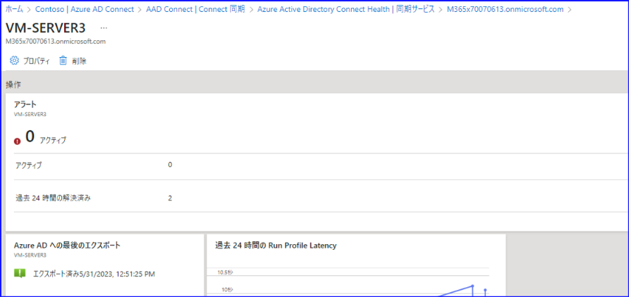
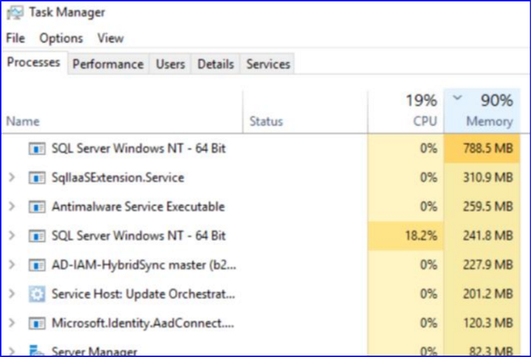

# Azure AD Connect に関するよくある質問

こんにちは！ Azure ID チームの小出です。

Azure AD Connect (AADC) のお問い合わせが多いご質問について、以前 2020 年に Q&A 形式でおまとめいたしておりましたが、バージョンも v2 となり記事が古くなってまいりました。
今回改めて記事を更新し、最新のよくある質問としてカテゴリ別におまとめいたしました。
既存のドキュメントではカバーされていない動作や質問について、今後も適宜内容を拡充していきますので、ご参照いただければと思います。
  
## Azure AD Connect の構成について

### **Q. AADC の Active / Stand By (アクティブ / スタンバイ) の構成が行えるか？**  

**A.** いいえ。AADC はクラスター構成を実装していません。
AADC を同一フォレスト内で 2 台以上構成した場合でも、各 AADC で死活監視を行う実装はなく、自動的にアクティブ サーバーを切り替える実装もありません。
冗長構成をご検討の場合は、アクティブ サーバーの 1 台以外はステージング モードを有効化し、必要に応じて手動でアクティブ サーバーを切り替えてご利用ください。
  
### **Q. ステージング サーバーについての詳細を教えてください** 

**A.** Azure AD Connect で冗長構成を行うために利用する「ステージング モード」を有効にしたサーバーです。
Azure AD Connect では同期に際し、Import、 Synchronization、 Export の 3 つの処理があり、 Export 処理が完了すると、Azure AD 側にユーザーが作成されたり、値が更新されたりします。
ステージング モードが有効な場合、Import、 Synchronization の処理は行われますが、 Export 処理は行われません。
アクティブなサーバーと同じ構成にして利用するサーバーとなるため、何かあった際にステージング モードをオフにすれば、アクティブなサーバーとして利用できます。
詳細は[こちら](../azure-active-directory-connect/introduction-staging-server.md) をご参照ください。  
  
### **Q. 1 つのアカウントを複数の Azure AD へ同期することはできますか？**

**A.** はい、できます。以前はこのシナリオはサポートされていませんでしたが、現在は利用可能です。
ただし注意点が複数ありますので、必ず[こちら](https://learn.microsoft.com/ja-jp/azure/active-directory/hybrid/connect/plan-connect-topologies#sync-ad-objects-to-multiple-azure-ad-tenants) にて最新の情報をご確認ください。
  
### **Q. お勧めの AADC の構成を教えてください**

**A.** お客様の要望・要件によって異なりますが、一般的に単一の Azure AD Connect サーバーだけではなく、加えてステージング モードのサーバーを一台以上利用することをお勧めします。
何か問題が起きた際に同期ができなくなってしまうこと、またバージョン アップに際し、より慎重な「スウィング移行」の手順を利用できるためです。

また、パスワードをクラウド上に保管できる要件の場合は、パスワード ハッシュ同期を利用することをお勧めします。オンプレミス AD が利用できない状態のとき、パスワード ハッシュが同期されていないと、オンプレミス側にもクラウド側にもアクセスできなくなってしまうためです。
パスワード ハッシュが同期されていれば、オンプレミス側の環境にはアクセスできなくても、 Microsoft 365 や Azure の機能にはサインインでき、業務が完全に停止することを防げます。

その他、通信要件などが理由で Azure AD Connect Health を利用できていないお客様が多く見受けられますが、トラブル シューティングに際し弊社側からも情報を確認できるよう、正常に利用できる状態とすることをお勧めします。

### **Q. Azure AD Connect Cloud Sync というのがあるのを知りました。 Azure AD Connect との違いを教えてください。**

**A.** Cloud Sync  (クラウド同期) は、 Azure AD Connect に代わる新しい同期機能です。
Azure AD Connect では、 Azure AD Connect 用のサーバーを一般的に構築し、 Azure AD Connect をインストールしていました。
同期処理の管理や同期ルールの編集などは、これまで Azure AD Connect サーバーで行っていたかと思いますが、クラウド同期を利用すると、任意のサーバーにエージェントを入れるだけで、様々な設定を Azure ポータル上で行うことができるようになります。 Box や Salesforce への Saas プロビジョニングや、テナント間同期の機能を利用されているお客様にとっては、なじみのある画面で設定を行うことができます。

ただし、現時点では Azure AD Connect で用意されている機能をすべて代替できるわけではありません。[こちら](https://learn.microsoft.com/ja-jp/azure/active-directory/hybrid/cloud-sync/what-is-cloud-sync#comparison-between-azure-ad-connect-and-cloud-sync)からサポートされている機能一覧を必ず確認してください。
  
### **Q. 現在オンプレミスと同期をしていますが、Azure AD Connect を廃止して、クラウド専用のユーザーにしたいです。どうすればいいですか？**

**A.** 下記の手順をご利用ください。

**1. サインイン方式を無効化します**

 1-1. AADC サーバーにて、AADC の構成ウィザードを開きます。
   
 1-2. [構成] ボタンをクリックし、[ユーザー サインインの変更] を選択して、[次へ] をクリックします。
   
 1-3. テナントのグローバル管理者情報を入力して、[次へ] をクリックします。
   
 1-4. [パスワード ハッシュの同期] あるいは [構成しない] を選択します。
   
 1-5. [シングル サインオンを有効にする] からチェックを外し、[次へ] をクリックします。
   
 1-6. [構成の準備完了] 画面にて [構成が完了したら、同期プロセスを開始してください。] のチェックを外し、[構成] をクリックします。
   
**2. ディレクトリ同期を無効化します**

 2-1. PowerShell を管理者として実行します。

 2-2. 起動した PowerShell にて、Connect-MgGraph -Scopes “Organization.ReadWrite.All” を実行します。サインイン画面が表示されたらグローバル管理者のユーザー名とパスワードを入力します。
     
 2-3. 以下のコマンドを実行し、onPremisesSyncStatus の state を確認します。  
  (Get-MgOrganization -OrganizationId <テナント ID>).AdditionalProperties.onPremisesSyncStatus

 2-4. enabledの場合は、以下のコマンドを実行し、ディレクトリ同期を無効にします。  
  Update-MgBetaOrganization -OnPremisesSyncEnabled:$false -OrganizationId <テナント ID>

 2-5. 再度 2-3 のコマンドを実行し、 onPremisesSyncStatus の state が enabled や pendingDisabledDraining から disabled に変化しましたら、同期の解除は完了です。

**3. Azure 管理ポータルの設定を確認します**

Azure の管理ポータルの [Azure AD Connect] の画面にて、[シームレスなシングル サインオン] 含め、すべてが無効となっていることを確認します。
上記手順 2 まで完了すると、オンプレミス AD から Azure AD へ同期したユーザー・グループを同期無効化し、クラウド ユーザー・クラウド グループとして継続して利用いただくことが可能です。

すべてのユーザー・グループが問題なくクラウド ユーザー・クラウド グループとなったことが確認できた後、これ以降の手順 3 に進むようにしてください。

ユーザーの場合、 Azure AD ポータルのユーザーの画面にて、 [オンプレミスの同期が有効] 列が全て “いいえ” になっていることで、クラウド ユーザーに変更されていることを確認できます。
グループの場合、 [ソース] 列が全て “クラウド” になっていることで、クラウド グループに変更されていることを確認可能です。

なお、同期の無効化を実施後、切り戻しを実施する必要がある可能性に備え、手順 2 完了後、Azure AD Connect をステージング モードとし、定期同期を停止する方法をとることも可能です。
この場合、手順 2 のディレクトリ同期の無効化を実施後、切り戻し ( Update-MgBetaOrganization -OnPremisesSyncEnabled:$true -OrganizationId <テナント ID> を実施する) までには、少なくとも 72 時間必要な点に注意が必要です。
クリーンアップをしない場合は、手順 1, 2 まででディレクトリ同期の無効化自体は完了です。

無効化が完了したら、必要に応じて下記を実施ください。

**4. Active Directory に作成されたオブジェクトを削除します (シームレス SSO 有効化時のみ)**

 4-1. 同期していたオンプレミス AD の任意のドメイン コントローラーにログインし、[Active Directory ユーザーとコンピューター] を開きます。
 
 4-2. "Computers" コンテナー配下の "AZUREADSSOACCT" というコンピューター アカウントを削除します。

**5. Azure AD Connect をアンインストールします。**

コントロールパネルより、Azure AD Connect をアンインストールします。

**6. Azure AD Connect の同期用アカウント (AAD) を削除します。**

こちらのアカウント (※) は、Azure AD のみに存在するユーザーであり、Azure AD Connect をアンインストール後も残存します。
こちらのアカウントは、後述のコマンドで削除可能です。

※ Azure AD Connect の同期処理のみに利用されるアカウントです。Sync_<サーバー名>_<乱数>@xxxx.onmicrosoft.co の形式で作成され、同期処理に必要な最低限の権限のみを保有しております。

 6-1. PowerShell を管理者として実行します。

 6-2. 以下のコマンドを実行し、Azure AD のグローバル管理者のアカウントでサインインします。 

```PowerShell
Connect-MgGraph -Scopes "Directory.AccessAsUser.All"
```

  ※ アクセス許可の同意が要求された場合は、[承諾] をクリックします。 

 6-3. 以下のコマンドを実行し、同期用アカウントを削除します。 

```PowerShell
$RoleID = (Get-MgDirectoryRole -Filter "DisplayName eq 'Directory Synchronization Accounts'").id
$userIDs = (Get-MgDirectoryRoleMember -DirectoryRoleId $RoleID).id
foreach($ID in $userIDs){
Remove-MgUser -UserId $ID
}
```

**7. Azure AD Connect Health を削除します。**

 7-1. [Azure Portal] - [Azure Active Directory] - [Azure AD Connect] – [Connect 同期] - [Azure AD Connect Health] を開きます。

 7-2. [同期サービス] でテナント名 (xxxx.onmicrosoft.com) を選択します。

 7-3. [Azure Active Directory Connect Servers] で撤去するサーバーを選択します。

 7-4. サーバー画面上段の ”削除” をクリックします。
 


 7-5. サーバー名を入力して ”削除” を選択します。

### **Q. AADC や AADCH をインストールする際のネットワーク要件を教えてください。**  

**A.** [Azure AD Connect サーバー - ウィルス対策ソフト除外項目 / 使用する通信ポート](../azure-active-directory-connect/port-used-by-aadc.md) をご参照ください。  

### **Q. AADC は Azure VM にも構築できますか？**

**A.** はい、可能です。Azure VM でも構築・利用できます。

### **Q. AADC のバックアップ / リストア方法はありますか？**  

**A.** いいえ、 Azure AD Connect を利用している状態でバックアップを取得したり、問題が発生した場合にバックアップやスナップショットからサーバーをリストアする方法は、方法にかかわらずサポートされていません。
Azure AD Connect (AADC) の復旧作業は、AADC の再インストールを基本作業として実施ください。 

以下いずれかの方法から対応をご検討ください。詳細は[こちら](https://learn.microsoft.com/ja-jp/azure/active-directory/hybrid/connect/how-to-connect-sync-staging-server#disaster-recovery) をご覧ください。

- Azure AD Connect を再インストールする。
- 予備のスタンバイ サーバーを用意する (" ステージング モード" と呼ばれます)。
- 仮想マシンを使用する。
※ このうち、「仮想マシンを使用する」 については、Hyper-V ライブマイグレーションのような方式を指します。(仮想マシンのバックアップリストアによる復旧はサポートされておりません。)

何か問題が発生した際には、ステージング サーバーとモードを切り替えて対応します。
この際、先に問題が起きているサーバーをステージングとし、もともとステージングだったサーバーは後からアクティブにしてください。
これは、短い時間ではありますが、2 台のサーバーが同時にアクティブな状態となってしまうことを防ぐためです。
順番が反対だと、２つのサーバーがアクティブになる瞬間があり、さらに問題が発生したり、不整合を起こしたりする場合があります。

もし AADC が 1 台しかないなど、ステージング モードと入れ替えできない場合は、Azure AD Connect をアンインストールし、再度インストールしてください。

なお、再インストールするにあたり、 Azure AD Connect 内の情報については、現在サポートされているバージョンについては下記 Import / Export 機能を利用してバックアップすることは可能です。
Import / Export 機能については [こちら](https://jpazureid.github.io/blog/azure-active-directory-connect/aadc-import-export-config/)をご覧ください。

### **Q. AADC でバックアップ / リストアができないのはなぜですか？**

**A.** バックアップ/リストアによって Azure AD と オンプレミス AD 間で情報の不整合が生じる可能性があるためです。

たとえば、5/1 に OS バックアップを取得し、5/5 にオンプレミス側からユーザーを 3 人同期したとします。
5/10 までこのユーザーは正常に Azure AD や Microsoft 365 を利用していましたが、 5/12 にリストアを行うことになりました。
5/1 のバックアップを利用してリストア作業を実施すると、 5/5 に作成・同期したユーザーはその時点でオンプレミス AD に登録されていません。

ユーザーがオンプレミスから削除、あるいは同期対象 OU から外れた場合、本来そのユーザーは Azure AD から削除される動作となります。
しかしながら、バックアップからリストアされた Azure AD Connect はその変更を検知できないため、5/5 に作成・同期された 3 名は、 Azure AD にユーザー アカウントが残留してしまいます。

不整合については、完全同期を手動で行うことで解消するシナリオもありますが、製品としては想定されないシナリオのため、意図しない動作が起こる可能性があります。
そのため、Azure AD Connect をバックアップ・リストアで復旧することはお控えください。
仮にバックアップ ファイルなどからサーバーを復旧させた場合、AADC を一度アンインストールした上で再度インストール作業を実施ください。

## アップグレード・バージョンについて

### **Q. AADC のダウングレードはできますか？**  

**A.** いいえ。ダウングレードは出来ません。  
アップグレード後に以前のバージョンに戻したいなどの場合には、一度 AADC をアンインストールし、お客様にて保持されているアップグレード前のインストール ファイルでインストール、構成し直す必要があります。  
  
### **Q. Azure AD Connect の旧バージョンのインストール ファイルを提供してほしい。**  

**A.** テクニカル サポートでは提供していません。最新バージョンのインストール ファイルを利用するか、新しいバージョンが提供される前に事前にお客様側でファイルを保管してください。
  
### **Q. AADC のサポート対応中のバージョン、サポート有効期間は？**  

**A.** バージョン v1.x は、すでに 2022 年 8 月 31 をもって廃止されております。
また、[こちら](https://learn.microsoft.com/ja-jp/azure/active-directory/hybrid/decommission-connect-sync-v1) に記載の通り、2023 年 10 月 1 日以降は AADC v1.x からの接続を停止します。
もし現在も Azure AD Connect v1.x を利用されている場合は、速やかにアップグレードを実施してください。

アップグレードの手順詳細は、下記をご覧ください。
[Azure AD Connect アップグレード手順](../azure-active-directory-connect/how-to-upgrade.md)  
  
Azure AD Connect v2.x につきましては、ご利用いただいているバージョンによってサポート期限が異なります。
下記公開情報に記載の次のバージョンにつきましては、すでに 2023 年 3 月 15 日をもって廃止され、弊社としての利用は非推奨とされております。

その他の v2.x につきましては、最新版がリリースされると、それ以前にリリースされたバージョンは 12 か月後に非推奨となります。
具体的には、2023 年 5 月 17 日現在、最新の Azure AD Connect のバージョンは、2022 年 11 月 9 日にリリースされたバージョン 2.1.20.0 となっております。
そのため、バージョン 2.1.19.0 は、 12 か月後の 2023 年 11 月 9 日までサポートされます。
 
上記のようなライフサイクルとなりますので、半年から少なくとも 1 年に 1 度は最新版のリリース状況やアップグレードを実施ください。 
バージョン履歴については [こちら](https://learn.microsoft.com/ja-jp/azure/active-directory/hybrid/connect/reference-connect-version-history#21160)をご覧ください。
  
> 以前のバージョンの Azure AD Connect Sync 2.x の廃止は新しいバージョンに置き換えた日から 12 か月後に開始されます。 このポリシーは 2023 年 3 月 15 日に適用されます。このタイミングで 2022 年 3 月 15 日に新しいバージョンに置き換えるすべてのバージョンが廃止されます。
> 次のバージョンは、2023 年 3 月 15 日に廃止されます。  
> · 2.0.89.0  
> · 2.0.88.0  
> · 2.0.28.0  
> · 2.0.25.1  
> · 2.0.10.0  
> · 2.0.9.0  
> · 2.0.8.0  
> · 2.0.3.0  
> Azure AD Connect Sync の最新リリース バージョンをまだ使用していない場合は、その日付より前に Azure AD Connect Sync ソフトウェアをアップグレードする必要があります。  

### **Q. Azure AD Connect の以前のバージョンを使っています。このまま最新バージョンにあげることはできますか。**

**A.** はい、Azure AD Connect は、任意のバージョンからのアップグレードに対応しています。
すでに v2.x を利用している場合は、最新バージョンにアップグレードすることは可能です。
V1.x を利用している場合も、AADC 観点では最新バージョンへアップグレードすることができますが、 v2.x を利用するにあたり OS などの前提条件を満たしているか確認ください。また、非常に古いバージョンを利用している場合は、より安全なスウィング移行をご利用ください。

### **Q. サポートされない非推奨のバージョンを使っているとどうなりますか。**

**A.** 今問題なく同期ができているように見えても、意図しない動作や、突然同期できなくなったなどの問題が発生することがあります。
トラブル シューティングが必要となった場合には、お問い合わせをいただければ確認は可能ですが、バージョンが古いことが原因と判断された場合や、切り分けを実施するにあたりサポートされるバージョンへのアップグレードをお願いすることがあります。
なお、 Azure AD Connect v1.x は 2023 年 10 月 1 日より完全に同期を停止します。この日付以降は動作されない見込みとなりますので、可能な限り早めにアップグレードしてください。
  
## 通知・アラートについて  

### **Q. AADC からの同期エラーに関するメールが届きます。通知の頻度を教えてください。**  

**A.** おおよそ 1 日に 1 回配信されます。詳細は [こちら](https://learn.microsoft.com/ja-jp/azure/active-directory/hybrid/connect/how-to-connect-health-operations) をご覧ください。

> 同期エラーが発生するたびに毎回メッセージを送信するのではなく、バックエンド サービスから返されたすべてのエラーのダイジェストを毎日送信することになります。

### **Q. AADC からの同期エラーの通知メールを受信しました。受信者はどこで確認できますか？**  

**A.** 同期処理での問題について、以前通知は 2 種類ありましたが、現在は統一されています。下記手順にてご確認ください。

Azure AD Connect Health Agent : <azure-noreply@microsoft.com>

Azure AD Connect Health Agent 通知先設定手順

設定箇所 : [Azure ポータル] - [Azure AD Connect] - [Azure AD Connect Health] - [同期エラー] - [通知設定]

設定項目 : 追加の電子メール受信者

## 日頃の運用について

### **Q. AADC の同期間隔を変更する方法は？**    

**A.** 下記コマンドにて変更可能です。 

```PowerShell  
Set-ADSyncScheduler -CustomizedSyncCycleInterval <任意の時間>  
```

例 (60 分に設定する場合)

```PowerShell  
Set-ADSyncScheduler -CustomizedSyncCycleInterval 00:60:00  
```

なお、問題の発生を防ぐため、同期サイクルを変更した場合も、少なくとも 7 日に 1 度は同期が行われるようスケジュールを構成ください。[こちらの公開情報](https://learn.microsoft.com/ja-jp/azure/active-directory/hybrid/connect/how-to-connect-sync-feature-scheduler)も併せて参照ください。

> 同期サイクルを変更した場合、少なくとも 7 日に 1 回は同期サイクルが実行されるようにする必要があります。
>
> - 差分同期は、最後の差分同期から 7 日以内に実行されることが必要です。
> - (完全同期に続く) 差分同期は、完全同期が最後に完了してから 7 日以内に実行されることが必要です。

### **Q. 定期的な同期を 30 分未満に変更できますか？**

**A.**  いいえ、できません。
最も高頻度に同期を行う間隔として 30 分間隔となります。
CustomizedSyncCycleInterval での設定値が 30 分よりも低い数値 (10 分間隔などに) 設定された場合では、その設定値は無視され、30 分間隔で処理されます。

### **Q. AADC の定期同期を普段は停止しておき、運用の必要性が生じたタイミングだけ同期させても良いですか？**  

**A.** いいえ、定期的な同期が維持されるようにしてください。
 
同期処理を長期間停止している前提で、改めて同期処理を開始しようとした際に、初回の Import 処理に時間がかかり且つ最終的に stopped-server-down で Import 処理が失敗する場合があります。
これは、数日間同期を行わない期間があった場合、処理されずに滞留していた情報があり、同期の再開時にまとめて処理されることに起因して AAD からの Delta Import 処理が AADC 内部で進まなくなる場合があるためです。
 
数日のような長期にわたって同期を行わないことは想定されていないため、定期的な同期を維持してください。
どうしても長期的な同期停止後に同期を再開する必要がある場合は、下記コマンドにて完全同期を実施してください。
  
今すぐ完全同期を開始する場合  

```PowerShell  
Start-AdSyncSyncCycle Initial  
```
  
次回のスケジュール同期を完全同期として実行する場合

```PowerShell  
Set-ADSyncScheduler -NextSyncCyclePolicyType Initial
```
  
### **Q. 完全同期 (Start-ADSyncSyncCycle -PolicyType:Initial) の所要時間は？**  

**A.** オブジェクト内容、同期ルール内容、サーバースペック、ネットワーク パフォーマンスに依存しているため、正確な値を算出することはできません。  
参考値となりますが、オンプレミス Active Directory で 2 万ユーザーではドメイン コントローラー <=> Azure AD Connect では約 30 MB , Azure AD Connect <=> Azure AD では約 240 MB の通信が生じていることが確認出来、30 分程度の時間を要しました。 (オブジェクト自体は必要最低限の情報となり、そのサイズ自体も所要時間に影響を及ぼすものとなります)  
弊社過去事例からは、同期対象のオブジェクト数が 2 万程度の場合、完全同期が完了するまでに 1 ~ 3 時間ほどを要し、10 万オブジェクトほどの場合はおおよそ 4 ~ 9 時間を要したことを確認しています。   
 
### **Q. メモリ使用量がいつも高騰しています。なぜですか。どうしたらいいですか。**

**A.** どのサービスのメモリが高騰しているのかをまずはお知らせください。
タスク マネージャーのプロセス タブを開くと、現在使用中のメモリについて確認可能ですので、[Memory] カラムをクリックして、メモリ使用率でソートします。
ソートを行うと、メモリを大量に使用しているサービス順に表示されますので、どのサービスがメモリを使用しているのかお知らせください。


  
「SQL Server Windows NT – 64 Bit」と「AD-IAM-HybridSync master (xxxx) Azure AD Connect synchronization service」の 2 つのメモリ使用量が高い場合、Azure AD Connect とそれに付随する SQL サービスでメモリの使用量が高くなっている状態です。
 
SQL の既定の動作では、SQL Express サーバー含め、そのサーバーで使用可能なメモリはすべて SQL が利用できるように構成されております。
そのため、使用されていない空き容量のメモリを SQL が確保していることで、メモリ使用量が高くなっていることが想定されます。
これにより、 Azure AD Connect サーバーでは、使用率が 80 % や 90 % となることは想定されます。
 
対処策としては、下記公開情報に記載の手順を利用いただき、 max server memory を設定することで、 SQL が確保する最大メモリ数を指定することが可能です。
SQL Server Management Studio から設定が可能ですので、[こちらの公開情報](https://learn.microsoft.com/ja-jp/sql/database-engine/configure-windows/server-memory-server-configuration-options?view=sql-server-ver15#use-)をご確認ください。

### **Q. 完全同期は定期的に行うべきですか？**

**A.** 必須ではございませんが、環境によっては完全同期の定期的な実施もご検討ください。通常は AADC の同期ルールを変更するなど構成を変更しない限りは完全同期は不要ですが、オンプレミス側で多くのオブジェクトを変更するなど、大量の変更が発生した場合に、差分同期では正常に同期されないオブジェクトが発生した事例がございました。このシナリオでは、完全同期を行うことで整合性を取ることができ、事象が改善するため、定期的に完全同期を実施することをご案内差し上げる場合がございます。

## 同期の動作について

### **Q. AADC をインストール時に既定で生成されるグループを教えてください？**  

**A.** 下記の 4 グループが生成されます。  

 1. **ADSyncAdmins**  
 本グループのメンバーは、Azure AD Connect 同期サービスマネージャーにおけるすべてのアクセス権を持ちます。  
 インストール ウィザードを実行したユーザーは、既定でこのグループに追加されます。  
   
 2. **ADSyncBrowsers**  
 このグループのメンバーは、WMI を使ったパスワードのリセット時にユーザーの情報を集める権限を持ちます。  
  
 3. **ADSyncOperators**  
 このグループのメンバーは、Azure AD Connect 同期サービス マネージャーを操作する権限を持ちます。  
 この操作には例えば次のようなものが含まれます。  
    - 管理エージェントを実行する  
    - 実行した結果（同期状況）の確認する  
    - 実行履歴をファイルにエクスポートする  
  
 なお、このグループのメンバーは ADSyncBrowsers グループに所属している必要があります。  
  
 4. **ADSyncPasswordReset**  
 このグループのメンバーは、WMI を通して行われるパスワード管理のすべての操作ができる権限を持ちます。 
 なお、このグループのメンバーは ADSyncBrowsers グループに所属している必要があります。
  
### **Q. Synchronization Service Manager で Operations タブのみ表示されており、Connectors などが表示されません。理由を教えてください。**  

**A.** サインインしているユーザーが ADSyncBrowse / ADSyncOperator グループにのみ所属していることが原因となります 。  
Synchronization Rules Editor でも操作は制限され、読み取り権限 (Add ボタンは表示されますが、保存不可) のみとなります。  


  
### **Q. 同期対象 OU を個別に設定しています。新規で OU を作成した場合には、同期対象となりますか？**  

**A.** 作成した OU の親 OU が同期対象か否かで変わります。  
  追加した OU の親 OU が同期対象であれば、新規で追加された OU も同期対象となり、逆に親 OU が同期対象外であれば、子 OU も同期対象外となります。
  ルート OU 直下の OU も同様となり、ルート OU が親 OU となります。  
  
### **Q. 同期対象 OU を個別に設定しています。オンプレミス側で OU を移動した場合には、同期対象となりますか？**  

**A.** 同期対象の状態は維持されます。  
  例えば、親 OU / 子 OU 双方が同期対象状態となっている状態で、オンプレミス側で OU の配置を変更し、子 OU のみ非同期対象の OU 配下に移動した場合、子 OU の同期状態は維持されます。
  解除する必要がある場合には、Azure AD Connect インストール ウィザードから個別に選択を解除する必要があります。
  
### **Q. Azure AD のみのクラウドユーザーをオンプレミス Active Directory に書き戻すことはできますか？**  

**A.** クラウド ユーザーを書き戻す機能は実装していません。オンプレミス Active Directory 上で手動で作成し、ソフトマッチを行って同期ユーザーとしてご利用ください。  

### **Q. ソースアンカーを objectGUID から mS-DS-ConsistencyGUID に変更した場合の影響について教えてください。**

**A.** 特に影響やリスクはありません。詳細は[こちらのブログ](https://jpazureid.github.io/blog/azure-active-directory-connect/aadc_hardmatch/)も併せてご確認ください。

> ・ソースアンカーを変更するリスクは？
> 
> ソースアンカーを変更する場合のリスクを気にされる方も多いと思いますが、AADC は通常 objectGUID の値を Base64 でエンコードし、初回の同期処理で Azure AD の ImmutableID の値にセットします。  
> つまり、ソースアンカーを mS-DS-ConsistencyGuid に変更しても、ImmutableID の値は元の objectGUID をエンコードした値のまま変わりません。  
> したがって、同じ ImmutableID の値が mS-DS-ConsistencyGuid に書き戻されるため、既存の同期ユーザーが同期できなくなるといった影響は生じません。

### **Q. 同期元のユーザーを変更したいです。どうすればいいですか？**

**A.** ハード マッチを利用して、同期元のユーザーを切り替えます。詳細は [本ブログ](https://jpazureid.github.io/blog/azure-active-directory-connect/aadc_hardmatch/) にて案内しておりますのでご確認ください。

## よくみかけるエラーについて

### **Q.  大量にオブジェクトを削除したらエラーが発生しました。どうしたらいいですか。**

**A.**
Azure AD Connect には、大量のオブジェクトがオンプレミス Active Directory で削除された場合に、閾値 (既定で 500) を超えた場合には削除処理が誤って行われた可能性を考慮し、同期を停止する機能が既定で有効に設定されています。動作の詳細は [こちら](https://learn.microsoft.com/ja-jp/azure/active-directory/hybrid/connect/how-to-connect-sync-feature-prevent-accidental-deletes) をご覧ください。

削除処理が意図したものである場合には、一旦この保護機能を無効にして、同期を許可するという対応を実施します。

1. PowerShell を起動し、以下のコマンドを実行して、保護機能を一時的に無効にします。  

```PowerShell  
Disable-ADSyncExportDeletionThreshold
```

1. 手動で同期を実施し、正常に Export 処理が完了したことを確認します。
  
```PowerShell
Start-ADSyncSyncCycle -PolicyType Delta
```

1. 再度保護機能を有効にします。コマンドを実行した後、"DeletionThreshold" にパラメーターを入力する必要がありますが、特に理由が無ければ既定値の 500 を指定します。
   
```PowerShell  
Enable-ADSyncExportDeletionThreshold
```

なお、 Enable-ADSyncExportDeletionThreshold コマンドで -DeletionThreshold オプションを付与すると、閾値を変更することも可能です。このとき特に一旦無効にする必要はありません。例えば 2 を設定すると 2 オブジェクト以上の削除が検出されると同期が止まります。

また、現在の閾値は Get-ADSyncExportDeletionThreshold で確認できます。

### **Q. インストール ウィザードが完了できません。**

**A.** [こちら](https://github.com/jpazureid/aadconnect-diagnostic) のページを確認し、[シナリオトレース (構成ウィザード、またはその他のシナリオ)] を実施した際のログをお寄せください。

### **Q. permission-issue が発生しました。対処策を教えてください。**

**A.** 同期元オブジェクトへの書き込みアクセス許可が不足している場合に発生します。
[こちら](https://jpazureid.github.io/blog/azure-active-directory-connect/error-code-8344/)のブログをご確認ください。エラーの詳細をおまとめしています。

### **Q. AttributeMustbeUnique と表示され、重複エラーが発生します。対処策を教えてください。**

**A.** すでに Azure AD に同期しているユーザーと、これから同期しようとしているユーザーの属性が重複しているためにエラーとなっています。
具体的には、 UPN やメール属性、プライマリ プロキシ アドレスなどの重複をよくお見かけします。
既存で同期されているユーザーの値を調整するか、これから同期しようとしているユーザーの属性を変更して同期すれば、重複せずにそれぞれ同期されるため、エラーの解消が見込まれます。
