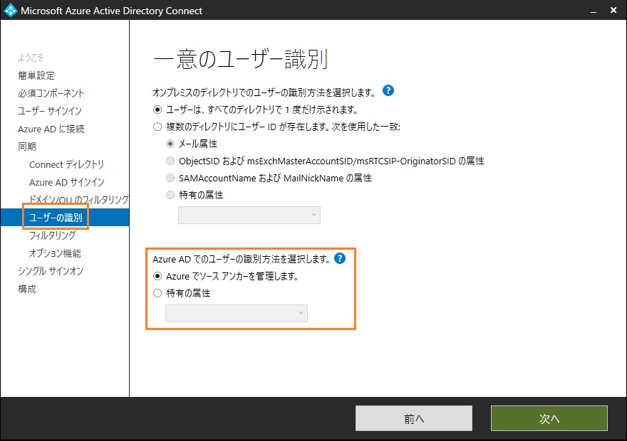
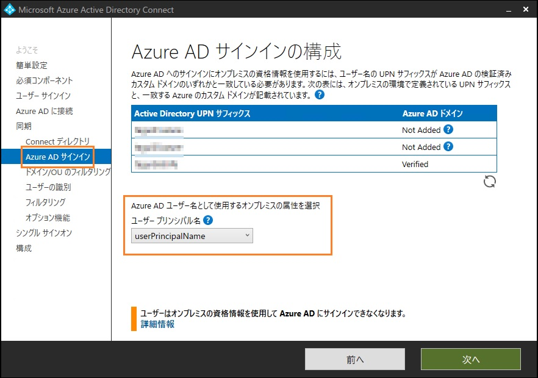
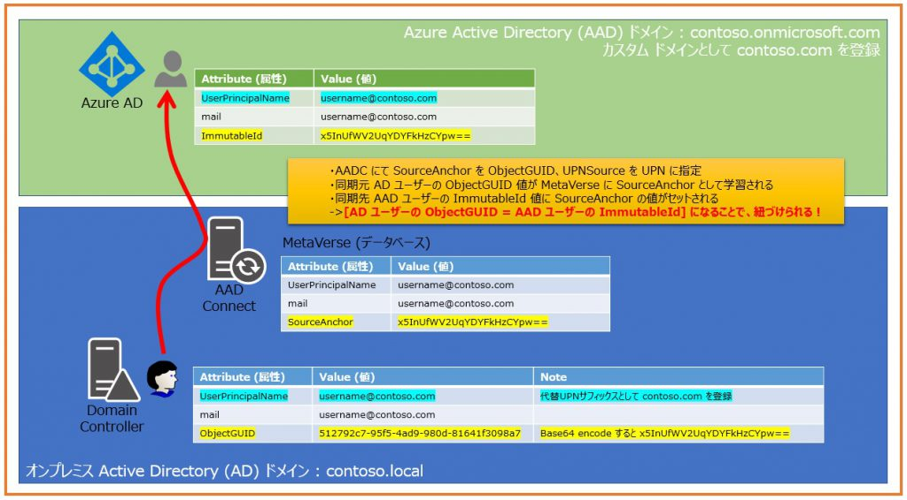

> 本記事は Technet Blog の更新停止に伴い https://blogs.technet.microsoft.com/jpazureid/2018/05/09/synchronization-basic-point/ の内容を移行したものです。
> 元の記事の最新の更新情報については、本内容をご参照ください。

# Azure AD Connect : ディレクトリ同期の基本的なポイント

こんにちは。Azure Identity チームの金森です。  
今回は Azure AD Connect (AADC) ツールによるオブジェクト同期の考え方を改めて紹介したいと思います。

AADC の技術情報は以下の技術情報をはじめとして豊富に公開されています。  
[オンプレミスのディレクトリと Azure Active Directory の統合](https://docs.microsoft.com/ja-jp/azure/active-directory/hybrid/whatis-hybrid-identity)

アーキテクチャや実装の仕様、構成の方法など幅広く情報が公開されていますので、ぜひお時間があれば各ページをご一読いただければ幸いです。  
しかし、情報量が多いがゆえに逆に勘所となるポイントがつかみづらい、というご意見にこたえる形で、今回は AADC によるオブジェクト同期のポイントをかいつまんで紹介したいと思います。

紹介するポイントは以下の通りです。

1. **AADC はオンプレミス  AD 側のオブジェクトが AAD に向けて同期される**
2. **AADC には重要な基本設定が 2 つある**
3. **オンプレミス AD オブジェクトと AAD オブジェクトはどのように紐づくのか**

それでは 1 つずつ見ていきましょう！

## 1. AADC はオンプレミス  AD 側のオブジェクトが AAD に向けて同期される

AADC ツールを構成する際、接続先のオンプレミス AD と AAD を指定しますが、この 2 つのディレクトリの同期の方向は [AD -> AAD] に向けた同期となります。  
オンプレミス AD の複数の Domain Controller (DC) サーバーのように双方向での同期は <span style="color: green; ">[基本的に]</span> 行われません。

<span style="color: green; ">[基本的に]</span> と強調しているのは、AADC 構成時のオプション選択によっては [AAD -> AD 方向の書き戻し] も行われるためです。  
下記技術情報の [オプション機能] の項目に、構成時に選択可能なオプション機能の情報を公開しています。
[Azure AD Connect のカスタム インストール](https://docs.microsoft.com/ja-jp/azure/active-directory/hybrid/how-to-connect-install-custom)

以下のオプション機能を有効にした場合、AAD から AD 方向の書き戻しが行われます。  
※ オプションによっては Azure AD Premium 等の追加ライセンスが必要なものもあります。

- **Exchange ハイブリッドのデプロイ** : Exchange 関連の属性値がオンプレミス AD 側のオブジェクトに書き戻されます。
- **パスワードの書き戻し (Writeback)** : AAD ユーザーのパスワードを変更するとオンプレミス AD ユーザー側のパスワードも変更 (書き戻し) されます。
- **グループの書き戻し** : [Office 365 グループ] という種類のグループを AAD 上に作成すると、Exchange を展開しているオンプレミス AD に書き戻されます。
- **デバイスの書き戻し** : AAD に登録したデバイス オブジェクトがオンプレミス AD の [RegisteredDevice] 名の OU に書き戻されます。

なお、グループの書き戻しは現時点ではプレビュー機能となっていますのでご注意ください。  
プレビュー機能に関しては [プレビュー段階の機能の詳細](https://docs.microsoft.com/ja-jp/azure/active-directory/hybrid/how-to-connect-preview) に情報を公開しています。

このようにオプション機能によっては AAD からオンプレミス AD に向けた同期も行われますが、基本的にはオンプレミス AD 側のオブジェクト情報が AAD に片方向で同期されると捉えていただければと思います。

## 2. AADC には重要な基本設定が 2 つある

AADC でディレクトリ同期を行うにあたって、重要な基本設定が 2 つあります。

### SourceAnchor

同期元であるオンプレミス AD ユーザーと、同期先である AAD ユーザー間の紐づけ (アンカー) を行う値の元ネタとなるオンプレミス AD オブジェクト側の属性の指定となります。  
AADC のバージョン 1.1.486.0 以前では ObjectGUID 属性が規定値として選択されていました。  
1.1.524.0 以降では規定値としてオンプレミス AD ユーザーの mS-DS-ConsistencyGUID 属性が選択されるようになりました。  
この値が AAD 同期ユーザー側の ImmutableId 属性値となります。

なお、ImmutableId 属性値は、直接 AAD 上に作成したユーザーの場合、既定で null になっています。  
つまり、オンプレミス AD ユーザーの [SourceAnchor に指定した属性値] と AAD 同期ユーザーの ImmutableId 属性値が一致することで、2 つのオブジェクトが同期元/先として紐づいた状態になります。

### UPNSource (と、この Blog では呼称します)

構成ウィザードの設定項目ではこのような呼称ではないのですが、同期先である AAD 同期ユーザーの UserPrincipalName (UPN、名前) を決定する、同期元オンプレミス AD ユーザーの属性の指定を UPNSource と、この Blog では呼称します。  
デフォルトではオンプレミス AD ユーザーの UPN 属性の値が選択され、この値が AAD 同期ユーザー側の UPN の値になります。

オンプレミス AD ユーザーの UPN と AAD ユーザーの UPN を同じ値にすることができないようなご都合があるケースもあるかと思います。  
例えば、元々オンプレミス AD のドメイン名を contoso.local としており、これからご利用になる AAD に登録するカスタム ドメインを contoso.com にするようなケースにおいては、オンプレミス AD 側のドメイン名を contoso.com に変えることができない、というような場合です。

このような場合においても、オンプレミス AD の [代替 UPN サフィックス] の機能を使用して、contoso.com を代替 UPN として登録してオンプレミス AD ユーザーの UPN を username@contoso.com にすることは可能です。  
しかし、オンプレミス AD ユーザーの UPN 値に依存した他のシステムがあり、AD ユーザーの UPN を変えられない、という場合もあるかと思います。

このようなケースでは、UPNSource の設定として UPN 属性を選択できず、例えば mail 属性などを選択される場合もありますが、このような [UPNSource として UPN 属性以外を選択する] 構成を一般的に [(UPN 以外の属性を UPN の代わりに指定する) 代替 ID 構成] と呼びます。

AADC 構成ウィザードにて、SourceAnchor と UPNSource それぞれの設定値を選択する画面を以下にご紹介します。

#### SourceAnchor



[Azure でソース アンカーを管理します] を選択すると、mS-DS-ConsistencyGUID 属性が利用できる場合は本属性を SourceAnchor に選択しようとします。  
もし mS-DS-ConsistencyGUID 属性が利用できない場合は ObjectGUID 属性を SourceAnchor に選択しようとします。  
こちらの動きに関しては以下の技術情報に説明を公開していますので、併せてご参照ください。  
[Azure AD Connect: 設計概念](https://docs.microsoft.com/ja-jp/azure/active-directory/hybrid/plan-connect-design-concepts)

#### UPNSource

 

なお、この 2 つの設定は [基本的に] AADC の最初の構成ウィザード時にのみ指定が可能ですので、構成後に後から変更したい場合は、AADC の再セットアップが必要になります。  
またも [基本的に] と強調しているのは、前述の [Azure AD Connect: 設計概念](https://docs.microsoft.com/ja-jp/azure/active-directory/hybrid/plan-connect-design-concepts) の [ConsistencyGuid 機能を有効にする方法 - 既存のデプロイ] にも説明がある通り、1.1.552.0 以降の AADC であれば、SourceAnchor を後から mS-DS-ConsistencyGUID 属性に変更することができるためです。

## 3. オンプレミス AD オブジェクトと AAD オブジェクトはどのように紐づくのか

オンプレミス AD オブジェクトと AAD オブジェクトが紐づくイメージを以下にご紹介します。  
この例では SourceAnchor として ObjectGUID 属性、UPNSource として UPN 属性が選択されている前提となります。
 
SourceAnchor に指定したオンプレミス AD ユーザーの属性値が AAD ユーザーの ImmutableID にセットされ、この 2 つのオブジェクトが紐づいた状態になります。
一度紐づいた状態では、オンプレミス AD ユーザー側の属性値が変更されると、同期処理時に紐づいた AAD ユーザー側の属性値が変更されます。

なお、ObjectGUID 属性はオンプレミス AD ユーザーが作成されるタイミングで自動的にランダム値が生成/セットされます。  
そのため、ObjectGUID 例えば [オンプレミス AD ユーザーを削除し、同じ名前で再作成] をしても、すでに作成された同期先 AAD ユーザーと改めて紐づくことはなく新規の AAD 同期ユーザーが作成されます。

また、イメージ図にもある通り、AAD オブジェクト側の ImmutableId 値には [SourceAnchor の値を Base64 encode した値] がセットされます。  
表現方式の違いであり、どちらも同じ値となりますが、ObjectGUID の値を ImmutableId の形式で表示 (もしくはその逆) する Powershell スクリプトを公開しています。

以下のギャラリーより取得していただくことが可能です。

[Convert DirSync/MS Online Directory Immutable ID to AD GUID (and vice versa)](https://gallery.technet.microsoft.com/office/Covert-DirSyncMS-Online-5f3563b1)

また、以下の Blog でもこの [GUID2ImmutableID.ps1] スクリプトを紹介しています。

[Script to convert an MS Online Directory Immutable ID to an AD GUID (and Vice Versa)](https://github.com/jpazureid/blog/blob/master/azure-active-directory-connect/script-to-convert-an-ms-online-directory-immutable-id-to-an-ad-guid-and-vice-versa)

使い方は上記の Blog にもある通り非常に簡単です。ローカル環境に GUID2ImmutableID.ps1 を配置して Powershell プロンプトより以下のようにコマンドを実施します。

``` powershell
PS E:\> .\GUID2ImmutableID.ps1 512792c7-95f5-4ad9-980d-81641f3098a7
ImmutableID
-----------
x5InUfWV2UqYDYFkHzCYpw==
```

引数として ObjectGUID 値を指定すると、ImmutableId 形式でどのような値になるか、が出力されます。  
ImmutableId 値を指定すると、今度は ObjectGUID 形式でどのような値になるか、が出力されます。

```powershell
PS E:\> .\GUID2ImmutableID.ps1 x5InUfWV2UqYDYFkHzCYpw==
Guid
----
512792c7-95f5-4ad9-980d-81641f3098a7
```

上記内容が皆様の参考となりますと幸いです。どちら様も素敵な AAD ライフをお過ごしください。

ご不明な点等がありましたら、ぜひ弊社サポート サービスをご利用ください。  
※本情報の内容（リンク先などを含む）は、作成日時点でのものであり、予告なく変更される場合があります。
