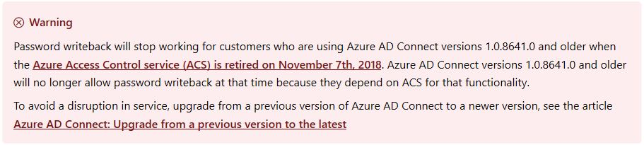

> 本記事は Technet Blog の更新停止に伴い https://blogs.technet.microsoft.com/jpazureid/2018/10/09/20171107cantphsback-aadc108641/ の内容を移行したものです。
> 元の記事の最新の更新情報については、本内容をご参照ください。

# Azure AD Connect: 2018/11/7 以降 AADC 1.0.8641.0 以前では Password Writeback が利用できない

こんにちは。Azure Identity チームの金森です。  
今回は Azure AD Connect (AADC) をご利用いただいている皆様に急ぎお伝えしたい情報がございます。  

先に結論ですが、表題の通り **AADC 1.0.8641.0 とそれ以前のバージョンをご利用の環境において 2018/11/7 以降は  Password Writeback が機能しなくなります**。

理由として、AADC 1.0.8641.0 以前のバージョンでは、Password Writeback を実現するために ACS (Access Control Service) を利用していました。  
**ACS が 2018/11/7 に完全リタイア**するのですが、ACS の機能が提供されなくなることで、AADC 1.0.8641.0 以前をご利用の環境で Password Writeback が動作しなくなります。なお、それ以降のバージョンについては特に影響はありませんのでご安心ください。

How-to: Configure password writeback  
https://docs.microsoft.com/en-us/azure/active-directory/authentication/howto-sspr-writeback

ACS のリタイアに関しては、昨年から情報を公開しておりましたので準備を進めていただいている方も多いかもしれませんが、今回は ACS 対応のアプリケーションを他に利用しているか否かは関係しません。

How to: Migrate from the Azure Access Control service  
https://docs.microsoft.com/en-us/azure/active-directory/develop/active-directory-acs-migration
ACS の移行スケジュール  
https://blogs.technet.microsoft.com/jpazureid/2017/12/29/acs-migration/

AADC のバージョン 1.0.8641.0 は 2015 年 6 月に公開されており、**すでに公開から 3 年以上が経過**しています。  
AADC のバージョン情報は以下のとおりですが、本 Blog 執筆時点 (2018 年 10 月) の最新バージョンは 1.1.882.0 となります。

Azure AD Connect: Version release history  
https://docs.microsoft.com/en-us/azure/active-directory/hybrid/reference-connect-version-history

<!-- textlint-disable -->
AADC はディレクトリ同期ツールとしては 3 代目の製品となります。  
DirSync, ADSync ツールを経て AADC へと進化し、機能追加と修正は現在までほぼ 1～2 カ月に 1 回のペースで行われ、最新バージョンを提供してきています。
<!-- textlint-enable -->

DirSync & ADSync – 2017/12/31 で終了のお知らせ  
https://blogs.technet.microsoft.com/jpazureid/2017/11/02/dirsync-adsync-20171231-で終了のお知らせ/

AADC のどのバージョンをご利用いただいていても、2018 年 10 月時点ではサポート対象となりますが、Password Writeback をご利用いただくためには 1.0.8641.0 よりも後のバージョンが必須となりますのでご注意ください。  
なお、AADC は前述の通りすべてのバージョンがサポート対象ですが、弊社としては**半年以内のバージョンのご利用**を強く推奨します。機能追加と修正を 1 ～ 2 カ月に 1 回程度のペースで行っていますので Windows OS のマンスリー修正のようにお考えいただければと思います。

AADC のアップグレード手順に関しても、Blog にて紹介しておりますのでこちらも参考としていただけると幸いです。

Azure AD Connect アップグレード手順  
https://blogs.technet.microsoft.com/jpazureid/2018/08/10/azure-ad-connect-upgrade/

なお、いきなり 3 年分のバージョンアップを行っても問題ないか心配… という方もいらっしゃると思います。  
そんな時には現在 Active な AADC サーバーを直接アップグレードせず、スウィング移行という方式を取ることも可能です。

Azure AD Connect: 旧バージョンから最新バージョンにアップグレードする  
https://docs.microsoft.com/ja-jp/azure/active-directory/hybrid/how-to-upgrade-previous-version  
-> こちらの [スウィング移行] が対象となります。

詳細はぜひ上記の技術情報をご参照いただければと存じますが、スウィング移行の考え方をざっくりとおまとめすると以下のようになります。

1. 現在ご利用中の Active な AADC サーバーの他に、もう 1 台サーバーを用意する  
2. 用意したサーバーに最新の AADC を [ステージング モード] で構成する  
3. ステージング モード (Import と Sync 処理のみ行い、Export 処理を行わないので既存環境への影響なし) の同期予定のデータを確認する  
4. 最終的に Active な AADC をステージングに、ステージングの AADC を Active に切り替える  
この中で、3. の [ステージング状態にある AADC サーバーの同期予定のデータの正常性 (既存の同期オブジェクトが失われたりしないか) の確認] は、前述の技術情報にもリンクがある以下の手順 (CSExportAnalyzer) を使用することで事前に確認することが可能です。

Azure AD Connect Sync: 操作タスクおよび考慮事項  
https://docs.microsoft.com/ja-jp/azure/active-directory/hybrid/how-to-connect-sync-operations#verify  
-> 確認、の項目が対象です。

ステージング状態の AADC サーバーにて CSExportAnalyzer を使用して [現在の同期済みオブジェクトと、これから (ステージングを解除したら) 同期される予定のオブジェクトを比較して差分を確認] します。 
ここで差分が何もない (ステージングを解除して同期を行っても何も変化がない) とご安心いただけるかと思いますが、仮に 1.0.8641.0 から最新 (執筆時点で 1.1.882.0) にアップグレードした場合、機能改善が行われているため差分が生じます。  
これは前述のバージョン履歴にも記載されている実装変更が行われているためとなり、例えば以下のような差分が検出されることが予想され、これは期待された結果であり差分があっても問題ではありません。

ユーザー オブジェクト  

- employeeID 属性が (オンプレ AD オブジェクトに定義されている場合) 同期対象になる : 1.1.524.0 の機能変更  
- photo 属性がオンプレ AD オブジェクトに定義されていても同期対象外になる : 1.1.524.0 の機能変更  
- userCertificate, userSMIMECertificate 属性に 15 個以上の値が定義されている場合、同期対象外になる : 1.1.524.0 の機能変更  
- OnPremisesDistinguishedName 属性が AAD に同期されるようになる : 1.1.553.0 の機能変更  
- altRecipient 属性が (オンプレ AD オブジェクトに定義されている場合) 同期対象になる : 1.1.553.0 の機能変更  

グループ オブジェクト 

- msExchBypassModerationLink 属性が (オンプレ AD オブジェクトに定義されている場合) 同期対象になる : 1.1.524.0 の機能変更  
- OnPremisesSamAccountName 属性が AAD に同期されるようになる : 1.1.553.0 の機能変更  
- NetBiosName 属性が AAD に同期されるようになる : 1.1.553.0 の機能変更  
- DnsDomainName 属性が AAD に同期されるようになる : 1.1.553.0 の機能変更  

連絡先オブジェクト

- userCertificate, userSMIMECertificate 属性に 15 個以上の値が定義されている場合、同期対象外になる : 1.1.524.0 の機能変更

デバイス オブジェクト

- AAD へのデバイス オブジェクト同期対象として、同期元 AD オブジェクトの userCertificate に値が入っていることが条件になる : 1.1.553.0 の機能変更

上記内容が皆様の参考となりますと幸いです。どちら様も素敵な AAD ライフをお過ごしください。  

ご不明な点等がありましたら、ぜひ弊社サポート サービスをご利用ください。  
※本情報の内容（リンク先などを含む）は、作成日時点でのものであり、予告なく変更される場合があります。
