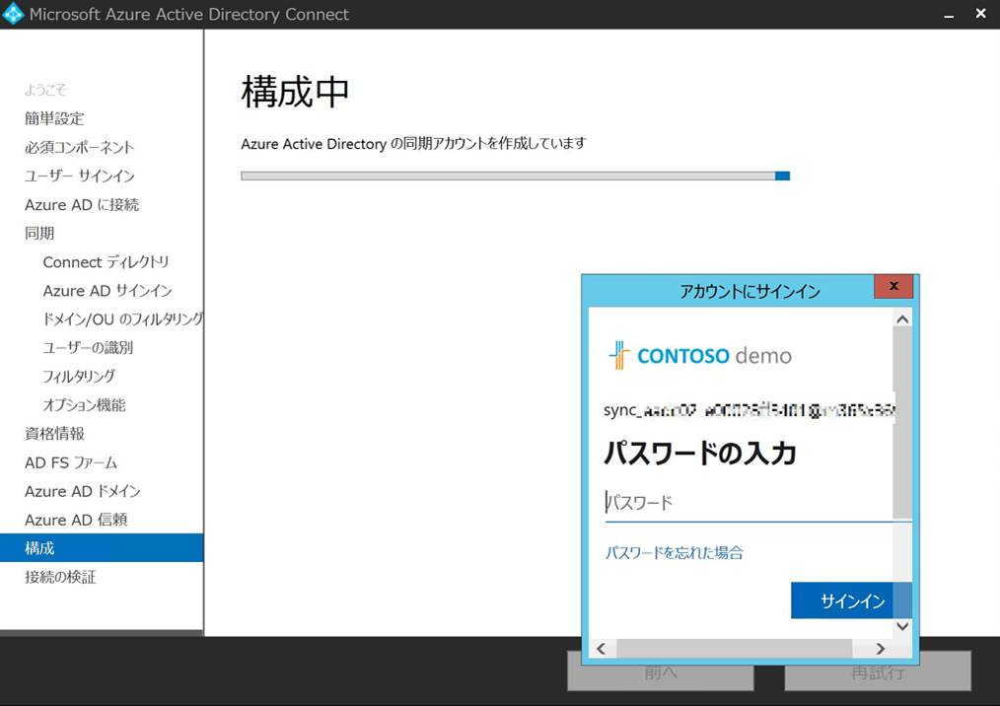

# 条件付きアクセスによりディレクトリ同期が失敗する場合の対処方法について

こんにちは、Azure Identity サポート チームの田中です。

 
今回は、比較的多くのお客様からお問い合わせをいただく、条件付きアクセスの利用を開始した環境において、ディレクトリ同期が失敗するという事象の対処方法の一例を紹介します。
 

**読者のターゲット** : テナントのグローバル管理者。条件付きアクセスおよび Azure AD Connect を操作できることが前提となります。
 

Azure AD Connect は、オンプレミス AD から Azure AD に情報を同期するため、Azure AD 側に Azure AD コネクタ アカウントと呼ばれる (既定では UPN が "Sync_" から始まるアカウント)、Azure AD Connect が同期に使用するための専用アカウントがあります。  
 

この Azure AD コネクタ アカウントが条件付きアクセスでブロックされると、Azure AD Connect によるディレクトリ同期が行われなくなります。
 

そのため、Azure AD 側では、Azure AD コネクタ アカウントが条件付きアクセスでブロックされないように、本アカウントを意味する “ディレクトリ同期アカウント” というロールを個別に用意し、条件付きアクセスの適用対象外ロールとして選択できるようになっています。
 

具体的には、お客様環境における条件付きアクセス ポリシーにて、下記の手順をもとにディレクトリロールの観点で設定を行います。

## 条件付きアクセスの適用「対象外」に Azure AD コネクタ アカウントのディレクトリ ロールを指定する方法
▼手順
1. Azure ポータル (https://portal.azure.com) に、全体管理者 (グローバル管理者) でサインインをします。
 

2. [Azure Active Directory] > [セキュリティ] > [条件付きアクセス] の順にクリックします。
 

3. 変更を行う条件付きアクセスのポリシーをクリックします。
 

4. [割り当て] 配下にある [ユーザーとグループ] をクリックし、下記の設定を追加します。
 

   [対象] : 特に追加の設定は不要です。
 

   [対象外] : [ディレクトリ ロール] にチェックを入れた後、[ディレクトリ同期アカウント] にチェックを入れるという追加の設定を行います。
 
   

   
5. [保存] をクリックします。
 

設定手順は以上となります。
 

## どのようなときに、Azure AD コネクタ アカウントのサインインに問題が発生していると判断すればいいのか
Azure AD コネクタ アカウントのサインインは、Azure AD Connect 新規インストール時からその後の定期的な同期処理においても発生します。

そのため、Azure AD コネクタ アカウントによるサインインに問題が発生している場合は、Azure AD Connect 構成ウィザードにおける画面がしばらくしても進まない動作や、Azure AD のサインイン ログにおいて当該アカウントによるサインインの失敗状況が確認される可能性が考えられます。
 

なお、Azure AD コネクタ アカウントについては、明示的に管理者などのユーザーがサインインを行うものではなく、Azure AD Connect 新規インストール時やその後の定期的な同期処理のタイミングで、自動で当該アカウントによるサインインが行われるものとお考えください。
 

下記では、Azure AD コネクタ アカウントに対して MFA が要求されるようにポリシーを構成している場合の確認例について、Azure AD Connect 構成ウィザードにおける画面、および Azure AD 対話型サインイン ログの観点でご紹介します。
 

**▼ Azure AD Connect 構成ウィザードにおける画面**

例えば、Azure AD Connect 新規インストール時、下記のような "構成中" の画面で、しばらく時間が経過しても画面が変わらない ("接続の検証" 画面に進まない) 場合は、Azure AD Connect 構成ウィザード画面とは別のウィンドウにて、Azure AD コネクタ アカウントに対して、ユーザー名とパスワード & MFA による認証が求められている可能性があります。

その場合は、画面上でパスワードを入力するなどの対処を行うことはできません。

**▼ Azure AD 対話型サインイン ログ**

例えば、ユーザー名が "Sync_" から始まる値で検索フィルターをかけると (通常は Azure AD コネクタ アカウントが検索対象として表示されるのが想定されます)、下記のように Azure AD コネクタ アカウントに対して MFA が要求されているために、当該アカウントによるサインインに失敗していることが確認できます。

本エラーが確認できた場合は、条件付きアクセスにて対処を実施します。
 

上記内容が少しでも参考となりますと幸いです。

なお、製品動作に関する正式な見解や回答については、お客様環境などを十分に把握したうえでサポート部門より提供させていただきますので、ぜひ弊社サポート サービスをご利用ください。