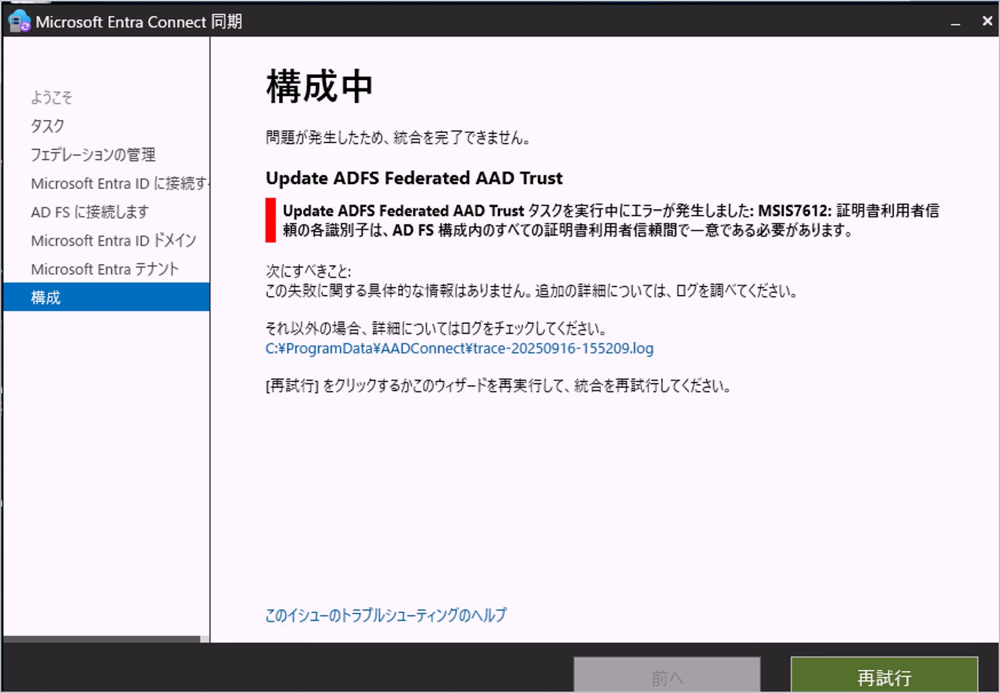
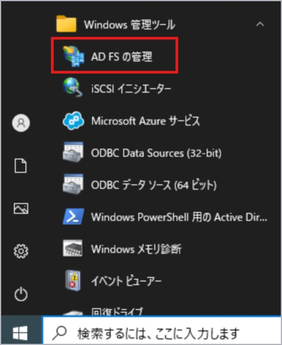
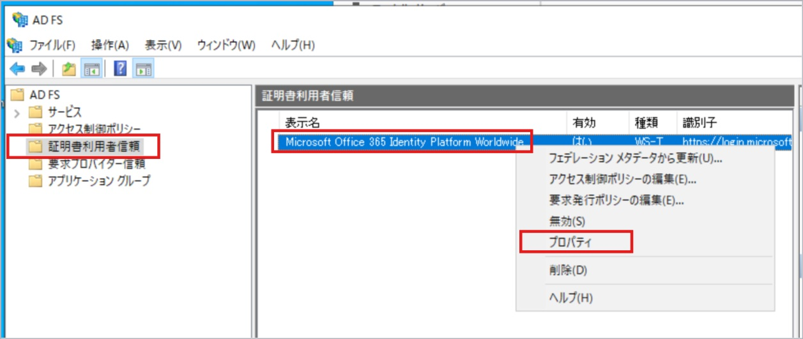
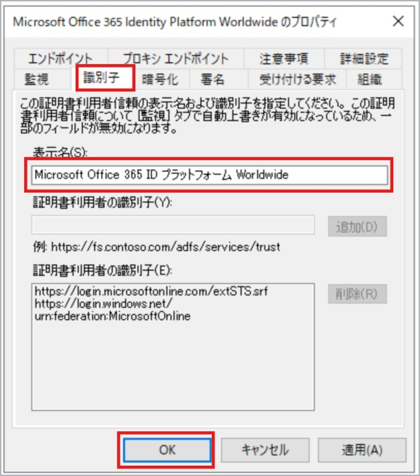

# Microsoft Entra Connect で MSIS7612 エラーが発生し AD FS の構成に失敗する

こんにちは、Azure & Identity サポート チームの長谷川です。

Microsoft Entra Connect 同期 (以下 MEC と表記) では AD FS を構成および管理することができます。その際には MEC のウィザードから「フェデレーションの管理」の項目を用いて AD FS を構成しますが、この構成の際、以下の画面のとおり MSIS7612 エラーが発生し AD FS の構成に失敗することがあります。このエラーが発生すると、その時の IssuerUri (クレーム ルール) の設定値次第ではフェデレーションの信頼関係が崩れ、フェデレーション ユーザーの認証にも影響が生じます。本ブログではこのエラーについて説明します。

## MSIS7612 とは

MSIS7612 は AD FS の証明書利用者信頼を構成する際に指定した各識別子のいずれかが、すでに AD FS で構成済みの証明書利用者信頼で既に利用されている (重複している) 際に表示されるエラーです。各識別子は AD FS 上での重複は許されず一意である必要があります。

## MEC で MSI7612 が記録されるパターン

以下の条件が重なっている場合に、MEC のウィザードから Microsoft Entra ID 用の証明書利用者信頼を更新しようとすると MSIS7612 エラーが発生します。

- AD FS を利用しており、すでに Microsoft Entra ID 用の証明書利用者信頼を構成している。
- AD FS 上の Microsoft Entra ID 用の証明書利用者信頼の表示名が「Microsoft Office 365 ID プラットフォーム Worldwide」以外となっている (例: 「Microsoft Office 365 Identity Platform」や「Microsoft Office 365 Identity Platform Worldwide」など)。
- MEC で AD FS を管理している。 
- MEC をインストールしている Windows Server の OS の言語設定を英語以外の言語 (日本語) にしている。 
- MEC を最新版にアップグレードした。

## MEC で MSI7612 が記録される理由

MEC で Microsoft Entra ID 用の証明書利用者信頼を更新しようとした場合、MEC は AD FS に対して証明書利用者信頼の有無を検索します。この検索の際には証明書利用者信頼の表示名も利用します。しかしながら、MEC がこの検索に利用する証明書利用者信頼の表示名は OS の言語設定に依存して変わる動作になっています。MEC は、日本語環境の場合は「Microsoft Office 365 ID プラットフォーム Worldwide」という表示名で証明者利用者信頼を検索します。

既に AD FS 上で構成されている Microsoft Entra ID 用の証明書利用者信頼の表示名が「Microsoft Office 365 Identity Platform」もしくは「Microsoft Office 365 Identity Platform Worldwide」の場合、MEC が検索に使用する表示名である「Microsoft Office 365 ID プラットフォーム Worldwide」とは名前が異なるため、MEC は証明書利用者信頼がまだ AD FS 上に構成されていないと誤認します。この結果、MEC は新たに Microsoft Entra ID 用の証明書利用者信頼を AD FS 上に構成しようとします。実際には Microsoft Entra ID 用の証明書利用者信頼は構成済みであるため、識別子の重複が検出されます。その結果 MSIS7612 が記録されます。

## MEC で MSI7612 が記録された際の影響

この MSIS7612 が表示された場合、MEC によりすでに Microsoft Entra ID 側のフェデレーション構成のアップデートが行われ、その後の AD FS 側の更新処理が失敗したという状況です。つまり Microsoft Entra ID 側のフェデレーション構成は更新されたが AD FS 側は未更新という状況のため、Microsoft Entra ID 上の IssuerUri の値と AD FS によって発行される IssuerUri の値に不一致が生じる可能性があります。これらの値が不一致となった場合、フェデレーション信頼の構成が崩れ、結果としてそのドメインをもつユーザーがフェデレーション認証する際に AADSTS50107 エラーが発生し、ユーザーは Microsoft Entra ID へのサインインに失敗するようになります。

## MEC で MSI7612 を回避する方法

MEC をインストールしている Windows Server OS の言語設定を日本語にしている場合は、AD FS 上の Microsoft Entra ID 用の証明書利用者信頼の表示名を「Microsoft Office 365 ID プラットフォーム Worldwide」に変更することで MEC での証明書利用者信頼を更新が可能になります (大文字、小文字、スペースの位置、カタカナ部分などは変えずにまったく同じ文字列にしてください)。表示名の変更手順は以下のとおりです。

1. AD FS サーバーにて [AD FS の管理] を起動します。
   
   

2. [証明書利用者信頼] 内の [Microsoft Office 365 Identity Platform (Worldwide)] を右クリックし [プロパティ] を選択します。
   
   

3. [識別子] タブ内の [表示名] を「Microsoft Office 365 ID プラットフォーム Worldwide」に変更し [OK] を選択します。
   
   

## おわりに

本記事では Microsoft Entra Connect で MSIS7612 エラーが発生し AD FS の構成に失敗する事象とその対処方法について紹介しました。製品動作に関する正式な見解や回答については、お客様環境などを十分に把握したうえでサポート部門より提供しますので、ぜひ弊社サポート サービスをご利用ください。
