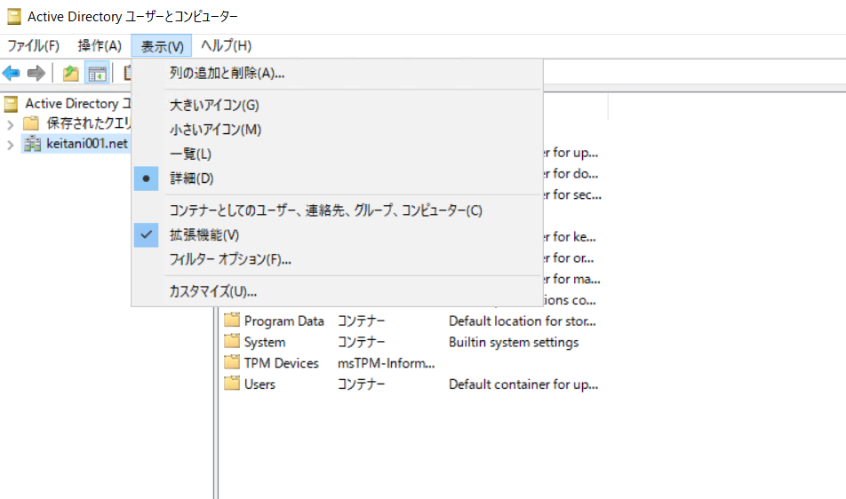
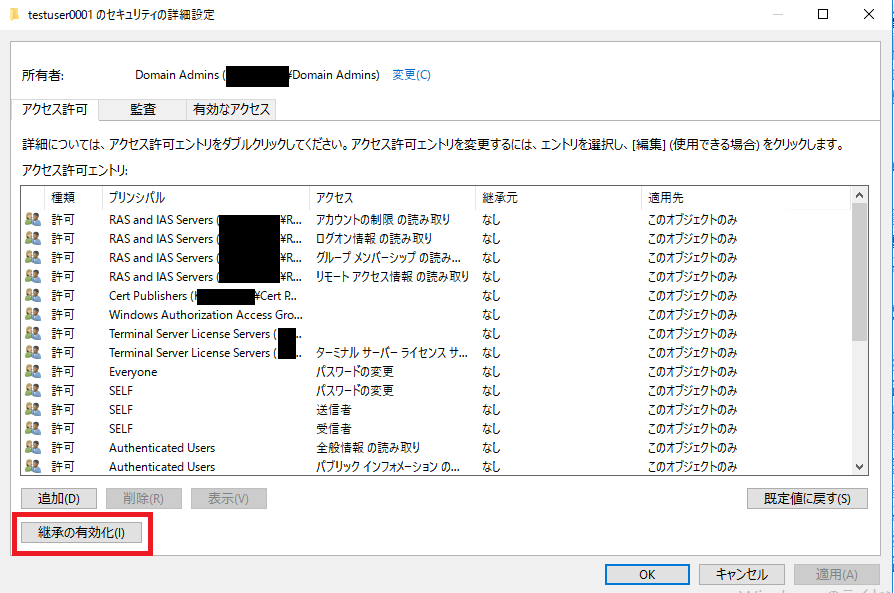

# permission-issue - Error Code ; 8344

Azure AD Connect 構築後、運用中に同期処理にて正常に行えないことで下記の事象が発生します。  
事象発生内容、それぞれのケースの対処方法をお纏めいたしました。

# permission-issue とは
--------------------

Azure AD Connect でユーザー オブジェクトを同期した場合の動作としては、下記の流れで処理が行われます。

1. Active Directory から Azure Active Directory に同期
2. Azure Active Directory から ユーザーオブジェクトの `mS-DS-ConsistencyGuid` 属性を取得し、Azure AD Connect に格納
3. Azure AD Connect から Active Directory のユーザーオブジェクトの `mS-DS-ConsistencyGuid` 属性の書き込み
 
上記の 3. の処理で通常はユーザーオブジェクトの `mS-DS-ConsistencyGuid` 属性に対し、Azure AD Connect で設定している AD DS コネクタ アカウント (MSOL_ から始まるユーザー、あるいはインストール時に指定したドメイン ユーザー) で書き込み処理が行われ、完了します。  
この処理にて AD DS コネクタ アカウントでの書き込み処理がアクセス権が不足している場合に、権限が不足していることを示す ***permission-issue - Error Code ; 8344*** が発生します。
 
# 同事象発生時の確認方法 / エラー
--------------------
Azure AD Connect では Synchronization Service Manager よりエラーを内容を確認することができます。
Synchronization Service Manager では下記のような表示となります。

    Status : completed-export-errors 
    Export Error (s) : permission-issue
    Connected data source error code: 8344
    Connected data source error: この操作を実行するための十分なアクセス権がありません。


# 対処方法
--------------------
全てのユーザーで生じているか、一部のユーザーで生じているかで原因が異なり、それぞれ異なる対処を行う必要が生じます。
それぞれのパターンでの対象方法は下記となります。

**<一部のユーザーでのみ発生している場合>**

全ユーザーではなく、特定のユーザーや特定の OU 配下のユーザーのみで発生している場合には、多くのケースではアクセス権の継承が無効化が原因となっていることが多く報告されています。
下記の手順で継承を有効化します。

1. 任意の ドメイン コントローラー  (DC) に、ドメイン管理者でサインインし、\[Active Directory ユーザーとコンピューター\] を開きます。

> 下記の拡張機能を有効化します。(チェックが入っている状態が有効である状態となります)



2. 画面左ツリーから対象のユーザー、あるいは OU を右クリックし \[プロパティ\] を選択します。
3. \[セキュリティ\] タブより \[詳細設定\] ボタンをクリックし、\[セキュリティの詳細設定\] を開きます。
4. 画面左下に \[継承の有効化\] が表示されている場合は、 クリックすることにより継承を有効化します。



5. 上記完了後に Azure AD Connect サーバーにて差分同期を実施し、事象が解消するかご確認いただければと存じます。

``` PowerShell
Start-ADSyncSyncCycle -PolicyType Delta
```

**<全てのユーザーで発生している場合>**

AD DS コネクタ アカウントにユーザーオブジェクトの属性の読み取り / 書き込み権限が不足していることが原因となって発生していることが多く報告されています。  
下記の手順にて AD DS コネクタ アカウントの確認、同アカウントに適切な権限を付与します。

AD DS コネクタ アカウント確認手順
--------------------
1. Azure AD Connect を起動し、\[構成\] ボタンをクリックします。
2. \[現在の構成を表示する\] を選択し、\[次へ\] ボタンをクリックします。
3. 下記赤枠の ACCOUNT 内の MSOL から始まるアカウントが AD DS コネクタ アカウントです。
4. 確認後は画面を終了します。


>ADSyncConfig PowerShell モジュールがインストールされている場合には下記コマンドにて確認可能
> Get-ADSyncADConnectorAccount 


アクセス権確認、設定手順
--------------------
1. 任意の ドメイン コントローラー  (DC) に、ドメイン管理者でサインインし、\[Active Directory ユーザーとコンピューター\] を開きます。
> 下記の拡張機能を有効化します。(チェックが入っている状態が有効である状態となります)
2. 画面左ツリーから ディレクトリルートを選択、右クリックから \[プロパティ\] を選択します。
3. \[セキュリティ\] タブより \[詳細設定\] ボタンをクリックし、\[セキュリティの詳細設定\] を開きます。
4. \[有効なアクセス\] タブを選択します。
5. "ユーザーの選択" から上述で確認した AD DS コネクタ アカウントを選択します。
6. "有効なアクセス許可の表示" ボタンをクリックします。
7. 画面下部にて表示されるアクセス許可にて下記全てが許可されていることを確認します。
>  - プロパティの読み取り/書き込み
>  - ユーザーの子孫オブジェクト
8. 許可されていない場合には、下記コマンドを実行し、アクセス権を付与します。

``` PowerShell
Set-ADSyncMsDsConsistencyGuidPermissions -ADConnectorAccountDN <String> [-ADobjectDN <String>] [<CommonParameters>]
```

実行例 

``` PowerShell
Set-ADSyncMsDsConsistencyGuidPermissions -ADConnectorAccountDN 'CN=ADConnector,OU=AzureAD,DC=Contoso,DC=com'
```

9. 上記完了後に Azure AD Connect サーバーにて差分同期を実施し、事象が解消するかご確認いただければと存じます。

``` PowerShell
Start-ADSyncSyncCycle -PolicyType Delta
```

参考情報
sourceAnchor としての ms-DS-ConsistencyGuid の使用
<https://docs.microsoft.com/ja-jp/azure/active-directory/hybrid/plan-connect-design-concepts#using-ms-ds-consistencyguid-as-sourceanchor>

Azure AD Connect: AD DS コネクタ アカウントのアクセス許可の構成
<https://docs.microsoft.com/ja-jp/azure/active-directory/hybrid/how-to-connect-configure-ad-ds-connector-account>
