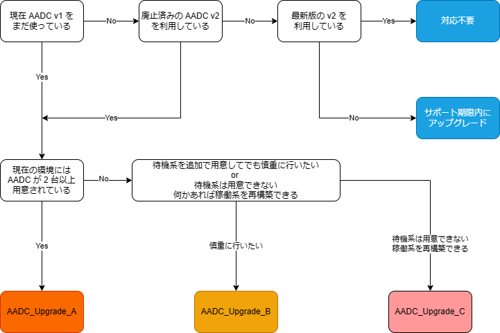

# Azure AD Connect アップグレード手順詳細

こんにちは。 Azure Identity サポートの小出です。

以前、Azure AD Connect の非推奨プロセスに伴い、多くのお客様にて推奨バージョンへのアップグレードご検討いただいている状況となり、弊社にも多くのお問い合わせをいただいておりました。
現在はすでに v1.x は廃止され、多くのお客様が v2.x を利用されていますので、以前展開していた手順詳細資料をこの度アップデートいたしました。

なお、2023 年 10 月 1 日以降は AADC v1.x からの接続を停止することから、まだ v1.x を利用しているお客様においては、早急にアップグレードの対応を実施いただいているかと思います。

利用されているバージョンが v1.x、v2.x にかかわらず、利用できる手順となりますので、実際の作業時の参考にしていただければ幸いです。

今回ご紹介する手順のシナリオは下記の 3 パターンとなります。

- A. Azure AD Connect 2 台構成によるスウィング アップグレード
- B. Azure AD Connect 1 台構成に 1 台追加で構成し、アップグレード
- C. Azure AD Connect 1 台構成によるインプレースアップグレード

それぞれの手順の流れと手順内容を pptx ファイルに纏めさせていただいています。
ご利用いただいている環境に応じて、ご参照ください。

## A. Azure AD Connect 2 台構成によるスウィング アップグレード

### <手順概要>

1. 既存環境の各サーバーにて、動作状況の確認などアップグレード前の事前確認を行います。
2. カスタム同期ルールをはじめ、設定内容を保存します。
3. Server B の Azure AD Connect のインプレース アップグレードを行います。
4. Server B にて、アップグレード後の動作状況を確認します。
5. Server A にて Azure AD Connect のステージング モードを有効化します。
6. Server B にて Azure AD Connect のステージング モードを無効化し、アクティブにします。
7. Server A の Azure AD Connect のインプレース アップグレードを行います。
8. Server A にて、アップグレード後の動作状況を確認します。

### <手順詳細>  
[アップグレード手順詳細 A](./how-to-upgrade-details/aadc-upgrade-a-2023v2.pptx)

## B. Azure AD Connect 1 台構成に 1 台追加で構成し、アップグレード

### <手順概要>

1. 既存環境の ServerA にて、動作状況の確認などアップグレード前の事前確認を行います。
2. カスタム同期ルールをはじめ、設定内容を保存します。
3. Server B となる新しいサーバーを用意します。
4. 新規構築した ServerB に Azure AD Connect をインストールします。 (ステージング モード有効)
5. Server B で動作状況を確認します。
6. Server A にて、 Azure AD Connect のステージング モードを有効化します。
7. Server B にて、 Azure AD Connect のステージング モードを無効化し、アクティブにします。
8. Server A の Azure AD Connect のインプレース アップグレードを行います。
9. Server A で動作状況を確認します。

### <手順詳細>  
[アップグレード手順詳細 B](./how-to-upgrade-details/aadc-upgrade-b-2023v2.pptx)

## C. Azure AD Connect 1 台構成によるインプレースアップグレード

### <手順概要>

1. 既存環境の動作状況の確認
2. 設定内容の保存
3. アップグレード
4. アップグレードの動作確認 (手順1. と同じ)

### <手順詳細>  
[アップグレード手順詳細 C](./how-to-upgrade-details/aadc-upgrade-c-2023v2.pptx)

## 資料の選び方について
どの資料が適切な手順が分からない場合には、下記フローも参考にしてください。

