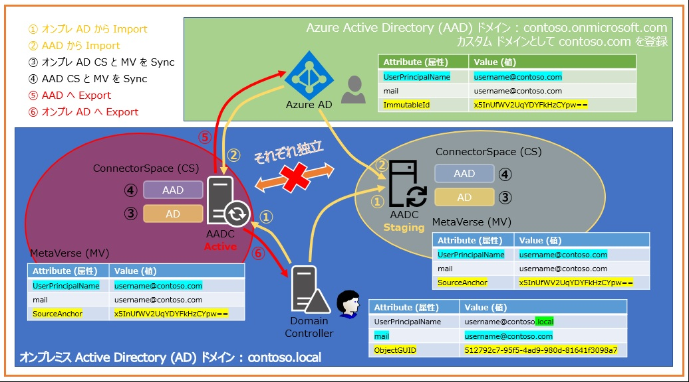
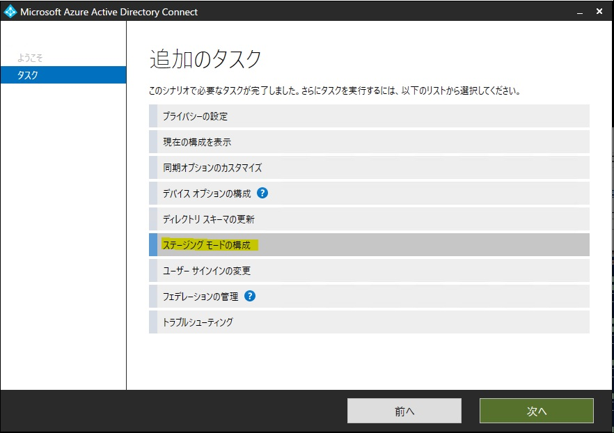

> 本記事は Technet Blog の更新停止に伴い https://blogs.technet.microsoft.com/jpazureid/2018/11/27/aadc_staging/ の内容を移行したものです。
> 元の記事の最新の更新情報については、本内容をご参照ください。

# Azure AD Connect : ステージング サーバーのすゝめ

こんにちは。Azure Identity チームの金森です。  
今回は Azure AD Connect (AADC) サーバーの運用にあたって、さまざまなメリットが享受できる [Staging サーバー] のご紹介です！

AADC が担っているディレクトリ同期やパスワード同期は AADC サーバーが停止した場合も [AAD 上のユーザーやグループなどのオブジェクト情報] はそのままであり、AADC そのものが認証処理を担っている訳ではないため業務への影響はそこまでは大きくないと言えます。  
もちろんパススルー認証 (PTA) の構成にしており、PTA エージェントが AADC と同居しているそのサーバー 1 台だけ、という場合は AADC サーバーの停止 = AAD への認証ができなくなることになるため、影響は大きくなることが予想されます。

※ そんな懸念に対しては PTA エージェントの役割を持つサーバーを複数台用意しましょう！ DC サーバーと同じく認証基盤を担うサーバーですので、冗長構成が基本です。

つまり、AADC サーバー (＝ディレクトリ同期) が停止しても業務影響が小さいと判断すること自体は誤りではないのですが、それが故に AADC サーバーを 1 台だけで構成されているお客様もいらっしゃいます。  
しかし、運用していく中で以下のようなお悩みが生じることがままあります。

- バージョン アップを検討しているけど、いきなりアップしてすでに同期済みのユーザーとかグループに影響はないかな…
- (同期元になるオンプレ AD 側のリプレースなど) 大きく ID 基盤の環境が変わる予定があるけど、 ちゃんと同期済みのユーザーとかグループとの紐づけ状態は維持されるかな…
- そろそろサーバーのリプレースだけど、新規に構築する AADC サーバーは今まで通りに動作するかな…

そんなお悩みも、Staging サーバーをご用意いただけば多くの課題が解決できます！  
加えて障害復旧の際の復旧までの時間を短縮できる効果も、もちろん期待でき、Active サーバーが障害で停止…といったような **いざ** というときにも安心です。

それでは、そんなメリットが多い Staging サーバーを以下の流れでご紹介させていただきます！

1. **Staging サーバーとは？**
2. **Staging サーバーの構成方法**
3. **どうやって大きな作業に向けた事前確認で安心できるの？**

## 1. Staging サーバーとは？

以下は Active サーバーと Staging サーバーを並べて構成したイメージとなります。


左が Active サーバー、右が Staging サーバーになります。  
見ての通り [Import で最新の情報を取り込み、Sync でデータベースを更新する] ところまでは一緒ですが、最後の Export (書き込み) 処理をしない、というのが Staging サーバーの動作です。  
それぞれのコンポーネントに関しては [こちら](https://docs.microsoft.com/ja-jp/azure/active-directory/hybrid/plan-connect-performance-factors#azure-ad-connect-component-factors) の技術情報が参考になるので、ぜひご一読いただければと思います。

Export さえしなければ、既存のオンプレ AD にも AAD にも何も影響を与えることはありませんので、Staging　サーバーを構築することには何もリスクがないことになります！  
[こちら](https://docs.microsoft.com/ja-jp/azure/active-directory/hybrid/plan-connect-topologies#staging-server) の技術情報にも Staging サーバーの参考情報がございますので、ぜひこちらも併せてご参照ください！

ポイントは [最新のオブジェクト情報の取り込みと学習を行っているため、<span style="color: red; ">**Export する準備ができた状態のデータを持っている**</span>] という点です。

## 2. Staging サーバーの構成方法

Staging サーバーの構成方法はすこぶる簡単です！  
[こちら](https://docs.microsoft.com/ja-jp/azure/active-directory/hybrid/how-to-connect-sync-staging-server#staging-mode) の技術情報にも案内がございますが、AADC をカスタム インストールで新規にインストールするウィザードの一番最後の実行直前の画面にて [ステージング モードを有効にする] のチェックを入れるだけです。簡単ですね。

※ もちろん、Active サーバーと Staging サーバーの [AADC としての設定] は同じである前提のご案内となります。

また、インストール後に Active から Staging へ、もしくはその逆にモードを変更するのも非常に簡単です。  
インストール後の環境で Azure AD Connect ウィザード　(C:\Program Files\Microsoft Azure Active Directory Connect\AzureADConnect.exe)　を起動して、追加のタスク画面にて [ステージング モードの構成] メニューを選択するだけです。  
※ [こちら](https://github.com/jpazureid/blog/blob/master/azure-active-directory-connect/how-to-upgrade.md) の Blog でも Staging サーバーの構成手順をご紹介しておりますので、併せて参考にしていただければと思います！


(バージョン 1.2.67.0 の画面です。バージョンによって表示が違う場合があります。)

ウィザードを進めると以下のようなメニューが表示されるので、チェックを入れて進めれば Staging モードに、チェックを外して進めれば Active モードに切り替えられます。


ご注意いただきたいポイントとして [1 つの AAD テナントには 1 台の AADC Active サーバーのみがサポートされるトポロジである] 点です。  
前述した [こちら](https://docs.microsoft.com/ja-jp/azure/active-directory/hybrid/plan-connect-topologies) の技術情報でサポートされる/されないトポロジをご案内していますが、<span style="color: red; ">**1 つの AAD テナントに複数の Active な AADC サーバーから同期を行う構成は取れません**</span>のでご注意ください。

※ なお、ステージング サーバーは Export 処理を行わないので、複数台構成しても同期処理そのもののスケールアウト/性能向上につながる訳ではない点にもご注意ください。

もし Active な AADC サーバーが障害で停止しても、Staging サーバーがあれば、すかさず AADC のウィザードを再実行し、 Staging の AADC サーバーを Active モードにしてあげれば、ディレクトリ同期処理がすぐに継続再開できるので安心です。  
そんなに同期元のオンプレ AD でオブジェクト情報の変更を行う予定が無いから AADC が止まっててもすぐには困らない…という場合もあるかもしれませんが、例えばパスワード ハッシュ同期やパスワード ライトバックのオプションもご利用の場合は、Active な AADC サーバーが稼働していることでパスワードのハイブリッド管理状態が継続できているため、より耐障害性の高さがメリットになるかと思います。

## 3. どうやって大きな作業に向けた事前確認で安心できるの？

最初に記載したお悩み例を再掲します。

- バージョン アップを検討しているけど、いきなりアップしてすでに同期済みのユーザーとかグループに影響はないかな…
- そろそろサーバーのリプレースだけど、新規に構築する AADC サーバーは今まで通りに動作するかな…

それぞれに共通したお悩みポイントは、 [同期元オンプレ AD や AADC サーバーそのものに変更があった時に、認証に使用している大事な AAD ユーザーやグループ オブジェクトが影響を受けずに変わらず利用し続けることができるか] に集約されます。

このお悩みを解決する [切り替え後の正常性の事前確認方法] ですが、前述した [こちら](https://docs.microsoft.com/ja-jp/azure/active-directory/hybrid/how-to-connect-sync-staging-server#staging-mode) の技術情報にある **CSExportAnalyzer** を使用した分析がその方法となります。

`1.` に記述した通り、Staging サーバーは [<span style="color: red; ">**Export する準備ができた状態のデータを持っている**</span>] ので、言い換えると [<span style="color: red; ">**Export を実行したら現在の AAD のオブジェクトにこんな追加/変更/削除を行うよ！**</span>] というデータを持っていることになります。<br>
そのため、Staging サーバーを Active にする前にその追加/変更/削除される予定のデータを確認し、何も変更点が無い、もしくは変更される予定のデータがあっても既存の AAD のオブジェクトとしては影響が無いことが確認できれば、安心して Active モードに変更することができますね。

**CSExportAnalyzer** を使用した [これから Export する予定のデータを確認する方法] は、技術情報にも記載がありますが改めて以下にご紹介します。

1. 事前に最新の情報を学習しておくために、AADC Staging サーバーで同期を行います。すでにインストール終了時に完全同期、以降の定期的な差分同期が実行されているようであれば最新の状態で差分同期することで問題ありません。  
もし一度も同期を行っていない、もしくは AADC の同期ルールをカスタムしたり、同期対象 OU の変更を行った後に一度も完全同期をしていない場合は、完全同期を行ってください。

PowerShell を管理者として起動して、以下のコマンドを実行してください。

```PowerShell
Start-ADSyncSyncCycle Initial : 完全同期の開始
Start-ADSyncSyncCycle Delta : 差分同期の開始
```

また、以下のコマンドを実行して AAD 向けコネクターの名前を確認しておくと 2. の手順で利用できて便利です。

```PowerShell
Get-ADSyncConnector | fl name
```

/// 出力例

```txt
Name : contoso.onmicrosoft.com - AAD : 同期先 AAD テナント向けのコネクター名です。
Name : contoso.local : 同期元オンプレ AD 向けのコネクター名です。
```

2. 最新の情報を学習する同期の終了後、コマンド プロンプトを管理者として起動して以下のコマンドを実行します。

```cmd
C:\Program Files\Microsoft Azure AD Sync\Bin\csexport.exe "contoso.onmicrosoft.com - AAD" C:\temp\AADexport.xml /f:x
```

引数の AAD テナント向けコネクター名はご利用環境に即したものを指定します。  
出力する xml ファイルのパスとファイル名の指定は任意で問題ありません。  

<!-- textlint-disable-->
/f:x は、このコマンドで出力する対象のデータをフィルターするオプションで、その条件を [Export 待ちになっているデータ] としています。
<!-- textlint-eable-->

これで AADC が把握している最新の学習情報より、Export を実行したら追加/変更/削除される予定のデータのみが xml に出力されます。

3. そのままでは見づらいので以下のコマンドを実行して解析しやすく整形して csv ファイルとして保存します。

```cmd
C:\Program Files\Microsoft Azure AD Sync\Bin\CSExportAnalyzer.exe C:\temp\AADexport.xml > C:\temp\AADexport.csv
```

4. 出力された csv ファイルを開きます。エクセルで開いてカンマ区切りで表示すると見やすいです。

新規ユーザーの作成、既存ユーザーの属性値変更、既存ユーザーの削除、の 3 つのオブジェクトの更新がある状態で取得したサンプルが以下です。


見やすくなるように整形していますが、ポイントになる見方は以下の通りです。

- OMODT 欄は [オブジェクトに対する処理の種類] です。この欄が add なら新規のオブジェクト追加、update なら既存のオブジェクトへの変更、delete なら既存オブジェクトの削除を意味します。
- AMODT 欄は [オブジェクトの中の属性に対する処理の種類] です。add なら新規の属性追加、update なら既存の属性値の変更、delete なら既存属性値の削除を意味します。
- OMODT と AMODT が add なら、それは新規のユーザー等のオブジェクトになります。
- 属性単位で 1 行になるので、新規ユーザーを同期しようとしている場合は例のように [DN 値が同じ = 同じオブジェクトに対して追加される属性] ごとに行が記録されます。
- この例では、既存のユーザーの mail 属性を oldmail@contoso.com から newmail@contoso.com に変更している前提です。
- 最下部にオブジェクト単位の処理数の集計結果があります。

なお、サンプル csv の原本も以下からダウンロード可能です。拡張子を .txt から .csv にしてご参照ください。
[AADexportSample](https://github.com/jpazureid/blog/tree/master/azure-active-directory-connect/aadc_staging/AADexportSample.txt)

この CSV の結果が以下であれば、現在 Staging モードの AADC を Active にしても AAD 側の既存オブジェクトの利用には影響が無い、と判断していただけます。

- **何も結果が無い、追加も変更も削除も無い**
つまり、Staging モードを Active にして Export 処理が行われても、AAD 側の既存オブジェクトには何も変更が生じない、という確証が得られます。

- **OMODT が update、AMODT が add もしくは delete になっているが、対象の属性値は AAD 側の既存オブジェクトの利用に対して何も影響が無い**
これは AADC のバージョン変更や、同期元 AD ドメインの構成変更などで良くあるパターンです。
[こちら](../azure-active-directory-connect/cantphsback-aadc.md) の Blog の下部でもご紹介していますが、AADC はバージョンによって同期対象の属性に違いがある場合があるので、バージョン アップによって AAD 側に Export される属性が増えていると、csv では [OMODT : update、AMODT : add] として対象の属性が全オブジェクトに対して追加される結果が得られます。
もしくは、同期元 AD ドメインのリプレースなどでは、同じ名前のユーザーであっても新旧 AD ドメインのユーザーそれぞれの持つ SID 値や最後のパスワード変更日時など、当然違ってくる属性値があるため、そのような場合は [OMODT : update、AMODT : update] のように差分が出力されます。
いずれの場合も、[構成や前提に対して発生するべくして発生している正しい差分] となるので、何らかの変更予定が出力されていてもそれが予定作業内容に沿ったものであれば問題ない、と事前に確認と判断を行うことができます。

ここで再度お悩み例と、その解決策を記載します！もう Staging サーバーを導入しない理由が無いですね。

- バージョン アップを検討しているけど、いきなりアップしてすでに同期済みのユーザーとかグループに影響はないかな…
-> 事前に Staging モードの AADC としてアップ予定のバージョンをインストールし、CSExportAnalyzer の結果をチェックしておけば既存の AAD オブジェクトへの影響有無を確認できる！

- (同期元になるオンプレ AD 側のリプレースなど) 大きく ID 基盤の環境が変わる予定があるけど、 ちゃんと同期済みのユーザーとかグループとの紐づけ状態は維持されるかな…
-> 事前に Staging モードの AADC を構成し、変更予定のオンプレ AD 環境を同期元にして同期を行い CSExportAnalyzer の結果をチェックしておけば既存の AAD オブジェクトへの影響有無を確認できる！

- そろそろサーバーのリプレースだけど、新規に構築する AADC サーバーは今まで通りに動作するかな…
-> 事前に Staging モードの AADC としてリプレース先になるサーバーを構成し、CSExportAnalyzer の結果をチェックしておけば既存の AAD オブジェクトへの影響有無を確認できる！

なお、注意点としてこの事前確認は [AAD にクラウド ユーザーを直接作成して運用している環境に対して、オンプレ AD とのディレクトリ同期を新規に導入し、ソフトマッチにより同期元 AD ユーザーと同期先 AAD ユーザーの紐づけを行う] 場合にはご利用いただけない、という点がございます。

これは、CSExportAnalyzer によるチェック対象のデータは [AADC が把握できているオブジェクト情報] となるのですが、前述の導入シナリオの場合 AAD 側のオブジェクトはクラウド上に直接作成されているため、AAD からの Import 処理時に AADC は [自分の管理対象外のオブジェクト] と認識し Import 対象外として、オブジェクト情報を学習しないためです。  
前述の導入シナリオでソフトマッチが期待した通り動作するかを確認される場合は、テスト ユーザーをご用意して正しくマッチ処理が行わるかを確認し、それから同期元 AD オブジェクトの範囲を広げてください。

上記内容が皆様の参考となりますと幸いです。どちら様も素敵な AAD ライフをお過ごしください。

ご不明な点等がありましたら、ぜひ弊社サポート サービスをご利用ください。  
※本情報の内容（リンク先などを含む）は、作成日時点でのものであり、予告なく変更される場合があります。
