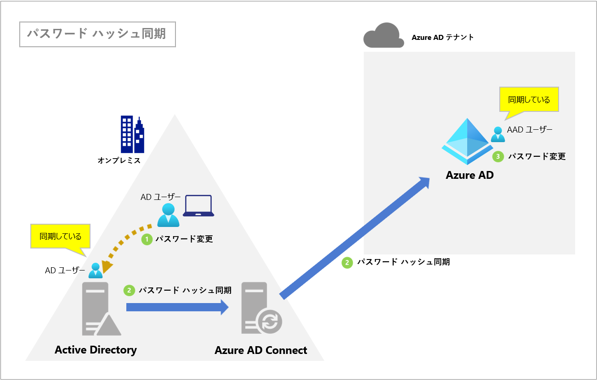
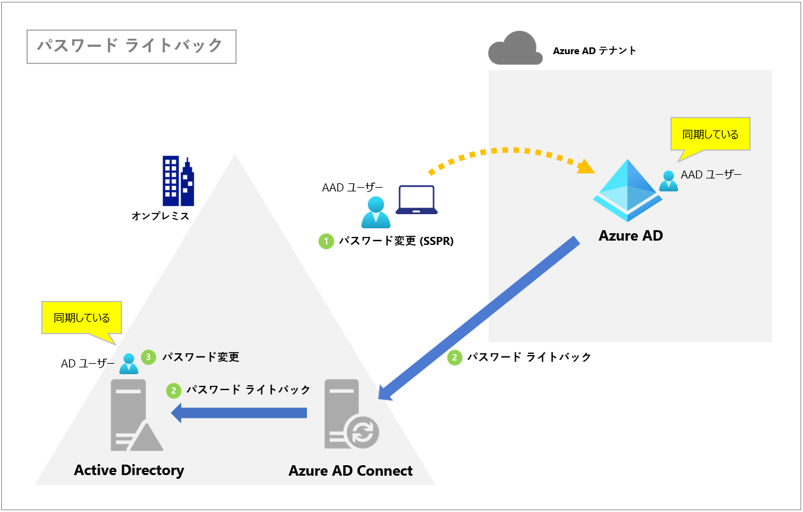
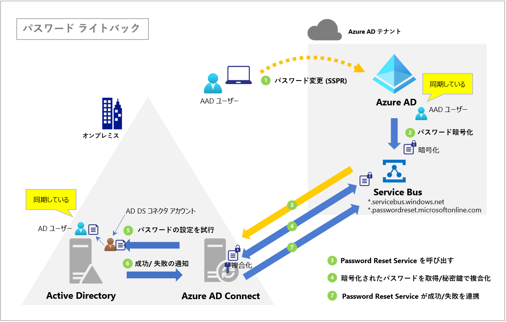
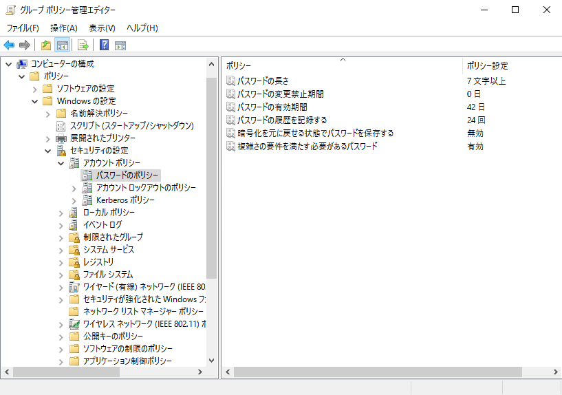
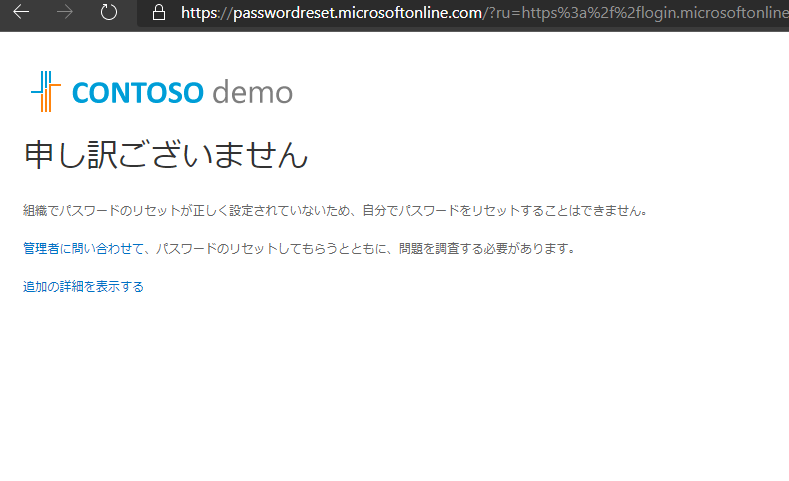
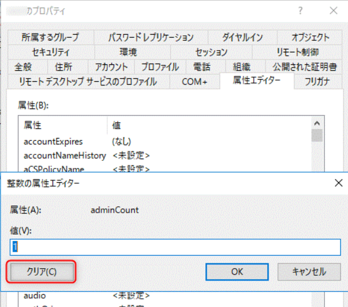
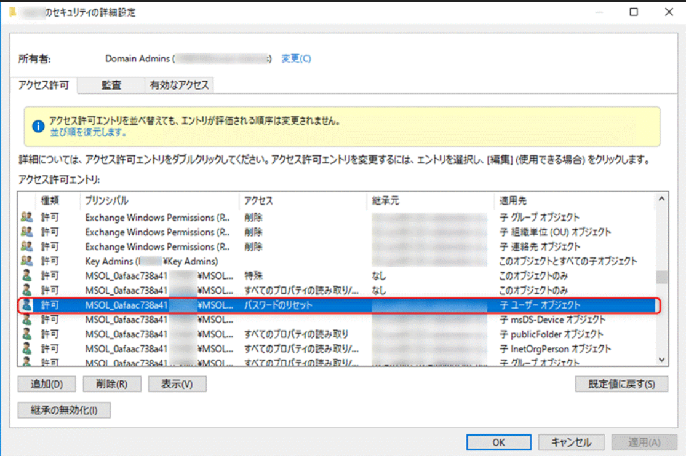
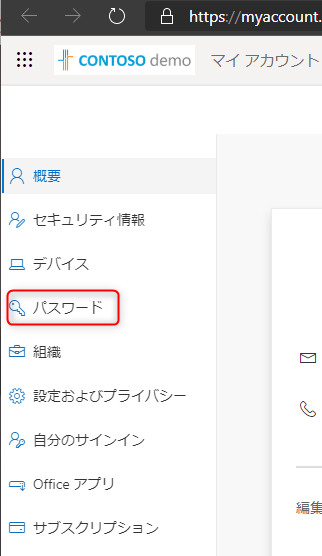
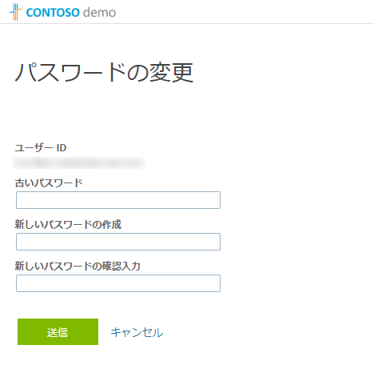

# パスワード ライトバックのしくみと一般的なトラブルシューティング

こんにちは、Azure & Identity サポート チームの金子です。
今回はパスワード ライトバックのしくみと一般的なトラブルシューティングについてご紹介します。

## パスワード ハッシュ同期とパスワード ライトバックの違いとは

まずユーザーは Azure AD Connect により、オンプレミス AD から Azure AD に同期されていることを前提とします。
パスワード ハッシュ同期についてはご存じの方が多いと思いますが、パスワード ハッシュ同期はオンプレミスの認証パスワード (厳密にはパスワード ハッシュ) を Azure AD に同期する機能です。これによりユーザーは同じ ID/パスワードで Office 365 などのクラウド上のアプリにもサインインすることができるようになります。
オンプレミス側でパスワードを変更した場合も同様にクラウド側へ同期されますが、逆にクラウド側からはオンプレミス側のパスワードをリセットしたり変更することはできません。なぜなら、パスワード ハッシュ同期はオンプレミスの Active Directory Domain Services (AD DS) から Azure AD への一方向の同期しかおこなわないためです。

そのため、社外で仕事をしておりオンプレミス AD に接続できないような状況で次のような要件が発生する場合はパスワード ライトバックを有効化する必要があります。

- **ユーザーが Microsoft 365 などのクラウド アプリにサインインする認証パスワードを忘れたため、ユーザー自身で同期ユーザーのパスワードをリセットしたい**
- **何らかの要件があり Azure AD の管理者が、同期ユーザーのパスワードを強制的にリセットしたい**
- **Azure AD Identity Protection によって同期ユーザーの資格情報の漏洩が疑われた (リスク検知した) 場合に、ユーザー自身でパスワードを変更 (または リセット) したい、Azure AD の管理者がユーザーに代わってパスワードをリセットしたい**

上記のようなシナリオでは、パスワード ライトバックを有効にすることで要件を実現できます。
SSPR と連動させれば、ユーザーがパスワードを忘れてしまった場合でもユーザー自身がオンプレミス AD のパスワードをリセットできるため、IT 管理者の負荷を軽減することができます。
また、Identity Protection によって不正なアクセスなどを検知した場合、ユーザー自身が同期ユーザーのパスワードを変更 (リセット) できる他、管理者は Azure ポータルにサインインできる環境であれば、どこにいてもユーザーのパスワードを強制的にリセットすることができますので、セキュリティ リスクを軽減することにもつながります。

## 前提条件

同期ユーザーに対する社外ネットワークからのパスワード変更およびリセットを実現するためには、次の前提条件をすべて満たしている必要があります。

1. Azure AD Connect でパスワード ライトバックを有効化していること
2. Azure ポータル上でセルフサービス パスワード リセット (SSPR) が有効になっていること（“オンプレミスとの統合”）
3. 利用するユーザーごとに Azure AD Premium P1 または P2 ライセンス、もしくは Microsoft 365 Business Premium ライセンスを持っていること
4. AD DS コネクタ アカウントに下記のアクセス許可があること
   - パスワードのリセット
   - lockoutTime に対する書き込みアクセス許可
   - pwdLastSet に対する書き込みアクセス許可
   - まだ設定して場合は、そのフォレスト内の "各ドメイン" のルート オブジェクトに対する "期限切れではないパスワード" の拡張権利があること
5. Azure AD Connect サーバーから下記の外部 URL へ HTTPS で接続できること

*.passwordreset.microsoftonline.com
*.servicebus.windows.net

## パスワード ライトバックのしくみ

ではパスワード ライトバックが実際にどのようなしくみで動作しているかを説明します。

まず、ユーザーが Azure AD のアカウントでパスワード変更 (SSPR)  要求をおこないますと、設定したパスワードが暗号化され、テナント固有の Service Bus へ送られます。
Service Bus に保留中のリセット要求が届くと、パスワード リセット エンドポイントがオープンし、Azure AD Connect サーバーの Password Reset Service が処理を開始 (PasswordResetRequestStart) し Azure AD 側から暗号化されたパスワードを取得します。
これはオンプレミス側からのクラウド側への Outbound (HTTPS / 443) の通信でおこなわれますので、クラウド側からオンプレミス側への Inbound の通信（ポート）を開放する必要はありません。

Password Reset Service がパスワードを取得しますと、秘密鍵で複合化し、Azure AD Connect はリセット要求のあったユーザーをデータべ―ス内から探し出し、AD Sync サービスが適切な AD DS に対してパスワード リセットを要求します。この時、実際のパスワードリセットは Azure AD Connect で設定したオンプレミス AD 上の AD DS コネクタ アカウント(既定では MSOL_xxxxx) がおこないます。

そして、パスワード リセット (変更) が成功しますと、Password Reset Service は成功 (PasswordResetSuccess) を Azure AD 側に通知します。
この通知を受け取るとパスワード変更 (SSPR)  が完了します。

このパスワード ライトバックの一連の処理はログ上では次のように記録されます。

### ● Azure AD Connect サーバーのアプリケーション イベントログ

**PasswordResetService**
Event ID: 31001
PasswordResetRequestStart, Details: user1@contoso.com

**ADSync**
Event ID: 405
Call sync ldap_bind for DomainName=CONTOSO.COM, UserName=MSOL_xxxxxxxxx.

**ADSync**
Event ID: 403
ImpersonationHelper call LogonUser for DomainName=CONTOSO.COM, UserName=MSOL_xxxxxxxxx.

**ADSync**
Event ID: 405
Call sync ldap_bind for DomainName=CONTOSO.COM, UserName=MSOL_xxxxxxxxx.

**PasswordResetService**
Event ID: 31002
TrackingId: xxxxxxxxx-xxxx-xxxxxxxxx-xxxxxxxxx, PasswordResetSuccess, Details: Context: cloudAnchor: User_xxxxxxxxx-xxxxxxxxx, SourceAnchorValue: xxxxxxxxxxxxxxxxxx, UserPrincipalName: user1@contoso.com, unblockUser: True

### ● Azure AD の監査ログ

**Self-service password reset flow activity progress**
User submitted a new password

**Reset user password**

**Update StsRefreshTokenValidFrom Timestamp**

**Reset password (self-service)**
Successfully completed reset.

**Self-service password reset flow activity progress**
User successfully reset password

また、パスワード ハッシュ同期を有効化している場合は、パスワード ライトバック後に下記のログが記録されます。
これは Password Reset Service とは別のパスワード ハッシュ同期処理のプロセスが動作しているためで、オンプレミス AD 側で変更されたパスワードは通常のパスワード ハッシュ同期のタイミング ( 2 分に一度) で Azure AD 側へ同期されます。
これはパスワード ハッシュ同期の既定の動作とご理解ください。

### ● Azure AD Connect サーバーのアプリケーション イベントログ

***Directory Synchronization***
Event ID: 657
Password Change Result

### ● Azure AD の監査ログ

**Change user password**

(補足）
パスワード ライトバックを利用する上で、パスワード ハッシュ同期の有効化は必須ではありません。
パスワード ライトバックはパスワード ハッシュ同期による認証だけではなく、パススルー認証や AD FS の環境でもサポートされています。よって、認証方法によらず、同期ユーザーは Azure AD 側からもパスワード変更 (SSPR) をおこなうことができます。

## トラブルシューティング

パスワード ライトバックが失敗するシナリオはいくつか考えられます。
ここでは一般的なエラー要因とその対処方法についてご紹介します。

1. 変更したパスワードが オンプレミス AD のパスワード ポリシーを満たしていない (Event ID 33008)
2. "password" や "baseball" といった推測されやすい用語が含まれているため Azure AD 側で変更が拒否された
3. パスワード ライトバックに必要なアクセス許可が付与されていない (Event ID 33004)
4. ADSync サービスがダウンしていた (Event ID 31034)
5. オンプレミス AD 側でユーザーが見つからない (Event ID 33002)
6. オンプレミス AD の保護されたグループ内に存在する管理者アカウントのパスワードをリセットした (Event ID 33004)
7. Azure AD Connect 構成ウィザードでパスワード ライトバックを有効化できない

#### 1. 変更したパスワードが オンプレミス AD のパスワード ポリシーを満たしていない (Event ID 33008)

[エラー内容]
Azure AD Connect のイベントログには Event ID 33008 のエラーが記録されます。
エラー メッセージ：**A restriction prevents the password from being changed to the current one specified.**

[原因と対処方法]
パスワードライトバックを利用して同期ユーザーのパスワードリセット (変更) を行った場合、オンプレミス AD のパスワードポリシーおよび Azure AD のパスワードポリシー双方が評価されます。
オンプレミス AD のパスワード ポリシー (文字数や変更禁止期間など) やアカウントのパスワード変更禁止設定など、パスワード ポリシーを満たしていない場合、パスワード変更は下記のエラーが返されます。

この場合はオンプレミス AD のパスワード ポリシーで決められた範囲でパスワードを変更する必要があります。
「グループ ポリシー管理エディター」にて「パスワード ポリシーの設定」をご確認ください。

#### 2. "password" や "baseball" といった推測されやすい用語が含まれているため Azure AD 側で変更が拒否された

[エラー内容]
上述の通り、パスワードライトバックを利用して同期ユーザーのパスワード変更 (リセット) を実施した場合、オンプレミス AD のパスワードポリシーに加えて、Azure AD のパスワードポリシーも評価されます。
もし パスワード リセットで設定したパスワードが Azure AD 側の禁止文字に該当する場合は、変更が拒否されます。

[原因と対処方法]
Azure AD 側ではパスワードの文字列に対して以下の両方のチェックがおこなわれます。このチェックはオンプレミス AD にパスワード リセットを要求する前 ([フロー図 3] の ①) にAzure AD によって内部的に実行されます。

- グローバル禁止パスワード
- カスタム禁止パスワード

グローバル禁止パスワードは、 Azure AD がグローバルで禁止しているパスワード リストです。
セキュリティ上このリストは公開されていませんが、 "password" や "baseball" といった推測されやすい用語が含まれている場合が該当します。

カスタム禁止パスワードは、管理者が設定できる禁止パスワードです。
これらの禁止パスワードを利用しないようにパスワード変更 (リセット) を行うことが対処策となります。

#### 3. パスワード ライトバックに必要なアクセス許可が付与されていない (Event ID 33004)

[エラー内容]
前述の「前提条件 (4)」 に記載したパスワード ライトバックに必要なアクセス許可が対象のユーザーや OU に付与されていない場合はエラーが返されます。

Azure AD Connect のイベントログに Event ID 33004 のエラーが記録されます。
エラー メッセージ：**Requesting user was denied access to perform the operation on a privileged account.**

[原因と対処方法]
パスワード変更をおこなうAD DS コネクタ アカウントには以下の 2 つがあり、ご自身の環境がどちらのアカウントを使用しているかを確認します。

a. Azure AD Connect のインストール時に新規で作成されたアカウント (既定では MSOL_xxxxx)
b. オンプレミス AD 上に作成した既存のアカウント

a のアカウントは自動でルート ディレクトリに対して必要なアクセス許可が付与されますので、配下の OU やユーザーにもアクセス許可が継承されます。そのため、通常はパスワード変更の権限も付与されています。

b のアカウントはアクセス許可を手動で割り当てる必要があります。もしアクセス許可を付与していない場合は、下記に記載された PowerShell コマンドレットで権限を付与してください。

パスワード ライトバックのアクセス許可  
https://docs.microsoft.com/ja-jp/azure/active-directory/hybrid/how-to-connect-configure-ad-ds-connector-account#permissions-for-password-writeback

#### 4. ADSync サービスがダウンしていた (Event ID 31034)

[エラー内容]
Azure AD Connect のイベントログには Event ID 31034 のエラーが記録されます。
エラー メッセージ：**The connection to the connect service was lost.**

[原因と対処方法]
ADSync サービスがダウンしている場合はパスワード リセットが失敗します。
Azure AD Connect サーバーの ADSync サービスを再起動してください。

#### 5. オンプレミス AD 側でユーザーが見つからない (Event ID 33002)

[エラー内容]
Azure AD Connect のイベントログには Event ID 33002 のエラーが記録されます。
エラー メッセージ：**The operation failed because the object could not be found.**

[原因と対処方法]
オンプレミス AD 側でユーザーが見つからない場合はパスワード リセットが失敗します。
オンプレミス AD にユーザーが存在することを確認してください。

#### 6. オンプレミス AD の保護されたグループ内に存在する管理者アカウントのパスワードをリセットした (Event ID 33004)

[エラー内容]
Azure AD Connect のイベントログには Event ID 33004 のエラーが記録されます。
エラー メッセージ：**The password could not be updated because the management agent credentials were denied access.**

●エラーになる操作
サインイン時に「パスワードを忘れた場合」をクリックします。

SSPR の画面に遷移します。

パスワード リセットはエラーになります。

[原因と対処方法]
対象のユーザー アカウントが Active Directory の保護されたグループ (例えば Enterprise Admins や Domain Admins ) に所属していることが考えられます。

オンプレミス AD の保護されたグループに所属しているメンバーは、パスワード リセット (パスワードを忘れた場合のリセット) はできません。

Active Directory の保護されたグループ (いわゆる管理者グループ)は、SDProp と呼ばれるプロセスにより 1 時間に 1 回、AdminSDHolder オブジェクトに設定されているアクセス許可で上書きされます。そのため、AD ユーザーに対してパスワード リセットを実行している “AD DS コネクタ アカウント” のリセット権限も失われ、結果として Azure AD Connect のパスワード リセットは失敗します。
保護されたグループのメンバーは、ユーザー プロパティの adminCount 属性に “1” が自動で設定されます。

本エラーの対処方法としては、オンプレミス AD の保護されたグループ メンバーから外す必要があります。
グループのメンバーから外した後、[Active Directoty ユーザーとコンピューター] の プロパティ内の [属性エディター] タブにて、adminCount の 1 の値を手動で クリアします。

そして、[セキュリティ] タブの [詳細設定] にて、「継承の有効化」をおこなってください。

継承が有効化されますと、ルート ディレクトリのアクセス許可が継承されますので、 “AD DS コネクタ アカウント” に対してパスワード リセットのアクセス許可が付与されます。

(補足）
保護されたグループに所属しているメンバーでもパスワード変更は可能です。パスワード変更とは、自分のアカウントでサインインした後に、マイアカウントのページから変更をおこなう下記の操作のことです。

#### 7. Azure AD Connect 構成ウィザードでパスワード ライトバックを有効化できない

[エラー内容]
構成ウィザードでパスワード ライトバックの構成中に下記のエラー メッセージが表示される場合があります。

エラーメッセージ：
**パスワードの書き戻しを構成できません。 必要なライセンスを持っていることを確認します。**
Unable to configure password writeback. Ensure you have the required license and consult the event log for addition information.

[原因と対処方法]
このエラーメッセージは「前提条件の (5) 」のエンドポイントに接続できない場合に発生します。
オンプレミスでプロキシ サーバーをご利用されている場合に、Azure AD Connect が machine.config のプロキシ設定を正しく読み込めていないため、外部エンドポイントへの通信がプロキシを経由できず、オンプレミスのファイアウォール等でブロックされている可能性があります。

外部エンドポイントへの接続がプロキシを経由できていない場合は、machine.config にプロキシの設定を追加した後、一度 Azure AD Connect サーバーを再起動してください。
その後、構成ウィザードでパスワード ライトバックを有効にしますと、オンプレミスのファイアウォール等でブロックされることなくエンドポイントへ接続できるようになりエラーが解消されます。

もし何かエラーが生じて原因がわからないなどお困り事がありましたら、お気軽にテクニカル サポートへお問い合わせください。
上記の情報が少しでも皆様のお役に立ちましたら幸いです。

※本情報の内容（添付文書、リンク先などを含む）は、作成日時点でのものであり、予告なく変更される場合があります。

### 参考文献やリンクなど

前提条件  
https://docs.microsoft.com/ja-jp/azure/active-directory/authentication/tutorial-enable-sspr-writeback#prerequisites

Azure AD Connect に使用されるアカウント  
https://docs.microsoft.com/ja-jp/azure/active-directory/hybrid/reference-connect-accounts-permissions#accounts-used-for-azure-ad-connect

Azure AD Connect に対するアカウントのアクセス許可を構成する  
https://docs.microsoft.com/ja-jp/azure/active-directory/authentication/tutorial-enable-sspr-writeback#configure-account-permissions-for-azure-ad-connect

Confirm network connectivity  
https://docs.microsoft.com/ja-jp/azure/active-directory/authentication/troubleshoot-sspr-writeback#confirm-network-connectivity

エディションと機能の比較  
https://docs.microsoft.com/ja-jp/azure/active-directory/authentication/concept-sspr-licensing#compare-editions-and-features

パスワード ライトバックのしくみ  
https://docs.microsoft.com/ja-jp/azure/active-directory/authentication/concept-sspr-writeback#how-password-writeback-works

Password writeback event log error codes  
https://docs.microsoft.com/ja-jp/azure/active-directory/authentication/troubleshoot-sspr-writeback#password-writeback-event-log-error-codes

カスタムの禁止パスワードを構成する  
https://docs.microsoft.com/ja-jp/azure/active-directory/authentication/tutorial-configure-custom-password-protection#configure-custom-banned-passwords

パスワード ライトバックのアクセス許可  
https://docs.microsoft.com/ja-jp/azure/active-directory/hybrid/how-to-connect-configure-ad-ds-connector-account#permissions-for-password-writeback

付録 c: 保護されたアカウントと Active Directory のグループ  
https://docs.microsoft.com/ja-jp/windows-server/identity/ad-ds/plan/security-best-practices/appendix-c--protected-accounts-and-groups-in-active-directory

Azure AD Connect ウィザードを実行すると、エラーが発生する: パスワードの書き戻しを構成できません  
https://docs.microsoft.com/ja-jp/troubleshoot/azure/active-directory/unable-configure-pwd-writeback-error

パスワードの書き戻し (FAQ)  
https://docs.microsoft.com/ja-jp/azure/active-directory/authentication/active-directory-passwords-faq#password-writeback
