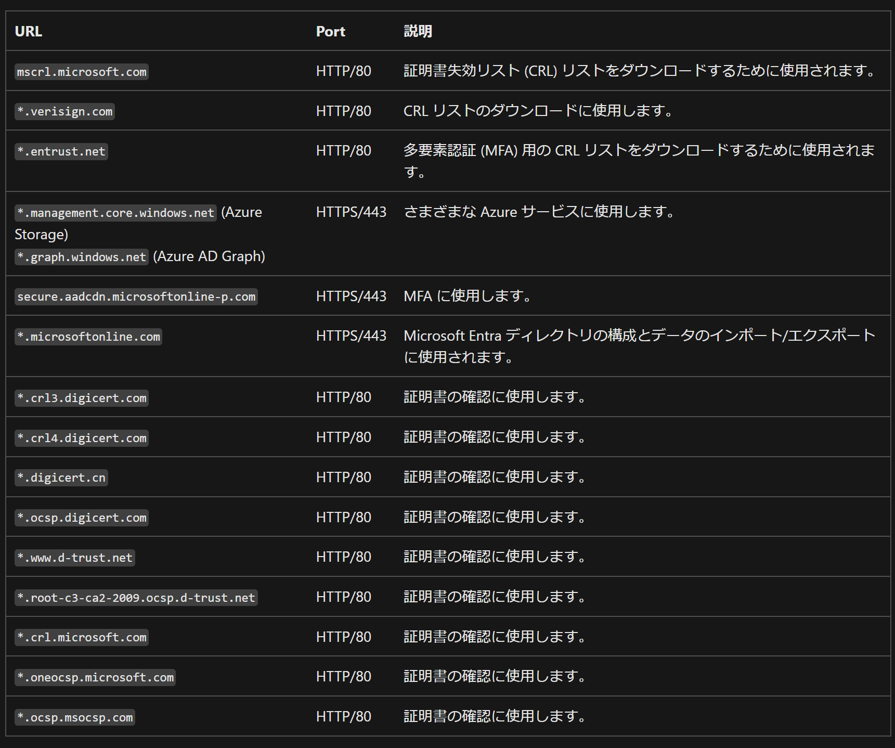
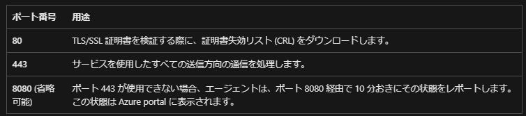
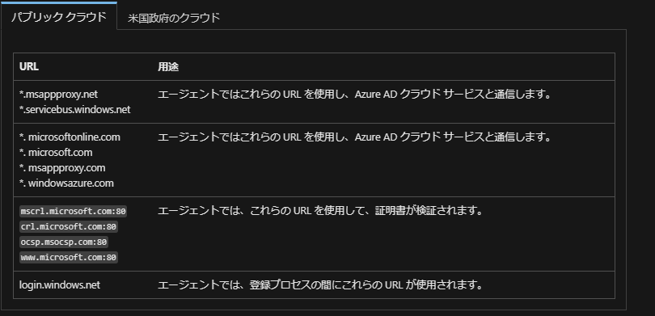

> [!NOTE]
> 本記事は Technet Blog の更新停止に伴い [こちらの記事](https://blogs.technet.microsoft.com/jpazureid/2018/07/03/azure-ad-connect-requirement/) の内容を移行したものです。
> 元の記事の最新の更新情報については、本内容をご参照ください。
> 
> なお、本記事は 2018 年 7 月 3 日に「Azure AD Connect サーバー - ウィルス対策ソフト除外項目 / 使用する通信ポート」 として公開しておりましたが、情報が古くなってまいりましたので、最新情報として改めて更新のうえ公開しております。

# Azure AD Connect の通信要件

こんにちは！ Azure Identity サポートの小出です。  
今回は、 Azure AD Connect の通信要件についてのまとめをご案内します。

## はじめに

Azure AD Connect は、オンプレミス AD と Azure AD のアカウントを連携するために使われているサービスです。
すでに多くのお客様にご利用いただき、ハイブリッド環境を構築されている企業様も多いと思いますが、これから Azure AD Connect を利用したいと検討されているお客様のなかには、どのような通信を許可すればよいか確認されたい方もいらっしゃるかと思います。

Azure AD Connect の通信要件に関しては、弊社サポートにもよくお問い合わせをいただいておりますが、公開情報の記載が複数にまたがっており、どこのページを見ればよいか分かりにくい状況でした。

そこで今回は、様々な公開情報の記載を確認しなくてもよい形で、 Azure AD Connect の通信要件の情報をおまとめします。


## A. 最低限許可してほしい通信

### Azure AD Connect を利用するための要件

最低限必要なポートは、[本公開情報](https://learn.microsoft.com/ja-jp/azure/active-directory/hybrid/connect/reference-connect-ports#table-1---azure-ad-connect-and-on-premises-ad) に記載の 表 １ と表 2 です。その他、環境に応じて表 3 以降のポートを開ける必要もありますが、ここでは省略します。


また、 Azure AD Connect をご利用いただくにあたって、許可いただく必要のある URL は下記の通りです。[本公開情報](https://learn.microsoft.com/ja-jp/azure/active-directory/hybrid/connect/tshoot-connect-connectivity#troubleshoot-connectivity-issues-in-the-installation-wizard) に記載がございます。
Entra Connect v2.4 以降では下記に加えて graph.microsoft.com への通信を許可いただく必要があります。



もし上記 URL を許可してもエラーが発生する、正しく動作しない場合などは、まず [本公開情報](https://learn.microsoft.com/ja-jp/microsoft-365/enterprise/urls-and-ip-address-ranges?redirectSourcePath=%252farticle%252fOffice-365-URLs-and-IP-address-ranges-8548a211-3fe7-47cb-abb1-355ea5aa88a2&view=o365-worldwide) に記載されている ID 56、ID 59、ID 125 に記載の URL を許可して様子を確認してください。

### Azure AD Connect Health を利用するための要件

Azure AD Connect Health を利用するにあたって必要なポートにつきましては、まず[本公開情報](https://learn.microsoft.com/ja-jp/azure/active-directory/hybrid/connect/reference-connect-ports#table-1---azure-ad-connect-and-on-premises-ad) の表 7 をご確認ください。


また、以下の URL についても許可リストに追加してください。

```text
*.blob.core.windows.net
*.aadconnecthealth.azure.com
**.servicebus.windows.net - ポート: (5671 がブロックされている場合、エージェントは 443 にフォールバックしますが、5671を使用することをお勧めします。 このエンドポイントは、エージェントの最新バージョンでは必要ありません。)
*.adhybridhealth.azure.com/
https://management.azure.com
https://policykeyservice.dc.ad.msft.net/
https://login.windows.net
https://login.microsoftonline.com
https://secure.aadcdn.microsoftonline-p.com
https://www.office.com (このエンドポイントは、登録時の検出目的でのみ使用されます。)
https://aadcdn.msftauth.net
https://aadcdn.msauth.net
```

Azure AD Connect Health でエラーが発生するお問い合わせには、上記の URL が許可されていない、プロキシ環境などで TLS 終端機能が使用されている場合などが多く見受けられます。
Azure AD Connect Health をご利用の際には、上記を含めた前提条件を満たすかご確認ください。[こちらの公開情報](https://learn.microsoft.com/ja-jp/azure/active-directory/hybrid/connect/how-to-connect-health-agent-install#outbound-connectivity-to-the-azure-service-endpoints)に記載があります。

### Azure AD クラウド同期（Cloud Sync）を利用するために必要な要件

Azure AD Connect ではなく、新しい Azure AD Cloud Sync をご利用のお客様は、[こちらの要件](https://learn.microsoft.com/ja-jp/azure/active-directory/hybrid/cloud-sync/how-to-prerequisites?tabs=public-cloud#firewall-and-proxy-requirements)をご確認ください。

エージェントから Azure AD に送信要求を発行できるように、下記のポートを許可してください。



また、必要に応じて以下の URL を追加し、エージェントと Azure AD が通信できるように設定してください。




## B. 要望や環境に応じて許可してほしい通信

### Azure ポータルにアクセスするための要件

プロキシ環境で Azure ポータルにアクセスできない時は、[こちらの公開情報](https://learn.microsoft.com/ja-jp/azure/azure-portal/azure-portal-safelist-urls?tabs=public-cloud#azure-portal-urls-for-proxy-bypass)の URL が許可されていないことが原因である可能性があります。
そのため、プロキシ環境でご利用のお客様は、上記必ず必要な通信のほかに、下記 URL も許可リストに追加してください。

```text
*.aadcdn.microsoftonline-p.com
*.aka.ms
*.applicationinsights.io
*.azure.com
*.azure.net
*.azure-api.net
*.azuredatalakestore.net
*.azureedge.net
*.loganalytics.io
*.microsoft.com
*.microsoftonline.com
*.microsoftonline-p.com
*.msauth.net
*.msftauth.net
*.trafficmanager.net
*.visualstudio.com
*.asazure.windows.net (Analysis Services)
*.core.windows.net (Azure Storage)
*.database.windows.net (SQL Server) 
*.graph.windows.net (Azure AD Graph)
*.kusto.windows.net (Azure Data Explorer/Kusto)
*.search.windows.net (search)
*.servicebus.windows.net (Azure Service Bus)
```

### シームレス SSO に必要な要件 

ファイアウォールまたはプロキシで許可している場合は、*.msappproxy.net もしくは tenantid.registration.msappproxy.net の URL に対するポート 443 での許可リストへの接続を追加します。
詳細につきましては、[本公開情報](https://learn.microsoft.com/ja-jp/azure/active-directory/hybrid/connect/how-to-connect-sso-quick-start#step-1-check-the-prerequisites)の前提条件をご確認ください。


### パスワード ライトバックに必要な要件

パスワードライトバックは以下に対し接続を行いますので、利用される場合は下記への通信も許可してください。

```text
*.passwordreset.microsoftonline.com
*.servicebus.windows.net
```


### パススルー認証を使う際に必要な通信要件

パススルー認証に必要な通信要件は、[こちらの公開情報](https://learn.microsoft.com/ja-jp/azure/active-directory/hybrid/connect/how-to-connect-pta-quick-start)に記載があります。
まずは下記のポートを使用して通信ができるよう、ファイアウォールなどの設定をご確認ください。


また、公開情報に記載の通り、下記 URL への通信も許可してください。

```text
*.msappproxy.net 
*.servicebus.windows.net 
autologon.microsoftazuread-sso.com （発信 HTTP プロキシを利用している場合）
login.windows.net
login.microsoftonline.com
crl3.digicert.com:80
crl4.digicert.com:80
ocsp.digicert.com:80
www.d-trust.net:80
root-c3-ca2-2009.ocsp.d-trust.net:80
crl.microsoft.com:80
oneocsp.microsoft.com:80
ocsp.msocsp.com:80
```

## ウィルス対策ソフトでのスキャン除外項目

基本的には SQL Server 2012 Express LocalDB としての除外をご考慮いただければと存じますので、[こちらの公開情報](https://learn.microsoft.com/ja-JP/troubleshoot/sql/database-engine/security/antivirus-and-sql-server)をまずは参考としてご参照いただければと存じます。

上記技術情報を踏まえ、AADC 製品を添付の SQL Server 2012 Express LocalDB をご利用いただいた状態で、既定でセットアップされた際の除外対象は以下となります。

- SQL Server データ ファイル格納先

```txt
C:\Program Files\Microsoft Azure AD Sync\Data
```

※ 一時的に利用される場合があるため、[C:\Program Files\Microsoft Azure AD Sync\MaData] も併せて除外していただければと存じます。

- ウイルス スキャンから除外するプロセス

```txt
C:\Program Files\Microsoft SQL Server\110\LocalDB\Binn\sqlservr.exe
```

上記に加え、SQL Server 観点として技術情報にございます [.bak / .trn / .trc / .sql] の拡張子を持つファイルの除外も念のためご検討ください。

## よくある質問

**Q. 許可すべき通信が多すぎます。公開情報に記載の URL の中には、実際には通信していない URL もありそうでした。最低限しか許可したくないのですが、どの URL を許可すればいいですか？**

**A.** 公開情報に記載されているものにつきましては、基本的に許可することを推奨しています。もしお客様環境の要件などにより、上記より絞り込む必要がある場合は、ツールなどで実際の通信を取得し、許可する通信先をお客様側で判断してください。
トラブル シューティングなどの際には、まずは上記 URL を許可するようご案内する場合があります。


**Q. 通信を許可するにあたり、どちら向きの通信を許可すればよいのでしょうか。**

**A.** Azure AD Connect を起点に、 Azure AD Connect -> オンプレミス AD 、 Azure AD Connect -> Azure AD の向きの通信を許可します。
一般的に戻りの通信は許可されておりますので、この方向の通信を許可すれば、オンプレミス AD や Azure AD から返される応答の通信は許可されます。
