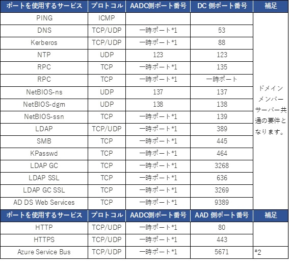

> 本記事は Technet Blog の更新停止に伴い https://blogs.technet.microsoft.com/jpazureid/2018/07/03/azure-ad-connect-requirement/ の内容を移行したものです。
> 元の記事の最新の更新情報については、本内容をご参照ください。

# Azure AD Connect サーバー : ウィルス対策ソフト除外項目 / 使用する通信ポート

こんにちは！ Azure Identity サポートの谷です。  
Azure AD Connect サーバーを新規構築に構築する場合や既存環境のセキュリティ面での見直しなどの背景により、
サードパーティ製のウィルス対策ソフトやファイアウォールでの通信制限についてのお問い合わせを多くいただいています。
公開情報等の情報を踏まえ、これらの情報を一目できるようにお纏めしました。  
構築時や運用時の参考にしていただければ幸いです。

## ウィルス対策ソフトでのスキャン除外項目

基本的には SQL Server 2012 Express LocalDB としての除外をご考慮いただければと存じますので、以下の技術情報をまずは参考としてご参照いただければと存じます。
Title: [SQL Server を実行しているコンピューター上で実行するウイルス対策ソフトウェアを選択する方法](https://support.microsoft.com/ja-jp/help/309422/how-to-choose-antivirus-software-to-run-on-computers-that-are-running)
上記技術情報を踏まえ、AADC 製品を添付の SQL Server 2012 Express LocalDB をご利用いただいた状態で、既定でセットアップされた際の除外対象は以下となります。

- SQL Server データ ファイル格納先

```txt
C:\Program Files\Microsoft Azure AD Sync\Data
```

※ 一時的に利用される場合があるため、[C:\Program Files\Microsoft Azure AD Sync\MaData] も併せて除外していただければと存じます。

- ウイルス スキャンから除外するプロセス

```txt
C:\Program Files\Microsoft SQL Server\110\LocalDB\Binn\sqlservr.exe
```

上記に加え、SQL Server 観点として技術情報にございます [.bak / .trn / .trc / .sql] の拡張子を持つファイルの除外も念のためご検討ください。

## 通信ポート要件

Azure AD Connect サーバーの通信要件は下記弊社サイトにてまとめさせていただいております。
Title : [ハイブリッド ID で必要なポートとプロトコル](https://docs.microsoft.com/ja-jp/azure/active-directory/connect/active-directory-aadconnect-ports)
上記サイト内で Azure AD Connect の要件として必要な表は下記となります。

- 表 1 - Azure AD Connect とオンプレミスの AD
- 表 2 - Azure AD Connect と Azure AD  
- 表 6a - SSO でのパススルー認証のトラブルシューティング  
- 表 6b - SSO でのパスワード ハッシュ同期  
- 表 7a - Azure AD Connect Health エージェント (AD FS/Sync) と Azure AD 用のポートとプロトコル  
- 表 7b - Azure AD Connect Health エージェント (AD FS/Sync) と Azure AD 用のエンドポイント  

上述のサイト内にもリンクがありますが、Azure AD Connect の接続先である Azure サービス (AAD など) の接続先 IP アドレスは下記となります。

- [Office 365 の URL と IP アドレスの範囲](https://docs.microsoft.com/ja-jp/office365/enterprise/urls-and-ip-address-ranges?redirectSourcePath=%252fja-jp%252farticle%252foffice-365-url-%25e3%2581%258a%25e3%2582%2588%25e3%2581%25b3-ip-%25e3%2582%25a2%25e3%2583%2589%25e3%2583%25ac%25e3%2582%25b9%25e7%25af%2584%25e5%259b%25b2-8548a211-3fe7-47cb-abb1-355ea5aa88a2)

この情報は将来的に変更が行われる可能性があります。上記の内容を下記表にて纏めさせていただきました。

 

1 : ポート番号 : 49152 ～ 65535  
2 : Azure AD Connect Health Agent を使用する場合のみです。
Azure AD Connect Health Agent の通信ポート以外の要件については [こちら](https://docs.microsoft.com/ja-jp/azure/active-directory/hybrid/how-to-connect-health-agent-install) をご参照ください。
その他ご利用のサービスなどで使用するポートや懸念事項がございましたら、お気軽に弊社テクニカル サポートまでご連絡いただければ幸いです。
