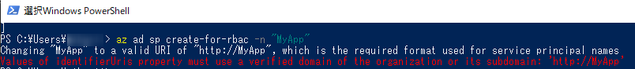

# Values of identifierUris property must use a verified domain of the organization or its subdomain エラーの対処法

こんにちは、Azure Identity サポート チームの栗井です。

本記事は、2021 年 10 月 14 日に米国の Azure Tools Blog で公開された [Azure Active Directory breaking change impacting Azure CLI and Azure PowerShell](https://techcommunity.microsoft.com/t5/azure-tools/azure-active-directory-breaking-change-impacting-azure-cli-and/ba-p/2848388) を意訳したものになります。

---

## 背景

2021 年 10 月 15 日より、Azure AD に登録されるシングルテナントアプリケーションの AppId URI (identifierUris) には、デフォルトのスキーム (api://{appId}) または検証済みドメインのいずれかが要求されるようになります。

- 参考情報 (英語) : [Upcoming changes - October 2021 - AppId Uri in single tenant applications will require use of default scheme or verified domains](https://docs.microsoft.com/en-us/azure/active-directory/develop/reference-breaking-changes#appid-uri-in-single-tenant-applications-will-require-use-of-default-scheme-or-verified-domains)
  ※ 日本語版の公開情報 (ja-jp) では、本変更に関する記述が未記載です (2021/10/17 時点)。英語の原文 (en-us) をご確認いただけますと幸いです。
実際にサポートされるアプリケーション ID の URI を、公開情報より抜粋します。

> 以下の例にある API と HTTP スキーマー ベースのアプリケーション ID の URI がサポートされます。`<appid>` などのプレース ホルダーの値を、公開情報に記載の説明を元に置き換えてください。

> サポートされるアプリケーション ID の URI フォーマット | アプリケーション ID の URI の例
> -- | --
> `api://<appId>` | `api://fc4d2d73-d05a-4a9b-85a8-4f2b3a5f38ed`
> `api://<tenantId>/<appId>` | `api://a8573488-ff46-450a-b09a-6eca0c6a02dc/fc4d2d73-d05a-4a9b-85a8-4f2b3a5f38ed`
> `api://<tenantId>/<string>` | `api://a8573488-ff46-450a-b09a-6eca0c6a02dc/api`
> `api://<string>/<appId>` | `api://productapi/fc4d2d73-d05a-4a9b-85a8-4f2b3a5f38ed`
> `https://<tenantIdDomain>.onmicrosoft.com/<string>` | `https://contoso.onmicrosoft.com/productsapi`
> `https://<verifiedCustomDomain>/<string>` | `https://contoso.onmicrosoft.com/productsapi`
> `https://<string>.<verifiedCustomDomain>` | `https://product.contoso.onmicrosoft.com`
> `https://<string>.<verifiedCustomDomain>/<string>` | `https://product.onmicrosoft.com/productsapi`
上記の変更の影響により、Azure CLI または Azure PowerShell を最新のバージョンにアップグレードしていない場合、サービス プリンシパルの作成時に次のようなエラーメッセージが表示されることが想定されます。

```
Values of identifierUris property must use a verified domain of the organization or its subdomain
```

例 : "az ad sp create-for-rbac" コマンド実行時




### 解決方法
各種ツールを以下のバージョンにアップグレードください。

- Azure CLI : 2.25.0 以降
- Azure PowerShell : 6.0.0 以降

この変更による影響については、各ツールの GitHub ページからご確認いただけますと幸いです。
- Azure CLI: https://github.com/Azure/azure-cli/issues/19892
- Azure PowerShell: https://github.com/Azure/azure-powershell/issues/16097


### 回避策
自動化ツールの新バージョンへのアップグレードが実施いただけない場合は、以下の手順によってエラーを回避し、サービス プリンシパルを作成ください。

1. Azure Active Directory にカスタム ドメインを登録します (未実施の場合)。
2. 承認された形式の IdentifierUri で、アプリケーションを登録します。

    例 ([az ad app create](https://docs.microsoft.com/ja-jp/cli/azure/ad/app?view=azure-cli-latest#az_ad_app_create) コマンド):
    ```sh
    az ad app create --display-name "myApp" --identifier-uris "https://test.contoso.com"
    ```

3. 登録したアプリケーションを参照するサービスプリンシパルを作成します。

    例 ([az ad sp create](https://docs.microsoft.com/ja-jp/cli/azure/ad/sp?view=azure-cli-latest#az_ad_sp_create) コマンド):
    ```sh
    az ad sp create --id <2.で登録したアプリの App Id>
    ```

> [!NOTE]
> 訳注: az ad sp create-for-rbac コマンド実行時に、適切なアプリケーション ID の URI を指定することでも回避可能です。
> ```sh
> az ad sp create-for-rbac --name "https://test.<verified-domain>.com"
> ```
---

以上の内容がご参考になりましたら幸いです。ご不明点等ございましたらサポート チームまでお問い合わせください。
