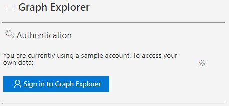

# Azure AD ディレクトリ クォータの拡張について

こんにちは、Azure Identity サポート チームの小田です。  
今回は、Azure AD オブジェクト数の拡張と、その確認方法についてご案内いたします。

# Azure AD オブジェクト数の制限値

Azure AD では、既定で最大 50,000 個の Azure AD オブジェクトを作成することが可能です。  
そこに検証済みドメイン (カスタム ドメイン) を 1 つ以上追加した場合、この Azure AD オブジェクト数の上限は 300,000 個に拡張されます。

- 参考情報
Azure AD サービスの制限と制約
<https://docs.microsoft.com/ja-jp/azure/active-directory/users-groups-roles/directory-service-limits-restrictions>

Azure AD リソースとは、下記のようなオブジェクトの総数を指します。

- ユーザー
- グループ
- 連絡先
- デバイス
- アプリケーション
- サービスプリンシパル
- サブスクリプション

# Azure AD の最大オブジェクト数を拡張する方法

Azure AD に検証済みドメインを追加すると、Azure AD のオブジェクト数は 300,000 個に拡張されますが、これ以上にはそのままでは増えません。  
300,000 個以上の Azure AD オブジェクトを作成して使用する場合には、下記の弊社サポート窓口にて拡張リクエストをお受けしています。

- Microsoft 365 サポート窓口
- Azure サポート窓口 (課金サポート / 技術サポート)

ユーザーやグループ、デバイス数など、どれくらいのオブジェクト量が見込まれるか (どれくらい拡張したいか) 概算を添えてお問い合わせください。
お問い合わせを受け、弊社内で検討を進めます。  
検討の結果が出て、拡張の作業が完了するまでには 5 営業日以上かかる場合もございますため、拡張を計画される際はスケジュールに余裕をもってご相談いただけますと幸いです。

# 現在の上限と使用量を確認する方法

Azure リソースを操作可能な Microsoft Graph を使用して、現在の Azure AD のオブジェクト数上限と登録済オブジェクトの総数を確認することができます。
手順は、下記の通りです。
> Graph の beta エンドポイントを利用する方法ですので、予告なく変更される可能性があることについてはご留意ください。


1. 下記の URL より Graph Explorer にアクセスします。

- <https://developer.microsoft.com/en-us/graph/graph-explorer>

2. 下記のメニューより調査対象の Azure AD のグローバル管理者ユーザーにてサインインを行います。 



3. 上部のアドレスバーに `https://graph.microsoft.com/beta/organization` を指定し、\[Run query\] をクリックします。


4. 下部の実行結果にて ”directorySizeQuota” の項目を確認します。

``` Json
{
    "Value" : [
        {
            "directorySizeQuota": {
                "used": 145,　＜＜＜現在の使用数
                "total": 50000　＜＜＜オブジェクト数の上限
            },
        }
    ]
}
```


上記内容が少しでも参考となりますと幸いです。
※本情報の内容（添付文書、リンク先などを含む）は、作成日時点でのものであり、予告なく変更される場合があります。