こんにちは、 Azure ID チームの小出です。
今日は、ゲスト ユーザーの棚卸をする方法について紹介します。


## はじめに
多くの企業のテナントでは、外部のユーザーと一緒に Teams 会議をしたり、外部のユーザーがプロジェクトで使用するリソースにアクセスしたりできるよう、外部のユーザーをテナントにゲスト ユーザーとして招待していると思います。  
ゲスト ユーザーは、一般ユーザーでも Azure ポータル上から簡単に招待することができますが、ゲスト ユーザーが増えるにつれて、こんな不安をお持ちのテナント管理者もいらっしゃるのではないでしょうか。  

- 不要なゲスト ユーザーの削除をしたいが、誰を削除したらいいかわからない
- 一定期間サインインのないゲスト ユーザーを棚卸したいが、最終サインイン日時がわからない
- ゲスト ユーザーが大量にいるため、確認に工数がかかっている。棚卸を自動化したい
 
上記のような不安を解消するために、今回は、ゲスト ユーザーを棚卸するための機能として、アクセス レビューとゲスト ユーザーの最終サインイン日時を取得する方法の 2 つを紹介します。  
なお、アクセス レビューをご利用いただくためには、Azure AD Premium P2 ライセンスが必要となります点を、あらかじめご了承ください。

<!-- more -->

### 目次
A. アクセス レビューを使用して、一定期間サインインのないユーザー アカウントを自動的に棚卸する方法  
B. ゲスト ユーザーの最終サインイン日時を取得する方法  

## A. アクセス レビューを使用して、一定期間サインインのないユーザー アカウントを自動的に棚卸する方法
アクセス レビューは、特定のグループやアプリケーションに割り当てられたユーザーを対象に、  
グループのメンバーシップやアプリケーションの割り当てに問題がないか（不要なユーザーに割り当てが行われていないか）を定期的に確認できる機能です。

1 回もしくは定期的に行われるレビューでは、レビューを行う管理者ユーザー（以下、レビュー担当者）が、レビュー内で各ユーザーに対し、[許可] もしくは [拒否] を設定します。  
詳細は後述していますが、レビュー担当者はレビュー内で対象ユーザー 1 人 1 人の最終サインイン日時 (=最終利用日時) を確認することが可能ですので、そちらをもとに割り当ての「許可」「拒否」を選択します。

レビューで拒否が選択された場合、たとえばグループから自動的にユーザーを削除したり、アプリケーションから割り当てを自動的に削除したりすることができます。  
さらには 30 日間アカウントを無効化（サインインをブロック）したのちにユーザーを自動的に削除することも可能です。

このアクセスレビュー機能を応用してゲスト ユーザーの棚卸を行いますが、実際のところレビューを行う管理者は不特定多数のゲスト ユーザーについて 1 人 1 人アクセスの要否を判断することが困難です。  
そのため、今回はゲスト ユーザー自身にセルフレビューを依頼し、アクセス権の継続が必要な場合のみ [許可] してもらいます。  
アクセス権が不要になったゲスト ユーザーは自ら [拒否] を選択することも、レビュー自体を無視することも可能です。(レビューを無視した場合は [拒否] 扱いとすることが可能です。)

以下の手順にてレビューを作成すると、レビューで拒否が設定されたゲスト ユーザーは自動的に無効化され、 30 日後にテナントから自動的に削除されます。

### 手順（アクセス レビューを作成する

1. Azure ポータルにサインインし、 [Azure Active Directory] - [Identity Governance] を開きます。もしくは、ポータル上の検索ボックスより、[Identity Governance] を開きます。
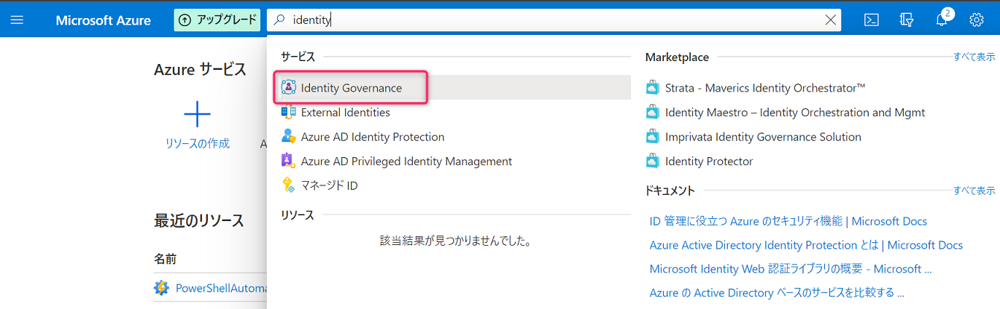

2. 左ペインにて [アクセス レビュー] をクリックし、 [+ 新しいアクセス レビュー] を選択します。
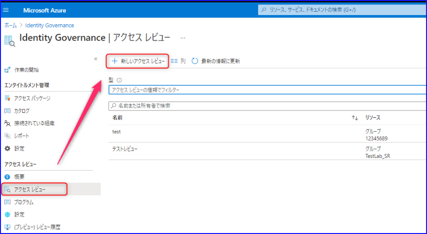

3. レビュー対象を指定します。たとえば、 特定のグループを対象にゲスト ユーザーのレビューを行いたい場合は、以下のように指定します。
 
    手順1: [チームとグループ] を選択します。  
    手順2: [チームとグループの選択] を選択し、ゲスト ユーザーが所属しているグループを選択します。  
    手順3: [ゲスト ユーザーのみ] を選択します。  
 
    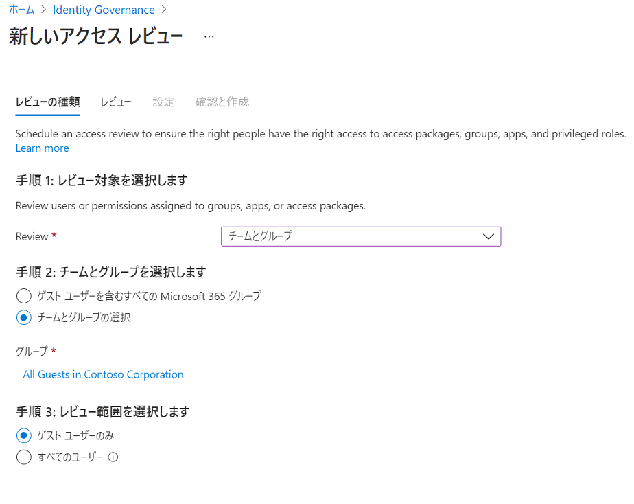


手順 2 ではレビュー対象のグループを指定します。  
ゲスト ユーザーは既存の業務用セキュリティグループ (例 : プロジェクト A グループ) に参加させることが一般的かと思います。  
この場合、既存の業務用セキュリティグループを手順 2 で選択しつつ、手順 3 では [ゲスト ユーザーのみ] を選択すればレビュー対象をゲスト ユーザーのみに限定することが可能です。

> [!WARNING]
> なお、手順 2 で[ゲスト ユーザーを含むすべての Mcirosoft 365 グループ] を選択すると、後述の手順にて [拒否されたゲスト ユーザーに適用するアクション] が構成できません。そのためこの項目では [チームとグループの選択] を使用します。


> [!TIP]  
> ゲスト ユーザーを既存の業務用セキュリティグループに参加させていない場合は、ゲスト ユーザー全員を含む動的グループを利用する方法もあります。
> 
> 具体的には以下のように、 `(user.userType -eq "Guest")` のルールで動的グループを作成すると、ゲスト ユーザー全員がメンバーに含まれるグループが作成されますので、本グループを手順 2 で指定します。  

動的グループの作成方法の詳細は、本記事では省略しております。以下の公開情報をご確認ください。  
[グループ メンバーシップ ルールを作成するには](https://docs.microsoft.com/ja-jp/azure/active-directory/enterprise-users/groups-create-rule#to-create-a-group-membership-rule)

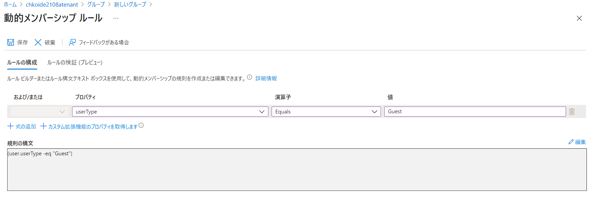

4. 必要に応じて、レビュー担当者と繰り返しの設定を行います。以下の画面では、半年ごとに、ゲスト ユーザー自身がレビューを行うよう設定しています。

    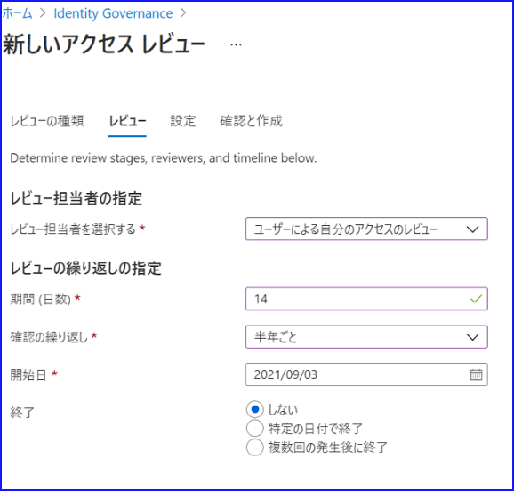

   - 管理者のレビューへの負担を最小限にしたい場合は、本手順のように [レビュー担当者を選択する] にて [ユーザーによる自分のアクセスのレビュー] を選択し、 ゲスト自身がセルフ レビューを行うよう構成します。
   - ゲスト自身ではなく、特定のユーザーが一括でレビューを管理したい場合は、 [ユーザーまたはグループが選択済み] を選択してレビュー担当者を個別に指定することも可能です。また、[グループの所有者] を選択して、グループの所有者をレビュー担当者とする構成も実現できます。
   - 上記の設定は 14 日間有効なレビューが半年ごとに繰り返し実行されます。レビューの依頼をうけたゲスト ユーザーは 14 日間 (2 週間) 以内にレビューに対して応答する必要があります。
 
5. アクセス レビューの設定を行います。
 
    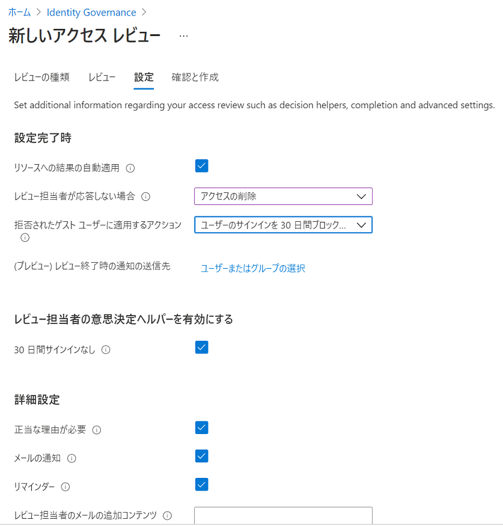

自動的に棚卸を行うために、 [リソースへの結果の自動適用] を [有効] に設定します。
また、[レビュー担当者が応答しない場合] の設定を [アクセスの削除] に設定します。
（管理者がレビューを行う場合は、 [アクセスの削除] もしくは  [推奨事項の実行] に設定します。）

レビューで拒否されたゲスト ユーザーをブロックし、30日後にテナントから削除されるようにするためには、
[拒否されたゲスト ユーザーに適用するアクション] の項目で、[ユーザーのサインインを 30 日間ブロックした後、テナントからユーザーを削除します] を選択します。
 
主な設定項目の説明と、指定する際の判断基準は以下の通りです。

| 項目  | 説明  |
| ------------ | ------------ |
| [リソースへの結果の自動適用] | レビュー完了後、自動で結果を反映させたい場合は [有効] にします。|
| [レビュー担当者が応答しない場合]	| レビュー担当者がレビューを行わなかったユーザーに対し、どのような処理を行うか指定します。|
| [拒否されたゲスト ユーザーに対するアクション]	| ゲスト ユーザーが拒否された場合の動作を指定します。|


| [レビュー担当者が応答しない場合] の選択肢  | 説明  |
| ------------ | ------------ |
|[変更なし] | 	レビュー担当者が応答しない場合、特に何も実行されません。|
|[アクセスの削除] | 	レビュー担当者が [拒否] を設定した時と同様の処理が行われます。実際に行われる処理は、以下の [拒否されたゲスト ユーザーに対するアクション] によって決定されます。|
|[アクセスを承認する] | レビュー担当者が [許可] を設定した時と同様の処理が行われます。そのため、引き続きグループのメンバーシップが維持されます。|
|[推奨事項の実行] | 	システム上で算出される推奨事項が実行されます。具体的には、 30 日以内にサインインがあれば [許可] 、 30 日以内にサインインがなければ [拒否] が選択される動作となります。	また、 [拒否] が選択されたユーザーに対して行われる処理は、[拒否されたゲスト ユーザーに対するアクション] によって決定されます。|
	 


| [拒否されたゲスト ユーザーに対するアクション] の選択肢  | 説明  |
| ------------ | ------------ |
| [リソースからユーザーのメンバーシップを削除] | 	レビュー対象のグループから、メンバーが削除されます。またはアプリケーションへのアクセス権が削除されます。ユーザー自体は特に影響を受けないため、テナントには引き続きサインインできます。|
| [ユーザーが 30 日間サインインできないようにしてから、テナントからユーザーを削除する] | 他のリソースへのアクセス権を持っているかどうかに関係なく、拒否されたユーザーによるテナントへのサインインがブロックされます。	また、 30 日後にテナントからゲスト ユーザーが削除されます。  
 

6. レビュー名と説明を記入し、アクセスレビューを作成します。
 
    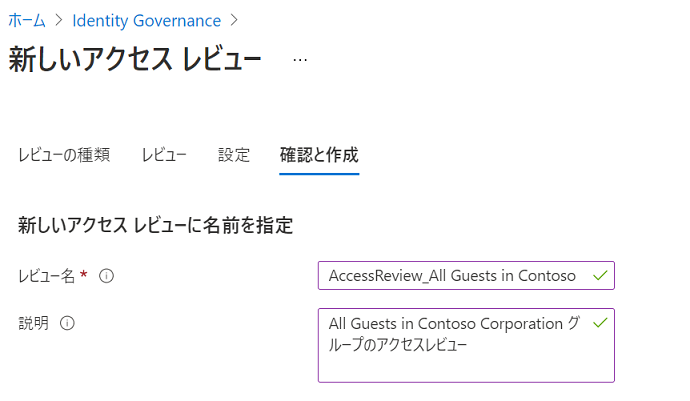

 

### 手順（アクセス レビューを実施する）-セルフ レビュー編-

1. アクセス レビューが開始されると、レビュー対象者の元に azure-noreply@microsoft.com からメールが届くので、[レビューを開始する（Review Access）] をクリックします。  
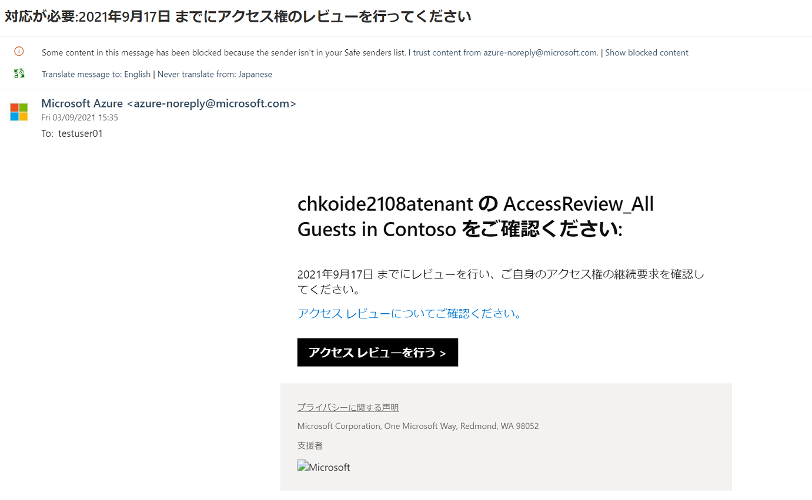

2. 以下のような画面が表示されるので、セルフ レビューを実施します。  
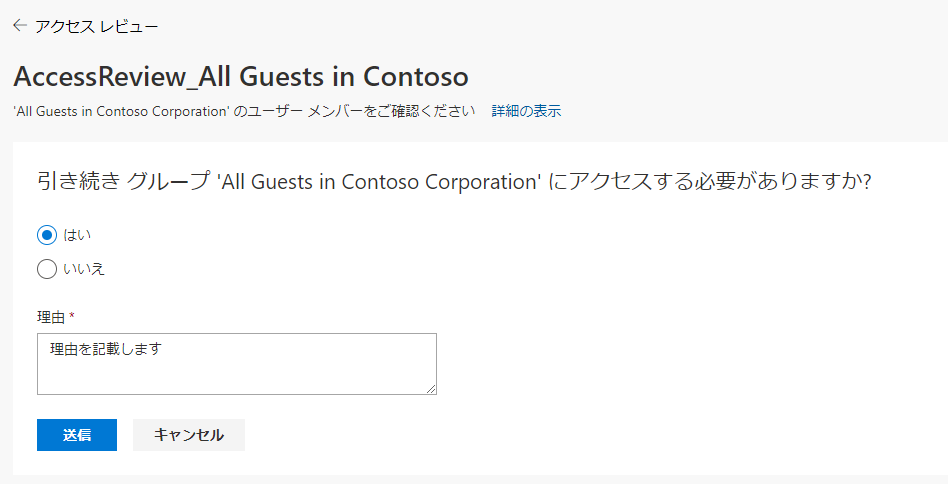
 
3. 画面が以下のように遷移します。 Progress の項目が 1/1 と表示されていることを確認します。  
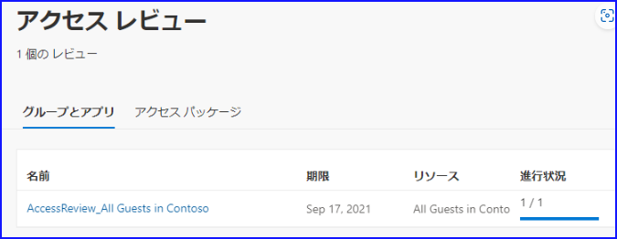

4. 指定した日付が経過するなどしてレビューが完了すると、[自動適用]が有効な場合は、自動的に [拒否されたゲスト ユーザーに対するアクション] が実行されます。
 
    たとえば、[ユーザーが 30 日間サインインできないようにしてから、テナントからユーザーを削除する] を設定した場合、拒否したユーザーの [サインインのブロック] が [はい] になります。  
    この状態では、まだユーザーは削除されませんが、ユーザーはポータル上にサインインできない状態となります。  
    また、このあと30日経過すると、ゲスト ユーザーはテナントから削除されます。

### 手順（アクセス レビューを実施する）-管理者レビュー編-

上記まではゲスト ユーザー自身にレビューを実施してもらう手順となりますが、もしゲスト ユーザー数が少ない場合などは管理者が代表してレビューを行うことも可能です。この場合の手順を後述します。

1. アクセス レビューが開始されると、レビュー対象者の元に azure-noreply@microsoft.com からメールが届くので、[レビューを開始する] をクリックします。
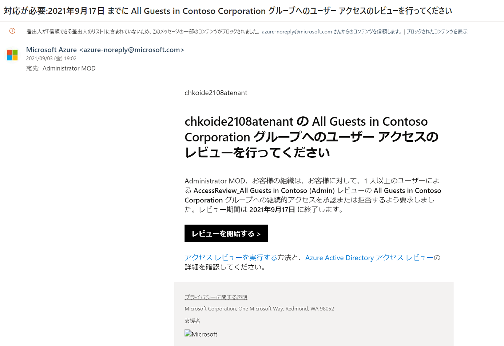
 
2. ユーザーの状況を確認します。各ユーザーを選択すると、 [承認する] と [拒否] がクリックできるようになるので、承認もしくは拒否を指定します。
3. [決定] の項目に、レビューを行った際の承認・拒否の値が表示されることを確認します。
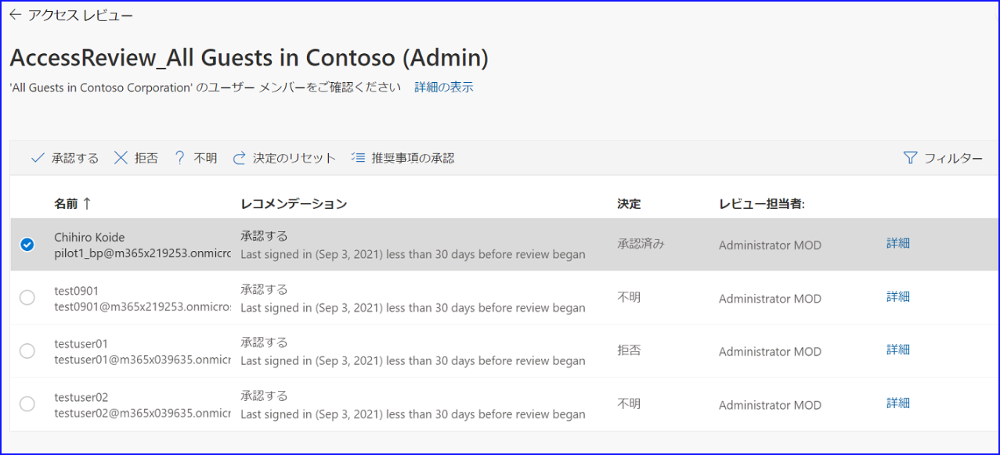
 
4. 指定した日付が経過するなどしてレビューが完了すると、[自動適用] が有効な場合は、自動的に [拒否されたゲスト ユーザーに対するアクション] が実行されます。

アクセス レビューに関する以下の公開情報も、併せてご確認ください。  

- [Azure AD アクセス レビューを使用して外部 ID の無効化および削除を行う](https://docs.microsoft.com/ja-jp/azure/active-directory/governance/access-reviews-external-users#disable-and-delete-external-identities-with-azure-ad-access-reviews)  
- [アクセスレビュー作成手順](https://docs.microsoft.com/ja-jp/azure/active-directory/governance/create-access-review)
 
## B. ゲスト ユーザーの最終サインイン日時を取得する方法

アクセス レビューを使用した棚卸についてご案内しましたが、この機能を利用するためには、 Azure AD Premium P2 ライセンスが必要です。  
そのため、 Azure AD Premium P1 ライセンスまでのみお持ちの環境では、上記の機能を利用することができません。
 
棚卸を完全に自動化したい場合は、Azure AD Premium P2 ライセンスの購入を検討する必要がありますが、
一定期間サインインのないユーザーを抽出するのみであれば、以下の Github 上に記載のスクリプトを使用することで、ユーザーの最終サインイン日時を取得することが可能です。  
[最終サインイン日時を一括で取得する方法](https://jpazureid.github.io/blog/azure-active-directory/azure-ad-get-lastSignInDateTime/)
 
このスクリプトを利用するためには、アプリケーションの登録などの事前準備が必要です。  
必要な手順につきましては、下記にて詳細をご案内しておりますので、こちらも併せてご参照ください。  
[アプリケーションの登録手順](https://github.com/jpazureid/get-last-signin-reports/tree/use-signin-activity-beta-api)
 
スクリプトを実行すると CSV ファイルが出力され、以下のように、ユーザーの ID、UPN、最終サインイン日時、アプリケーション情報を順に確認できます。
 
実行結果
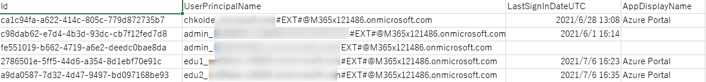
 
 
なお、上記にてダウンロードしたスクリプトでは、ゲスト ユーザーのみならず、テナントに登録されているすべてのユーザーの情報が取得されます。  
そのため、取得対象をゲスト ユーザーのみにしたい場合は、
Get-LastSignIn.ps1 のスクリプトの48 行目を、以下のように修正してから実行します。  
 
修正箇所
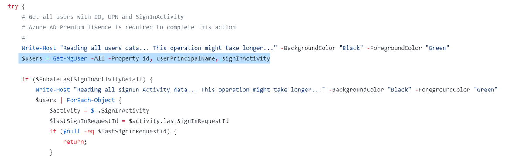
 
 
修正前
```powershell
$users = Get-MgUser -All -Property id, userPrincipalName, signInActivity
```

修正後
```powershell
$users = Get-MgUser -All -Property id, userPrincipalName, signInActivity -Filter "usertype eq 'Guest'"
```

上記手順で 30 日以上サインインしていないゲスト ユーザーを手動で抽出し、必要に応じて、削除処理などを実施いただければと思います。

