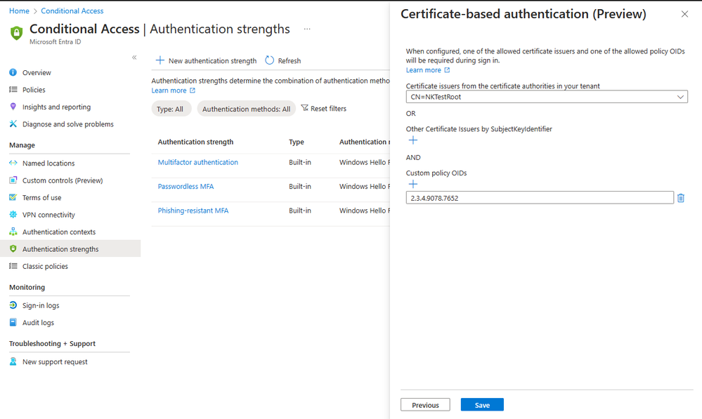

# 条件付きアクセスで高度な証明書ベース認証 (CBA) の設定オプションがパブリック プレビューになりました

こんにちは、Azure Identity サポート チームの 中村 です。 
 
本記事は、2024 年 1 月 30 日に米国の Microsoft Entra Blog で公開された [Introducing More Granular Certificate-Based Authentication Configuration in Conditional Access](https://techcommunity.microsoft.com/t5/microsoft-entra-blog/introducing-more-granular-certificate-based-authentication/ba-p/2365668) を意訳したものになります。ご不明点等ございましたらサポート チームまでお問い合わせください。

---

条件付きアクセスによる高度な証明書ベース認証 (CBA) の新しいオプションのパブリック プレビューを発表できることを嬉しく思います。このオプションは、証明書の発行者やポリシーのオブジェクト識別子 (OID) のプロパティに基づいて、特定のリソースへのアクセスを許可する機能を提供します。

弊社のお客様、特に厳格に規制された業界や政府機関のお客様は、CBA の設定により柔軟性が必要であると要望されていました。すべての Entra ID 連携アプリケーションに同じ証明書を使用することは、必ずしも十分ではありません。リソースによっては、特定の発行者が発行した証明書によるアクセスが必要な場合もありますし、特定の OID のポリシーに基づくアクセスが必要なリソースもあります。

例として、Contoso という企業では、従業員にスマート カードを使用して 3 種類の多要素証明書を従業員に発行しているとします。これらの証明書は、機密、秘密、トップシークレットのような異なるセキュリティ クリアランス レベルに対応しています。Contoso 社は、適切な多要素証明書を持つユーザーのみが、対応する分類のデータにアクセスできるようにする必要があります。

条件付きアクセスの認証強度の機能により、お客様は証明書発行者や OID のポリシーに基づいてアクセスを許可する高度な CBA オプションを使用して、カスタムの認証強度ポリシーを作成できるようになりました。パートナーの Entra ID テナントから多要素認証 (MFA)  が信頼されている外部ユーザーの場合、これらのプロパティに基づいてアクセスを制限することもできます。 

これにより、[12 月に共有した最新の更新](https://jpazureid.github.io/blog/azure-active-directory/advancing-cybersecurity-the-latest-enhancement-in-phishing-resistant-authentication/) に加えて、CBA に柔軟性が追加されました。私たちは、すべてのお客様に対してフィッシング耐性のある認証機能をより向上させ、米国政府のお客様が「[国家のサイバーセキュリティの向上に関する大統領令 14028](https://www.whitehouse.gov/briefing-room/presidential-actions/2021/05/12/executive-order-on-improving-the-nations-cybersecurity/)」を満たすことができるよう、引き続きサポートしていきます。

この新機能の詳細については、[認証強度の詳細オプション](https://learn.microsoft.com/en-us/entra/identity/authentication/concept-authentication-strength-advanced-options) をご確認ください。

Alex Weinert
