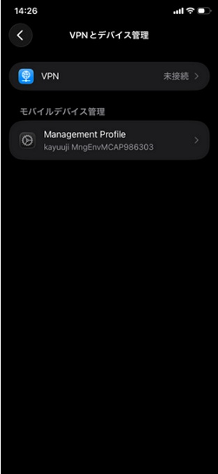
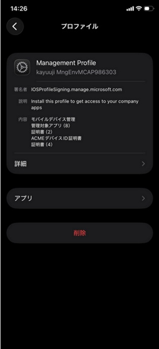
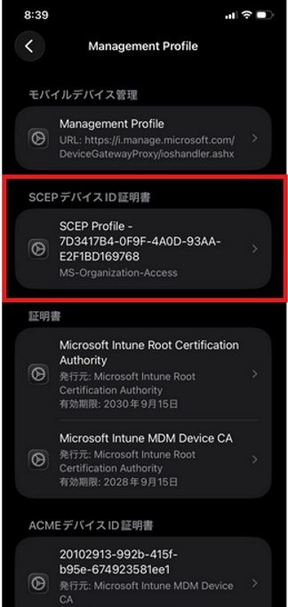
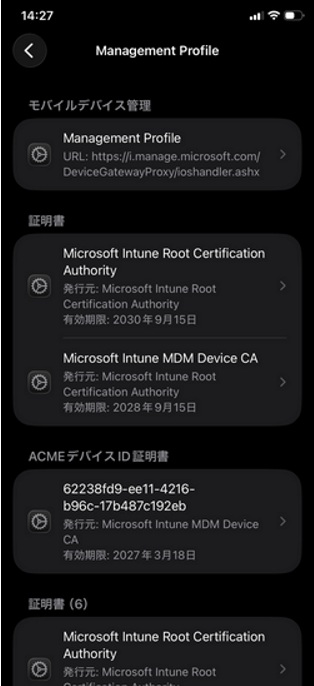
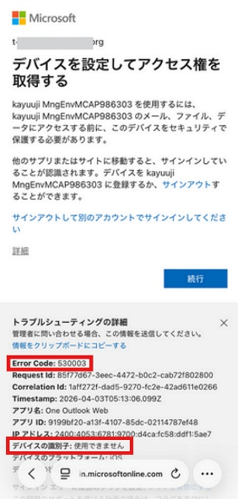
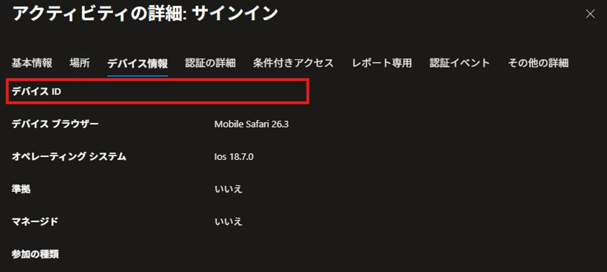
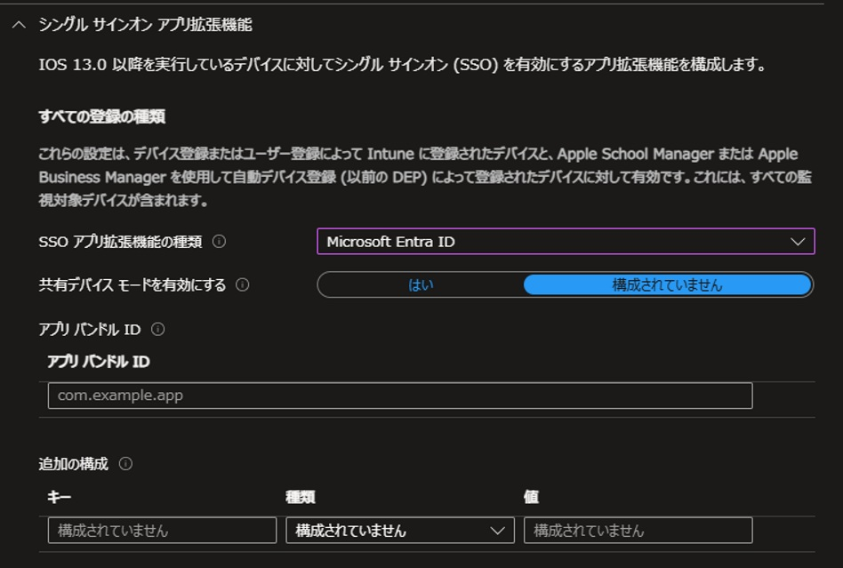

# Apple デバイスでキーチェーンから Secure Enclave 利用へ
こんにちは、Azure & Identity サポートの金森です。

今回は Apple デバイス (iPhone、iPad、Mac) の [Microsoft Entra ID (以下 Entra ID) へのデバイス登録に紐づく、デバイス ID / キーの情報が保持される仕組み] が変更されたことについて、どのような変更であるかの説明や、この変更による影響、対処方法などについてお知らせします。

弊社公開情報では、 [Apple デバイス用の Microsoft Enterprise SSO プラグイン](https://learn.microsoft.com/ja-jp/entra/identity-platform/apple-sso-plugin) 内の [デバイス ID キー ストレージ](https://learn.microsoft.com/ja-jp/entra/identity-platform/apple-sso-plugin#device-identity-key-storage) の説明が該当します。

## どのような実装変更であるか

[前述の公開情報](https://learn.microsoft.com/ja-jp/entra/identity-platform/apple-sso-plugin#device-identity-key-storage) の説明のポイントをサマライズします。

- Apple デバイスは、Intune への MDM 登録を行うと、併せて Entra ID へのデバイス登録も行っている
- つまり、Apple デバイス上には以下の 2 つのデバイス登録情報がそれぞれ別のものとして保持されていることになる
  - Intune への MDM 登録情報
  - Entra ID へのデバイス登録情報 (以降デバイス ID と呼称します)
- デバイス ID は、PRT (Primary Refresh Token) を用いた SSO やデバイス ベースのアクセス制御を適切に受けるための判定情報であるデバイス固有の ID 値を提供する
- これまで、Entra ID に対してデバイスの新規登録をおこなう際、デバイス ID は OS 内の "キーチェーン" に格納されていた
- この新規登録の際のデバイス ID の格納先が、キーチェーンから Secure Enclave に変わる実装がロールアウトされた
- このロールアウトにより、デバイスに格納されているデバイス認証に利用される鍵などの情報の保護が強化された
- このロールアウトは 2025 年 8 月以降順次、各テナントにロールアウトされていき、特に 2026 年 3 月に広くロールアウトされた

つまり、ロールアウトが適用される以前に Intune MDM 登録 + Entra ID へのデバイス登録を行った Apple デバイスと、2025 年 8 月以降にロールアウトが適用された Apple デバイスでは [デバイス ID の格納先が異なる] ことになります。

- ロールアウトが適用される以前のセットアップ : キーチェーンにデバイス ID が格納されている
- ロールアウトが適用された以降のセットアップ : Secure Enclave にデバイス ID が格納されている

### 補足
キーチェーンや Secure Enclave は、Apple デバイスの [機密性の高いデータ (アカウントの資格情報やトークンのキャッシュなど) を格納する領域] です。
以下は Apple の技術情報ですが、参考として紹介します。

[キーチェーンのデータ保護 - Apple サポート (日本)](https://support.apple.com/ja-jp/guide/security/secb0694df1a/1/web/1)
[Secure Enclave - Apple サポート (日本)](https://support.apple.com/ja-jp/guide/security/sec59b0b31ff/web)

> [!NOTE]
> Secure Enclave は、Windows における TPM のように [OS から直接アクセスできない、ディスク以外のハードウェアに確保されたセキュアなデータの格納領域] です。

## キーチェーンと Secure Enclave のどちらに格納されているかの見分け方
お手元の Intune MDM 登録 + Entra ID へのデバイス登録済みの Apple デバイスがどちらのシナリオで構成されたものであるかを見分ける場合、特徴的な差異として [SCEP デバイス ID 証明書が視認できるかどうか] という見方があります。
以下は iOS デバイスの例ですが [設定] - [一般] - [VPN とデバイス管理] から、Intune 登録時にインポートされている Management Profile の詳細を確認する流れです。

| Management Profile をタップ | 詳細をタップ  |
|-----|-----|
|   |  |

| SCEP デバイス ID 証明書あり = キーチェーン利用 | 	SCEP デバイス ID 証明書なし = Secure Enclave 利用 |
|-----|-----|
|  |  |

## この実装変更が展開されるとどのような影響が発生するか
この実装変更がロールアウトされた後に Intune MDM 登録 + Entra ID へのデバイス登録をしたデバイスの一部のアプリにおいてデバイス ID を提示できなくなります。
その結果、条件付きアクセスでデバイス ID の提示を必要とするポリシーを構成している場合に一部アプリでのサインインがブロックされます。

## どのような環境のどのようなアプリが影響を受けるのか
次のような条件付きアクセス ポリシーを構成している環境で影響が発生する恐れがあります。

- [条件付きアクセス: デバイスのフィルター](https://learn.microsoft.com/ja-jp/entra/identity/conditional-access/concept-condition-filters-for-devices) で紹介しているデバイスのフィルターを判定条件に利用している。

- [条件付きアクセス:Grant](https://learn.microsoft.com/ja-jp/entra/identity/conditional-access/concept-conditional-access-grant) で紹介している、デバイスは準拠としてマーク済みである必要がある、承認済みクライアント アプリを必須にする (2026 年 3 月に廃止)、アプリの保護ポリシーを必須にする、といったアクセス制御を利用している。

上記の判定条件やアクセス制御はいずれも **クライアント アプリ/ブラウザからの認証要求時に、デバイス ID が Entra ID に提示される** ことで適切に判定を受けることが可能な機能です。
つまり、クライアント アプリ/ブラウザが認証時にデバイス ID を提示できないと、Entra ID は [どのデバイスからの認証要求であるか] を判定する情報が得られず、未登録デバイスと判定することになります。

上述の条件付きアクセス ポリシーを構成している環境において、それぞれの OS ごとで動作するアプリケーションへの影響を以下の表にまとめました。

### iOS の場合

| 区分 | 説明 |
|------|------|
| MSAL 対応アプリ／ブラウザ | 特に対応は不要です。なお、Microsoft の 1st party アプリや Edge ブラウザは MSAL に対応しています。3rd party アプリが MSAL に対応しているかどうかは、アプリ提供元への確認が必要です。 |
| 非 MSAL 対応アプリ／ブラウザ | Enterprise SSO プラグイン機能を有効にすることで、Secure Enclave に格納されたデバイス ID の取得と認証時の提示が行えるようになります。 |

### macOS の場合

| 区分 | 説明 |
|------|------|
| MSAL 対応アプリ／ブラウザ | Enterprise SSO プラグイン機能を有効にすることで、Secure Enclave に格納されたデバイス ID の取得と認証時の提示が行えるようになります。 |
| 非 MSAL 対応アプリ／ブラウザ | Enterprise SSO プラグイン機能を有効にすることで、Secure Enclave に格納されたデバイス ID の取得と認証時の提示が行えるようになります。 |

※ Platform SSO では Enterprise SSO を利用しているため Secure Enclave に対応しています。

## 影響を受けた場合の具体的な例
ここまでの内容を踏まえて、影響を受けた場合の具体的な例を紹介します。

- 前提
  - ロールアウトが適用された以降に Intune MDM 登録 + Entra ID へのデバイス登録をした iOS デバイス
  - Enterprise SSO を有効にする設定を配布していない
  - デバイス ID を元にアクセス制御を行う条件付きアクセスのポリシーを構成している
  - Safari や 3rd party 製アプリなど MSAL に対応していないアプリ利用時

- 発生しうる事象
  - 認証時にクライアント側からデバイス ID が提示されず、条件付きアクセスのポリシーに抵触してサインインがブロックされる。
  - Edge ブラウザ や 1st party (Microsoft) 製アプリを使用した場合は同様の事象は発生しない。
  - ロールアウトが適用される以前にセットアップしたデバイスでは同様の事象は発生しない。

- 事象が発生した際のクライアント上でのエラー表示例
以下の例では Safari ブラウザからのアクセス シナリオですが、サインイン時に以下のように 530003 のエラー コードで失敗しています。このエラー コード 530003 は "Your device is required to be managed to access this resource." を意味しており、つまり MDM 管理されたデバイスからのアクセスではないため "デバイスは準拠としてマーク済みである必要がある" のアクセス制御に抵触したことを示しています。
また、"デバイスの識別子" の項目が "使用できません" となっていることもデバイス ID が提示されなかったことを示唆しています。

上記のサインインに呼応する Entra ID のサインイン ログの詳細を参照すると以下のようにデバイス ID の項目がブランクとなっており、この点からもクライアントからデバイス ID が提示されていないことを確認可能です。

上記は [Apple デバイス用の Microsoft Enterprise SSO プラグイン](https://learn.microsoft.com/ja-jp/entra/identity-platform/apple-sso-plugin) 内の [セキュリティで保護されたエンクレーブ ベースのデバイス ID のトラブルシューティング](https://learn.microsoft.com/ja-jp/entra/identity-platform/apple-sso-plugin#troubleshooting-secure-enclave-based-device-identity) の説明が該当します。

## 対処方法
Enterprise SSO プラグインを有効化することで、非 MSAL 対応アプリ/ブラウザを利用する際のユーザー認証時にデバイス ID を提示できるようになります。
Enterprise SSO 機能を有効化するには、 [MDM を使用して iOS/iPadOS Enterprise SSO アプリ拡張機能を構成する](https://learn.microsoft.com/ja-jp/intune/intune-service/configuration/use-enterprise-sso-plug-in-ios-ipados-with-intune?tabs=prereq-intune%2Ccreate-profile-intune) 内の [シングル サインオン アプリ拡張機能構成ポリシーを作成する](https://learn.microsoft.com/ja-jp/intune/intune-service/configuration/use-enterprise-sso-plug-in-ios-ipados-with-intune?tabs=prereq-intune%2Ccreate-profile-intune#create-a-single-sign-on-app-extension-configuration-policy) の手順に沿って Intune にてデバイス構成ポリシーを用いて設定を配布します。
 
Safari ブラウザもしくは [認証ブローカーとして Safari WebView を使用する] 3rd party アプリの場合、以下のように Enterprise SSO を有効化することで、デバイス ID を提示できるようになります。
[SSO アプリ拡張機能の種類] の設定を "Microsoft Entra ID" にしているのみの設定です。

なお、3rd party アプリが [認証ブローカーとして Safari WebView] を使用しているかどうかは、各アプリの実装に依存するためアプリ提供元までご確認ください。
もし MSAL も Safari WebView も認証処理に使用していない 3rd party アプリの場合、該当アプリの [アプリ バンドル ID] を指定することで対応できる可能性はありますが、該当アプリの実装に依存するため Microsoft として確証を持ったご案内ができない点、あらかじめご了承ください。

## よくあるご質問とその回答 (FAQ)

### FAQ1
Q:
3rd party アプリの [アプリ バンドル ID] はどのように確認することができますか？

A:
アプリ バンドル ID の正確な情報はアプリのご提供元ベンダー様へご確認ください。
[iOS デバイスでのアプリ バンドル ID の確認](https://learn.microsoft.com/ja-jp/entra/identity-platform/apple-sso-plugin#find-app-bundle-identifiers-on-ios-devices) にも該当のご案内があります。

その他の簡易的なアプリ バンドル ID の確認方法としては、2026 年 4 月現在では、App Store のアプリ ID を元に、アプリ バンドル ID を確認することが可能であるという情報を確認しています。
その手順は次の通りです。

まずは確認したいアプリの App Store サイトを開きます。例として MSN アプリとします。

App Store の MSN アプリのサイト
https://apps.apple.com/jp/app/msn/id945416273
->この URL よりアプリ ID が 945416273 であることがわかります。

続けて、Apple の iTunes の lookup サイトでアプリ ID の数字 945416273 を id= で指定した URL を開きます。
https://itunes.apple.com/lookup?id=945416273

1.txt というテキストのダウンロードが行われるため、テキストファイルより bundleid 値を検索します。
今回の例では ["bundleId":"com.microsoft.axp-ios.BingNews"] という値であるため、com.microsoft.axp-ios.BingNews が MSN アプリのアプリ バンドル ID であることがわかります。

---
### FAQ2
Q:
認証ブローカーとは何でしょうか。

A:
認証ブローカーとは、アプリに代わって認証の処理を行うコンポーネントを指します。
OS 上で起動するアプリは、認証に関わるやり取りをアプリ自身のプロセス上で実行せず、別のプロセスに委任する (認証に関する処理を任せる) 作りが広く一般的です。
これは OS の種類にかかわらず、以下のように言えます。

- Windows の場合、Outlook や Teams などの Office (1st party) アプリでは WAM (Web Account Manager) と呼ばれる OS の認証ブローカーに認証の処理を任せる
　3rd party アプリの場合、アプリの作りによって WAM に任せる作りのアプリもあれば、Edge WebView に任せる作りのアプリ、自分自身のプロセスで対応する (他プロセスに委任しない) アプリもある

- iOS の場合、Office (1st party) アプリは、Microsoft Authenticator に認証の処理を任せる
　3rd party アプリの場合、アプリの作りによって認証ブローカーである Microsoft Authenticator に任せる作りのアプリもあれば、Safari WebView に任せる作りのアプリ、自分自身のプロセスで対応する (他プロセスに委任しない) アプリもある

- Android の場合、Office (1st party) アプリは、Intune Company ポータル アプリに認証の処理を任せる
　3rd party アプリの場合、アプリの作りによって認証ブローカーである Intune Company ポータル アプリに任せる作りのアプリもあれば、Chrome WebView に任せる作りのアプリ、自分自身のプロセスで対応する (他プロセスに委任しない) アプリもある
 
上記の Microsoft の認証ブローカーに認証処理を委任できるアプリは、1st / 3rd party 製であるかどうかにかかわらず [MSAL (先進認証のライブラリ) に対応したアプリ] という言い方も可能です。

---
### FAQ3
Q:
Enterprise SSO を有効にすることによる影響はありますか。

A:
Apple の OS に対して Enterprise SSO を有効化することで、Safari の認証処理がアドイン/強化される (ブラウザ単位ではなく、デバイスとして保持する認証情報を利用できるようになる) ことになります。
そのため、Safari もしくは [Safari WebView を認証ブローカーとする作りのアプリ] がその恩恵を受けることになります。
 
そのため [Safari ブラウザ、もしくは認証ブローカーとして Safari WebView を使用する 3rd party アプリの利用時、これまでは対話的な認証画面が表示されて認証操作を行っていたが、Intune に MDM 登録を行っているユーザーとして SSO が行えるようになり、かつ認証時にデバイス ID 情報も提示できるようになる] という影響/効果が生じることが期待値となります。

なお、前述のとおり MSAL も Safari WebView も認証処理に使用していない 3rd party アプリの場合、該当アプリの [アプリ バンドル ID] を指定することで、同様の影響/効果を得られる可能性もあります。
繰り返しになりますが該当アプリの実装に依存するため Microsoft として Enterprise SSO の効果が得られるかどうかに関して確証を持ったご案内ができない点、あらかじめご了承ください。

---

上記内容が皆様の参考となりますと幸いです。どちら様も素敵な Entra ID ライフをお過ごしください。
