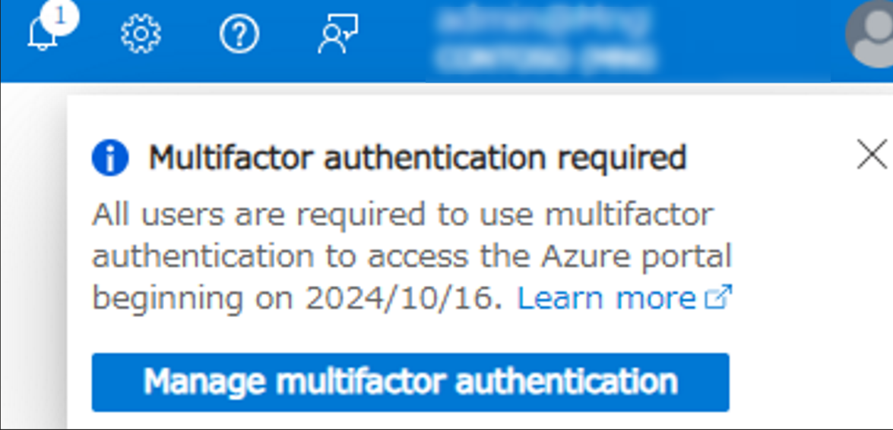
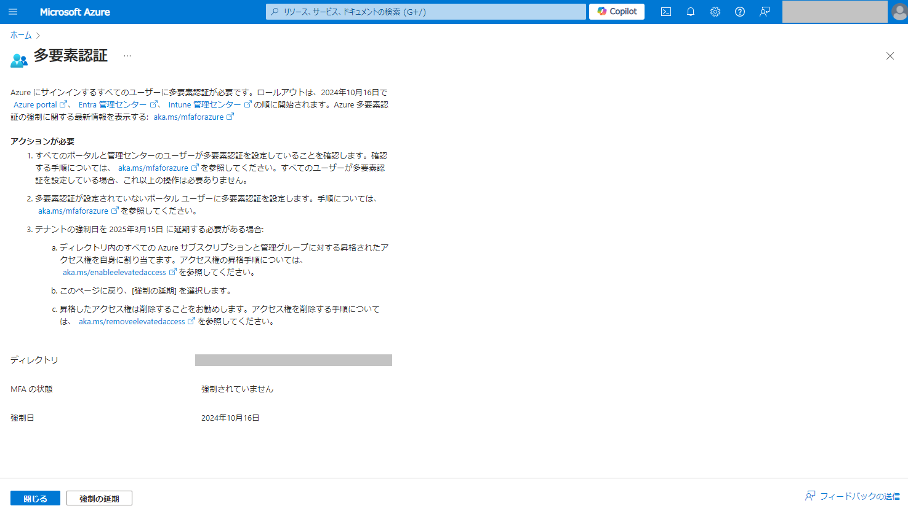
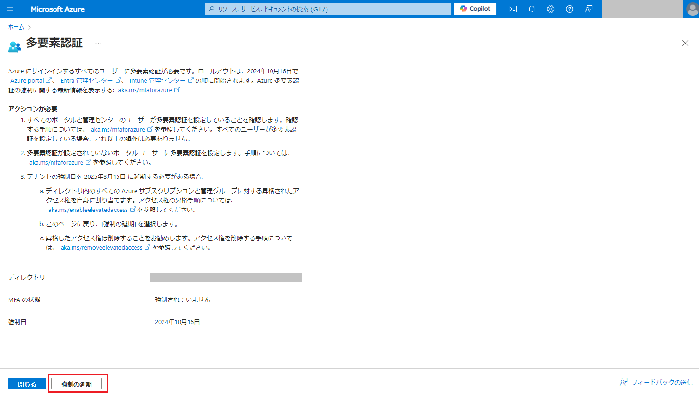

# MC862873 - Azure ポータル (および Azure CLI 等) の MFA 義務付けの延長申請について

こんにちは、Azure Identity サポート チームの 五十嵐 です。

Microsoft では [Secure Future Initiative](https://www.microsoft.com/en/microsoft-cloud/resources/secure-future-initiative) の取り組みのひとつとして、ID とシークレットの保護に専念しております。その中の重要なアクションとして、Azure を利用するアカウントの保護を目的に Azure ポータル (および Azure CLI 等) へのアクセスに対して MFA を義務付けることを発表いたしました。これまで、以下のブログでこの取り組みについて説明させていただいております。概要につきましては以下のブログをご参照ください。

[Microsoft は Azure ポータル (および Azure CLI 等) を利用するユーザーに MFA を義務付けます | Japan Azure Identity Support Blog (jpazureid.github.io)](https://jpazureid.github.io/blog/azure-active-directory/microsoft-will-require-mfa-for-all-azure-users/)

[Azure ポータル (および Azure CLI 等) の MFA 義務付けに関する更新情報 (2024/6/27) | Japan Azure Identity Support Blog (jpazureid.github.io)](https://jpazureid.github.io/blog/azure-active-directory/update-on-mfa-requirements-for-azure-sign-in/)


2024 年 8 月 15 日には、グローバル管理者へのメール、Microsoft 365 管理センターのメッセージ センターおよび Azure ポータルでの通知を開始いたしました。
Azure ポータルにおける通知の場合、以下の表記を確認します。



グローバル管理者へのメールは以下のいずれかのタイトルで通知される予定です。

    対応が必要: 2024 年 10 月 15 日までにテナントの多要素認証を有効にする  
    Action required: Enable multifactor authentication for your tenant by 15 October 2024

適用対象の詳細と延長申請について追加の情報がございますので、このブログでも内容を補足いたします。
まずは、メッセージ センターで通知した MC862873 の内容について抄訳したものを以下に記載いたします。

## MC862873 の抄訳

>2024 年 10 月 15 日以降、セキュリティをさらに強化するため、Microsoft はすべてのユーザーが Microsoft Azure ポータル、Microsoft Entra 管理センター、および Microsoft Intune 管理センターにサインインする際に多要素認証の使用を必須とします。  
>注意: この要件は、Windows 365 Cloud PC などの Intune 管理センターを通じてアクセスされるすべてのサービスにも適用されます。  
>多要素認証が提供する追加の保護を活用するため、できるだけ早く多要素認証を有効にすることをお勧めします。  
>詳細については、以下の Azure および管理ポータルのための多要素認証の義務化に関する計画を参照してください。  
>
>[必須の Microsoft Entra 多要素認証 (MFA) - Microsoft Entra ID | Microsoft Learn](https://learn.microsoft.com/ja-jp/entra/identity/authentication/concept-mandatory-multifactor-authentication)
>
>[この変更が組織に与える影響:] この変更後、Azure ポータル、Microsoft Entra 管理センター、および Intune 管理センターにサインインするために、多要素認証を利用する必要があります。
>
>[準備するために必要な手順:] まだ、多要素認証を有効化していない場合は、2024 年 10 月 15 日までに多要素認証を設定して Azure ポータル、Microsoft Entra 管理センター、および Intune 管理センターにアクセスできるようにしてください。
>この日までに多要素認証を設定できない場合は、延期するための申請が可能です。 
>変更が適用された後、事前に多要素認証が設定されていない場合、Azure ポータル、Microsoft Entra 管理センター、または Intune 管理センターにアクセスする際に多要素認証の登録を求められます。
>詳細については、Azure および管理ポータルのための MFA の義務化の計画を参照してください。
>
>[必須の Microsoft Entra 多要素認証 (MFA) - Microsoft Entra ID | Microsoft Learn](https://learn.microsoft.com/ja-jp/entra/identity/authentication/concept-mandatory-multifactor-authentication)

既にテナント全体で MFA を有効化しているお客様は本通知の影響は受けません。
また、この取り組みを待つことなく、条件付きアクセスやセキュリティの既定値群の機能を利用して、多要素認証を有効化いただくこともご検討いただけますと幸いでございます。

[Microsoft 管理ポータルに多要素認証を要求する - Microsoft Entra ID | Microsoft Learn](https://learn.microsoft.com/ja-jp/entra/identity/conditional-access/how-to-policy-mfa-admin-portals)

[条件付きアクセスですべてのユーザーに対して MFA を必須にする - Microsoft Entra ID | Microsoft Learn](https://learn.microsoft.com/ja-jp/entra/identity/conditional-access/howto-conditional-access-policy-all-users-mfa)

## 延長申請手順

延長申請を行うためには、申請を行うアカウントに以下の権限が有効化されている必要があります。
グローバル管理者であっても、Azure サブスクリプションに対する権限の昇格を行わない限り、申請をすることはできません。

- グローバル管理者
- Azure サブスクリプションに対する昇格されたアクセス権

グローバル管理者を利用してサブスクリプションに対する権限の昇格を行う手順を含め、あらためて以下に手順をまとめさせていただきました。

### a. グローバル管理者の権限昇格方法

申請の前提条件である、Azure サブスクリプションに対する権限の昇格を行います。

- グローバル管理者で Azure Portal (https://portal.azure.com/) にアクセスします
- [Microsoft Entra ID] の項目を選択します
- [管理] 内にある [プロパティ] の項目を選択します
- 以下の設定にて "はい" に設定して、[保存] を選択します

```
Azure リソースのアクセス管理  
<アクセスしているユーザーの表示名>は、このテナント内のすべての Azure サブスクリプションおよび管理グループへのアクセスを管理できます。
```


### b. 延長申請

- 先ほどの権限を昇格したアカウントにて以下の URL にアクセスください。

https://aka.ms/managemfaforazure



- "ディレクトリ"、"MFA の状態", "強制日" を確認ください  
  延長申請をしていない場合、"強制日" は 2025 年 3 月 15 日 以前の日付となっています
- [強制の延期] を選択します
- 表示される画面の表記を確認のうえ [延期] を選択します
- "MFA の状態" が "延期" と表示されていれば申請は完了です




### c. 昇格した権限を削除します

申請後、Azure サブスクリプションに対する権限が昇格された状態は不要であるため、削除することを検討ください
以下の手順で昇格された状態を切り戻します

- Azure Portal (https://portal.azure.com/) にアクセスします
- [Microsoft Entra ID] の項目を選択します
- [管理] 内にある [プロパティ] の項目を選択します
- 以下の設定にて "いいえ" に設定して、[保存] を選択します

```
Azure リソースのアクセス管理  
<アクセスしているユーザーの表示名>は、このテナント内のすべての Azure サブスクリプションおよび管理グループへのアクセスを管理できます。
```

以上で申請は完了となります。

延長申請や MFA の強制化に関する補足情報を Q & A 形式で記載いたします。参考になりましたら幸いです。

#### Q. 昇格されたアクセス権とは何ですか？

A.
テナントに紐づく Azure サブスクリプションのすべてを管理するための権限です。
Azure サブスクリプションは Microsoft Entra ID テナントに紐づきますが、サブスクリプションの情報を読み取るためにはサブスクリプションごとに権限が必要です。
Microsoft Entra ID のグローバル管理者であったとしても、サブスクリプションに対する権限がない場合には、Azure リソースを管理することができません。
しかし、特定の管理のためのシナリオに対応するために、グローバル管理者の権限を昇格することで、テナントに紐づいたすべてのサブスクリプションに対するアクセス権を有効化することができます。

昇格されたユーザーはテナントに紐づいたすべてのサブスクリプションにおいて "ユーザー アクセス管理者" の Azure サブスクリプションのロールを持ちます。
"ユーザー アクセス管理者"  はサブスクリプションのロールを管理することができるため、あらゆる操作が可能となります。

影響につきまして、権限の昇格を行うのみでは Azure 上のリソースに対する変更は加えられません。
また、権限が付与されるのは操作を行ったグローバル管理者のみとなります。
テナント内のサブスクリプションを利用するユーザーは、サブスクリプションに割り当てられているロールの一覧から、"ユーザー アクセス管理者"  のロールを持ったユーザーを確認することが可能です。

今回の延長申請では、この権限の昇格を必要なものとしており、申請を行う場合は事前に操作ください。
なお、申請後は昇格された権限を削除いただいても構いません。申請後のアカウントの状態を確認することはありません。

[Azure サブスクリプションと Azure AD の管理者 | Japan Azure Identity Support Blog (jpazureid.github.io)](https://jpazureid.github.io/blog/azure-active-directory/subscription-azure-ad-relationship/)

#### Q. Azure CLI についても延長できますか？

A.
今回申請では、以下の "フェーズ 1" の適用に対して延長を申し込むことができます。

[必須の Microsoft Entra 多要素認証 (MFA) - Microsoft Entra ID | Microsoft Learn](https://learn.microsoft.com/ja-jp/entra/identity/authentication/concept-mandatory-multifactor-authentication)
>フェーズ 1: 2024 年後半以降、MFA は Azure portal、Microsoft Entra 管理センター、および Microsoft Intune 管理センターにサインインするのに必要になります。 適用は、世界中のすべてのテナントに徐々に実施されます。 
>このフェーズは、Azure CLI、Azure PowerShell、Azure mobile app、IaC ツールなどの他の Azure クライアントには影響しません。 

公開情報の適用範囲の表に記載されている実施段階が "2024 年後半" となっている以下のアプリケーション (Web サイト) に対する適用を延長できます。
以下のアプリケーション以外の弊社が提供するサイトなどへのアクセスは適用範囲外となります。

- Azure Portal (https://portal.azure.com/)
- Microsoft Entra 管理センター (https://entra.microsoft.com/)
- Microsoft Intune 管理センター (https://intune.microsoft.com/)

フェーズ 2 である Azure CLI などに対する適用の延長申請に関しては今後の情報をお待ちください。

#### Q. Microsoft Graph API PowerShell や SharePoint Online, Teams などの管理用 PowerShell コマンドの利用は今回の対象になりますか。また、他のアプリケーションへの利用も影響はありますか。

A. 
以下の公開情報の "適用範囲" のアプリケーション一覧に記載のあるアプリケーションに対して制御が適用され、記載されていないアプリケーションに対して制御は適用されません。

[必須の Microsoft Entra 多要素認証 (MFA) - Microsoft Entra ID | Microsoft Learn](https://learn.microsoft.com/ja-jp/entra/identity/authentication/concept-mandatory-multifactor-authentication)

そのため、Microsoft Graph API PowerShell や SharePoint Online, Teams などの管理用 PowerShell コマンドを利用する際のサインインに対して、本取り組みによる制御は適用されません。

#### Q. 延長申請を再度実施することは可能でしょうか？

A. 
再度延長要求を行うことで継続して期日を延ばすことはできません。
延長申請では、フェーズ 1 の適用を 2025 年 3 月 15 日 まで延長いただけます。


#### Q. 特定のアカウントだけ無効にできますか？また、MFA を強制化する設定自体の無効化は可能でしょうか？

A.
今回の MFA の義務付けはテナント内のすべてのユーザーに対して適用されます。
特定のユーザーを無効にすることはできません。
また、MFA を強制化する設定を無効にすることもできません。

#### Q. ライセンスは必要ですか？

A.
MFA の義務付けに関するライセンス要件はありません。
全てのテナントで有効化されます。

#### Q. 何も対応せずに期日を迎えた場合どうなりますか？

A.
フェーズ 1 では以下のページにアクセスした際に MFA が強制されます。

- Azure Portal (https://portal.azure.com/)
- Microsoft Entra 管理センター (https://entra.microsoft.com/)
- Microsoft Intune 管理センター (https://intune.microsoft.com/)

ユーザーが事前に MFA の方法を登録している場合、登録されている方法を利用して MFA を行います。
MFA の方法を登録していない場合、ユーザーに対して MFA の登録が求められます。

もし、ユーザーが過去に登録した方法を利用できなくなってしまった場合、管理者はリセットすることが可能です。
方法については以下のブログの方法をご参照ください。

[MFA 認証方法を 変更 / 再登録 / 追加 したい！ | Japan Azure Identity Support Blog (jpazureid.github.io)](https://jpazureid.github.io/blog/azure-active-directory/change-mfa-verification-method/)
