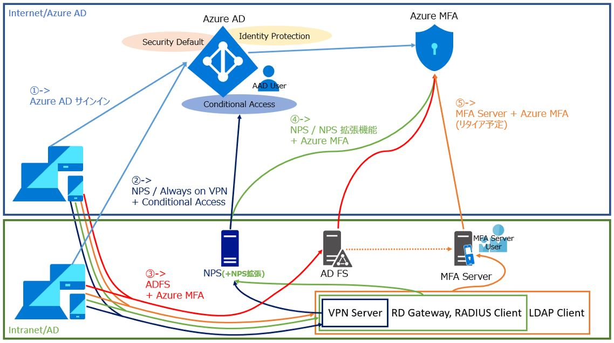

# Azure MFA 導入パターンを網羅的にご紹介！

こんにちは。Azure Identity チームの金森です。

弊社をはじめ、セキュリティに対する新しい考え方が次々と公開されており、おそらく [ユーザー名とパスワードだけで認証は安全！] とは考えない方がほとんどになってきたものと思います。
最近の弊社の考え方をご紹介する以下のような Blog の内容も、弊社に限らず広まってきたように感じます。

[ゼロ ハイプ](https://jpazureid.github.io/blog/azure-active-directory/zero-hype/)

[レガシー認証をブロックするための新しいツール](https://jpazureid.github.io/blog/azure-active-directory/new-tools-to-block-legacy-auth/)

また、リモート ワークを安全に実現したい！というご要望が高まっている昨今の状況に呼応した以下のような Blog も公開しておりますので、ぜひこちらもご参照ください。

[安全なリモート アクセスを実現するための条件付きアクセスに関するよくある質問](https://jpazureid.github.io/blog/azure-active-directory/faq-using-ca-to-secure-remote-access/)

セキュリティを高める方法は様々ですが、おそらく持っていない人を探す方が大変と思われる携帯電話/スマホを使って実現できる MFA / 多要素認証の導入が最もご検討いただきやすいのではないでしょうか。
今回は、Azure MFA サービスを利用した MFA の実現方法について、2023 年 5 月時点の情報を元に以下の観点でご紹介いたします！

1. **Azure MFA サービスを利用するためのライセンス**
2. **Azure MFA サービスを利用する際の構成要素の考え方**
3. **Azure MFA サービスの利用パターン**

なお、本記事では以下の主旨でご案内を進めていきますので、前提としてご認識ください。

* MS アカウント (MSA) は Azure MFA サービスを用いた MFA ではないため本記事の対象外です。
* プライマリ認証 (通常はユーザー名/パスワード) に対する追加の認証方式としての MFA (多要素認証) を本記事の対象とします。
* プライマリ認証をパスワードレスの認証方式 (Authenticator アプリを使用、もしくは FIDO2 キーを使用) にする考え方は、本記事では主旨が別になるため扱いません。

パスワードレスの認証方式については [Azure Active Directory のパスワードレス認証オプション](https://learn.microsoft.com/ja-jp/azure/active-directory/authentication/concept-authentication-passwordless) をご参照ください。

***

# 1. Azure MFA サービスを利用するためのライセンス

Azure MFA サービスを利用するために、MFA を利用するユーザー毎に必要なライセンスは、技術情報としても公開されていますが、シンプルにまとめると以下のような考え方になります。

上から下に向かって利用できる利用可能な機能は追加されていきます。例えば Security Defaults は Azure AD Premium を付与されている場合にも利用できます。

ただし、Security Defaults については、条件付きアクセス ポリシーを構成している環境では有効にすることはできないことにはご注意ください。

[Azure Multi-Factor Authentication の機能とライセンス](https://learn.microsoft.com/ja-jp/azure/active-directory/authentication/concept-mfa-licensing)

|ライセンスの種類|利用可能な MFA 機能|カスタマイズ性|
|:-----------|:------------|:------------|
|Azure AD Free (MFA 用のライセンス不要)|Security Defaults|×|
|すべての Microsoft 365 プラン|ユーザーごとの MFA (per User MFA)|△|
|Azure AD Premium P1 (EMS E3 or Microsoft 365 E3 含む)|条件付きアクセス、他 (ヒント)|○|
|Azure AD Premium P2 (EMS E5 or Microsoft 365 E5 含む)|リスクベースの条件付きアクセス	|○|
> [!TIP]
> 他に NPS 拡張や Always on VPN、ADFS サーバーとの連携、MFA Server との連携もご利用シナリオがあります。

例外的な対象は以下の通りです。
- AAD テナントの全体管理者の権限を持つユーザーは、MFA 用のライセンスが無い場合も Authenticator 以外の MFA 方法 (SMS or 電話) がご利用可能です。
- Microsoft 365 Business Premium ライセンスは、Azure AD Premium P1 と同等の条件付きアクセスの機能が利用できます。
[ビジネス向け Microsoft 365 を使用してデータをセキュリティで保護する](https://learn.microsoft.com/ja-jp/microsoft-365/business-premium/secure-your-business-data?view=o365-worldwide#1-use-multi-factor-authentication)

それぞれの機能ごとのカスタマイズ性や (すべてではありませんが) 機能を利用するうえでのシナリオ例をまとめたものが以下となります。

|対象機能|カスタマイズ性の詳細|選択シナリオ例|
|:-----------|:------------|:------------|
|Security Defaults|<Li>テナントに対する機能の有効/無効のみが設定できる <Li>機能の有効/無効以外の設定はできない (ユーザー毎、アクセス先などで条件を変える等) <Li>すべての AAD ユーザーが MFA の方法をセットアップする必要がある <Li>MFA の方法として Authenticator アプリでの通知のみが利用できる (SMS や音声電話は利用不可) <Li>特定の特権ユーザー (管理者ロールを保持) には、サインイン時に MFA が求められる <Li>一般ユーザーに対しても "必要に応じて" サインイン時に MFA が求められる 　(一般ユーザーがサインイン時に MFA を求められる条件 (どんなサインインが危険とみなされるか) は非公開) <Li>レガシ認証 (Outlook 2010 や POP/IMAP/SMTP など) はブロックされる <Li>Azure の管理用での接続である Azure PowerShell, Azure CLI, Azure ポータルへのサインインは MFA が求められる ※ 条件付きアクセス ポリシーと本機能は共存不可。条件付きアクセス ポリシーを作成すると本機能は利用できなくなる|<Li>カスタマイズ性はなくても無料で MFA を使いたい！とお考えの方 (ただし、一般ユーザーについては必ずしも MFA が求められるわけではないことはご注意を) <Li>ある程度のセキュリティが実現できれば良い、とお考えの方|
|ユーザーごとの MFA (per User MFA)|<Li>AAD ユーザー毎に MFA の有効/無効の設定ができる <Li>最終的にアクセスしたいサービスは問わず、AAD へのサインインすべてが評価対象となる <Li>MFA が必要 (有効) とされたユーザーのみが MFA の方法をセットアップする必要がある <Li>MFA の方法として、Authenticator だけではなく電話 (SMS/音声) や OATH トークンも利用可能 <Li>[どの MFA の認証方法をセットアップ可能とするか] という制限もテナント全体で可能 <Li>[信頼できる IP] を登録し、その IP からの認証時には MFA をスキップさせる設定が可能 <Li>[MFA の記憶] 機能で、一度 MFA をすると指定した日数は MFA を求めないようにすることが可能 <Li>アプリケーション パスワード (レガシ認証で MFA 要求をスキップするための専用パスワード) を利用可能|<Li>Office 365 のライセンスをお持ちの方 <Li>ユーザーによって MFA の有効/無効を制御したいとお考えの方 <Li>グループ単位やアクセスしたいサービス毎に MFA の有効/無効は制御しなくても良いとお考えの方|
|条件付きアクセス|<Li>AAD ユーザー毎だけではなく、グループ毎でも MFA の有効/無効の設定ができる <Li>最終的にアクセスしたいサービス毎に MFA の有効/無効の設定ができる <Li>接続元クライアントの OS の種類、IP (場所) なども条件として指定することができる <Li>MFA を求める以外の制御 (ブロックやデバイス認証が必要、など) を指定することができる <Li>Azure MFA ポータルのオプション機能を利用することができる <Li>アプリケーション パスワードは利用できない (レガシはスルーで認証する、という設定は可能だが非推奨)|<Li>グループ単位で MFA の有効/無効を制御したいとお考えの方 <Li>アクセスしたいサービス毎に MFA の有効/無効を制御したいとお考えの方 <Li>MFA が必要、という制御以外にブロックなど他の制御も条件に応じて実現されたい方 <Li>接続元デバイス (\*) の条件毎に MFA の有効/無効を制御したいとお考えの方 　(\*) Hybrid Azure AD Join 済みデバイス、Intune ポリシー準拠済みデバイス|
|リスクベースの条件付きアクセス|<Li>すべてのユーザーに MFA の方法のセットアップを求めることができる 　(MFA 認証ではなく "MFA が求められた場合の方法" のセットアップを求めることができる) <Li>サインインのリスクが中以上と判定されたユーザーに対して MFA を求めることができる| <Li>危険なサインインが疑わしい場合に動的に MFA を求めたいとお考えの方|

Security Defaults の詳細は [Azure AD のセキュリティの既定値群](https://learn.microsoft.com/ja-jp/azure/active-directory/fundamentals/concept-fundamentals-security-defaults) をご参照ください。

ユーザーごとの MFA (per User MFA) の詳細は [ユーザーごとの Azure AD Multi-Factor Authentication を有効にしてサインイン イベントのセキュリティを確保する](https://learn.microsoft.com/ja-jp/azure/active-directory/authentication/howto-mfa-mfasettings) をご参照ください。

> [!WARNING]
> ユーザーごとの MFA (per User MFA) は上記の技術情報に記載の通り、"いつ MFA を求めさせるか" を柔軟に評価することができる条件付きアクセスや Security Defaults がご利用いただける環境では、融通が利かない点もあり、非推奨となります。

Azure MFA ポータルや条件付きアクセスで利用可能な MFA のオプション機能の詳細は [Azure Multi-Factor Authentication の設定を構成する](https://learn.microsoft.com/ja-jp/azure/active-directory/authentication/howto-mfa-mfasettings) をご参照ください。

条件付きアクセスの詳細は以下をご参照ください。

[条件付きアクセスとは](https://learn.microsoft.com/ja-jp/azure/active-directory/conditional-access/overview)

[チュートリアル:Azure Multi-Factor Authentication を使用してユーザーのサインイン イベントのセキュリティを確保する](https://learn.microsoft.com/ja-jp/azure/active-directory/authentication/tutorial-enable-azure-mfa)

[条件付きアクセスの基本的な考え方](https://jpazureid.github.io/blog/azure-active-directory/conditional-access-basic/)

[Azure AD の条件付きアクセスに関する Q&A](https://jpazureid.github.io/blog/azure-active-directory/qanda-conditional-access/)

[条件付きアクセス:リスクベースの条件付きアクセス](https://learn.microsoft.com/ja-jp/azure/active-directory/conditional-access/howto-conditional-access-policy-risk)

***

# 2. Azure MFA サービスを利用する際の構成要素の考え方

Azure MFA サービスをご利用いただくにあたって、MFA を実現するための構成要素を以下のように捉えていただくと分かりやすいかもしれません。

|構成要素|設定対象|説明|
|:-----------|:------------|:------------|
|Who|MFA を必要とさせるユーザー|誰に対して MFA を必要とするか|
|When|MFA を必要とさせるきっかけ|いつ MFA を求めさせるか|
|How|SMS やモバイル アプリ等 MFA の実行方法|どのような方法で MFA を実行するか|

上記 3 つの要素が揃って、初めてあるユーザーのサインイン時に MFA が求められるようになります。
各機能毎のそれぞれの要素に対する考え方をまずは以下におまとめします。

|対象機能|Who|When|How|
|:-----------|:------------|:------------|:------------|
|Security Defaults (設定変更不可)|<Li>特定の特権ユーザー<Li>MFA を求める "必要がある" 一般ユーザー<Li>Azure 管理機能を利用するユーザー|<Li>特定の特権ユーザーの AAD への認証要求時<Li>"必要がある" 一般ユーザーの AAD への認証要求時<Li>Azure PowerShell, CLI, ポータルへの認証要求時|**Authenticator アプリの通知/確認コード ※ テナントの全体管理者ユーザーは他の方法も利用可能**|
|ユーザーごとの MFA (per User MFA)|<Li>MFA を有効にしているユーザー|<Li>AAD への認証要求時|音声電話、SMS、Authenticator アプリの通知/確認コード、OATH トークン|
|条件付きアクセス|<Li>作成したポリシーの評価条件に該当するユーザー 　(条件は柔軟に指定可能)|<Li>作成したポリシーの評価条件に該当する AAD への認証要求時|音声電話、SMS、Authenticator アプリの通知/確認コード、OATH トークン|
|リスクベースの条件付きアクセス|<Li>サインインのリスクが中以上と判定されたユーザー|<Li>サインインのリスクが中以上と判定された AAD への認証要求時|音声電話、SMS、Authenticator アプリの通知/確認コード、OATH トークン|

Who と When はご利用になる各機能にて設定/提供されます。 
How (MFA の実行方法) は、各機能ではなく [AAD ユーザー] 自身が保持する設定値になります。 
そのため、ご利用になる機能が変わっても、仮に MFA を求める機能を使用しない場合も [How : MFA の実行方法] は AAD ユーザー毎に保持することが可能です。

各 AAD ユーザーは自身の [How : MFA の実行方法] のセットアップを以下のタイミングで実行することが可能です。

* 各機能から MFA の実行が求められるタイミングで、該当ユーザーの How がまだ未構成の場合
* MFA の実行方法をセットアップするサイトを利用する

後者の [MFA 方法のセットアップ サイト] の URL は https://aka.ms/mysecurityinfo です。
こちらにユーザーが、自身の Azure AD ユーザーとしてサインインすることで、現在設定済みの MFA 方法の確認や、新規 MFA 方法の登録、登録済み MFA 方法の削除等が行えます。

> [!WARNING]
> 無料版もしくは試用版の AAD テナントをご利用の方は、MFA の方法として音声電話 (Voice) はご利用いただけません。
> SMS はご利用いただけますが、試そうとしたら [選択肢に音声電話が無い！] という状況になった際には、無料/試用版の AAD テナントではご利用いただけないのが適切な状態ですのでご留意ください。

***

# 3. Azure MFA サービスの利用パターン

ここまでのご案内は基本的に [クライアントから AAD へのサインイン時に Azure MFA サービスで MFA を求める] ことを前提としていました。
しかし、Azure MFA はオンプレミスの他の認証システムとも連携することが可能です！
つまり [Azure MFA サービスに話しかけているのが、クライアント端末ではなく何らかのサーバー] になるようなパターンです。

それではざっくりとご利用いただける Azure MFA サービスの利用パターンを見てみましょう。

それぞれのパターンごとに以下にご紹介いたします。
たくさんあって大変。。。という印象もあるかもしれませんが、[どんな認証システムをご利用になっているか/なりたいか] が先にあるかと思いますので、そのご要件に沿って Azure MFA と連携できるかご検討ください。

## ① クライアントから AAD へのサインイン
こちらのパターンはこれまでご紹介した機能が対象となります。

## ② NPS Server への Always on VPN 認証時
こちらは、Windows 10 クライアントに対して Always On VPN を構成した際のオプションとして条件付きアクセスと連携して MFA 認証を求めるシナリオになります。

[チュートリアル: Always On VPN を展開する - Always On VPN のインフラストラクチャを設定する](https://learn.microsoft.com/ja-jp/Windows-server/remote/remote-access/tutorial-aovpn-deploy-setup)
-> Always On VPN 機能の概要です。

[Azure AD を使用した VPN 接続への条件付きアクセス](https://learn.microsoft.com/ja-jp/Windows-server/remote//remote-access/how-to-aovpn-conditional-access)
-> Always On VPN 機能をご利用になる際に、条件付きアクセスの機能と連携させることで MFA 認証を求める設定の手順です。

## ③ ADFS へのフェデレーション認証時
こちらは、ADFS へのフェデレーション認証時に [ADFS サーバーが直接 Azure MFA サービスと連携] することで、MFA 認証を求めるシナリオになります。
主なポイントは以下の通りです。

* ADFS サーバーは Windows Server 2016 以降の必要がある
* AAD ユーザーの How : MFA 方法のセットアップが事前に完了している必要がある
* ADFS におけるプライマリ認証、セカンダリ認証のどちらに対しても [Azure MFA サービスでの MFA 認証] を、認証方法として指定することができる
* Windows Server 2016 では、プライマリ認証方法として Azure MFA を使用すると Authenticator のみが利用可能

[AD FS を使用して Azure AD 多要素認証を認証プロバイダーとして構成する](https://learn.microsoft.com/ja-jp/windows-server/identity/ad-fs/operations/configure-ad-fs-and-azure-mfa)
-> 構成手順はこちらの情報をご参照ください。

## ④ NPS Server への RADIUS 認証時
こちらは、NPS Server に [NPS 拡張] 機能をインストールし、RADIUS 認証要求を NPS Server にて受け付けた際に MFA 認証を求めるシナリオになります。
主なポイントは以下の通りです。

* NPS Server に [NPS 拡張] 機能を追加でインストールする必要がある
* AAD ユーザーの How : MFA 方法のセットアップが事前に完了している必要がある
* AAD ユーザーは、オンプレミス AD から Azure AD Connect (AADC) で同期されている必要がある
* RADIUS 構成におけるパスワードの暗号化方式によって、利用可能な MFA 方法が異なる
　(PAP の場合はすべての MFA 方法が利用可能、CHAPv2 と EAP の場合は音声電話と Authenticator アプリの通知の2種類が利用可能)

[Azure AD Multi-Factor Authentication と既存のネットワーク ポリシー サーバー (NPS) インフラストラクチャの統合](https://learn.microsoft.com/ja-jp/azure/active-directory/authentication/howto-mfa-nps-extension)
-> 構成手順はこちらの情報をご参照ください。

## ⑤ (2024 年 9 月リタイア予定) オンプレミスに MFA Server を導入
こちらは、Windows Server に [MFA Server] の機能をインストールし、複数のオンプレミスの認証システムと連携して Azure MFA サービスへのプロキシを行い、MFA 認証を求めるシナリオになります。
以下のような認証システムと連携することが可能です。

* ADFS サーバー (③ は ADFS サーバーが直接 Azure MFA サービスと連携しますが、ADFS が MFA 連携先として MFA Server を利用することも可能です)
* LDAP 認証、Active Directory 認証 (クライアントからの LDAP 認証要求を受け取るプロキシとして動作)
* RADIUS 認証 (④ とは違い、RADIUS 認証要求を受け取るプロキシとして動作し、"≒ NPS サーバー" の立ち位置になる)
* IIS 認証
* Windows 認証

MFA Server 自身が MFA 認証処理を行っているのではなく、ある認証システムと Azure MFA サーバー間の橋渡し、MFA 認証要求のプロキシを行うような立ち位置となっています。

[Azure Multi-Factor Authentication Server の概要](https://learn.microsoft.com/ja-jp/azure/active-directory/authentication/howto-mfaserver-deploy)

> [!WARNING]
> MFA Server は **2019 年 7 月 1 日以降にご利用を開始された AAD テナントではすでにご利用いただけなくなっています**。
> また、上記技術情報にも記載がある通り、2024 年 9 月 30 日にリタイアが予定されています。
> 今後はクラウドである Azure MFA サービスに集約されている流れとなっているため、新規に MFA の実現を検討されるお客様は、①～④ のシナリオをご検討いただくことになります。
> 現在 MFA Server をご利用のお客様は、以下の技術情報もご参照ください。
> [MFA Server から Azure AD Multi-Factor Authentication に移行する](https://learn.microsoft.com/ja-jp/azure/active-directory/authentication/how-to-migrate-mfa-server-to-azure-mfa)

***

いかがでしたでしょうか。

上記内容が Azure MFA サービスのご利用をご検討いただくに際して皆様の参考となりますと幸いです。どちら様も素敵な AAD ライフをお過ごしください！

ご不明な点等がありましたら、ぜひ弊社サポート サービスをご利用ください。

