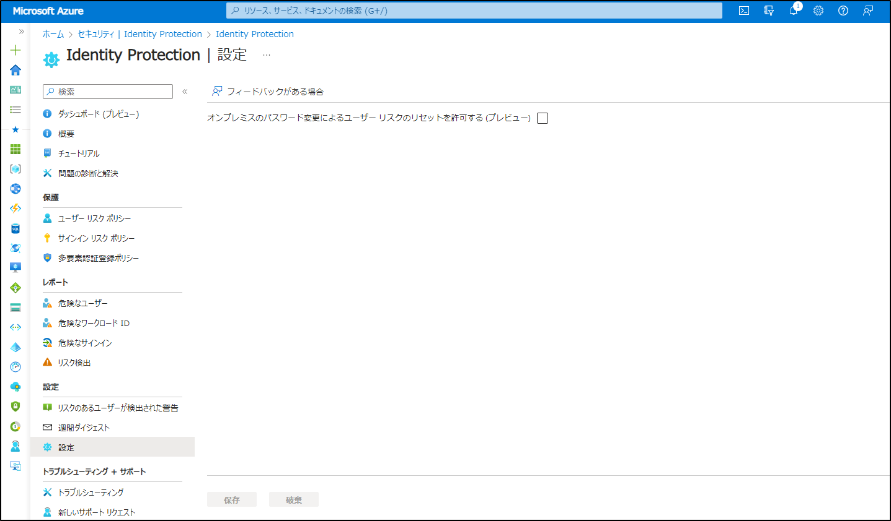

# オンプレミスのパスワード変更で Microsoft Entra ID Protection のユーザー リスクを修復する

こんにちは、Azure Identity サポート チームの 竜 です。

本記事は、2023 年 9 月 28 日に米国の Azure Active Directory Identity Blog で公開された [Remediate User Risks in Microsoft Entra ID Protection Through On-premises Password Changes](https://techcommunity.microsoft.com/t5/microsoft-entra-azure-ad-blog/remediate-user-risks-in-microsoft-entra-id-protection-through-on/ba-p/3773129) を意訳したものになります。

----

ユーザー リスクに基づいてゼロ トラストの考えのもとセキュリティ侵害を防止することが、今日のデジタル環境において大変重要です。しかし、ハイブリッド環境におけるユーザー リスクの管理には、いくつもの課題がありました。この度、ハイブリッド環境におけるユーザー リスクの管理をより容易にするべく、Microsoft Entra ID Protection (旧 Azure AD Identity Protection) において、**オンプレミスのパスワード変更によりユーザー リスクを修復できる** ようになりました。

これまで、Microsoft Entra ID のパスワード保護機能を活用するために、Microsoft としては Microsoft Entra ID でパスワード変更を管理することを推奨していましたが、一方でこれにより、オンプレミスでパスワード変更を行うハイブリッド環境をご利用のお客様にとっては、ユーザー リスク ポリシーを有効化しづらい状況がありました。というのも、オンプレミスでパスワード変更を行っても Microsoft Entra ID Protection に反映されなかったため、リスクによりユーザーがブロックされた場合にオンプレミスでパスワード リセットしてもリスクをクリアできず、ユーザー自身で自己修復することができない状況でした。オンプレミスでのパスワード変更によりリスク修復ができない結果、リスクがある (リスクが修復されていない) と判断されるユーザーが増えていくため、一部のお客様では Microsoft Entra ID Protection によるリスク検出を利用することや、ハイブリッド環境のテナントを保護するためにリスク ベースのポリシーを活用することが難しい状況でした。

この課題を解決するため、Microsoft Entra ID Protection に「オンプレミスのパスワード変更によるユーザー リスクのリセットを許可する」 という新しい機能を導入しました。テナントでパスワード ハッシュ同期を有効にしているお客様は、この機能を有効化することができます。本機能を有効化すると、パスワードがオンプレミスで変更された場合に、ユーザーのリスクが自動的に修復されるようになります。このため、お客様はユーザー リスク ポリシーを導入し、ハイブリッドのユーザーを効果的に保護することができます。

本機能によるセキュリティの向上により、お客様は 2 つの主要な利点を享受いただけます:

- 効率的な修復: 本機能により、管理者による手動での操作を必要とせず、リスクの高いハイブリッド ユーザーは効率的に自己修復を行うことができるようになり、管理者の負担が軽減されます。オンプレミスでパスワードが変更されると、ユーザーのリスクは Entra ID Protection 内で自動的に修復され、ユーザーを安全な状態に戻すことができます。
- プロアクティブなセキュリティ: ハイブリッド環境とユーザーを確実に保護するために、組織はパスワードの変更を要求するユーザー リスク ポリシーをプロアクティブに導入できるようになりました。このプロアクティブなアプローチにより、アクセス制御ポリシーによるセキュリティ管理を簡素化させつつ、複雑なハイブリッド環境であってもユーザー リスクに迅速に対処できるようになり、より組織のセキュリティ体制を強化することができます。

今すぐ [Identity Protection - Microsoft Entra 管理センター](https://entra.microsoft.com/#view/Microsoft_AAD_IAM/IdentityProtectionMenuBlade/~/OverviewNew) で 「オンプレミスのパスワード変更によるユーザー リスクのリセットを許可する」設定を有効化ください。詳細については、[リスクを修復してユーザーをブロック解除する](https://learn.microsoft.com/ja-jp/azure/active-directory/identity-protection/howto-identity-protection-remediate-unblock) もご覧ください。
 
弊社は、最善のセキュリティ ソリューションを提供するために、サービスの継続的な改善に取り組んでいます。今後とも Microsoft Entra ID Protection をよろしくお願いいたします。

Stay safe out there,  
Alex Weinert (@Alex_T_Weinert)   
VP Director of Identity Security, Microsoft     
