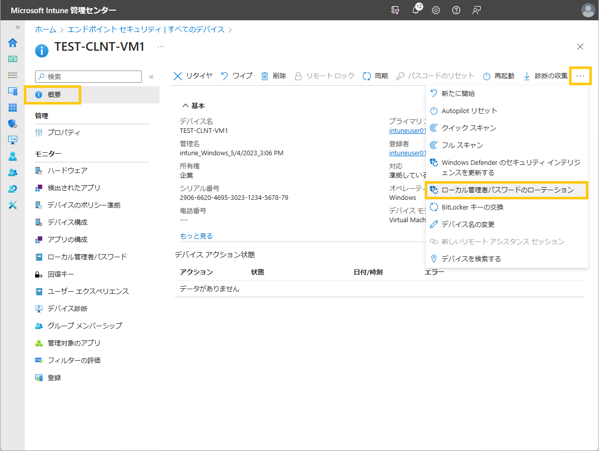

こんにちは、Azure Identity サポート チームの 名取 です。

本記事は、2023 年 10 月 23 日に米国の Azure Active Directory Identity Blog で公開された [Solution with Microsoft Entra ID now Generally Available!](https://techcommunity.microsoft.com/t5/microsoft-entra-azure-ad-blog/windows-local-administrator-password-solution-with-microsoft/ba-p/3911999) を意訳したものになります。ご不明点等ございましたらサポート チームまでお問い合わせください。

---

本日、Microsoft Entra ID と [Microsoft Intune](https://learn.microsoft.com/ja-jp/mem/intune/protect/windows-laps-overview) を使用した [Windows Local Administrator Password Solution (LAPS)](https://learn.microsoft.com/ja-jp/entra/identity/devices/howto-manage-local-admin-passwords) の一般提供を発表できることを嬉しく思います。この機能は、Microsoft Entra 参加済みデバイスと Microsoft Entra ハイブリッド参加済みデバイスの両方で使用できます。これにより、すべての組織が Windows 上のローカル管理者アカウントを保護してセキュリティを確保し、[Pass-the-Hash(PtH)](https://www.microsoft.com/en-us/download/details.aspx?id=36036) およびラテラル トラバーサル型の攻撃を軽減できるようになります。

2023 年 4 月のパブリック プレビューの発表以来、数千のお客様と数百万のデバイスで Windows LAPS の展開と利用が大幅に進んでいることに、感謝申し上げたいと思います。

この機能は、2023 年 4 月 11 日以降の Windows Update がインストールされた以下の Windows OS プラットフォームで利用可能です:

- Windows 11 22H2 
- Windows 11 21H2 
- Windows 10 20H2, 21H2 and 22H2 
- Windows Server 2022 
- Windows Server 2019 

Windows LAPS のクライアント側設定を管理するには以下を使用します:

- MDM 管理された Microsoft Entra 参加/ハイブリッド参加デバイス用の [Windows LAPS 構成サービス プロバイダー (CSP)](https://learn.microsoft.com/ja-jp/windows/client-management/mdm/laps-csp)
- Microsoft Entra ハイブリッド参加デバイス用の [Windows LAPS グループ ポリシー オブジェクト (GPO)](https://learn.microsoft.com/ja-jp/windows-server/identity/laps/laps-management-policy-settings#windows-laps-group-policy)

お客様からのフィードバックに基づいて、さらに多くの機能のサポートを追加しています。現在は以下のようなことが可能です:

- **Windows LAPS を有効にする** には、テナント全体のポリシーとクライアント側のポリシーを使用します。これによりローカル管理者パスワードが Microsoft Entra ID にバックアップされます。
- **クライアント ポリシーを構成する** には Microsoft Intune ポータルを使用し、ローカル管理者のパスワード管理用にアカウント名、パスワードの有効期限、長さ、複雑さ、パスワードの手動リセットなどを設定できます。
- **パスワードを回復する** 際は、Microsoft Entra/Microsoft Intune ポータルまたは Microsoft Graph API/PSH を利用できます。
- **すべての LAPS 対応デバイスを列挙する** には、Microsoft Entra ポータルまたは Microsoft Graph API/PSH を利用できます。
- **Microsoft Entra ID のロールベースのアクセス制御 (RBAC) ポリシーを作成する** ことで、カスタム ロールと管理単位を使用してパスワード回復の権限を付与できます。
- **監査ログを確認する** ことで、Microsoft Entra ポータルまたは Microsoft Graph API/PSH 経由で、パスワードの更新および取得イベントを監視できます。
- **条件付きアクセス ポリシーを構成する** ことでパスワード回復の権限を持つディレクトリ ロールを保護できます。

今後提供予定の (ロードマップにある) 機能:

- Windows LAPS が設定された場合にローカル管理者アカウントを自動作成。
- ローカル管理者パスワードが認証に使用された場合にデバイスが Microsoft Entra ID に通知。
- デバイス所有者が自身で (セルフサービスで) ローカル管理者パスワードを必要な時間だけ回復。

いつものように、皆様からのフィードバック、ご意見、ご提案をお待ちしております！ [Microsoft Entra ID フォーラム](https://feedback.azure.com/d365community/forum/22920db1-ad25-ec11-b6e6-000d3a4f0789)でぜひ共有ください。皆様のご意見をお待ちしております。 

Sandeep Deo (@[MsftSandeep](https://twitter.com/MsftSandeep))  
Principal Product Manager  
Microsoft Identity Division
