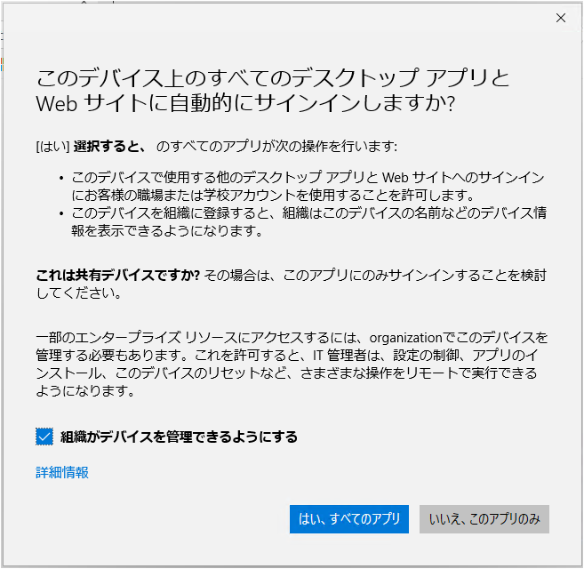
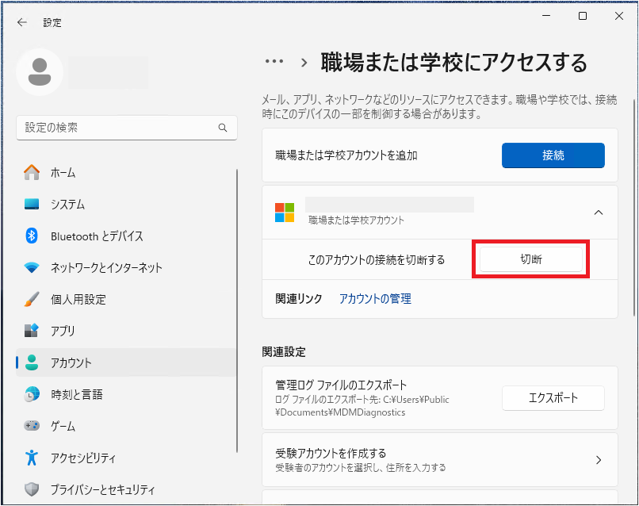
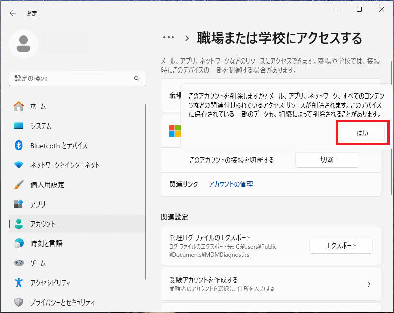
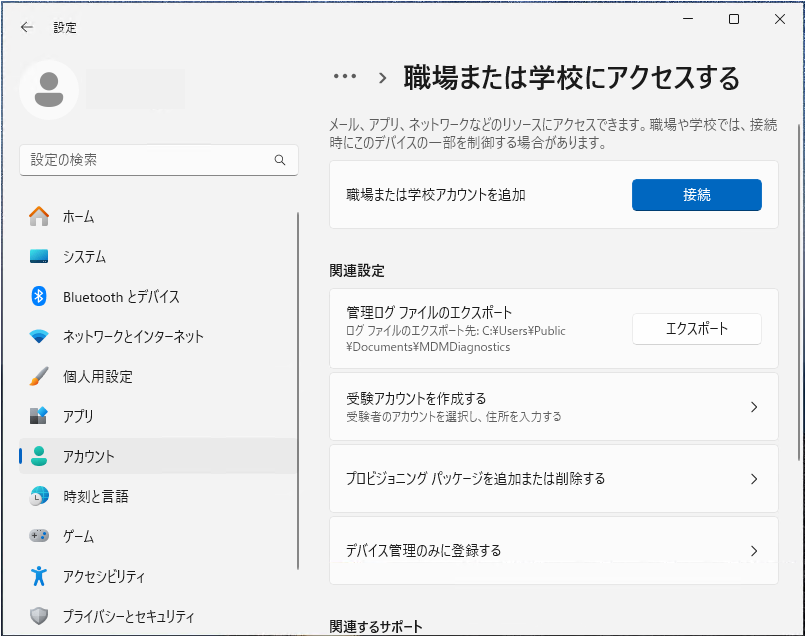

# このデバイス上のすべてのデスクトップ アプリと Web サイトに自動的にサインインしますか?

> [!NOTE]
> 本記事は 2020 年に公開した [すべてのアプリにサインインしたままにする](../azure-active-directory/WorkPlaceJoin.md) を 2025 年 5 月時点での最新の情報で再作成した記事です。

こんにちは、Azure & Identity サポート チームの長谷川です。

Windows 10 以降のデバイスで Office のライセンス認証時やサインインが求められる際に表示される下記「このデバイス上のすべてのデスクトップ アプリと Web サイトに自動的にサインインしますか?」の画面について、お問い合わせを多くいただいています。
この画面の動作および制御方法について、本記事ではお纏めいたしました。  

  
## なぜ表示されるのか？
Windows 10 の 1703 (Build 15063.138) 以後のバージョンにて Office のバージョン 16.0.7967 以後のバージョンを利用する場合、Office は Web Account Manager (WAM) と呼ばれる認証フレームワークを利用します。  

「このデバイス上のすべてのデスクトップ アプリと Web サイトに自動的にサインインしますか?」のダイアログ メッセージは、認証に WAM が使用された際、資格情報 (ID/Password) を入力してユーザー認証が終了した後、続けて Microsoft Entra ID にデバイスを登録するかどうかを確認する動作により表示されています。  (Microsoft Entra ID にデバイス登録するとシングル サインオンが利用でき利便性が向上します)

## 各選択肢の意味は？

以下の通りです。

- [はい、すべてのアプリ] : Microsoft Entra ID に [Microsoft Entra 登録] の方式でデバイスを登録 (Registered) します。

- [組織がデバイスを管理できるようにする] : このチェックボックスをチェックした状態で下段の [OK] を選択すると (Intune 利用環境の場合) Intune にもデバイスを登録します。この選択肢は Intune への自動登録の対象となっているユーザーでのみ表示されます。

- [いいえ、このアプリのみ] : Microsoft Entra ID / Intune 関わらずクラウドへのデバイス登録を行いません ([組織がデバイスを管理できるようにする] のチェックの有無は影響しません)。

希望される状態によって選択肢を変更ください。

>[!NOTE]
> Intune ライセンスを保持していないユーザーや管理者権限のないユーザーで [組織がデバイスを管理できるようにする] にチェックをいれて [OK] を選択した場合、エラー CAA50024 が発生し Intune 登録のみならず Microsoft Entra 登録も失敗します。この場合に Microsoft Entra 登録だけを実施したい場合は、 [組織がデバイスを管理できるようにする] のチェックを外して [OK] を選択します。

## 「このデバイス上のすべてのデスクトップ アプリと Web サイトに自動的にサインインしますか?」の画面を表示させたくない場合

Windows 10 1803 以降であればレジストリを追加することで制御することが可能です。

### 表示させなくするレジストリ

 レジストリ キーパス : HKEY_LOCAL_MACHINE\SOFTWARE\Policies\Microsoft\Windows\WorkplaceJoin
 レジストリ名 : BlockAADWorkplaceJoin
 形式 : DWORD
 値 : 00000001

### 上記レジストリをグループ ポリシーで配布する方法

上述の BlockAADWorkplaceJoin レジストリ値を 0x1 として設定するグループポリシーに関して、下記の手順をご紹介いたします。

1. グループ ポリシーの管理画面より対象クライアント コンピューターに適用させる前提の GPO の編集画面を表示します。
2. 以下のポリシーを展開します。
　--コンピューターの構成  
　----基本設定  
　------Windows の設定  
　--------レジストリ
3. 上記 [レジストリ] を右クリックし [新規作成] - [レジストリ項目] を選択します。
4. 下記のように設定を追加します。
  アクション : 更新  
  ハイブ : HKEY_LOCAL_MACHINE  
  キーのパス : SOFTWARE\Policies\Microsoft\Windows\WorkplaceJoin  
  値の名前 : BlockAADWorkplaceJoin  
  値の種類 : REG_DWORD  
  値のデータ : 00000001  
   
上記の設定をポリシーで配布することでクライアントに目的のレジストリ値が反映するかご確認いただけますと幸いです。
 
### Windows 10 1803 で上記レジストリを利用する際の注意事項
Windows 10 のバージョン 1809 以降の場合、上記のレジストリ キー値を設定し、再起動することで Microsoft Entra 登録状態にならない様に構成することが可能です。

Windows 10 1803 では上述のレジストリ設定に加え、下記の更新プログラムの適用が必要です。
仮に既に KB4489894 以降の更新プログラムを適用している場合、レジストリの設定、および再起動のみでご要望を満たすことが可能です。

<対象の更新プログラム>  
  March 19, 2019 - KB4489894 (OS Build 17134.677) 
  <https://support.microsoft.com/en-us/help/4489894/windows-10-update-kb4489894> 

### その他、上記レジストリ利用にあたる注意事項

このレジストリを適用した場合、「このデバイス上のすべてのデスクトップ アプリと Web サイトに自動的にサインインしますか?」の画面が表示されなくなることに加え、そのデバイスでの Microsoft Entra 登録自体が「エラー コード: CAA50101」でブロックされ実施できなくなります。
  
## すでに意図せず Microsoft Entra 登録してしまった場合の切断方法

1. 通常クライアント PC を利用するユーザーで Windows にログオンします。  

2. [スタート] - [設定] (歯車のマーク) - [アカウント] - [職場または学校にアクセスする] を開きます。  

3. 以下のように、[職場または学校アカウント] のエントリが存在する場合、エントリを選択し、[切断] をクリックします。  
   

4. ポップアップが表示されますので、[はい] をクリックします。 
   

5. 職場または学校にアクセスするの画面にて"職場または学校アカウント" の情報が消えれば、削除が完了します。
  

## よくご質問いただく内容  

### **Q. 登録済みのデバイスを Azure ポータルから管理者の操作のみで切断可能か？**  

**A.**　Microsoft Entra ID 上からデバイスの削除を行うことは可能ですが、対象のデバイスで上述の切断方法を実施しない場合には下記の問題が発生します。
そのため、デバイス側で手動で切断を実施するようにしてください。
エラーコード 700003 の対処策について  
https://jpazureid.github.io/blog/azure-active-directory/what-to-do-errorcode-700003/  
  
  
### **Q. Microsoft Entra ID にデバイスが登録されたまま放置しても問題ないか？** 

**A.**　デバイスの管理方法の変更が組織で行われない限り、特別問題が生じることはありません。
組織にてデバイスの管理を Microsoft Entra ハイブリッド参加構成に変更を行った場合に、Microsoft Entra 登録 と Microsoft Entra ハイブリッド参加の状態の 2 つのデバイスが Microsoft Entra ID に重複登録されてしまう可能性があります。  
構成変更をする場合には、予め下記をご参照ください。  
  
Microsoft Entra 登録済み状態のデバイスの処理
https://learn.microsoft.com/ja-jp/azure/active-directory/devices/hybrid-azuread-join-plan#handling-devices-with-azure-ad-registered-state

  
### **Q. 「このデバイス上のすべてのデスクトップ アプリと Web サイトに自動的にサインインしますか?」のメッセージはどのタイミングで表示されるのか？**  

**A.**　上述させていただきましたとおり、Office 365 インストール時や Teams 、Outlook などの Office 製品での認証時に表示されます。  
その他には Edge ブラウザーへサインインする際や、Azure Virtual Desktop に接続する際に利用される Windows 用リモート デスクトップ クライアントでのサインイン時にも表示されます。
つまり、WAM を認証ブローカーとして使用するアプリで (WAM を用いた) サインインを行った際に表示されます。
  
  
### **Q. 「このデバイス上のすべてのデスクトップ アプリと Web サイトに自動的にサインインしますか?」のメッセージを非表示にするように制御した場合の影響は?**  

**A.**　WAM による Microsoft Entra ID へのデバイス登録が行われなくなるだけで、Windows 10 以降のデバイス 、Office 製品、Microsoft Entra ID の利用上に制限や問題となるような影響は特にありません。  

### **Q. Microsoft Entra ID でのデバイス管理方法について**  

**A.**　本記事のメッセージを契機に Microsoft Entra ID でのデバイス管理方法についてご質問を多くいただきます。  
弊社製品開発チームにて開催させていただいている Webinar にてご紹介させていただいておりますので、参考にしていただければ幸いです。  
https://github.com/yusukekodama/PMActivities/blob/master/Webinar/Schedule.md
  
関連する回としては下記となります。  
- COVID-19 でリモート対応に成功した企業と失敗した企業の違いとは？  
- Azure AD の新しいデバイス管理パターンを理解しよう  
- Intune によるモバイルデバイスとアプリのセキュアな管理とは  
