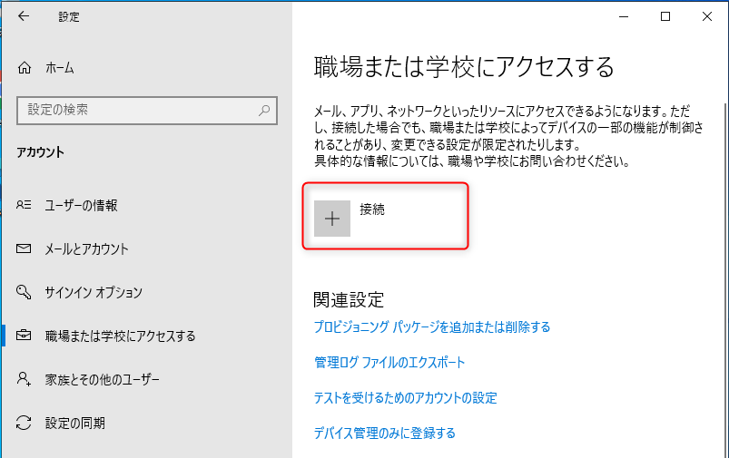
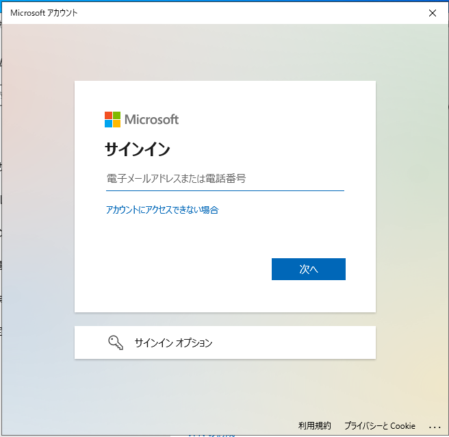
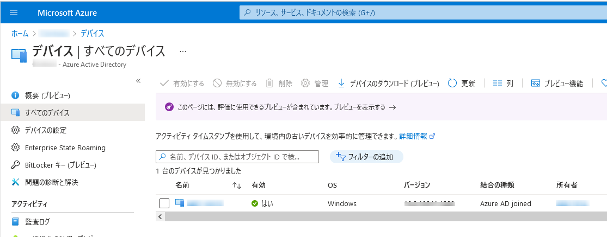

# このデバイスを Azure Active Directory に参加させる のリンクが表示されない場合の確認点

こんにちは。 Azure Identity サポート チームです。

こちらのブログでは、手動で Azure AD 参加を構成する際に利用する [このデバイスを Azure Active Directory に参加させる] のリンクが表示されない場合の確認点について紹介します。
<!-- more -->

## どんな事象？
Azure AD 参加を手動で構成する場合は、Windows 10 にて [スタート] > [設定] > [アカウント] > [職場または学校にアクセスする] の [接続] をクリックし、次の画面にて [このデバイスを Azure Active Directory に参加させる] のリンクから参加させます。

しかし、次の画像のように [このデバイスを Azure Active Directory に参加させる] のリンクが表示されない場合があります。

この事象について、本記事にて説明します。

## 確認点
 
[このデバイスを Azure Active Directory に参加させる] のリンクが表示されないケースの確認点として、以下のようなパターンが考えられます。
これらの条件を満たしているか確認してください。
 

### 1. Windows に対して、管理者権限を保持していないユーザーとしてログオンしている
   - ローカルの Administrators グループに所属しておらず、端末に対して管理者権限を保持していないユーザーとして Windows にログオンしている場合、[このデバイスを Azure Active Directory に参加させる] が表示されません。
   - 操作時に Windows にログオンしているユーザーが、ローカルの管理者権限を保持しているかご確認ください。

### 2. Azure AD への通信が行えない
   - Azure AD への通信が行えない状態の場合、[このデバイスを Azure Active Directory に参加させる] が表示されません。
   - 「Azure AD への通信が行えない状態」とは、Azure AD の認証時に利用されるエンドポイントにインターネット経由でアクセスができない状態です。
   - 次の公開情報  [Office 365 URL および IP アドレス範囲 - Microsoft 365 Common および Office Online](https://docs.microsoft.com/ja-jp/microsoft-365/enterprise/urls-and-ip-address-ranges?view=o365-worldwide#microsoft-365-common-and-office-online) の項番 56, 59, 125 の宛先が Azure AD の認証に利用されるエンドポイントです。
   - 項番 125 の宛先は厳密には Azure AD が提供するエンドポイントではございませんが、 [Azure AD が提示しうるサーバー証明書の失効確認先] のエンドポイントとなり、アクセスできるよう構成ください。
   - インターネットへのアクセスにプロキシを利用しているネットワーク環境の場合、クライアント端末が適切にプロキシ参照設定を行っているか、参照しているプロキシにて必要なエンドポイントへの通信をブロックしていないかに関してもご確認ください。なお、WinINet (インターネット オプション) のプロキシ設定と WinHTTP のプロキシ設定のどちらのプロキシ設定においても上記宛先へ通信できるように設定ください。
WinINet (インターネット オプション) のプロキシ設定方法は [Windows でプロキシ サーバーを使用する](https://support.microsoft.com/ja-jp/windows/windows-%E3%81%A7%E3%83%97%E3%83%AD%E3%82%AD%E3%82%B7-%E3%82%B5%E3%83%BC%E3%83%90%E3%83%BC%E3%82%92%E4%BD%BF%E7%94%A8%E3%81%99%E3%82%8B-03096c53-0554-4ffe-b6ab-8b1deee8dae1) の記事を参考にしてください。 WinHTTP のプロキシ設定方法は [弊社ブログ内の netsh winhttp の箇所](../../azure-active-directory/troubleshoot-hybrid-azure-ad-join-managed.md#1-3-HAADJ-%E3%81%AB%E5%BF%85%E8%A6%81%E3%81%AA-Azure-AD-%E3%81%AE%E3%82%A8%E3%83%B3%E3%83%89%E3%83%9D%E3%82%A4%E3%83%B3%E3%83%88%E3%81%B8%E3%82%A2%E3%82%AF%E3%82%BB%E3%82%B9%E3%81%A7%E3%81%8D%E3%81%A6%E3%81%84%E3%81%AA%E3%81%84) を参考ください。

### 3. Windows が Home エディションである
   - もしご利用の端末が Windows Home エディションの場合、[このデバイスを Azure Active Directory に参加させる] が表示されません。
   - Professional もしくは Enterprise エディションをご利用ください。

### 4. Windows に built-in administrator ユーザーとしてログオンしている
   - もし端末のローカル ユーザーである Administrator (built-in administrator) として Windows にログオンしている場合、[このデバイスを Azure Active Directory に参加させる] は表示されません。(既定ではこのユーザーは無効状態です)
   - 運用上の都合で built-in administrator ユーザーとして Windows にログオンしている場合、別の "ローカルの管理者権限を持つ ローカル ユーザー” として Windows にログオンしてください。
   - 次の公開情報 [エラー情報が表示されなかったにもかかわらず、PC を Azure AD に参加させることができなかったのはなぜですか?](https://docs.microsoft.com/ja-jp/azure/active-directory/devices/faq#----------------------pc---azure-ad-----------------------) にも案内があります。

### 5. Windows 端末がすでにオンプレミスの AD に参加している
   - もし該当の Windows 端末が、すでにオンプレミスの AD に参加している場合、[このデバイスを Azure Active Directory に参加させる]  は表示されません。
   - Azure AD 参加 は Azure AD に対してのみ直接参加する機能となるため、Azure AD 参加をする際はオンプレミス AD から離脱し、ワークグループの状態で実施ください。
   - もし、オンプレミス AD と Azure AD の両方に対して参加されたい場合は、Hybrid Azure AD 参加の構成をご検討ください。
   - 参考情報: [ハイブリッド Azure AD 参加済みデバイス](https://docs.microsoft.com/ja-jp/azure/active-directory/devices/concept-azure-ad-join-hybrid)
    , [方法:Hybrid Azure Active Directory 参加の実装を計画する](https://docs.microsoft.com/ja-jp/azure/active-directory/devices/hybrid-azuread-join-plan)

## 補足  :  手動で Azure AD 参加を構成する手順

前提となります、手動で Azure AD 参加を構成する手順は次の通りです。

Windows にて、[スタート] > [設定] > [アカウント] > [職場または学校にアクセスする] にて [接続] をクリック。

[このデバイスを Azure Active Directory に参加させる] をクリック。

サインインが要求されますのでサインインします。

次の画面にて [参加する] をクリックすることでデバイスを Azure AD に参加させることができます。

次の画面が表示され Azure AD への参加が完了します。

このタイミングで Azure AD (Azure ポータル) 上でも該当のデバイスが Azure AD joind として登録されます。

以上の情報がご参考になれば幸いです。
ご不明な点がございましたら弊社サポートまでお気軽にお寄せください。
