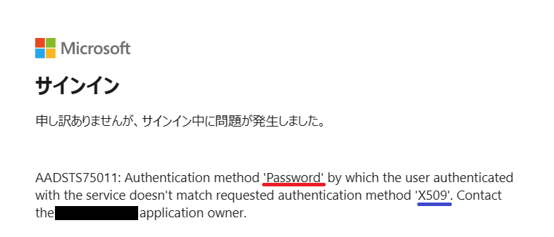

こんにちは、Azure Identity サポート チームの沓澤です。

SAML 連携をしているアプリケーション (SP) にサインインをしようとした際に、AADSTS75011 エラーが生じるというお問い合わせを定期的にいただきます。

AADSTS75011 エラーの画面を Microsoft Entra ID が提供しているものの、AADSTS75011 エラーを根本的に回避したい場合には SP 側での対処が必要です。

本記事では AADSTS75011 エラーの原因と SP 側での対処案について説明します。

AADSTS75011 エラーについてまとめられた以下の公開情報を基に説明します。

[エラー - サービスで認証されたユーザーが要求された認証方法 AuthnContextClassRef と一致しない AADSTS75011 認証方法](https://learn.microsoft.com/ja-jp/troubleshoot/azure/active-directory/error-code-aadsts75011-auth-method-mismatch)

## AADSTS75011 エラーの発生原因

SP で指定された AuthnContext と、サインインを試行したユーザーの AuthnContext が異なる場合に AADSTS75011 エラーが発生します (AuthnContext: 認証方法)。

例をあげると、SP が機密情報にアクセスするようなアプリケーションであるために証明書ベースの認証を期待しているものの、サインインを試行したユーザーがパスワード ベースでの認証を完了している場合にこのエラーが発生します (下図参照)。

赤線部分にユーザーが実際に使用した認証方法が記載され、青線部分が SP が期待する認証方法が記載されています。

他 SP へのサインイン時にパスワード ベースの認証をして SSO を完了させた場合に、この証明書ベースの認証を期待する SP にサインインをするときには対話的な認証が生じずに、パスワード ベースでの認証が済んでいるという状態で非対話的にサインインを試行する動作をします。

> [!NOTE]
> 証明書ベースの認証として判定される例としては、以下のような認証方法を使用した場合です
> - Microsoft Entra CBA
> - AD FS での証明書認証
> - Windows Hello for Business を使用した PRT での認証
> - Microsoft Authenticator を使用したパスワードレス認証

### AADSTS75011 エラーが生じるタイミング

AADSTS75011 エラーの根本的対処には SP 側での対処が必要であるため、お客様には根本的対処の可否について SP 側へのお問い合わせ等を検討いただいております。

SP 側へお問い合わせをいただく際により詳細な情報が必要というお客様も多くいらっしゃいましたので、本記事では SAML プロトコルのシーケンスと合わせ、AADSTS75011 エラーが生じるタイミングについて説明します。

下図は SAML プロトコルのシーケンスです。

AADSTS75011 エラーが生じるタイミングは、上図の 4 と 5 の間です。
そのため、エラーが生じるまでの流れを説明します。

1. `User` が `Service Provider` (`SP`) にアクセスします。
2. `SP` はユーザーを認証するために Microsoft Entra ID にリダイレクトするよう `User` に指示します (SP によって Microsoft Entra ID へのリダイレクトが行われるきっかけは異なります)。
このとき SP は SAML リクエストを含むリダイレクト先 URL を生成します (https://login.microsoftonline.com/<tenantid>/saml2?SAMLRequest=xxx)。
**この SAML リクエストの中に [RequestedAuthnContext](https://learn.microsoft.com/ja-jp/azure/active-directory/develop/single-sign-on-saml-protocol#requestedauthncontext) 要素が含まれています。**
RequestedAuthnContext 要素は、SP がユーザーに対して要求する認証方法を指定するための要素です。
つまり、ここで証明書ベースの認証を指定したりなどの認証方法の指定ができます。
1. `User` のブラウザーを通して、2. で `SP` が指示したリダイレクト先 (Microsoft Entra ID) にリクエストが生じます。
2. サインインを試行するユーザーの認証状況を確認します。Microsoft Entra ID で認証済みの場合は通常は 5 への進みます。
ただ、SAML リクエストの中に RequestedAuthnContext が含まれる際には、直近で使用した認証方法を確認します。
**このとき、直近で使用した認証方法 (`User` が使用した認証方法) と RequestedAuthnContext で指定された認証方法 (`SP` が指定した認証方法) とが異なる場合に AADSTS75011 エラーが発生します。**

SP 側で認証方法を指定するのが先であり、Microsoft Entra ID 側で認証方法の一致を判定するのが後です。

そのため、根本対処としては SP 側での対処が必要であるエラーではあるものの、Microsoft Entra ID 側でエラー画面を表示されます。

## SP 側での AADSTS75011 エラーの対処案について

対処案としては以下 2 つです。
- SAML リクエスト内の "RequestedAuthnContext" 要素 を省略する
- SAML リクエスト内の "RequestedAuthnContext" 要素を Unspecified に変更する
- SAML リクエスト内の "ForceAuthn" 要素を true に変更する

それぞれ説明します。

### SAML リクエスト内の "RequestedAuthnContext" 要素を省略する

SAML リクエストは前項の通り、一般的にはアプリケーション側で生成されます。

そのため、SAML リクエストの変更可否についてもアプリケーション観点での調査が必要です。

アプリケーションによっては管理画面から "RequestedAuthnContext" 要素の省略を設定できるものもあります。

参考 (外部サイト): [SAML シングルサインオン | Slack](https://slack.com/intl/ja-jp/help/articles/203772216-SAML-%E3%82%B7%E3%83%B3%E3%82%B0%E3%83%AB%E3%82%B5%E3%82%A4%E3%83%B3%E3%82%AA%E3%83%B3#enterprise-grid-%E3%83%97%E3%83%A9%E3%83%B3-1)

> 10. SAML のレスポンスとアサーションに署名するかどうかを選択します。お使いの IDP で End to End Encryption (E2EE) キー が必要な場合には、「AuthnRequest に署名する」の横にあるチェックボックスを選択して、証明書を表示します。「AuthnContextClassRef」の値も環境に応じて設定できます。

AuthnContextClassRef は RequestedAuthnContext 要素内で定義する要素です。

SP の管理者または利用者からの "RequestedAuthnContext" 要素の変更可否についてはアプリケーション側へのお問い合わせ等をご検討ください。

#### ▼ 省略すべきかの判断について

判断についてはお客様での最終判断が必要です。

ただ、よくお問い合わせで見かけるパターンとして、SP 側が認証強度が弱い認証方法を指定している状況で、ユーザーが認証強度が SP 側が指定する認証方法よりも高い認証方法を使用したためにエラーが生じるというケースが多く見られます。

具体的に例を挙げると、 SP 側でパスワード ベースの認証方法を指定しているものの、ユーザーが証明書ベースの認証を使用している場合です。
一般的にパスワード ベースの認証よりも証明書ベースの認証の方が認証強度が高いとされています。

認証強度が高い認証方法を使用中のユーザーをブロックする理由がなければ、"RequestedAuthnContext" の省略について前向きに検討いただくのが良いかと存じます。

### SAML リクエスト内の "RequestedAuthnContext" 要素を Unspecified に変更する

もし SAML リクエスト内の "RequestedAuthnContext" 要素を省略できない場合は、"RequestedAuthnContext" 要素を Unspecified に設定します。
これにより、Entra ID はユーザーが使用した任意の認証方法を受け入れられるようになり、AADSTS75011 エラーを回避できます。

### SAML リクエスト内の "ForceAuthn" 要素を true に変更する

SAML リクエスト内に [ForceAuthn](https://learn.microsoft.com/ja-jp/azure/active-directory/develop/single-sign-on-saml-protocol#authnrequest) 要素を含め、その値を true とすることで、SP にサインインする度に認証が要求されます。

認証が要求されましたら、SP が期待するの認証方法で認証を実行ください。

SAML リクエスト内に ForceAuthn 要素を true として指定できるかどうかについては、RequestedAuthnContext の変更可否同様に、アプリケーション側へお問い合わせ等をご検討ください。

また、上述のとおり、SP にサインインする都度、対話的な認証が要求されることが想定動作であるため、ユーザーの利便性を考慮した上でのご検討をお願いいたします。

## おわりに
本記事では AADSTS75011 エラーの原因と SP 側での対処案について主に説明しました。

現時点では認証方法の不一致が原因で AADSTS75011 エラーが発生した場合、Microsoft Entra ID 観点で実施できる対処策がないため、上記情報を参考に対処策を検討いただけますと幸いです。
