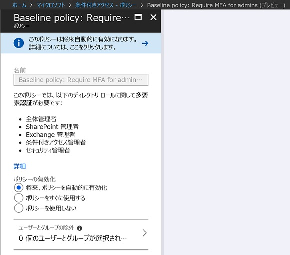

> 本記事は Technet Blog の更新停止に伴い https://blogs.technet.microsoft.com/jpazureid/2018/08/06/about-baseline-policy-require-mfa-for-admins/ の内容を移行したものです。
> 元の記事の最新の更新情報については、本内容をご参照ください。

# ”Baseline policy: Require MFA for admins” について

こんにちは、Azure ID チームの宮林です。
今回は下記のとおり、6/22 より Public Preview となった "Baseline policy: Require MFA for admins" についてお知らせいたします。

- Baseline security policy for Azure AD admin accounts in public preview!
    - https://cloudblogs.microsoft.com/enterprisemobility/2018/06/22/baseline-security-policy-for-azure-ad-admin-accounts-in-public-preview/
- ベースラインの保護とは (プレビュー)
    - https://docs.microsoft.com/ja-jp/azure/active-directory/active-directory-conditional-access-baseline-protection

(こちらが対象のポリシーとなります)

> "Baseline policy: Require MFA for admins" とは
> "Baseline policy: Require MFA for admins" は、特権ロールを持つアカウントに対して多要素認証 (MFA : Multi Factor Authentication) を必要とさせるポリシーです。将来的にすべての Azure Active Directory テナントにおいて、既定で有効となるポリシーです。有効化に際して別途、課金が発生することはございません。
> 対象となる特権ロールは以下の 5 つのロールを持つアカウントとなり、下記 5 つのロール以外のユーザーにはこのポリシーは適用されず、影響はありません。
>
> - 全体管理者
> - SharePoint 管理者
> - Exchange 管理者
> - 条件付きアクセス管理者
> - セキュリティ管理者

現時点において "Baseline policy: Require MFA for admins(プレビュー)" の状態は、既定で [将来、ポリシーを自動的に有効化] です。

このポリシーが有効になる時期については、ブログ執筆時において皆様にご案内できる情報がありませんが、有効になる時期について情報更新がありましたら、本ブログについても更新を予定しています。

## [自動的に有効化] する設定の無効化について

このポリシーを将来、自動的に有効にしたくない場合には、該当のポリシーを今のうちから無効にしてください。以下の手順でポリシーを無効、あるいは、ポリシー自体は有効としておきつつも、特定の管理者のみを除外することが可能です。

1. Azure ポータル (https://portal.azure.com/) にログイン
2. [Azure Active Directory] – [条件付きアクセス] – [Baseline policy: Require MFA for admins (プレビュー)] を選択
3. [ポリシーを使用しない] もしくは、[ユーザーとグループの除外]より除外するユーザーを選択

運用のご要件上、"Baseline policy: Require MFA for admins" を無効にする場合にも、改めてこのポリシーを有効にすることについては是非ご検討ください。なぜなら、昨今 ID に対する攻撃が大変に増加傾向にあり、この脅威への対策の必要性が高まっているからです。以下の参考ページでは、ID に対する代表的な攻撃手法の 1 つであるパスワードスプレーの説明と、その防衛策について紹介しています。

[Azure AD と AD FS のベスト プラクティス: パスワード スプレー攻撃の防御](./password-sprey-attack.md)

Azure Active Directory において、特権ロールのアカウントが悪意のあるユーザーに乗っ取られることは、大きな被害を生む可能性を孕んでいます。パスワード スプレーのような脅威から ID を守り、Azure Active Directory の認証基盤としての安全性を高めるためには、多要素認証が非常に効果的です。そのため、弊社では "Baseline policy: Require MFA for admins" の有効化を推奨しております。

また、現時点から [ポリシーをすぐに使用する] に設定を変更することで、本ポリシーの機能をご利用いただくことも可能です。

セキュリティと利便性は相反することが多く、どちらかのメリットを得ることで反対のデメリットが生じる場合もございますが、リスクの可能性が現実となった際の影響の大きさも考慮の上、ぜひ導入をご検討いただければと存じます。
ご不明な点がございましたら弊社サポートまでお気軽にお問い合わせください。

上記内容が少しでも皆様の参考となりますと幸いです。
※本情報の内容（添付文書、リンク先などを含む）は、作成日時点でのものであり、予告なく変更される場合があります。
