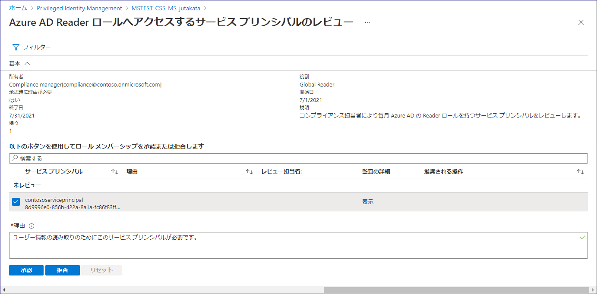

# サービス プリンシパルに対する Azure AD アクセス レビューの紹介

こんにちは、Azure Identity サポート チームの中井です。

本記事は、2021 年 6 月 10 日に米国の Azure Active Directory Identity Blog で公開された [Introducing Azure AD access reviews for service principals](https://techcommunity.microsoft.com/t5/azure-active-directory-identity/introducing-azure-ad-access-reviews-for-service-principals/ba-p/1942488) を意訳したものになります。ご不明点等ございましたらサポート チームまでお問い合わせください。

----

皆さん、こんにちは！

より多くのアプリケーションやサービスがクラウドに移行する中で、これらのワークロードで使用される ID を主体的に管理し、その方法を改善していく必要性が高まっています。本日、Azure AD のサービス プリンシパルに対するアクセス レビューのパブリック プレビューを発表いたします。多くのお客様では、ユーザー アカウントのアクセスを管理するために Azure AD のアクセス レビューをすでにご利用いただいておりますが、この機能をサービス プリンシパルやアプリケーションにも拡張してほしいという要望をいただいておりました。

今回のパブリック プレビューでは、Azure AD の特権ディレクトリ ロールが割り当てられているサービス プリンシパルやアプリケーションのレビューを要求することができます。さらに、サービス プリンシパルが割り当てられている Azure サブスクリプションのロールのレビューを作成することも可能となります。これにより、サービス プリンシパルに必要なロールのみが割り当てられていることを定期的に確認し、環境のセキュリティの改善に役立てることができます。

テナントや Azure サブスクリプションのサービス プリンシパルに対するアクセス レビューの設定は簡単です。アクセス レビューの作成時に "サービス プリンシパル" を選択すれば、あとは他のアクセスレビューと同様の手順です。

この新しい Azure AD の機能を Azure ポータルにて設定するには、以下の手順で行います。

1. Azure Active Directory > Identity Governance に移動します。
2. Azure AD ロール または Azure リソース を選択し、続いてリソース名を選択します。
3. アクセス レビューの項目において、新しいアクセス レビューを作成します。
4. **スコープ** を **サービス プリンシパル** に設定します。

選択されたレビュアーには、Azure ポータルからのアクセスのレビューを依頼するメールが届きます。

また、MS Graph API や ARM (Azure Resource Manager) API を用いて、Azure AD ロールや Azure リソース ロールにそれぞれに対し、このアクセス レビューを作成することもできます。この機能の詳細につきましては、[Azure AD ロール](https://docs.microsoft.com/ja-jp/azure/active-directory/privileged-identity-management/pim-how-to-start-security-review?toc=/azure/active-directory/governance/toc.json)のレビューや、[Azure リソース ロール](https://docs.microsoft.com/ja-jp/azure/active-directory/privileged-identity-management/pim-resource-roles-start-access-review?toc=/azure/active-directory/governance/toc.json) の割り当てに関するドキュメントをご覧ください。

今後様々なワークロードに対して ID の関連機能を拡張していく中で、本プレビュー機能を利用してお客様よりフィードバックを収集し、これらの機能を GA するにあたっての最適な方法を模索していく予定です。