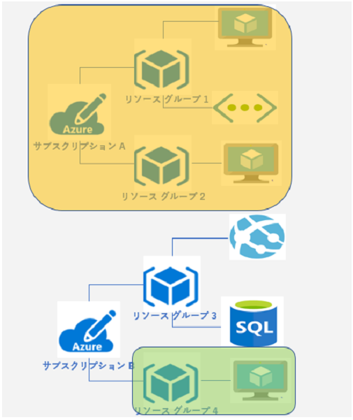
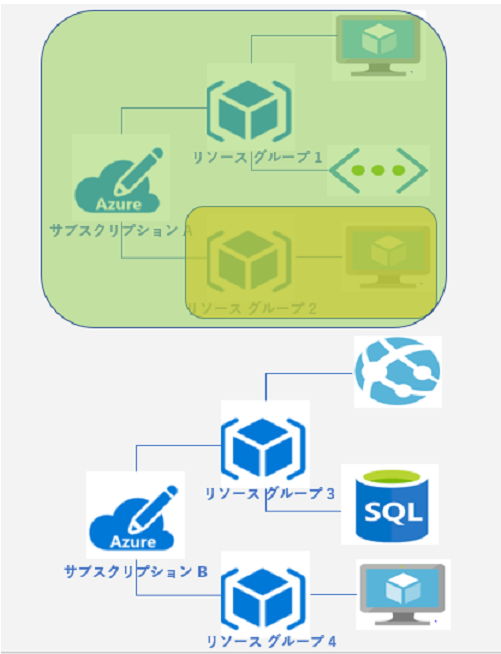
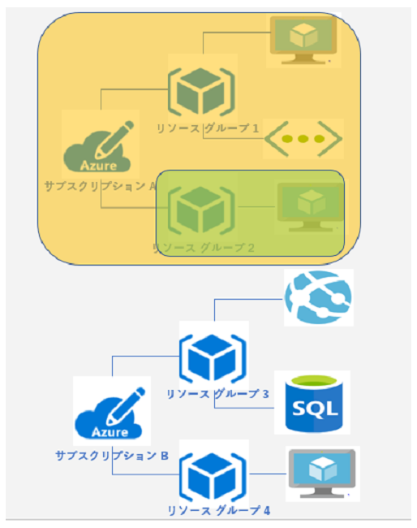
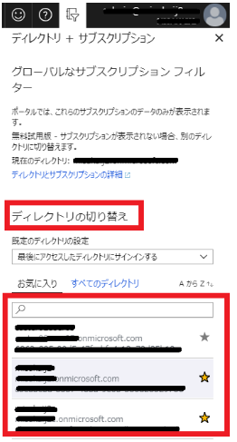

> 本記事は Technet Blog の更新停止に伴い https://blogs.technet.microsoft.com/jpazureid/2018/08/09/about-rbac/ の内容を移行したものです。
> 元の記事の最新の更新情報については、本内容をご参照ください。

# RBAC のスコープについて

こんにちは、Azure & Identity サポート チームの坂井です。

今回は ロールベースのアクセス制御 (RBAC) について紹介します。Azure の各種リソースに対するアクセス制御 (IAM) とも呼ばれ、リソースに対して実行できること、そのユーザーがアクセスできる領域を管理するのに役立ちます。

RBAC の設定ポイントとしては、3 つあります。

- セキュリティ プリンシパル

    権限を付与する対象を表します。ユーザー、グループ、サービス プリンシパルに設定可能です

- ロール (権限) 定義

    組み込みロールやカスタム ロールから、付与したい権限の種類を決定します

- Scope (スコープ)

    権限が適用される範囲を決定します (サブスクリプション > リソース グループ > リソース)

サブスクリプション全体に対して権限を付与すると、リソース グループ、リソースへと権限が継承されます。ここからは "スコープ" について具体例をもとに、紹介します。

## シナリオ 1: サブスクリプション単位

- **設定内容**: サブスクリプション A には「所有者」権限、サブスクリプション B には権限の付与なし
- **設定結果**: ユーザーは、サブスクリプション A のすべての操作が可能ですが、サブスクリプション B を参照することもできない
- **設定手順**: [サブスクリプション] - [サブスクリプション A ] - [アクセス制御 (IAM) ] より 「＋追加」

## シナリオ 2: リソース グループ単位

- **設定内容**: リソース グループ 1 には「所有者」権限、リソース グループ 2 には権限の付与なし
- **設定結果**: ユーザーは、リソース グループ  1  配下のすべての操作が可能ですが、リソース グループ 2 を参照することもできません。 また、新しいリソース グループの作成など、サブスクリプションのスコープで操作が必要な操作はできない
- **設定手順**: [リソース グループ] - [リソース グループ 1 ] - [アクセス制御 (IAM) ] より 「＋追加」

## シナリオ 3 : リソース単位

- **設定内容**: リソース a には「所有者」権限、その他権限の付与なし
- **設定結果**: ユーザーは、リソース a のすべての操作が可能ですが、その他リソースの参照や操作はできない
- **設定手順**: [リソース グループ 1 ] - [リソース a ] - [アクセス制御 (IAM) ] より 「＋追加」

## シナリオ 4 : 別スコープで、別の権限を付与

- **設定内容**: サブスクリプション A には「所有者」権限、サブスクリプション B のリソース グループ 4 に「閲覧者」の権限を付与
- **設定結果**: ユーザーは、サブスクリプション A のすべての操作が可能です。サブスクリプション B については、リソース グループ 4 の閲覧 (つまり参照) のみ可能です。 このシナリオは、RBAC の設定がひとつのユーザーやグループ オブジェクトに対して、複数のスコープや異なった権限を付与することが可能であることを示す
- **設定手順**: [サブスクリプション] - [サブスクリプション A ] - [アクセス制御 (IAM) ] より 「＋追加」で役割を「所有者」で選択、もしくは [リソース グループ] - [リソース グループ 4 ] - [アクセス制御 (IAM) ] より 「＋追加」で役割を「閲覧者」で選択

## シナリオ 5 : 親スコープからの継承

- **設定内容**: サブスクリプション A には「閲覧者」権限、リソース グループ 2 に「所有者」の権限を付与
- **設定結果**: ユーザーは、サブスクリプション A のすべての参照が可能かつ、リソース グループ 2 配下において、すべての操作が可能 
- **設定手順**: [サブスクリプション] - [サブスクリプション A ] - [アクセス制御 (IAM) ] より 「＋追加」で役割を「閲覧者」で選択、もしくは [リソース グループ] - [リソース グループ 2 ] - [アクセス制御 (IAM) ] より 「＋追加」で役割を「所有者」で選択

## 補足

サブスクリプションとリソース グループに与える権限を逆にして、サブスクリプション A には「所有者」権限、リソース グループ 2 に「閲覧者」を付与した場合は、リソース グループ 2 に対しても、より強力な「所有者」の権限が継承されます。

各サブスクリプションが紐づく Azure AD が異なる場合について

今回のシナリオはすべて、サブスクリプション A と サブスクリプション B が同じ Azure AD に紐づいている前提です。もし、サブスクリプション A - Azure AD 1、サブスクリプション B - Azure AD 2 というようにそれぞれのサブスクリプションが別の Azure AD に紐づいている場合は、設定やリソースを操作するためにはディレクトリの切り替えを実施する必要があります。

また、サブスクリプションの権限と Azure AD の権限は異なりますので、サブスクリプションに対して「所有者」の権限を付与しても、Azure AD 上のユーザー作成・削除、パスワード変更などの管理者操作が行えるわけではありませんので、その点ご注意ください。こちらについては、リンクのブログでも紹介しておりますので、合わせてご参照ください。

上記内容が少しでも皆様の参考となりますと幸いです。
