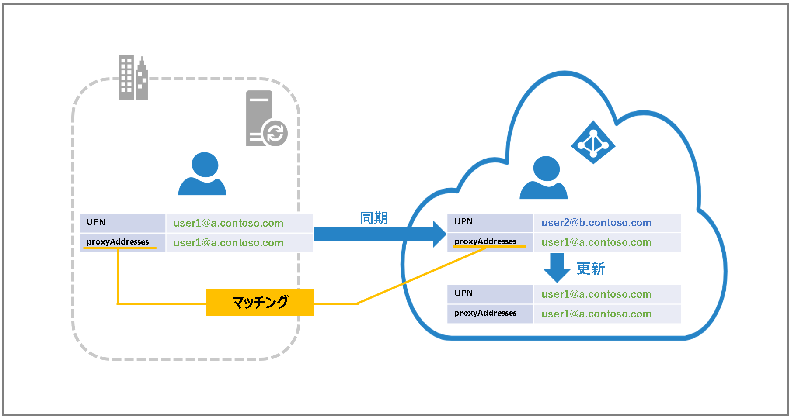

# ソフトマッチによるAzure AD (Office 365) 上のユーザーをオンプレミス Active Directory ユーザーと紐付ける方法

こんにちは、Azure & Identity サポート チームの菊池です。

Azure AD 上のユーザーをオンプレミス Active Drectory ユーザーと紐づける方法として、ハードマッチとソフトマッチと呼ばれる方法があります。
今回はソフトマッチについてご紹介します。

## ソフトマッチとは ?

ソフトマッチとは、Azure AD 上のユーザーとオンプレミス AD 上のユーザーを proxyAddresses または UserPrincipalName (UPN) で紐づけて、同期させる手法のことをいいます。基本的にはユーザーを紐づける必要がある場合には、ソフトマッチを利用することを推奨します。
ソフトマッチができない場合にはハードマッチと呼ばれる方法で直接的に同期時にオブジェクトの一意性を確保するソースアンカーと呼ばれる ID 情報 (ImmutableID) を紐づけます。ハードマッチによる同期をおこなう手順については[ハードマッチによる同期ユーザーの切り替え方法](https://jpazureid.github.io/blog/azure-active-directory-connect/aadc_hardmatch/)をご参照ください。

ハードマッチの例：

ソフトマッチする前と後の例：

## マッチングを行うことでできることと注意点

マッチングによって、すでに利用している Azure AD 上のアカウントにオンプレミス AD 上のアカウントを紐づけることができます。そのため、オンプレミス AD 側と同じ UPN (サインイン用 ID)、パスワードで Azure AD の認証が必要なアプリケーション (Office 365 など) を利用できるようになります。一方で、マッチング後はオンプレミス AD から Azure AD へ同期が行われるため、 Azure AD 側でのユーザー情報の変更はできなくなります。また、一度ソフトマッチで同期された場合、Azure AD 側のユーザーに ImmutableID が設定され、この値は削除できないため非同期に戻すことはできません。

## マッチング順位

Azure AD Connect では、同期処理を行う際、以下の流れでオンプレミス AD 側のオブジェクトと Azure AD 側のオブジェクトのマッチングを確認します。

1. ソースアンカー (ImmutableID) の値が同じオブジェクトがあるか -> ハードマッチ
2. proxyAddresses/mail の値が同じオブジェクトがあるか -> SMTP ソフトマッチ
3. UPN の値が同じオブジェクトがあるか -> UPN ソフトマッチ

マッチするオブジェクトがある場合は、そのオブジェクトに対して同期が行われます。
マッチするオブジェクトが無い場合は、Azure AD 側に新たにオブジェクトが作成されます。

以下、SMTP と UPN でソフトマッチをする手順について説明します。

---
## ユーザーをソフトマッチする手順

### ・ SMTP ソフトマッチ

1. オンプレミス AD 側の Domain Controller で Azure AD 上のユーザーと紐づけたいオンプレミス AD のユーザーのプロパティを開き、[Attribute Editor] にある [proxyAddresses] をダブルクリックする。

2. 紐づけたい Azure AD 上のユーザーのメールアドレスと同じ値をプライマリ アドレスとして登録する。

3. 同期対象の OU にユーザーを移動する。

4. Azure AD Connect で同期する。(start-adsyncsynccycle)

5. Azure AD で、変更箇所が確認できる。ソフトマッチされた場合、[同期されたディレクトリ] が "はい" になり、ユーザーのプロファイル画面にある [ソース] が "Windows Server AD" になる。

#### ・ mail ソフトマッチ

SMTP ソフトマッチは、mail 属性でも行うことが可能です。　

1. オンプレミス AD 側のドメイン コントローラーで Azure AD 上のユーザーと紐づけたいオンプレミス AD のユーザーの [E-mail] に、Azure AD 上のユーザーのメールアドレスを設定する。

2. 同期対象の OU にユーザーを移動する。

3. Azure AD Connect で同期する。(start-adsyncsynccycle)

4. Azure AD で、変更箇所が確認できる。ソフトマッチされた場合、[同期されたディレクトリ] が "はい" になり、ユーザーのプロファイル画面にある [ソース] が "Windows Server AD" になる。

### ・ UPN ソフトマッチ
UPN ソフトマッチは、 proxyAddresses が一致しておらず、オンプレミス AD 側、Azure AD 側で同じ UPN を持つユーザーがいる場合に有効です。

1. オンプレミス AD 側のドメイン コントローラーで Azure AD 上のユーザーと紐づけたいオンプレミス AD のユーザーの UPN が同じであることを確認する。

2. 紐づけるユーザーを同期対象の OU に移動する。

3. Azure AD Connect で同期する。(start-adsyncsynccycle)

4. Azure AD で、変更箇所が確認できる。ソフトマッチされた場合、[同期されたディレクトリ] が "はい" になり、ユーザーのプロファイル画面にある [ソース] が "Windows Server AD" になる。

## シナリオ例

### パターン 1
Azure AD 上のユーザーの proxyAddresses と同じ UPN、プロキシ アドレスを持つユーザーがオンプレミス AD 上にいる場合：

Azure AD 上のユーザーの proxyAddresses とオンプレミス AD 上のユーザーの proxyAddresses でマッチングされる。

### パターン 2
Azure AD 上のユーザーと同じ UPN の値をもつ、ユーザーがオンプレミス AD 上にいる場合 (オンプレミス AD 上のユーザーは proxyAddresses を持っていない) ：

Azure AD 上のユーザーの UPN とオンプレミス AD 上のユーザーの UPN でマッチングされる。

### パターン 3
UPN と proxyAddresses の値が同じ Azure AD 上のユーザーと、そのユーザーと同じ proxyAddresses の値を持つが UPN の値は異なるオンプレミス AD 上にいるユーザーをソフトマッチする場合：

Azure AD 上のユーザーの proxyAddresses とオンプレミス AD 上のユーザーの proxyAddresses でマッチングされ、Azure AD 上の UPN の値がオンプレミス AD 上の UPN の値に変化する。

### パターン 4
UPN と proxyAddresses の値が異なる Azure AD 上のユーザーと、そのユーザーの proxyAddresses と同じ UPN と proxyAddresses の値を持つオンプレミス AD 上にいるユーザーをソフトマッチする場合：

Azure AD 上のユーザーの proxyAddresses とオンプレミス AD 上のユーザーの proxyAddresses でマッチングされ、Azure AD 上の UPN の値がオンプレミス AD 上の UPN の値に変化する。

### パターン 5
Azure AD 上のユーザーの proxyAddresses と同じ UPN、プロキシ アドレスを持つユーザーがオンプレミス AD 上にいるが、Azure AD 上のユーザーは一度すでに別のユーザーと同期済みで ImmutableID が生成されている場合：

ImmutableID が Azure AD 側のユーザーにすでに生成されているのでソフトマッチはされない。マッチングしたい場合は、ハードマッチのみが有効であるため、オンプレミス AD 側のユーザーの sourceAnchor の値を Azure AD 側のユーザーの ImmutableID の値に揃える。

## 補足
### グループオブジェクト
セキュリティグループ、配布グループ の proxyAddresses と オンプレ AD のグループ オブジェクトをマッチさせることが可能です。(※ Microsoft 365 グループはソフトマッチが行われません。) 注意点といたしまして、ソフトマッチ実施の際に、グループ オブジェクトのメンバーが Azure AD と オンプレミス AD で異なる場合は、オンプレミス AD のメンバー情報で上書きされます。

### 管理者はソフトマッチされません
オンプレミスの AD 上のユーザーと、管理ロールが割り当てられている Azure AD 上のユーザーをソフトマッチさせることはできません。そのため、ソフトマッチを行うためには、管理者ロールを一時的に外し、ソフトマッチを行ってから管理者ロールを割り当てなおします。詳しくは、[既存の管理者ロールの競合](https://docs.microsoft.com/ja-jp/azure/active-directory/hybrid/tshoot-connect-sync-errors#existing-admin-role-conflict)をご覧ください。

上記内容が少しでも皆様の参考となりますと幸いです。

