# エンタイトルメント管理におけるカスタム拡張機能の利用方法について

こんにちは！ Azure ID チームの小出です。
今回は、エンタイトルメント管理（アクセス パッケージ）の機能をより最大限活用できる、カスタム拡張機能について紹介します。

今回の記事は、アクセス パッケージを既にご利用いただいており、基本的な操作を理解いただいている方をターゲットとした、中級向けのご案内となります。
アクセス パッケージを初めて触るお客様や、これから導入を検討されているお客様などで、基本的な概要を確認されたい場合、以前公開いたしましたこちらの記事を先にご覧くださいませ。

[アクセス パッケージを利用した一括でのアクセス権の管理](https://jpazureid.github.io/blog/azure-active-directory/access-management-with-access-package/)

今回は、このカスタム拡張機能の機能を利用した操作の例をご紹介します。
次回の記事にて、ライフサイクル ワークフローとこのアクセス パッケージのカスタム拡張機能を利用した上級編シナリオのご紹介を予定しておりますので、
まずは本記事にて基本的な手順や利用方法を確認いただければと思います。


## カスタム拡張機能とは？
アクセス パッケージに対する要求・割り当て・期限が迫っている時など特定のイベントにおいて、事前に設定したカスタム タスクを実行する機能です。
アクセス パッケージを作成するときに、任意項目なのでスキップされてしまいがちですが、下記のように「カスタム拡張機能」を指定するよう構成することができます。

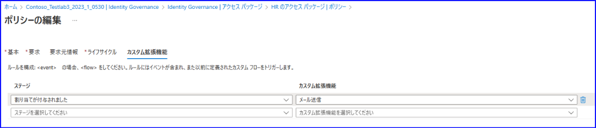

たとえば上記のスクリーンショットでは、アクセス パッケージの割り当てが行われたことをメール通知するような機能をカスタム拡張機能として指定しています。その他にもカスタム拡張機能の実行のタイミングとして以下を選択可能です。


カスタム拡張機能自体は「カタログ」内に項目があり、下記から新しい拡張機能を作成することができます。また、以下の例では PackageTask1 というロジック アプリにカスタム拡張機能を紐づけ、カスタム拡張機能が呼び出されると、このロジック アプリが実行される仕組みになっています。

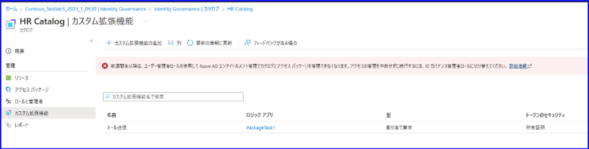

ロジック アプリを呼び出した後、具体的にどんな処理を行わせたいかは、お客様側で自由に記載することができます。
また、プログラミング スキルがなくても、下記のようなデザイナーを使って、どのような処理を行いたいかを GUI 上で構成することが可能です。

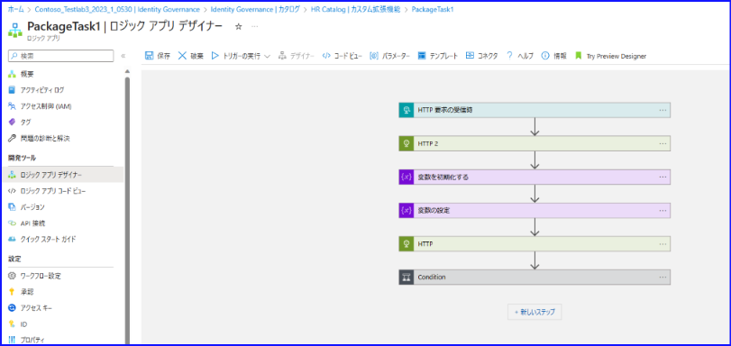

## 事前にご理解いただきたいこと
- ロジック アプリと連携するためには、事前にサブスクリプションの用意が必要です。
- ロジック アプリ側で課金が発生します。**コスト面も必ず評価したうえでご利用ください。**
- アクセス パッケージの機能については、 Microsoft Entra ID Premium P2 ライセンスが必要ですが、カスタム拡張属性も利用したい場合、**新しい Microsoft Entra ID Governance ライセンスが必要です。**
- スクリプト作成支援と同様、**ロジック アプリの具体的な記載方法などについてはサポートでは支援が難しい場合があります。** ロジック アプリの作成方法などはロジック アプリの観点で支援が可能ですが、具体的にデザイナーにどのような処理を記載すればよいのか、コードとしてどのような記載を行えばよいのかといった支援は、スクリプト代行と同等となりますため、ロジックアプリ観点、アクセス パッケージ観点の双方でもご案内が難しいことが考えられます。「ユーザーを取得したいが、利用する Graph API はどれか？」といったご質問であれば対応可能です。

可能な限りこちらのブログで機能については解説いたしておりますが、基本的には [こちらの公開情報](https://learn.microsoft.com/ja-jp/entra/id-governance/entitlement-management-logic-apps-integration)を参考いただき、まずはお客様側で実装いただけますと幸いです。


## 実際の構成例は？
アクセス パッケージを割り当てた時に追加で実施したいタスクとしては、「割り当てられたユーザーのプロパティ変更」や「割り当てられたユーザーへのメール送信」などが挙げられます。
今回は、アクセスパッケージが割り当てられたら「割り当てられたユーザーの部署（department 属性）およびExtenrionAttribute1 属性を変更する」「変更された旨と、パッケージ内のリソース リンクをユーザーにメール通知する」といった拡張機能を実装してみたいと思います。

手順は大きく分けて４つあります。

① カタログにカスタム拡張機能を追加し、ロジック アプリを作成する

② カスタム拡張機能をアクセス パッケージに紐づける

③ マネージド ID を用意し、権限を付与する

④ ロジック アプリ内でどのような操作をするか記載する


順に下記にてご案内しておりますが、手順は下記公開情報と同様になりますので、併せて参考となれば幸いです。

[エンタイトルメント管理でカスタム拡張機能を使用して Logic Apps をトリガーする](https://learn.microsoft.com/ja-jp/entra/id-governance/entitlement-management-logic-apps-integration)


### ① カタログにカスタム拡張機能を追加し、ロジック アプリを作成する

1-1. Azure ポータルにサインインし、[Azure Active Directory] - [Identity Governance] - [カタログ] - [新しいカタログ] よりカタログを作成します。名前と説明を入力し、作成してください。カタログはアクセスパッケージに含めることが出来るリソース (グループ、アプリケーション、SPO サイト) を纏めるために利用します。

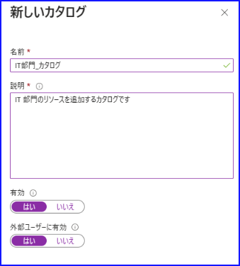

1-2. 作成したカタログについて、メニューから [カスタム拡張機能] を選択し [カスタム拡張機能の追加] をクリックします。


1-3. カスタム拡張機能に名前と説明を付けます。どのようなカスタム タスクが実行されるかを説明に記載しておくと分かりやすいです。


1-4. アクセス パッケージにこの拡張機能を紐づける時、どのようなタイミングでトリガーされるかを指定します。今回は「要求ワークフロー」を指定します。


1-5. ロジック アプリの実行中に、アクセス パッケージの割り当て処理などを一時停止するかを指定します。今回は  department 属性を正しく変更しメールが送信できたら処理を再度開始したいので、「起動して待機」を指定します。待機時間などは既定値のままですが、任意に変更できます。

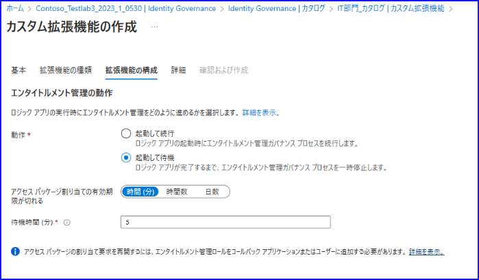

1-6. このカスタム拡張機能に紐づけるロジック アプリを作成します。サブスクリプションとリソース グループを選択し、ロジック アプリの名前を指定して、「ロジック アプリの作成」をクリックします。

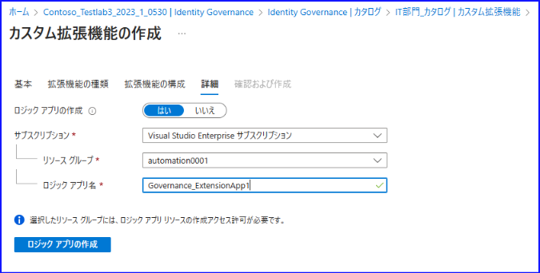

1-7. ロジック アプリのデプロイが完了するのを待機します。下記のように成功メッセージが表示されれば次へ進みます。


1-8. 最終確認画面で作成をクリックすれば完了です。

1-9. 下記のように、一覧に表示されていることを確認します。


### ②  カスタム拡張機能をアクセス パッケージに紐づける

既存のパッケージ ポリシーを開き、上記で作成したカスタム拡張機能を紐づけます。
具体的には、ポリシーの作成画面・編集画面において、ステージ（いつ実行するか）とカスタム拡張機能（何を実行するか）を指定します。
今回は、「割り当てが付与されたときに、 customextension1 というタスクを実行する」ようにしました。


### ③ マネージド ID を用意し、権限を付与する

今回のロジックアプリでは「割り当てられたユーザーの部署（department 属性）およびExtenrionAttribute1 属性を変更する」「変更された旨と、パッケージ内のリソース リンクをユーザーにメール通知する」という 2 つのタスクを Microsoft Graph API を利用して実現します。

呼び出されたロジック アプリで Graph API クエリを実行するためには、ロジック アプリ内で認証の構成を行う必要があります。
Azure AD にアプリを作成してクライアント シークレットなどを利用して認証を行うこともできますが、今回はマネージド ID を利用する方法を紹介します。

上記で作成されたロジック アプリにアクセスし、 ID を開くと、マネージド ID の状態が表示されます。既定ではオフになっています。

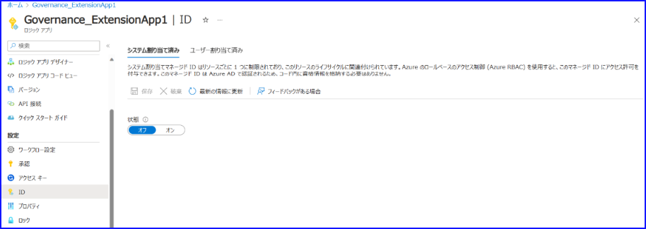

オンに変更すると、下記のメッセージが表示されるので「はい」を選択します。

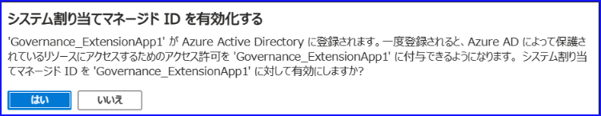


システム割り当てマネージド ID が有効化されたことを確認します。

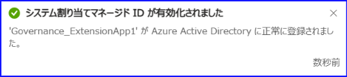


有効になると、マネージド ID のオブジェクト ID が表示されるので確認し、ID を控えます。

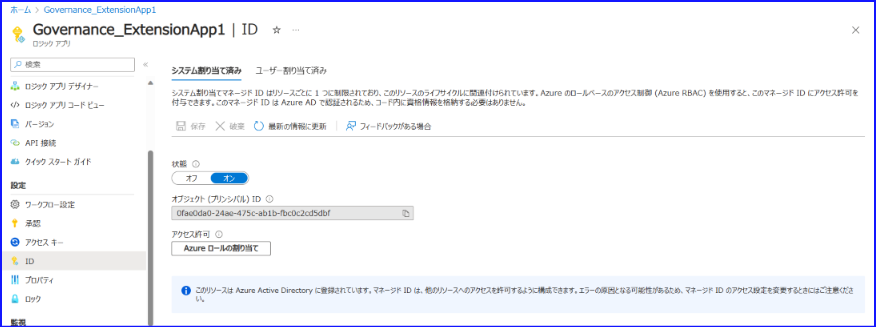

Microsoft Entra ID - [エンタープライズ アプリケーション] を開き、「アプリケーションの種類」フィルターを "マネージド ID" にしたうえで先ほどの ID を入力し、アプリがあることを確認します。


グローバル管理者の権限で PowerShell を開き、下記のコマンドを実行して マネージド ID に Graph API の権限を付与します。
実際にこのマネージド ID でどのような操作を行わせたいかによって、付与する権限は変わりますが、今回はユーザーのプロパティ更新とメールの送付をしたいので、それぞれ必要となる権限である Directory.ReadWrite.All と Mail.Send を付与するようなサンプルになっています。


```PowerShell
# グローバル管理者でサインインします。
Connect-MgGraph -Scopes "Application.Read.All" ,"AppRoleAssignment.ReadWrite.All"

$graph= Get-MgServicePrincipal -Filter "AppId eq '00000003-0000-0000-c000-000000000000'"
$directoryReadWritePermission= $graph.AppRoles | Where-Object Value -eq "Directory.ReadWrite.All"| Where-Object AllowedMemberTypes -contains 'Application' | Select-Object -First 1
$mailSendPermission = $graph.AppRoles | Where-Object Value -eq "Mail.Send" | Where-Object AllowedMemberTypes -contains 'Application' | Select-Object -First 1


# A. の手順で確認したマネージド ID の Object ID を以下の <ObjectID> 部分に代入します。
$msi= Get-MgServicePrincipal -ServicePrincipalId <ObjectID> 

New-MgServicePrincipalAppRoleAssignedTo -ServicePrincipalId $graph.Id -AppRoleId $directoryReadWritePermission.Id -ResourceId $graph.Id -PrincipalId $msi.Id
New-MgServicePrincipalAppRoleAssignedTo -ServicePrincipalId $graph.Id -AppRoleId $mailSendPermission.Id -ResourceId $graph.Id -PrincipalId $msi.Id
```

マネージド ID に権限が割り当てられると、下記のように [アクセス許可] タブに権限が表示されますので確認します。

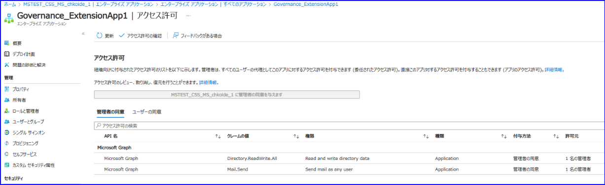

次に、ユーザー管理者ロールをマネージド ID に付与しておきます。Entra ID - ロールと管理者から「ユーザー管理者」ロールを検索します。（ユーザーの属性を編集するために本ロールが必要なためです。）

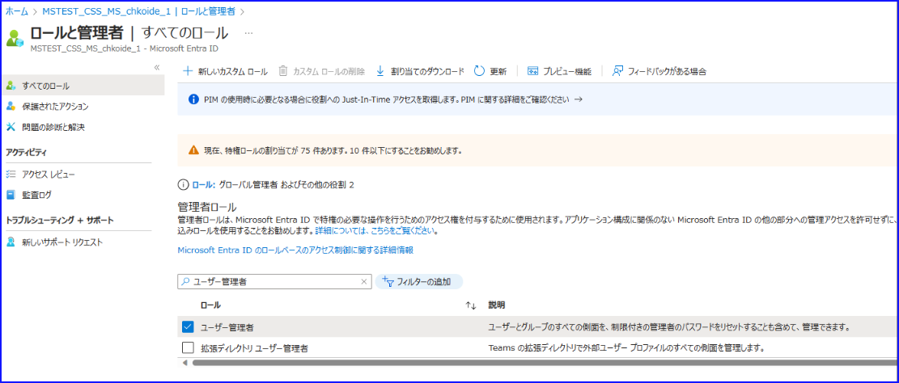

メンバーの選択の項目をクリックし、マネージド ID と同じ名前のアプリケーションを選択します。


アプリケーションのロール割り当てに関しては、アクティブな割り当てのみがサポートされています。この警告は気にせずに先に進んで問題ありません。


アクティブが選択されていることを確認のうえ、ロールを付与します。

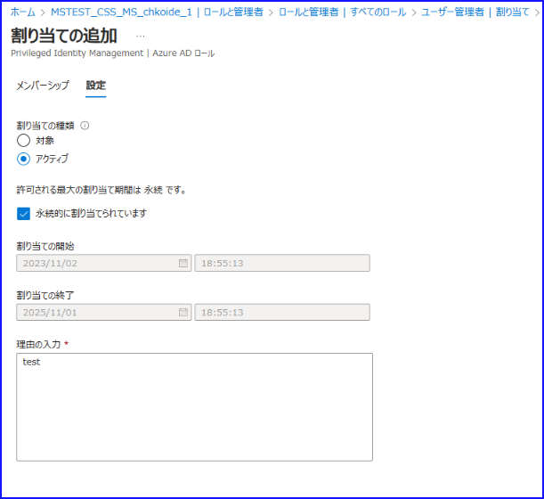


### ④ ロジック アプリ内でどのような操作をするか記載する

上記までできたら、実際にロジック アプリで、カスタム拡張機能が呼び出されたときにどうするかを記載していきます。

4-1. Identity Governance - カタログ - 該当のカタログを選択 - カスタム拡張機能より、下記の画面を開きます。
4-2. 下記のように「ロジック アプリ」列がリンクになっているので、下記の例では Governance_ExtensionApp1 のリンクをクリックします。

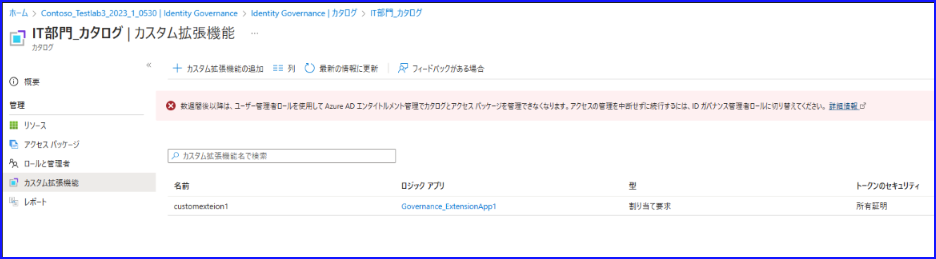

4-3. 下記のような画面が開きます。既定の設定はそのままにします。

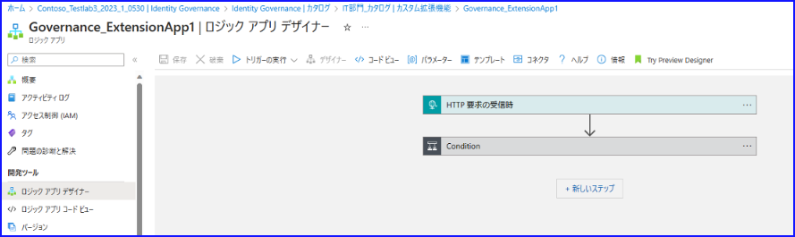

4-4. 表示されているステップの間の矢印の上にあるプラス ボタンをクリックし、[アクションの追加] をクリックします。

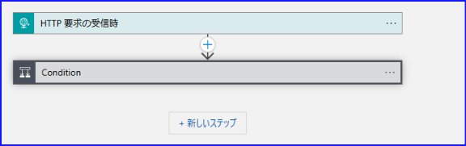

4-5. 追加できるアクションの数々が表示されるので各処理を記述していきます。


今回は以下のようなアクションを追加していきます。

(1)  アクセス パッケージから渡された情報をもとに変数に格納

(2)  ユーザーの情報を取得

(3)  ユーザーの部署（department） 属性と ExtensionAttribute1 の属性を更新する

(4)  メールの送付先となるアドレスを準備する

(5)  パッケージ内のリソース リンクをユーザーにメール通知する


#### (1) アクセス パッケージから渡された情報をもとに変数に格納

アクセス パッケージから渡された情報が triggerBody の中に含まれています。
渡された情報の中の、「パッケージが割り当てられたターゲットの ObjectID」を取得すると、割り当てられたユーザーを特定することができます。
そこでここではまず、 $userID という変数に、「パッケージが割り当てられたターゲットの ObjectID」を代入しています。
アクセス パッケージの割り当て情報の中の Target 内 ObjectID に記載されているという点を示すために、値にあたる部分は動的なコンテンツとして記載します。

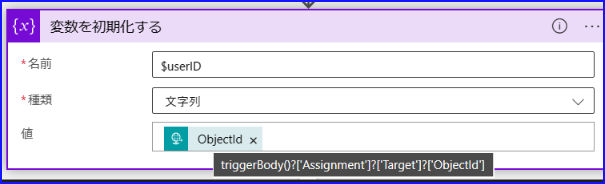


動的なコンテンツの追加は、値のボックスをクリックしたときに表示される選択肢の中から下記を選ぶと、上のように埋め込むことができます。
式としては、triggerBody()?['Assignment']?['Target']?['ObjectId'] となります。


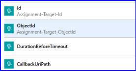


#### (2) ユーザーの情報を取得
ユーザーの情報を取得するためには、 [ユーザーの取得 - Microsoft Graph v1.0](https://learn.microsoft.com/ja-jp/graph/api/user-get?view=graph-rest-1.0&tabs=http) を使用します。
アクセス パッケージが割り当てられたユーザーの情報は、先ほど $userID 属性に格納したので、下記のように記載します。

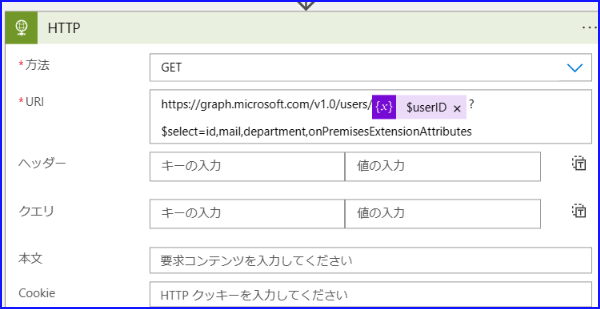

また、 Add new parameter を開き、認証のチェックをオンにします。

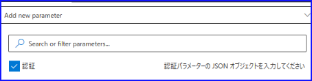


先ほど事前にマネージド ID を構成し権限を割り当てたので、下記のように、システム割り当てマネージド ID を選択します。
対象ユーザーの項目には、https://graph.microsoft.com を入力してください。

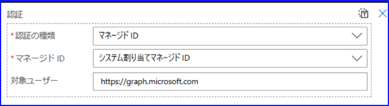


#### (3) ユーザーの部署（department） 属性と ExtensionAttribute1 の属性を更新する

次に、もう一つ HTTP アクションを追加し、ユーザーを更新するための API を記載します。更新するユーザー情報は、 $userID の変数から利用します。
具体的な更新 API は [ユーザーを更新する - Microsoft Graph v1.0](https://learn.microsoft.com/ja-jp/graph/api/user-update?view=graph-rest-1.0&tabs=http) に記載がありますので、こちらをもとに必要な情報を埋めていきます。
たとえば本文内に、「どの部署名に更新したいのか」部署の名前を指定しておきます。今回は、 IT という部署に移動したいので下記のように記載します。
なお、上記と同様に「認証」のチェックを有効化し、マネージド ID を指定してください。

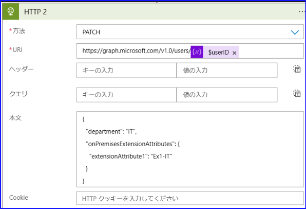


#### (4) メールの送付先となるアドレスを準備する

最後に、メールをユーザー本人に送付したいので、 $mail という変数を作り、事前に取得したユーザー情報の中から Mail 属性の値を取得して格納します。


アクセス パッケージの割り当てによって初めてメールボックスが作成される場合、アクセスパッケージ割り当て直後にメールを送付するとエラーになる可能性が考えられるため、10 分ほど待機するフローを挿入します。

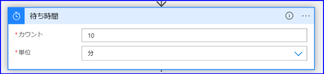

メールの送付元となるユーザーを $MailSender という変数に定義します。


#### (5) パッケージ内のリソース リンクをユーザーにメール通知する

メールの送付は [user: sendMail - Microsoft Graph v1.0](https://learn.microsoft.com/ja-jp/graph/api/user-sendmail?view=graph-rest-1.0&tabs=http) の API で実行できますので、下記のように実行します。

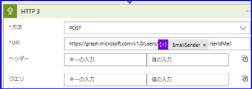


本文は下記のように記載し、受信者（toRecipients）のアドレスに送信先となる $mail を指定します。ここでアクセスパッケージで割り当てたリソース (グループ、アプリケーション、SPO サイト) のリンク先も記載しておきます。


先に記載した HTTP と同様に、認証のチェックをオンに変更し、マネージド ID を指定します。

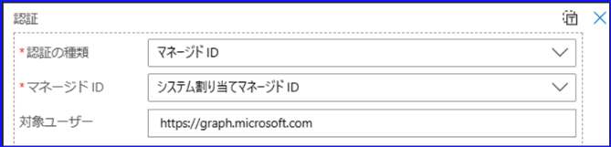

本文の記載が少々見にくいかと思いますので、下記が参考となりますと幸いです。

```JSON
{
  "message": {
    "body": {
      "content": 
 "IT 部門へようこそ！\n 異動処理と権限の付与が完了しましたので、メールでお知らせします。\n IT 部門用のチームやSPO サイトが用意されていますので、下記リンクよりアクセスできるか確認してください。\n\n ▼ IT 部門のページ\n SPO サイト\n 'SPO サイトのリンク' \n\n  チーム\n 'チームのリンク' \n\n もしアクセスできない場合は、CC に記載されているアドレス宛にメールにてご連絡ください。\n",
     "contentType": "Text"
    },
    "ccRecipients": [
      {
        "emailAddress": {
          "address": "admin@contoso.onmicrosoft.com"
        }
      }
    ],
    "subject": "IT 部門へようこそ！",
    "toRecipients": [
      {
        "emailAddress": {
          "address": "user@contoso.onmicrosoft.com"
        }
      }
    ]
  },
  "saveToSentItems": "false"
}
```


ちなみに、ロジック アプリの記載においては、デバッグやトラブル シューティングをしながら進めることが多いと思います。
ロジック アプリの概要画面を確認すると、成功・失敗の一覧が表示されているので、処理状況の確認が可能です。

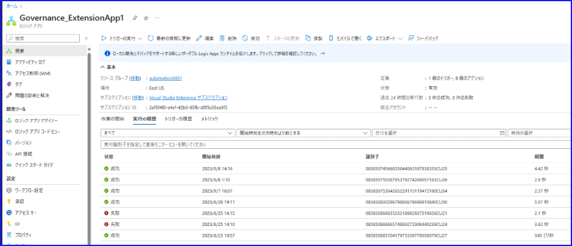


失敗のログをクリックすると、処理のどこでエラーになったのかも分かります。そのため、たとえば下記の場合だと、 HTTP 3 のアクションを見直せばよいことが分かります。

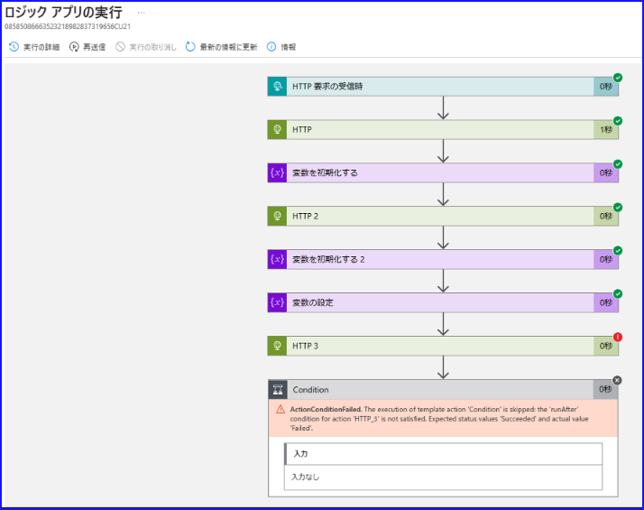

必要に応じて、[下記 Logic Apps 観点のブログ](https://jpazinteg.github.io/blog/LogicApps/Integration-graphApi/) もご確認ください。


### 実際の動作
ユーザーにアクセス パッケージのリンクへアクセスしてもらいます。要求ポリシーが複数ある場合はどちらか選択します。

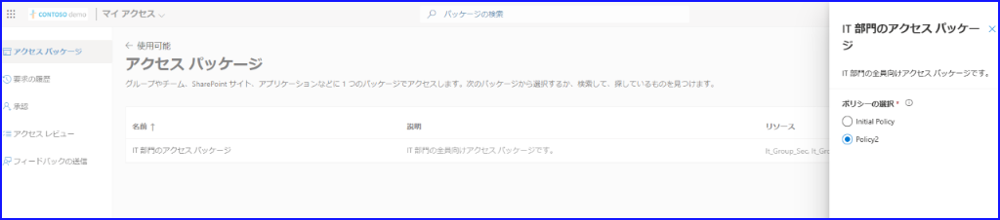

必要に応じて、期間や理由を記載のうえパッケージを要求します。

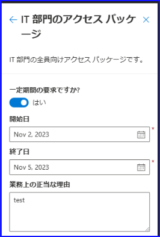

ポリシーの内容にもよりますが、承認などを経てパッケージが割り当てられます。割り当てられると、「割り当て」画面にユーザーが表示されます。

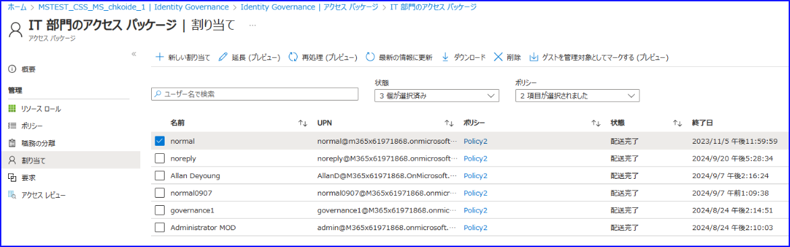

パッケージが割り当てられたので、カスタム タスクが発動します。ユーザーの属性が変更されるなどし、最後に下記のようなメールが送付されます。


実行履歴を確認すると、すべて成功しているかどうかなどを確認いただけます。

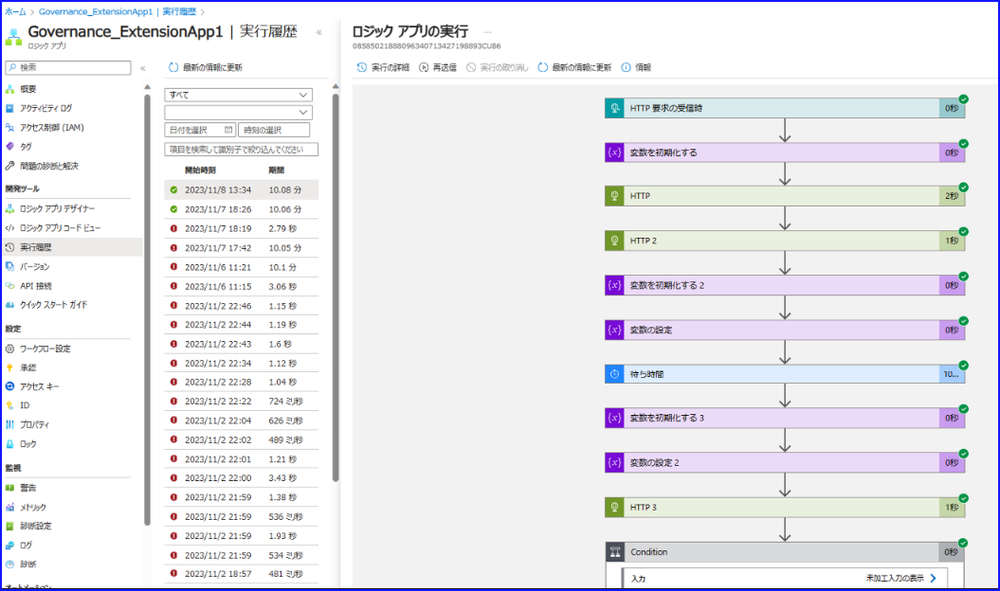

今回は、アクセス パッケージとカスタム拡張機能を利用したサンプルについて紹介しました。

上記内容を参考とし、お客様側の要件・ご要望に合うカスタム拡張機能を実装いただければ幸いです。


