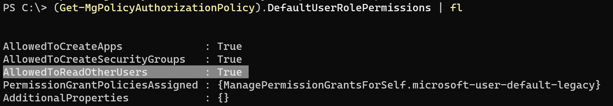
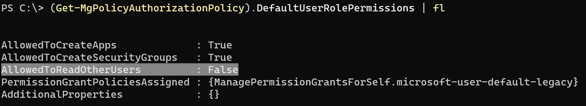

> [!NOTE]
> 本記事は Technet Blog の更新停止に伴い https://blogs.technet.microsoft.com/jpazureid/2017/12/29/azuread-portal/ の内容を移行したものです。
> 元の記事の最新の更新情報については、本内容をご参照ください。

> [!NOTE]
> 2017-12-29: 本記事の初版を投稿  
> 2023-04-16: MSOL コマンドのリタイアに伴い内容を全体的に更新

# Azure ポータルへのアクセス制限

こんにちは、Azure & Identity サポート チームの三輪です。

今回は、一般ユーザーに対して Azure ポータルへのアクセスを制限する方法について紹介します。

Azure ポータル (https://portal.azure.com) には、サブスクリプションの有無によらずログインすることが可能です。この動作変更により、ユーザーが簡単に Azure に対してアクセスできるようになっています。

Azure ポータルからは、そのログインしたユーザーが所属する Microsoft Entra ID ディレクトリにアクセスすることができ、このとき Microsoft Entra ID に対しての管理者権限を持たない一般ユーザーであっても、既定では Microsoft Entra ID に登録されているユーザーの一覧を参照できるようになっています。これは [ドキュメント](https://learn.microsoft.com/ja-jp/azure/active-directory/fundamentals/users-default-permissions) にも記載されていることで、一般ユーザーは他のユーザーの基本情報を見ることが可能であり、この動作自体は Microsoft Entra ID で想定されるものです。

Azure ポータルへ一般ユーザーがアクセスできたとしても、一般ユーザーの権限以上のことはできません。例えば、テナントやユーザーの構成を変更したり、詳細を確認することはできません。上述のとおり、他のユーザーの一覧 (基本情報) を確認することは既定で可能ですが、これは Office 365 を利用する中で他のユーザーを参照できるのと同等です。Microsoft Entra ID は組織内のユーザーの認証とコラボレーションを促進するディレクトリ サービスであるため、他のユーザーが参照できることはその機能の一部であり問題ではありません。

Azure ポータルへのアクセスを制限しても、ユーザーは Office 365 のサービス (Exchange や Teams) を利用して他のユーザーの情報を確認可能であることにご注意ください。また、Microsoft Entra ID 以外の項目、例えば仮想マシンなどのリソースに対しては、サブスクリプションの権限を明示的に付与しない限りは、各ユーザーは参照することもできませんのでご安心ください。

ただし、上記を踏まえてもお客様の運用形態によっては、Azure ポータル上やその他の方法で他のユーザーの一覧が見えてしまうことが運用上好ましくない場合もあると思います。今回は、このような一般ユーザーによる他のユーザーの参照や管理ツールへのアクセスをできる限り制限する方法についておまとめしました。

## Azure ポータルを含めた Azure の管理ツール全般へのアクセスを制限する方法

Azure ポータルやその他 Azure CLI など管理ツールへのアクセスを限られたユーザーのみに制限する方法としては、条件付きアクセスの機能を利用することがおすすめです。条件付きアクセスの機能を利用するためには Microsoft Entra ID P1 または P2 のライセンスが制御対象のユーザー分必要となります。

1. Azure ポータル (https://portal.azure.com) に管理者のアカウントでアクセスします。
2. [セキュリティ] から [条件付きアクセス] – [ポリシー] の順にクリックします。
3. 上部 [+ 新しいポリシーの作成] をクリックします。
4. [名前] にポリシーの名前を入力します。
5. ポリシーを割り当てるユーザーまたはグループを選択します。

    この時、ポリシーを全ての管理者に割り当てないようご注意ください。全ての管理者がポリシーの制限を受け、Azure ポータルにアクセスすることができなくなります。結果として、設定解除もできなくなるというお問い合わせを過去に複数いただいております。

6. [ターゲット リソース] では 「リソースの選択」にチェックを入れます。
7. [選択] では、[Windows Azure Service Management API] アプリケーションを検索し、選択します。

   追加の条件を設定する場合は [条件] にてポリシーが適用される条件を選択します。条件を選択しない場合、すべてのアクセスが対象となります。

8. [アクセス制御] の [許可] で「アクセスのブロック」を選択して、[選択] をクリックします。
9. 即時ポリシーを有効化する場合には、ポリシーの有効化で [オン] を選択し、[作成] をクリックします。

該当ユーザーで Azure ポータルへアクセスすると下記の画面が表示され、アクセスがブロックされます。


> [!IMPORTANT]
> [Windows Azure Service Management API](https://learn.microsoft.com/ja-jp/entra/identity/conditional-access/concept-conditional-access-cloud-apps#windows-azure-service-management-api) は複数のサービスが対象となっており、これへのアクセスをブロックすると、Azure ポータル以外にも Azure CLI などを利用したサブスクリプションへのアクセスがブロックされる点にご留意ください。

## Microsoft Entra ID 管理ポータルへのアクセスを制限する方法

これは Microsoft Entra ID の管理者 (グローバル管理者または制限付き管理者) を与えられていないユーザーによるポータル内 [Microsoft Entra ID] へのアクセスを制限する方法です。以下の手順で構成いただけます。本設定は、Azure ポータル上のアクセス制限になるため、設定完了後も PowerShell や Azure CLI を使用すれば、ユーザーの一覧は参照できます。

1. グローバル管理者として Azure ポータル (https://portal.azure.com) にサインインします。
2. [Microsoft Entra ID] を開きます。
3. 表示されたメニューから [ユーザー設定] をクリックします。
4. [管理センター] - [Microsoft Entra 管理センターへのアクセスを制限する] の項目で [はい] を選択します。
5. 上にある [保存] をクリックします。

※ 上記 4. で [はい] を選択することで管理者以外の一般ユーザーは、Azure ポータル内での [Microsoft Entra ID] にアクセスしようとすると、下記の画面が表示されアクセス権がなくなります。


## Microsoft Graph API でユーザーの一覧を取得できなくする方法

上述のとおり、Microsoft Entra ID では他のユーザーの一覧 (基本情報) を確認することが既定で可能であり、これは想定される動作です。ただし、学校など運用形態によっては、コマンドなどでユーザーが他のユーザーを一覧で取得できることが好ましくない状況もあると存じます。この場合、以下の設定を使用することで、他のユーザーの読み取りをある程度制限可能です。本設定をご利用の際は検証用のテナントで動作を確認したうえで、運用テナントでの利用を検討ください。

この設定を有効にするためには、Microsoft Entra ID 用の PowerShell を利用する必要があります。PowerShell を利用する際には組織アカウントのグローバル管理者が必要です (Microsoft Entra ID の PowerShell については [リンク](https://jpazureid.github.io/blog/azure-active-directory/azuread-module-retirement3/) も参照ください)。

1. PowerShell を開き、下記のコマンドでグローバル管理者で Microsoft Entra ID に接続します。

    ```powershell
    Connect-MgGraph -Scopes Policy.ReadWrite.Authorization
    ```
    
2. 下記コマンドで現在の設定を確認します。    
    
     ```powershell 
    (Get-MgPolicyAuthorizationPolicy).DefaultUserRolePermissions | fl
    ```
    
    AllowedToReadOtherUsers が該当の設定になります。 True になっていることを確認します。
    
    

3. 下記コマンドで他のユーザーの情報を取得させないように設定します。

    ```powershell 
    $params=@{
        defaultUserRolePermissions = @{
        allowedToReadOtherUsers = $false
      }
    }
 
    Update-MgPolicyAuthorizationPolicy -BodyParameter $params
    ```

3. 再度、下記コマンドで他のユーザーの情報を取得させないように設定されたか確認します。

    ```powershell
    (Get-MgPolicyAuthorizationPolicy).DefaultUserRolePermissions | fl
    ```
    
    AllowedToReadOtherUsers が False に変更されたことを確認します。
    
    

## 補足: ゲスト ユーザーのアクセス権

外部から追加したゲスト ユーザーについては既定で Microsoft Entra ID へのアクセスが制限されています。ゲストとメンバー の違いについては、[こちら](https://jpazureid.github.io/blog/azure-active-directory/member-and-guest-user/) を参照ください。

## 補足: Azure サブスクリプションの作成権限の制御

既定では Azure ポータルにユーザーがサインインすることで、自由に新規サブスクリプションを作成することが可能です。ここで作成されるサブスクリプションはそのユーザーが新たに自身のクレジット カードを登録して利用するものです。つまり、会社のサブスクリプションのリソースや課金観点において影響はありません。

Microsoft Entra ID のグローバル管理者においては下記の設定で、自身が管理する Microsoft Entra ID に紐づく全サブスクリプションを確認可能です。

1. グローバル管理者として Azure ポータル (https://portal.azure.com) にサインインします。
2. [Microsoft Entra ID] を開きます。
3. 表示されたメニューから [プロパティ] をクリックします。
4. [Azure リソースのアクセス管理] より、[このテナント内のすべての Azure サブスクリプションおよび管理グループへのアクセスを管理できます] を [はい] に設定します。
5. 上にある [保存] をクリックします。

上記内容が少しでも皆様の参考となりますと幸いです。
