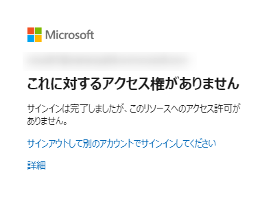
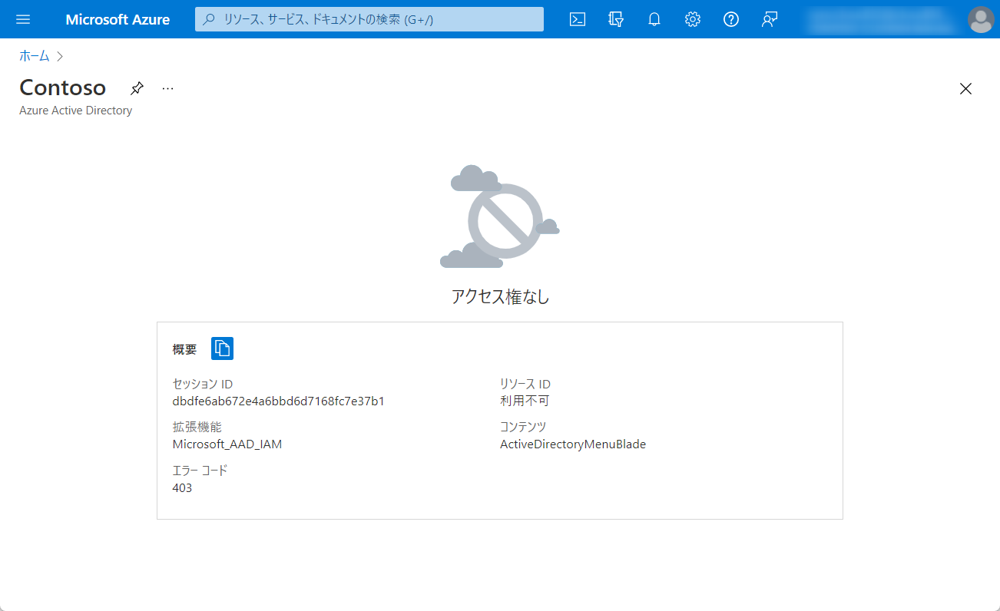

> 本記事は Technet Blog の更新停止に伴い https://blogs.technet.microsoft.com/jpazureid/2017/12/29/azuread-portal/ の内容を移行したものです。
> 元の記事の最新の更新情報については、本内容をご参照ください。

# Azure ポータルへのアクセス制限

こんにちは、Azure & Identity サポート チームの坂井です。

今回は、一般ユーザーに対して Azure ポータルへのアクセスを制限する方法について紹介します。

クラシック ポータル (旧ポータル) ではログインする際に Azure のサブスクリプションを保持していることが前提となっていました。一方 Azure ポータル (https://portal.azure.com) には、サブスクリプションの有無によらず、ログインすることが可能です。この動作変更により、より多くのユーザーが簡単に Azure に対してアクセスできるようになっています。

Azure ポータルからは、そのログインしたユーザーが所属する Azure AD ディレクトリにアクセスすることができ、このとき Azure AD に対しての管理者権限を持たない一般ユーザーであっても、既定では Azure AD に登録されているユーザー一覧を参照できるようになっています。ご利用状況によっては、このことがセキュリティ上好ましくない場合もあると思います。

## Azure ポータルへのアクセスを制限する方法

Azure ポータル自体へのアクセスを限られたユーザーのみに制限する方法については、条件付きアクセスの機能を利用する必要があります。条件付きアクセスの機能を利用するためには Azure AD Premium (P1 or P2) のライセンスが制御対象のユーザー分必要となります。

なお、 後述します Azure AD へのアクセスを制限する方法 (ユーザーの一覧を見えなくする) であれば、ライセンスは不要です。

<手順>

1. Azure ポータル (https://portal.azure.com) に管理者のアカウントでアクセスします。
2. セキュリティの [条件付きアクセス] – [ポリシー] の順にクリックします。
3. 上部 [＋新しいポリシー] をクリックします。
4. [名前] にポリシーの名前を入力します。
5. ポリシーを割り当てるユーザーまたはグループを選択します。

    この時、全ての管理者に割り当てないようにしてください。全ての管理者がポリシーの制限を受け、Azure にアクセスすることができなくなり、設定解除もできなくなるというお問い合わせを過去に複数いただいております。

6. [クラウド アプリ] では 「アプリを選択」 にチェックを入れます。
7. [選択] をクリックし、[Microsoft Azure Management] アプリケーションを検索し、選択します。
8. [クラウド アプリ] のブレードに戻るので、[完了] をクリックします。
9. [条件] – [場所] をクリックし、構成で [はい] を選択します。
10. 対象 で「すべての場所」を選択します。
11. Azure ポータルに戻って、[完了] を 2 回 クリックします。
12. アクセス制御 の [許可] で「アクセスのブロック」を選択して、[選択] をクリックします。
13. 即時ポリシーを有効化する場合には、ポリシーの有効化で [オン] を選択し、[作成] をクリックします。

該当ユーザーで Azure ポータルへアクセスすると下記の画面が表示され、アクセスがブロックされます。



## Azure AD へのアクセスを制限する方法

Azure AD の管理者権限（全体管理者または制限付き管理者）を与えられていないユーザーによる ポータル内 [Azure Active Directory] へのアクセスを制限する方法です。

<手順>

1. 全体管理者として Azure ポータル（http://portal.azure.com）にサインインします。
2. 左側のメニューから [Azure Active Directory] をクリックします。
3. 表示されたメニューから [ユーザーとグループ] をクリックします。
4. 表示されたメニューから [ユーザー設定] をクリックします。
5. 右側の下記の項目がございますので、[はい] を選択します。
6. [管理ポータル] - [Azure AD 管理ポータルへのアクセスを制限する] 
 上にある [保存] をクリックします。

※ 上記 5. で [はい] を選択することで管理者以外の一般ユーザーは、Azure ポータル内での [Azure Active Directory] にアクセスしようとすると、下記の画面が表示されアクセス権がなくなります。



上記設定は、Azure ポータル上のアクセス制限になるため、設定完了後も PowerShell を使用すれば、ユーザーの一覧は参照できます。その対処策となる設定についても下記にご案内させていただきます。

<手順>

この作業を実施するためには、Azure AD 用の PowerShell (Azure AD v1 の PowerShell) を利用する必要がありますが、 PowerShell を利用する際には Microsoft アカウントではなく、組織アカウントでの全体管理者が必要です (Azure AD の PowerShell についてはリンクも参照ください)。

1. PowerShell を開き、下記のコマンドで全体管理者で Azure AD に接続します。

    ```powershell
    Connect-MsolService
    ```

2. 下記コマンドで他のユーザー及びグループの情報を取得させないように設定します。

    ```powershell 
    Set-MsolCompanySettings -UsersPermissionToReadOtherUsersEnabled $false
    ```

3. 下記コマンドで他のユーザー及びグループの情報を取得させないように設定されたか確認します。

    ```powershell
    Get-MsolCompanyInformation | fl UsersPermissionToReadOtherUsersEnabled
    ```

## 補足

外部から追加した Guest ユーザーについては既定で Azure AD へのアクセスが制限されています 
(Guest と Member の違いについては、こちらのリンクを参照ください)。

Azure ポータルへのログインを条件付きアクセスを利用して制限していない場合でも、 Azure AD 以外の項目、例えば仮想マシンなどのリソースに対しては、サブスクリプションの権限を明示的に付与しない限りは、各ユーザーは参照することもできませんのでご安心ください。

上記内容が少しでも皆様の参考となりますと幸いです。

※ 本情報の内容（添付文書、リンク先などを含む）は、作成日時点でのものであり、予告なく変更される場合があります。