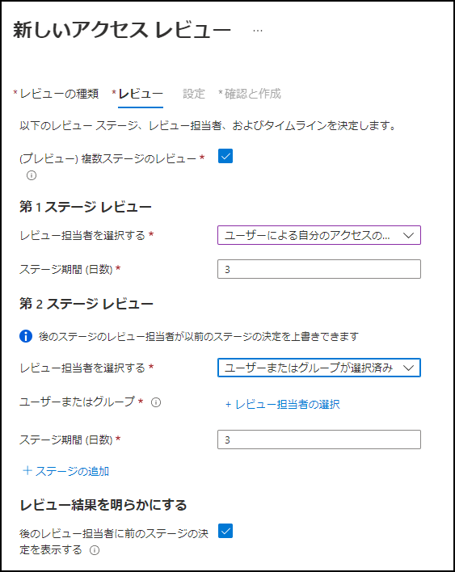
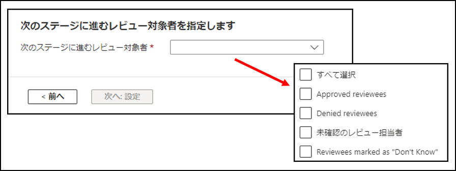

# Azure AD の新しい複数ステージのアクセス レビューによる最小権限モデルの実現

こんにちは、Azure Identity サポート チームの 村上 です。

本記事は、2022 年 2 月 28 日に米国の Azure Active Directory Identity Blog で公開された [Achieve a least privilege model using Azure AD's new multi-stage access reviews](https://techcommunity.microsoft.com/t5/azure-active-directory-identity/achieve-a-least-privilege-model-using-azure-ad-s-new-multi-stage/ba-p/3185211) を意訳したものになります。ご不明点等ございましたらサポート チームまでお問い合わせください。

---

皆さん、こんにちは。

本日、Azure AD のアクセス レビューにおける、複数ステージのレビューのパブリック プレビューを発表いたします。

この機能拡張により、アクセス レビューを順を追ったステージで構築し、ステージ毎に異なるレビュー担当者と設定を実装することができます。

この機能により、お客様のテナント内で複数のレビュー担当者が特定の順序でユーザーのアクセスを証明するよう再認定や監査の要件を満たすよう複雑なワークフローを実現することができます。また、各レビュー担当者が責任を負う意思決定の数を減らすことで、リソース所有者やレビュー担当者が、より効率的なレビューを設計できるようになります。以前は、レビューのために人為的に複数の異なるレビューを作成していたかもしれませんが、複数ステージのレビューでは、このすべてをたった一度のレビューの中で行えます。

## 複数ステージのレビューにより実現できるアクセス認定の主要なシナリオ

- **複数のレビュー担当者の間での合意形成**: アクセスを再認定する前に、すべてのステージで異なるレビュー担当者の合意を必要とする。 
- **未審査の決定について代替のレビュー担当者を設定**: レビュー担当者が不在や外出中の際に未審査のまま放置されたアカウントは、ユーザーの上司やリソース所有者など、次の適切なレビュー担当者に送られるようにする。 
- **後続のステージのレビュー担当者の負担を軽減**: 前のステージで拒否されたアカウントを除外することで、後のステージのレビュー担当者が行う決定の数を絞り込みます。例えば、リソースの所有者に認証を依頼する前に、ユーザー自身にアクセスの必要性を確認してもらうようにします。 

## 複数ステージのアクセス レビューをぜひお試しください

上記は、複数ステージのレビューの設定画面です。最大 3 つのステージを指定でき、各ステージのレビュー担当者と期間を個別に選択することもできます。さらに、前のステージでの決定を後のステージのレビュー担当者に公開するかどうかを定義することもできます。 

最後に、どのレビュー担当者が次のステージへ進むかを指定します。

複数ステージのレビューの設定方法の詳細については、[Azure AD アクセス レビューのドキュメント](https://docs.microsoft.com/ja-jp/azure/active-directory/governance/create-access-review) をご参照ください。MS Graph API (beta) を使ってこれらのレビューを試すには、[MS Graph API ドキュメント](https://docs.microsoft.com/ja-jp/graph/api/accessreviewset-post-definitions?view=graph-rest-beta&tabs=http%22%20\l%20%22example-4-create-an-access-review-on-a-group-with-multiple-stages) をご確認ください。

お客様の認証ニーズに対して、複数ステージのレビューがどのように活用されるかとても楽しみです。
 
Alex Simons (Twitter: [@Alex_A_Simons](https://twitter.com/alex_a_simons)  
Corporate Vice President Program Management  
Microsoft Identity Division

------

## よくあるご質問

**Q: ゲストのレビューに複数ステージのレビューを使用できますか？**

はい、ゲスト ユーザーにも複数ステージのレビューを使用することができます。また、ゲスト ユーザーをセルフ レビュアー (自身をレビュー担当者) として、3 つのステージのいずれかに参加させることも可能です。

**Q: ダウンロードできるレビュー履歴レポートには、複数ステージののレビュー担当者が表示されますか？**

はい、表示されます。レビュー履歴レポートには、最大 3 ステージのレビュー担当者が記録されます。レビュー履歴レポートのダウンロードについては [こちら](https://docs.microsoft.com/ja-jp/azure/active-directory/governance/access-reviews-downloadable-review-history) をご覧ください。

**Q: 以前、レビューで複数のレビュー担当者を設定したことがあります。複数ステージのレビューはどう違うのですか？**

複数のレビュー担当者の場合、ひとつのステージで全員が同時にレビューに関与します。それらレビュー担当者の判断に優劣はなく、レビュー期間の終了時には、最後のレビュー担当者の判断が適用されます。 

複数ステージのレビューでは、1 人または複数のレビュー担当者からなる最大 3 名の担当者を定義し、順次レビューを行っていきます。最初のステージのレビュー担当者がレビューを完了してから、2 番目のステージのレビュー担当者がレビューを開始します。異なるステージのレビュー担当者は独立してレビューを行い、どのレビュー担当者の場合にそのステージから別のステージに移動するか、またレビュー担当者が以前のステージの判断結果を見れるかどうかを設定することができます。

**Q: Azure AD ロールまたは Azure RBAC ロールの Privileged Identity Management ロール割り当てに複数ステージのレビューを使用したいです。ロール割り当てレビューに複数ステージを設定するにはどうすればよいですか?**

現在、多段構成をサポートするレビューの種類を拡張すべく取り組んでいます。現時点では、アプリケーションに加え、Security グループと M365 グループのレビューに対してのみ、複数ステージのレビューをサポートしています。
