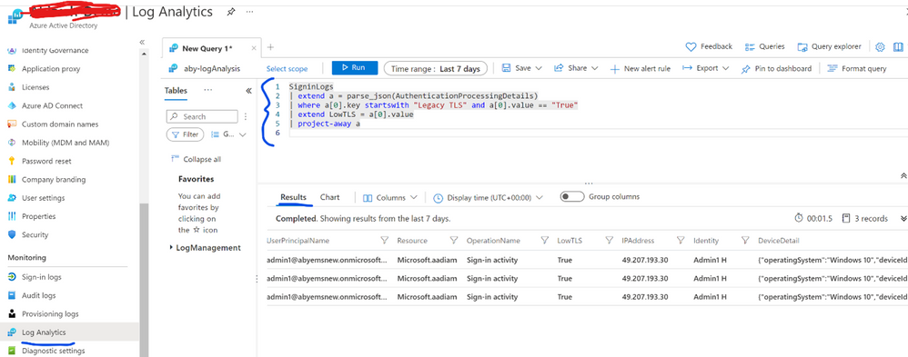

こんにちは、Azure Identity サポート チームの中井です。

本記事は、2021 年 11 月 22 日に米国の Azure Active Directory Identity Blog で公開された [Act fast to secure your infrastructure by moving to TLS 1.2!](https://techcommunity.microsoft.com/t5/azure-active-directory-identity/act-fast-to-secure-your-infrastructure-by-moving-to-tls-1-2/ba-p/2967457) を意訳したものになります。ご不明点等ございましたらサポート チームまでお問い合わせください。

> [!NOTE]
> TLS 1.2 に関する案内は、すでに公開中の [Azure AD Connect における TLS 1.2 の対応](https://jpazureid.github.io/blog/azure-active-directory-connect/azure-ad-connect-tls/) の記事でも解説されておりますので併せてご覧ください。

----

# TLS 1.2 へ移行して基盤環境のセキュリティ確保を

適切なセキュリティ対策を講じて機密データを保護することは、すべての組織にとって最も重要なことです。そのためには、データを保護し脅威に対抗するため、常に規格や規制を満たしていく必要があります。このような規格のうちの 1 つとして、Transport Layer Security (TLS) があります。TLS は、Web ブラウザと Web サーバーの間、モバイル アプリケーションとサーバー間の通信を暗号化するためのインターネット プロトコルです。弊社では、Azure Active Directory で TLS 1.2 を使用し基盤環境を保護することを推奨しています。テナントのセキュリティ態勢を向上させ、業界標準に準拠するため、旧バージョンの TLS (1.0 および 1.1) は廃止となり削除されます。 

TLS は広く採用されているセキュリティ プロトコルで、インターネット上の通信におけるプライバシーとデータ セキュリティを促進する仕組みです。TLS は、Azure AD、Office 365、および Microsoft や他のクラウド サービス プロバイダーが所有するその他のクラウド サービスに接続する際に使用されます。TLS の 3 つの要素のうち、1 つ目のものは暗号化であり、転送されるデータを第三者から隠蔽します。2 つ目の要素は認証であり、これは情報を交換する当事者が確かにその主張どおりの人物であることを確認します。3 つ目は整合性であり、データが偽造されていないか、改ざんされていないかを検証します。TLS 1.0 および 1.1 のプロトコルや 3DES 暗号は古いため、最新の暗号アルゴリズムに対応していません。その結果、攻撃者に悪用される可能性のあるセキュリティ上の脆弱性があります。FedRamp と [NIST SP 800-52r2](https://csrc.nist.gov/news/2019/nist-publishes-sp-800-52-revision-2) に準拠するためには、レガシーのTLS (1.0、1.1) プロトコルと暗号 (3DES) の利用を廃止する必要があります。

Microsoft 365 など、ほとんどのマイクロソフトのサービスでは、TLS 1.0 および 1.1 を非推奨にする方法についての[ガイダンス](https://docs.microsoft.com/ja-jp/microsoft-365/compliance/tls-1.0-and-1.1-deprecation-for-office-365?view=o365-worldwide) を提供しています。Azure AD を使用している多くのお客様は、すでに TLS 1.2 に移行していますが、この移行を促進するために、追加のガイダンスを提供いたします。2022 年 1 月 31 日から、Azure AD は、これら廃止予定の TLS バージョン 1.0 および 1.1 をサポートしなくなります。TLS 1.2 に移行していないお客様は、Azure AD へのリクエストが失敗するため、影響を受けることとなります。

## Azure AD のサインイン ログを使用してレガシーな TLS を検出し移行を計画する

Azure AD で TLS 1.2 をサポートするための完全なガイダンスについては、こちらの [ドキュメント](https://docs.microsoft.com/ja-jp/troubleshoot/azure/active-directory/enable-support-tls-environment?tabs=azure-monitor) を参照ください。これに加えてお客様は、Azure AD サインイン ログを使用して、お客様の環境でレガシーな TLS を使用しているクライアントやアプリケーションを特定することができます。レガシーな TLS で実行されたサインインに対して、Azure AD は、"追加の詳細" において、「Legacy TLS (TLS 1.0, 1.1, 3DES)」の項目 を True とマークします。「Legacy TLS」の項目は、レガシーな TLS によるサインインが行われた場合にのみ表示されるため、お客様のログにこの項目が表示されていない場合は、TLS 1.2 への切り替えの準備ができていることになります。

管理者がレガシーな TLS プロトコルをログから確認し、サインインの試行を特定する方法は複数あります。

1. **PowerShel**: PowerShell を使用して、レガシー TLS が使用されているサインイン ログのエントリをフィルタリングし、出力することができます。PowerShell で MS Graph API を呼び出すには、Azure AD Premium ライセンスが必要です。詳細につきましては、[レポート用の Azure AD PowerShell コマンドレット](https://docs.microsoft.com/ja-jp/azure/active-directory/reports-monitoring/reference-powershell-reporting) を参照ください。

2. **UX**: お客様は、Azure ポータルで、レガシーな TLS ベースのサインイン ログ エントリの詳細を参照できます。詳細につきましては、[Azure Active Directory のサインイン ログ - プレビュー](https://docs.microsoft.com/ja-jp/azure/active-directory/reports-monitoring/concept-all-sign-ins) を参照ください。

 

3. **JSON**: 過去 7 日間のサインイン ログを JSON 形式でダウンロードして、「Legacy TLS」の項目を確認できます。このフラグは、レガシーな TLS がサインイン要求に使用されている場合にのみ表示されます。サインイン ログを JSON 形式ではなく CSV 形式でダウンロードすると、Legacy TLS 項目は表示されません。詳細につきましては、[方法: Azure Active Directory でログをダウンロードする](https://docs.microsoft.com/ja-jp/azure/active-directory/reports-monitoring/howto-download-logs) を参照ください。

4. **Azure　モニター**: 最後は、Azure Monitor を用いてログを分析し、ログのエクスポートを設定する方法です。詳細につきましては、[Azure Monitor ログを使用して Azure AD アクティビティ ログを分析する](https://docs.microsoft.com/ja-jp/azure/active-directory/reports-monitoring/howto-analyze-activity-logs-log-analytics) を参照してください。

 

暗号プロトコルの進化に伴い、お客様は業界標準やベスト プラクティスを確認するとともに、既存のプロトコルに新たな脆弱性がないか注視していく必要があります。今回ご紹介したツールにより、お客様が TLS 1.2 への移行をスムーズに行い、セキュリティ体制を強化できれば幸いです。
