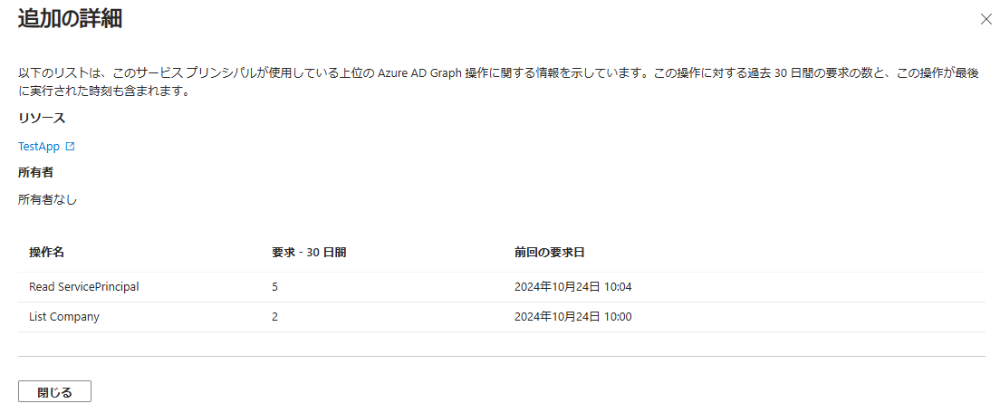

# 要対応: Azure AD Graph API の廃止

こんにちは、Azure Identity サポート チームの 五十嵐 です。

本記事は、2024 年 12 月 5 日に米国の Microsoft Entra (Azure AD) Blog で公開された [Action required: Azure AD Graph API retirement](https://techcommunity.microsoft.com/blog/identity/action-required-azure-ad-graph-api-retirement/4090533) の抄訳です。ご不明点等ございましたらサポート チームまでお問い合わせください。

----

## 影響を延期する措置を講じない限り、2025 年 2 月 1 日以降にアプリケーションからの Azure AD Graph API への呼び出しが失敗します。ここでは、2025 年 6 月 30 日までアクセスを延長するための措置を紹介します。

[Azure AD Graph API サービスの廃止](https://jpazureid.github.io/blog/azure-active-directory/azure-ad-graph-api-retirement/) は 2024 年 9 月に開始され、新規および既存のアプリケーションの両方に影響を与えます。現在、Azure AD Graph の廃止の第 1 フェーズを完了しており、新規のアプリケーションは、利用を延長するよう構成されていない限り、Azure AD Graph API を使用することはできません。Microsoft Graph は、Azure AD Graph API に代わるものであり、Azure AD Graph API を利用している場合は直ちに [Microsoft Graph](https://developer.microsoft.com/en-us/graph) に移行し、Azure AD Graph API を使用する今後の開発を行わないようにすることを強く推奨します。

今回の廃止については繰り返しお伝えしてきましたが、再確認として、主要なマイルストーンを以下の通り再掲します:

| フェーズ開始日 | 既存のアプリへの影響  | 新規のアプリへの影響 |
| ------------- | ------------- | ------------- |
| 2024 年 9 月 1 日 |    なし | **すべての新しいアプリでは Microsoft Graph を使用する必要があります。** <br>blockAzureAdGraphAccess を false に設定して [2025 年 6 月 30 日まで Azure AD Graph へのアクセスを延長して許可するようにアプリが構成](https://learn.microsoft.com/ja-jp/graph/applications-authenticationbehaviors?tabs=http%22%20%5Cl%20%22allow-extended-azure-ad-graph-access-until-june-30-2025) されていない限り、新しいアプリが Azure AD Graph API を使おうとするとブロックされます。 |
| 2025 年 2 月 1 日 |    アプリケーションは、blockAzureAdGraphAccess を false に設定して [Azure AD Graph アクセスへのアクセスを延長して許可するように構成](https://learn.microsoft.com/ja-jp/graph/applications-authenticationbehaviors?tabs=http%22%20%5Cl%20%22allow-extended-azure-ad-graph-access-until-june-30-2025) されていない限り、Azure AD Graph API にリクエストを行うことができません。<br><span style="color:red">この影響に備えるには、本記事の手順に沿って対応を実施ください。</span> | 〃 |
| 2025 年 7 月 1 日 |    Azure AD Graph が完全に廃止されます。Azure AD Graph API へのリクエストは機能しません。 | 〃 |

## 必要なアクション

影響を受けないようにするには、テナントが Azure AD Graph の廃止に対応できるよう、今すぐ **対策を講じる** ことが重要です。以下の **2 つのステップ** に従って、Azure AD Graph API を使用しているテナント内のアプリケーションを特定し、対策を実施ください。

### ステップ 1: テナントで Azure AD Graph API を使用しているアプリを特定する

Azure AD Graph の廃止に備える最初のステップは、Azure AD Graph API を使用しているアプリケーションを特定することです。弊社では、お客様のテナントで Azure AD Graph API をアクティブに使用しているアプリケーションとサービス プリンシパルを特定できる [Microsoft Entra の推奨事項](https://learn.microsoft.com/ja-jp/entra/identity/monitoring-health/recommendation-migrate-to-microsoft-graph-api) の機能を 2 つ提供しています。これらの推奨事項は次のとおりです:

- **廃止中の Azure AD Graph API から Microsoft Graph にアプリケーションを移行する**: お客様のテナント内で作成され、現在 Azure AD Graph API にアクセスしているアプリケーションの詳細を示します。
- **廃止中の Azure AD Graph API から Microsoft Graph にサービス プリンシパルを移行する**: お客様のテナントで使用され、なおかつ現在 Azure AD Graph API にアクセスしているマルチテナント アプリケーション (ソフトウェア ベンダーが提供) の詳細を示します。

これらの推奨事項に示されている情報は、お客様のテナントにおける Azure AD Graph API の実際の使用状況に基づいており、Azure AD Graph の廃止に際し注意が必要なアプリを見つけるのに最適なリソースです。推奨事項にはアプリケーションが一覧表示され、アプリケーションが実行している操作に関する情報が提供されます。これにより、移行の必要がある Azure AD Graph API の使用状況を明確にすることができます。

これらの推奨事項にアクセスするには、Microsoft Entra 管理センターで、[ID] > [概要] > [推奨設定] を参照ください。




#### リソース

- これらの推奨事項の詳細についてはこちらをご覧ください: [Microsoft Graph API への移行に関する推奨事項 - Microsoft Entra ID | Microsoft Learn](https://learn.microsoft.com/ja-jp/entra/identity/monitoring-health/recommendation-migrate-to-microsoft-graph-api)
- Microsoft Entra 管理センターで推奨事項を確認し実行する方法についてはこちらをご覧ください: [Microsoft Entra の推奨事項を使用する方法 - Microsoft Entra ID | Microsoft Learn](https://learn.microsoft.com/ja-jp/entra/identity/monitoring-health/howto-use-recommendations?tabs=microsoft-entra-admin-center%22%20%5Cl%20%22how-to-read-a-recommendation)

補足情報: 影響を受けるアプリケーションをスクリプトを使用して確認する

Microsoft Entra の推奨事項から情報をエクスポートしたり、定期的なレポートを自動化したりする場合は、[Microsoft Entra Recommendations API](https://learn.microsoft.com/ja-jp/graph/api/resources/recommendations-api-overview?view=graph-rest-beta) または [Microsoft Graph PowerShell](https://learn.microsoft.com/ja-jp/powershell/module/microsoft.graph.beta.identity.directorymanagement/get-mgbetadirectoryrecommendation?view=graph-powershell-beta) を使用いただけます。

### PowerShell の例:

```PowerShell
Import-Module Microsoft.Graph.Beta.Identity.DirectoryManagement
Import-Module Microsoft.Graph.Beta.Applications
Connect-MgGraph -Scopes "Application.Read.All", "User.Read.All", "DirectoryRecommendations.Read.All"
$appsRecommendationType = "aadGraphDeprecationApplication"
$spRecommendationType  = "aadGraphDeprecationServicePrincipal"
function getImpactedResources($recommendationType){
    $recommendation = Get-MgBetaDirectoryRecommendation -Filter "recommendationType eq `'$recommendationType`'"
    $resources =""
    if($recommendation){
        $resources = Get-MgBetaDirectoryRecommendationImpactedResource -RecommendationId $recommendation.id -Filter "Status eq 'active'" | select DisplayName, Id, Status
    }
    $resources | ft
}
Write-Output "Applications to migrate from Azure AD Graph to Microsoft Graph"
getImpactedResources $appsRecommendationType
Write-Output "Service Principals to migrate from Azure AD Graph to Microsoft Graph"
getImpactedResources $spRecommendationType
```

### ステップ 2: Azure AD Graph の廃止に向けたアプリケーション側の準備

Microsoft Entra の 2 つの推奨事項によりアプリが特定できたら、これら **Azure AD Graph API を使用する各アプリケーションに対して対応が必要になります**。「**アプリケーションの移行**」の推奨事項と「**サービス プリンシパルの移行**」の推奨事項の両方で示されたアプリケーションに対し、Azure AD Graph API ではなく Microsoft Graph API を使用するように開発者がアプリを更新する必要があります。2025 年 6 月 30 日までは Azure AD Graph を使用できるように、[利用延長](https://learn.microsoft.com/ja-jp/graph/applications-authenticationbehaviors?tabs=http) を設定することができます。

お客様のテナントで作成されたアプリケーションと、ベンダーが提供するアプリケーションのサービス プリンシパルとでは、次のステップと必要なアクションが異なります。

### お客様のテナントで作成されたアプリケーション

「**廃止中の Azure AD Graph API から Microsoft Graph にアプリケーションを移行する**」に示されている影響を受けるリソースは、お客様のテナントで作成されたアプリケーションです。これらのそれぞれについて、次のことを行う必要があります:

1. お客様の組織内のアプリケーションの所有者または開発者に連絡し、Azure AD Graph が廃止される予定であること、Microsoft Graph API に移行する計画があることを確認ください。アプリケーションの所有者は、Microsoft Entra の推奨事項 で [詳細情報] をクリックしてからアプリケーション名をクリックするか、Microsoft Entra 管理センターの [アプリの登録] でアプリケーションを検索することで見つけることが可能です。
2. アプリケーションを 2025 年 2 月 1 日までに Microsoft Graph API に移行できない場合は、アプリケーションの利用延長を設定し、2025 年 6 月 30 日までのアクセスを許可することができます。これを行うには、アプリの authenticationBehaviors 設定で blockAzureADGraphAccess: false を設定します。Microsoft Graph Explorer または Microsoft Graph PowerShell でこの操作を実行できます。詳細はこちらを参照ください: [アプリケーション認証の管理 Behaviors - Microsoft Graph | Microsoft Learn](https://learn.microsoft.com/ja-jp/graph/applications-authenticationbehaviors?tabs=http)
3. アプリケーション開発者は、Azure AD Graph から Microsoft Graph へのアプリケーションの移行に関するドキュメントを参照し、2025 年 6 月 30 日までにこの移行を完了するよう計画ください (アプリケーションに利用延長が設定されている場合)。

ドキュメント:

- [Azure Active Directory (Azure AD) Graph から Microsoft Graph に移行する - Microsoft Graph | Microsoft Learn](https://learn.microsoft.com/ja-jp/graph/migrate-azure-ad-graph-overview)
- [Azure Active Directory (Azure AD) Graph アプリの移行チェックリスト - Microsoft Graph | Microsoft Learn](https://learn.microsoft.com/ja-jp/graph/migrate-azure-ad-graph-planning-checklist)

### ベンダーが提供するアプリケーションのサービス プリンシパル

「**廃止中の Azure AD Graph API から Microsoft Graph にサービス プリンシパルを移行する**」に示されている影響を受けるリソースは、サービス プリンシパル (ソフトウェア ベンダーが提供しテナントで使用されているアプリケーション) です。

これらのサービス プリンシパルのそれぞれについて、アプリケーションを提供したベンダーに問い合わせ、Azure AD Graph API への呼び出しを Microsoft Graph API に置き換えたアップデートがすでに利用可能かどうかを確認ください。

- **アップデートが利用可能な場合**は、クライアント ソフトウェアを新しいバージョンにアップデートする必要があります。
- **利用可能なアップデートがない場合**:
    1. 2025 年 6 月 30 日まで Azure AD Graph API を引き続き使用するために、利用延長をアプリケーションに構成済みかどうかをベンダーにお問い合わせください。必要に応じてベンダーにこちらの [ドキュメント](https://learn.microsoft.com/ja-jp/graph/applications-authenticationbehaviors?tabs=http) を提示ください。
    2. ベンダーが、Azure AD Graph API を Microsoft Graph API に移行するクライアント ソフトウェアのアップデートを提供する計画があるか確認ください。

テナントで Azure AD Graph を使用しているサービス プリンシパルの一部は、Microsoft から提供されている可能性があります。これらについては、Azure AD Graph API の代わりに Microsoft Graph を使用する、以下のようなアップデートが利用可能です:

- Azure AD PowerShell: AzureAD PowerShell は非推奨であり、まもなく廃止される予定です。[Microsoft Graph PowerShel SDK](https://learn.microsoft.com/ja-jp/powershell/microsoftgraph/migration-steps?view=graph-powershell-1.0) に移行ください。
- Azure CLI: [Microsoft Graph の移行 | Microsoft Learn](https://learn.microsoft.com/ja-jp/cli/azure/microsoft-graph-migration)
- Azure PowerShell: [PowerShell Gallery | Az 12.4.0](https://www.powershellgallery.com/packages/Az/12.4.0)
- Visual Studio: [Visual Studio 2022 バージョン 17.7 リリース ノート | Microsoft Learn](https://learn.microsoft.com/ja-jp/visualstudio/releases/2022/release-notes-v17.7)

Microsoft Office、Microsoft Visual Studio Legacy、Microsoft Intune など、一部の Microsoft アプリケーションでは、Azure AD Graph API を使用しないようにするアップデートがまだ提供されていません。これらのアプリケーションについては、今後代替のバージョンが利用可能になったときに、Azure AD Graph API 廃止に関するブログの更新情報としてお知らせする予定です。これらのアプリケーションには、Azure AD Graph の利用延長が施されますので、アプリケーションをアップデートするために十分な猶予が与えられる予定です。

## アプリで Azure AD Graph アクセスの利用を延長する

アプリの Microsoft Graph への移行が完了していない場合、この廃止を延長することができます。アプリの authenticationBehaviors 構成で blockAzureADGraphAccess 属性を false に設定すると、アプリは 2025 年 6 月 30 日まで Azure AD Graph API を使用できるようになります。詳細なドキュメントは [こちら](https://learn.microsoft.com/ja-jp/graph/applications-authenticationbehaviors?tabs=http#allow-extended-azure-ad-graph-access-until-june-30-2025) をご覧ください。 

この設定を false に設定しない限り、新しいアプリケーションが Azure AD Graph API にアクセスしようとすると 403 エラーが発生します。2024 年に Microsoft Graph への移行が完了しないすべての既存アプリケーションについては、今すぐこの設定を計画ください。

詳細情報: [2025 年 6 月 30 日まで Azure AD Graph の拡張アクセスを許可する - Microsoft Graph｜Microsoft Learn](https://learn.microsoft.com/ja-jp/graph/applications-authenticationbehaviors?tabs=http%22%20%5Cl%20%22allow-extended-azure-ad-graph-access-until-june-30-2025#allow-extended-azure-ad-graph-access-until-june-30-2025)

## Microsoft Graph に移行するメリット

Microsoft Graph は、Microsoft が提供する純正の API です。Microsoft Entra サービスや Microsoft Teams、Microsoft Intune などの Microsoft 365 サービスにアクセスするための単一の統一エンドポイントを提供します。すべての新機能は、Microsoft Graph を通じてのみ利用可能になります。また、Microsoft Graph は Azure AD Graph よりも安全性と耐障害性に優れています。

Microsoft Graph は、Azure AD Graph で利用可能だったすべての機能と、ID 保護や認証方法などの新しい API を備えています。Microsoft Graph のクライアント ライブラリは、再試行処理、安全なリダイレクト、透過的な認証、ペイロード圧縮などの機能をビルトインでサポートしています。

## 関連情報

Azure AD Graph から Microsoft Graph への移行は、以下のツールやドキュメントを利用することで簡単に行うことができます:

- [Azure Active Directory (Azure AD) Graph から Microsoft Graph に移行する - Microsoft Graph | Microsoft Learn](https://learn.microsoft.com/ja-jp/graph/migrate-azure-ad-graph-overview)
- [Azure Active Directory (Azure AD) Graph アプリの移行チェックリスト - Microsoft Graph | Microsoft Learn](https://learn.microsoft.com/ja-jp/graph/migrate-azure-ad-graph-planning-checklist)
- [Azure AD Graph から Microsoft Graph への移行に関する FAQ - Microsoft Graph | Microsoft Learn](https://learn.microsoft.com/ja-jp/graph/migrate-azure-ad-graph-faq)

また、必要に応じて、アプリケーションのアクセスを 2025 年 6 月 30 日まで延長することができます: [2025 年 6 月 30 日まで Azure AD Graph の拡張アクセスを許可する - Microsoft Graph｜Microsoft Learn](https://learn.microsoft.com/ja-jp/graph/applications-authenticationbehaviors?tabs=http%22%20%5Cl%20%22allow-extended-azure-ad-graph-access-until-june-30-2025#allow-extended-azure-ad-graph-access-until-june-30-2025)

Kristopher Bash  
Product Manager, Microsoft Graph  
[LinkedIn](https://www.linkedin.com/in/kristopher-bash-aa3224133/)
