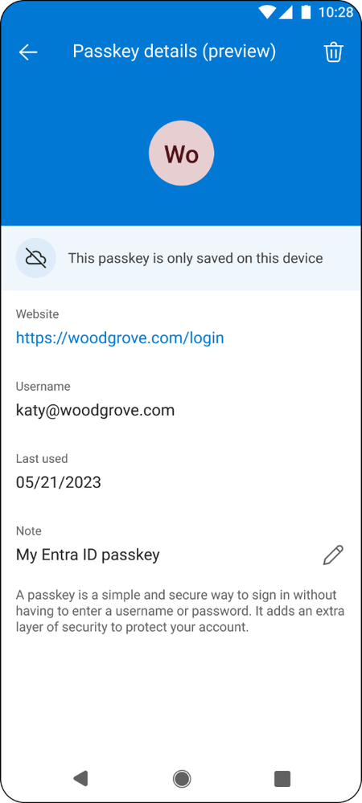
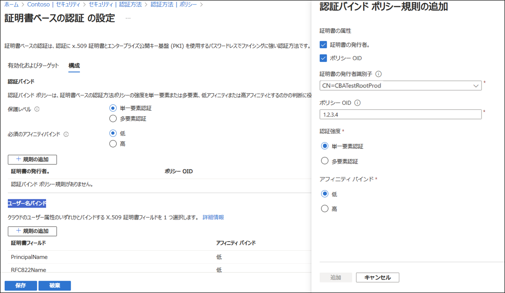

こんにちは、Azure Identity サポートチームの 張替 です。

本記事は、2023 年 12 月 15 日に米国の Azure Active Directory Identity Blog で公開された [Advancing Cybersecurity: The Latest enhancement in Phishing-Resistant Authentication - Microsoft Community Hub](https://techcommunity.microsoft.com/t5/microsoft-entra-blog/advancing-cybersecurity-the-latest-enhancement-in-phishing/ba-p/2365681) を意訳したものになります。ご不明点等ございましたらサポート チームまでお問い合わせください。

---

本日は、フィッシング耐性のある認証に向けた、いくつかの新たな機能強化をご紹介したいと思います！ この機能強化は、国家のサイバー セキュリティの改善に関する大統領令 14028 ([Executive Order on Improving the Nation's Cybersecurity | The White House](https://www.whitehouse.gov/briefing-room/presidential-actions/2021/05/12/executive-order-on-improving-the-nations-cybersecurity/)) に準拠するために不可欠であるだけでなく、デジタル ID を利用するすべての組織とユーザーの安全を確保するうえでますます重要となっています。

文章長すぎという方は以下のまとめをどうぞ。
 
	- Microsoft Authenticator がフィッシングに強いパスキーのサポートを発表
	- Microsoft Authenticator はすべてのプラットフォームで FIPS 140-3 に準拠
	- PIV/CAC 認証向けの構成オプションの増加
	- iOS および MacOS アプリケーションでの FIDO2 サポート
	- マネージド ポリシーにて "Secure by design, Secure by default" を支援
 
詳細は以下をご覧ください！
 
## Microsoft Authenticator がフィッシング耐性のある認証方式に！

Ignite 2023 で発表 ([Identity at Microsoft Ignite: Securing access in the era of AI - Microsoft Community Hub](https://techcommunity.microsoft.com/t5/microsoft-entra-blog/identity-at-microsoft-ignite-securing-access-in-the-era-of-ai/ba-p/2747279)) されたように、2024 年前半には、Microsoft Entra ID のユーザーは、デバイスに紐づくパスキーを Microsoft Authenticator アプリを用いて登録して、サインインに利用できるようになります。これは、費用対効果が高く、フィッシングに強い資格情報で、Authenticator アプリがあれば誰でも利用できる仕組みです！パスキーは FIDO 標準に関連した最新のセキュリティ機能であり、Authenticator との統合により、Authenticator が提供する革新的なセキュリティ機能や高度な機能を活用することができます。

図 1: Microsoft Authenticator アプリで管理されたパスキー
 
Microsoft Authenticator をさらに強化し、コンプライアンス要件を満たすために、Android 上の Authenticator アプリが FIPS-140 に準拠しました。
 
Microsoft Authenticator for Android は、バージョン 6.2310.7174 以降、デバイスに紐づくフィッシング耐性のあるパスキー、プッシュ型多要素認証 (MFA)、パスワードレス電話サインイン (PSI)、時間ベースのワンタイム パスコード (TOTP) を使用するすべての Microsoft Entra 認証において、連邦情報処理標準 (FIPS 140-3) に準拠しています。Intune Company Portal を使用している組織の場合は、FIPS 準拠のため、最新バージョンの Authenticator に加えて、Intune Company Portal のバージョン 5.0.6043.0 をインストールください。
 
iOS 向けの Microsoft Authenticator アプリは、2022 年 12 月に発表されたように、すでに FIPS-140 に準拠しています。Microsoft Authenticator アプリの FIPS 140 準拠の詳細については、[こちら](https://learn.microsoft.com/ja-jp/entra/identity/authentication/concept-authentication-authenticator-app#fips-140-compliant-for-microsoft-entra-authentication) をご覧ください。

## PIV/CAC を使用する組織のために設定項目を拡充

証明書ベース認証 (CBA) の一般提供開始を発表してからこの 1 年間で、米国政府機関のお客様の Entra ID CBA の利用が 850% 以上増加しました。CBA を活用することで、AD FS などのオンプレミス IdP からの移行を図りながら、PIV/CAC を使用して使い慣れたエンドユーザー体験を提供し続けることができ、お客様はゼロ トラストへの対応をより迅速に進めることが可能となります。
 
弊社ではクラウド ベースの CBA への投資を継続し、直近で証明書やリソースの種類、ユーザー グループごとに認証ポリシーを調整できる機能を追加しました。ユーザごとに証明書の強度を選択したり、多要素認証やステップアップ認証のためにCBA を他の方法と併用したり、さらにはテナント全体またはユーザー グループごとに高いアフィニティで (強い) 証明書バインドを構成したりできるようになりました。

図 2: 証明書ベースの認証におけるバインドのポリシー ルールの構成
 
Microsoft Entra 証明書ベース認証の最新の機能強化の詳細については、[こちら](https://techcommunity.microsoft.com/t5/microsoft-entra-blog/enhancements-to-microsoft-entra-certificate-based-authentication/ba-p/1061417) をご覧ください。
 
## モバイル向けにフィッシング耐性のある認証オプションを追加: iOS および macOS アプリケーション向けの FIDO2 サポート

2023 年夏に、iOS と macOS の Web ブラウザにおける FIDO2 認証のサポートを発表 ([Advancing Modern Strong Authentication - Microsoft Community Hub](https://techcommunity.microsoft.com/t5/microsoft-entra-blog/advancing-modern-strong-authentication/ba-p/3773135)) しました。本日、iOS と macOS でのFIDO2 認証のパブリック プレビューを発表できることを嬉しく思います。このリリースにより、iOS に Microsoft Authenticator をインストールしているユーザー、または macOS に Microsoft Intune Company Portal をインストールしているユーザーは、FIDO2 セキュリティ キーを使用して Microsoft アプリケーションにサインインできるようになります。この機能は現在 iOS で利用可能で、macOS では 2024 年初頭に利用可能になる予定です。
 
FIDO2 の認証は、「開発するアプリで FIDO2 キーによるパスワードレス認証をサポートする」([開発するアプリで FIDO2 キーを使用してパスワードレス認証をサポートする - Microsoft identity platform | Microsoft Learn](https://learn.microsoft.com/ja-jp/entra/identity-platform/support-fido2-authentication)) に記載されている要件を満たす、iOS および macOS の MSAL 対応サードパーティ製アプリケーションでも利用できます。
 
対応プラットフォームについては[こちら](https://learn.microsoft.com/ja-jp/entra/identity/authentication/fido2-compatibility)をご覧ください。

## CISA に沿った「Secure by design, Secure by default」アプローチに基づき既定の状態で安全な構成を採用

今月初め、Microsoft は Secure Future Initiative ([A new world of security: Microsoft’s Secure Future Initiative - Microsoft On the Issues](https://blogs.microsoft.com/on-the-issues/2023/11/02/secure-future-initiative-sfi-cybersecurity-cyberattacks/)) を発表しました。このイニシアティブの一環として、条件付きアクセス ポリシーの自動展開 ([Automatic Conditional Access policies in Microsoft Entra streamline identity protection | Microsoft Security Blog](https://www.microsoft.com/en-us/security/blog/2023/11/06/automatic-conditional-access-policies-in-microsoft-entra-streamline-identity-protection/)) を開始します。このイニシアティブは Cybersecurity and Infrastructure Security Agency (CISA) が提唱する "Secure by design, Secure by default" というアプローチに沿ったもので、消費者が日々利用するテクノロジーの安全性と完全性を信頼できるものにすることを目的としています。
 
サイバー セキュリティの課題には社会として取り組む必要があります。弊社は、政府機関、セキュリティ専門家、およびより広範なコミュニティと緊密に協力しｔえサイバー脅威に対する対策強化に取り組んでいます。弊社の目標は、政府機関のお客様に、進化するリスクに先手を打つために必要なツールと知識を提供することです。
 
サイバー セキュリティの強化に向けた当社の最近のリリースと継続的なコミットメントにより、大統領令の遵守に取り組んでいる米国政府のお客様を含め、当社の幅広いお客様をサポートしてまいります。共に、より安全なデジタルの未来を築いていきましょう。

Alex Weinert
