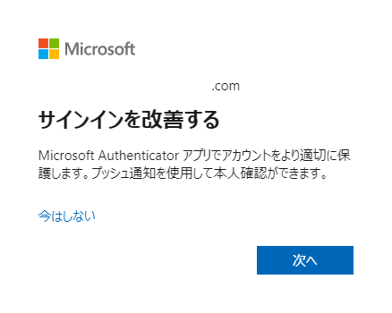

# 先進的で強力な認証の推進

こんにちは、Azure Identity サポート チームの 五十嵐 です。
本記事は、2023 年 7 月 17 日に米国の Azure Active Directory Identity Blog で公開された [Advancing Modern Strong Authentication](https://techcommunity.microsoft.com/t5/microsoft-entra-azure-ad-blog/advancing-modern-strong-authentication/ba-p/3773135) を意訳したものになります。ご不明点等ございましたらサポート チームまでお問い合わせください。

---

以前のブログ ["認証に電話網を使うのはそろそろやめよう (It’s Time to Hang Up on Phone Transports for Authentication)"](https://techcommunity.microsoft.com/t5/microsoft-entra-azure-ad-blog/it-s-time-to-hang-up-on-phone-transports-for-authentication/ba-p/1751752) で、SMS や音声などの多要素認証 (MFA) メカニズムの脆弱性について書きました。マイクロソフトの [最近の MFA 調査研究](https://arxiv.org/pdf/2305.00945.pdf) によると、SMS は [Microsoft Authenticator](https://www.microsoft.com/ja-jp/security/mobile-authenticator-app) アプリと比較して、悪意のある攻撃者を阻止する効果が 40％ 低いと結論づけています。

また、Authenticator の [セキュリティの改善](https://techcommunity.microsoft.com/t5/microsoft-entra-azure-ad-blog/new-microsoft-authenticator-security-features-are-now-available/ba-p/2464386) (日本語訳したブログは [こちら](https://jpazureid.github.io/blog/azure-active-directory/new-authenticator-security-features/)) にも引き続き取り組んでいます。しかし、電話ベースの認証から脱却することには明確な利点があるにもかかわらず、未だ MFA 要求の約 44% が SMS や音声電話によるものです。悪意のある攻撃者は、電話方式に基づく MFA を悪用し続けているのです。ユーザーを保護するために、是非より強力な認証方法を使用していきましょう。

本日は、改善に向けて取り組む皆様を支援するために、さらなる取り組みを共有したいと思います。まず、**強力な認証方法の登録キャンペーン機能を改善** し、ユーザーがより良い認証方法を登録できるようにします。そして、FIDO2 のような先進の機能をより多くの環境で利用できるように、**iOS と macOS ブラウザーでの FIDO2 サポート** の一般提供を開始します。

## 強力な認証の登録キャンペーン

2021 年 11 月、Microsoft Authenticator を始めとして最新の認証方法の採用を促進するため、登録キャンペーンの機能をリリースしました。リリース以来、何千もの企業がこの機能を利用して最新の認証方法の採用を促進し、130 万人以上のユーザーが Microsoft Authenticator を主要な認証方法として設定し、利用を開始しています。しかしながら、お客様から、最新の強力な認証方法の登録に当たり、より細かく登録動作をコントロールしたいという声をお聞きしました。この声にこたえるため、新しい機能を追加しました。

まず始めに、プロンプトのスキップ回数に上限を導入します。最新のアップデートにより、ユーザーは最大 3 回まで登録を延期できるようになります。これにより、キャンペーンの効果を高めつつ、ユーザーは変更に向けて予定や準備に十分な時間をえることができるようになります。

第二に、設定が "Microsoft マネージド" として設定されている組織の場合、MFA の方法として SMS または音声を利用しているユーザーに対して、この機能を自動的に有効にします。今月 (2023 年 7 月) より、この変更の段階的な展開を開始します。[Microsoft 365 管理センターのメッセージ センター](https://go.microsoft.com/fwlink/p/?linkid=2070717) で、管理者に対してこの変更が具体的に組織に影響する時期を通知しますので、ご注目ください。

## iOS および macOS ブラウザーでの FIDO2 サポートの一般提供開始

また、iOS および macOS の Web ブラウザーで、FIDO2 セキュリティキーを使用して Microsoft Entra ID と連携しているアプリケーションにサインインできるようになったことをお知らせします。FIDO2 セキュリティキーは、生体認証要素 (指紋) または PIN によって保護された、強力でフィッシング耐性のある認証を提供します。

これは、フィッシング耐性のある認証を必要とする大統領令 14028「Improving the Nation's Cybersecurity (国家のサイバーセキュリティの改善)」に準拠する必要がある米国政府機関など、厳格なコンプライアンス要件がある規制の厳しい組織にとって特に有用です。

[このページ](https://learn.microsoft.com/ja-jp/azure/active-directory/authentication/howto-authentication-passwordless-security-key) の指示に従って、FIDO2 セキュリティキーによるパスワードレス サインインを有効化ください。

サポートされるブラウザーのシナリオの詳細については、https://aka.ms/FIDOMatrix (日本語版の公開情報は [こちら](https://learn.microsoft.com/ja-jp/azure/active-directory/authentication/fido2-compatibility)) を参照ください。

この取り組みにより、何百万人ものユーザーがより良い MFA の方法を利用するようになることを願っております。

Alex
