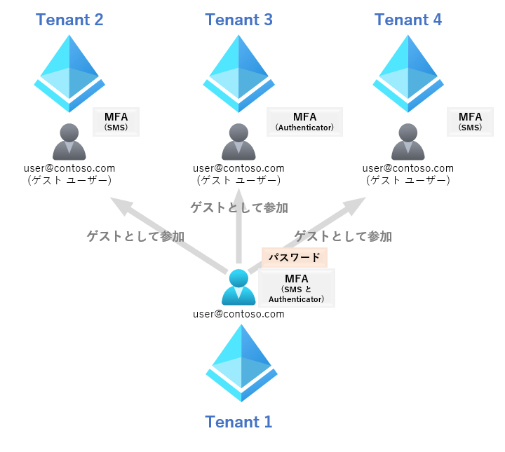
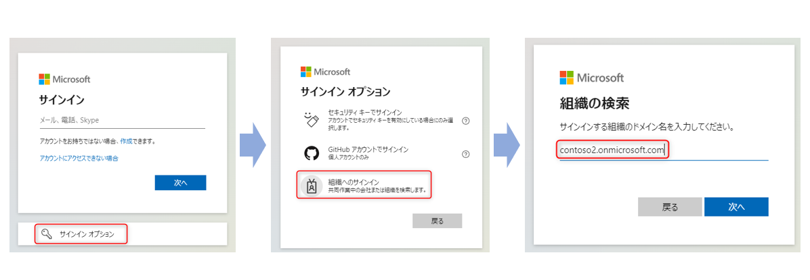
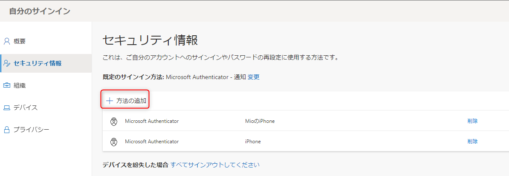

# ゲスト ユーザーの MFA のすべて

こんにちは。Azure Identity チームの栗井です。
本記事では、Azure Active Directory におけるゲスト ユーザー (B2B ユーザー) の多要素認証 (MFA) について、よくお問い合わせいただく内容をおまとめいたしました。

下記のようなユーザー様・テナント管理者様のお役に立てますと幸いです。
- 管理者 : ゲストユーザーに対して MFA を要求させたい。ゲストユーザーが利用する MFA がどのテナントに紐づくものか仕組みを知りたい。
- ユーザー : ゲストユーザーとして、ホーム テナント以外の組織に招待されている。いずれの組織へのアクセスにも MFA が要求される。MFA 用のモバイル デバイスの変更による影響が心配。

## 原則 - MFA はテナントごと登録されます
B2B ユーザーにおける MFA の原則として、**ユーザーはテナントごとに MFA を登録するする必要がある**という点があります。

下記はイメージ図です。

user@contoso.com は Tenant 1 で作成されたユーザーです。

このユーザーは、3 つのテナント (Tenant 2, Tenant 3, Tenant 4) にゲスト ユーザーとして招待されています。

今時 MFA を要求しないテナントなんてあり得ないので、いずれのテナント (Tenant 1, Tenant 2, Tenant 3, Tenant 4) もサインイン時には MFA を要求する制御を有効化しています。この場合、ユーザーは 4 つのテナントそれぞれ個別に MFA の登録を行う必要があります。

パスワードの場合はホームテナントに紐づくもののみになるので、仕組みが異なる点に

Azure AD で利用可能な MFA の方法は、Microsoft Authenticator アプリや SMS、音声通話などがありますが、テナントごとに管理者が許可している方法は異なります。そのため上記の例でも、ユーザーはテナントごとに異なる方法を登録しています。同じ SMS でも、テナントごとに送信先の番号を変更することもできます (もちろん同じ番号の利用も可能です)。

## 注意点 : MFA の設定変更は、各テナントごとに設定変更が必要です。モバイルデバイス買い替え時に注意 !
上記の原則をふまえて、ご利用者様に気を付けていただきたい点がございます。
それはサブタイトルの通り、**モバイルデバイスを変更する場合、各テナントごとに設定変更が必要となる**ということです。

Azure AD で利用可能な MFA の方法は、Microsoft Authenticator アプリや SMS、音声通話などがありますが、いずれの場合も日頃利用しているスマートフォンを登録することが一般的です。そのため、スマートフォンの買い替え時には、MFA の方法も再登録する必要があります。

そして繰り返しの記述となりますが、**MFA の再登録は参加しているすべてのテナント上で実施いただく**必要があります。

> [!NOTE]
> よくある例 : スマートフォン買い替えにあたって、Tenant 1 (ホームテナント) に登録している MFA の方法を変更した。しかしゲストユーザーとして参加している Tenant 2,Tenant 3, Tenant 4 の MFA の方法を変更しなかった。そのため、招待先のテナント上のリソースやアプリケーションへのアクセスができなくなってしまった。

## ゲストユーザーの MFA の設定変更方法
ここでは、ユーザーが外部テナントに登録した MFA の方法を変更する手順をご紹介します。

1. アカウントからサインアウトした状態で、下記 URL にアクセスします。
URL : https://aka.ms/mfasetup
2. [サインイン オプション] > [組織へのサインイン] に進み、招待先のテナントのテナント名を入力します。
   
   
3. 登録済みの方法で MFA  が要求されるので、変更前のデバイスで MFA を完了します (※)。
4. MFA の設定画面が表示されます。[+ 方法の追加] から新しい方法を登録します。
   
   
   上記は画面の例ですが、テナントの設定によっては UI が異なります。詳細は[MFA 認証方法を、変更 / 再登録 / 追加 したい！](https://jpazureid.github.io/blog/azure-active-directory/change-mfa-verification-method/)の記事にてご紹介しています。

(※) 例えばスマートフォン紛失時など、「登録済みの方法で MFA が実施できない」場合は、3. 以降の操作に進むことができません。このような場合は、該当テナントの管理者によるユーザーの MFA のリセットが必要です。リセット完了後、ユーザーは上記 1. ~ 4. の操作を実施ください (3. はスキップされます)。

管理者による MFA のリセットの方法は、[MFA 認証方法を、変更 / 再登録 / 追加 したい！](https://jpazureid.github.io/blog/azure-active-directory/change-mfa-verification-method/) の記事にてご紹介しています。

以上の情報が参考になりましたら幸いです。ゲストユーザーの MFA 登録に関してご不明点や問題など発生した際には、ぜひ弊社のサポートサービスまでお問い合わせください。