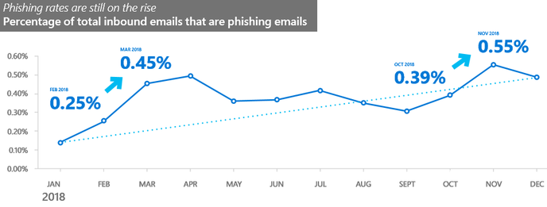

本記事は、 2019 年 10 月 3 日に Azure Active Directory Identity Blog に公開された記事 (All your creds are belong to us!) を翻訳したものです。原文は [こちら](https://techcommunity.microsoft.com/t5/azure-active-directory-identity/all-your-creds-are-belong-to-us/ba-p/855124) より参照ください。

# 君達の資格情報は全ていただいた！

> 先日ですが、お客様がアカウント乗っ取り (ATO) の標的となり、我々のチームが支援したということがありました。SMS と Authenticator アプリを使用して 2 段階認証を必須にしてアカウントを保護していたにも関わらず、攻撃者はアカウントに侵入し、パスワードが変更されていました。
> 
> MFA は破られてしまったのです。

前回のブログでは、[パスワードで攻撃は防げない](https://jpazureid.github.io/blog/azure-active-directory/your-password-doesnt-matter/) こと、多要素認証 (MFA) であれば攻撃を防げることを解説しました。ただ、何人かの方が「MFA は万能薬ではない」とコメントくださりました。標的型攻撃など攻撃者が MFA を突破するために十分な投資をすることを厭わない場合、確かにこれはそのとおりであり、これを防ぐ簡単な方法はありません。

**でも不安がる必要はありません、多要素認証 (MFA) は、アカウントの保護を真剣に考えているのであれば、最低限取り組むべきこととして変わりありません。** パスワードに加えて何かしらのものを使えば、攻撃者のコストは大幅に増加します。このため、**何らか MFA を使用しているアカウントが乗っ取られる率というのは、全体の 0.1% 以下になります。**

パスワード攻撃に比べて、パスワード以外の認証要素を標的にした攻撃は極めて稀です。MFA の要求を付与して発行されたすべてのトークンを見てみると、**企業アカウントで月に MFA を使用しているユーザーは 10% 未満である**という状況です (これにはオンプレミスおよびサードパーティの MFA も含まれます)。MFA がより広く普及すれば、攻撃者はその攻撃手法を洗練させる必要が生じるでしょうが、現状はその必要はほとんどありません。しかし、MFA への攻撃は確かに存在しており、このブログではその攻撃について解説していきます。

> 標的となったユーザーは当初、Authenticator アプリを使用してパスワードを回復したが、その後、攻撃者は再びパスワードを変更し、アカウントからアプリを削除しました。
> 
> これは、直接的に人を介した標的型攻撃でした。

## すべての認証要素には脆弱性がある

認証要素を破るメカニズムは、単純な推測から [強要 (暴力や恐喝など)](https://xkcd.com/538/) まで幅広く存在します。だからといって、すべての認証要素が同じように脆弱であるわけではありません。コストは攻撃の種類によって大きく異なり、匿名性を維持し、標的となるユーザーに近づく必要のない攻撃の方がはるかに簡単に達成可能です。

残念ながら、今日一般的に使用されている事実上すべての認証要素 - 電話、電子メール、ワンタイム パスコード (OTP) トークン、プッシュ通知 - は、認証要素に使用される通信チャネルの乗っ取り (チャネル ジャッキング) や中間のマシンを使用した認証メッセージの傍受と再生 (リアルタイム フィッシング) などの比較的低コストの攻撃に対して脆弱です。残念なことに、これら 2 つの攻撃は、最近ニュースにもなりました (私たちのお客様でも同様です)。MFA のバイパス攻撃は非常に稀であるため、その統計を得るには至っていませんが、実際に発生した場合には、これら 2 つのケースのいずれかに当てはまります。

ここに、脆弱性の評価 (強要はすべての要素に当てはまるので除きます) と一般的な資格情報の種類を一覧をまとめました。ここでカバーされてない内容ももちろんあるはずです😊

<table>
  <thead>
    <tr>
      <th width=50%>資格情報</th>
      <th width=10%>リアルタイムにフィッシング可能か</th>
      <th width=10%>チャネル ジャッキングが可能か</th>
      <th width=30%>資格情報を突破するその他の方法</th>
    </tr>
  </thead>
  <tbody>
    <tr>
      <td><strong>パスワード</strong>: ユーザーが選択した秘密の情報であり、ログイン画面で入力され、サーバーに保存されているパスワードの派生情報と比較される。</td>
      <td>Y</td>
      <td>Y</td>
      <td><a href="https://jpazureid.github.io/blog/azure-active-directory/your-password-doesnt-matter/" target="_blank" rel="noopener">前回のブログ</a>を参照</td>
    </tr>
    <tr>
      <td>個人識別番号 (<strong>PIN</strong>): パスワードのように使用される、ユーザーが選んだよりシンプルな秘密情報であり、通常は 4 ～ 8 文字である。生体情報と同様に、手元のデバイスへのアクセスに使用するのに最適である。</td>
      <td>Y</td>
      <td>Y</td>
      <td>パスワードと同様だが推測および再利用されやすく、一般的にストレージ上にデータとして残る可能性がある。</td>
    </tr>
    <tr>
      <td>単純な<strong>承認</strong>: 通信チャネルやデバイスがユーザーの所有物であることを確認するもの。アプリで単純な "承認/拒否 " を選ぶポップアップが表示されたり、電話では "承認するには 1 を押してください "とメッセージが流れるもの。レガシーな認証プロトコルで、より先進的なやり取りに対応していない場合に便利な方法です。</td>
      <td>Y</td>
      <td>Y</td>
      <td>ユーザーに複数のリクエストを送信してユーザーを混乱させ、そのうち 1 つが承認することを狙う。  承認操作が行われるデバイスを盗む。</td>
    </tr>
    <tr>
      <td>サーバーが送信するワンタイム <strong>パスコード</strong> (OTP): ログイン画面に入力するためにユーザーに送信されるコードのこと。これにより、通信チャネルや対象のデバイスをユーザーが制御していることを示す。ログイン サーバーがユーザーにコードを送信し、ユーザがコードを入力することで、チャネルまたはデバイスがユーザーの制御下にあることを証明する。</td>
      <td>Y</td>
      <td>Y</td>
      <td>OTP を受信するデバイスを盗む。</td>
    </tr>
    <tr>
      <td><strong>OATH ハードウェア トークン</strong>に数十秒毎に表示されるワンタイム パスコード (**TOTP</strong>): トークンとログイン サーバとの間で共有している秘密情報と現在の時刻を使用して、トークン上にコードを生成する。秘密情報はハードウェア トークンに組み込まれている。この秘密情報はサーバーに登録され、回復可能な形 (平文または暗号化された形) で保存しなければならない。これは、管理者が必要に応じて行うこともあれば、ユーザーが何らかの登録サービスを介してトークンの ID を秘密情報に変換することでも行われる。ログイン時には、ユーザーが生成されたコードをログイン サーバーの画面に入力し、ログイン サーバーは登録されている秘密情報を使用してコードを検証する。このコードは通常、物理的なトークンを持っている人なら誰でも利用できる。登録プロセスに変更を加えた OATH の派生が複数あるが、セキュリティ モデルはいずれも大きく変わらない。</td>
      <td>Y</td>
      <td>N</td>
      <td>コードを読んでログインを達成するのに十分な時間デバイスを盗むかアクセスする。  中間者を使って登録時の秘密情報を傍受する。  秘密情報が保存されているデータベースを盗む。コストの高い攻撃だが、ログイン サーバーのすべての OATH トークンを得られる。</td>
    </tr>
    <tr>
      <td><strong>OATH ソフトウェア</strong> TOTP トークン: OATH ハードウェアと異なり、秘密情報がソフトウェア トークンによってサーバーに配信される。秘密情報が直接送信されるため、ハードウェア トークンよりも登録が脆弱になる可能性がある。実際の秘密情報は、RSA や Symantec Tokens のような OATH に派生するトークンで仲介されることもある。Microsoft Authenticator や Google Authenticator のようなソフトウェア OATH トークンをホストするアプリは、指紋や顔のスキャン、PIN のようなデバイスのロックを解除するジェスチャーでコードを保護している。</td>
      <td>Y</td>
      <td>N ※</td>
      <td>※ OS の状態をバックアップする (秘密情報がバックアップされる) 機能が有効になっていない場合。  デバイスを盗む (ロック解除のジェスチャーが必要な場合は実害は小さいかも)。  攻撃者はウィルスなど悪意あるソフトを用いて登録時の秘密情報を傍受できる可能性がある。</td>
    </tr>
    <tr>
      <td><strong>Microsoft Authenticator</strong> のような認証<strong>アプリ</strong>: デバイスに登録されたアプリを利用して認証する。スマートカードや Windows Hello と同様に登録手順は安全で、公開鍵 (秘密情報は保存されない) を登録する。</td>
      <td>Y</td>
      <td>N ※</td>
      <td>※ OS の状態をバックアップする (キーがバックアップされる) 機能が有効になっていない場合。  ユーザーを混乱させる (ログインするのに画面上に表示された何らかの情報をユーザーに選択させるなどを場合を除く)。  OS のアカウントを乗っ取り、アプリのバックアップ/リストアが有効および利用可能な場合は、OS がバックアップしたアプリのデータを復元する。</td>
    </tr>
    <tr>
      <td><strong>スマートカード</strong>: 登録時の鍵交換に安全な登録手続きが使用されている。サーバーは公開鍵を保持し (秘密情報は保持されない)、登録されたものと同じトークンが使用されていることを検証する。一部のカードでは、登録と使用の両方がログインを試みているハードウェアに紐づけられており、これらのカードはフィッシング不可能になっている。</td>
      <td>N</td>
      <td>N</td>
      <td>肩越しに PIN を盗み見てカードを盗む。</td>
    </tr>
    <tr>
      <td><strong>Windows Hello</strong>: 登録時の鍵交換に安全な登録手続きが使用されている。サーバーは公開鍵を保持し (秘密情報は保持されない)、登録されたものと同じトークンが使用されていることを検証する。重要な点として、登録と使用の両方がログインを試みているハードウェアに紐づけられている。</td>
      <td>N</td>
      <td>N</td>
      <td>肩越しに PIN を盗み見て PC を盗む (生体認証が有効な場合は困難)。</td>
    </tr>
    <tr>
      <td><strong>FIDO</strong> トークン: 登録時の鍵交換に安全な登録手続きが使用されている。サーバーは公開鍵を保持し (秘密情報は保持されない)、登録されたものと同じトークンが使用されていることを検証する。重要な点として、登録と使用の両方がログインを試みているハードウェアに紐づけられている。詳しくは Pamela Dingle の <a href="https://techcommunity.microsoft.com/t5/Identity-Standards-Blog/All-about-FIDO2-CTAP2-and-WebAuthn/ba-p/288910" target="_blank" rel="noopener">ブログ</a> を参照のこと。</td>
      <td>N</td>
      <td>N</td>
      <td>肩越しに PIN を盗み見て PC を盗む (生体認証が有効な場合は困難)。</td>
    </tr>
  </tbody>
</table>

注: 生体認証をサーバー側に登録するのはアンチパターン (一度指紋のデータベースが破られると、他のサーバーでも指紋の使用が危険になる) であり、デバイスのロック解除ジェスチャー (Windows Hello や IOS、Android と同等のものなど) の話題のために残しておきたいと思いますので、ここでは取り上げません。この問題については、別途ブログで紹介します。

攻撃のコストが低いことを考えると、これらチャネル ジャッキングとリアルタイム フィッシングが、パスワード以外の認証要素が破られてしまう主な方法となります。

## チャネル ジャッキング

多くの認証要素は、その動作において通信チャネルに依存しています。例えば、ログイン画面に入力するコードを携帯電話で受信した場合、その携帯電話 - 関連するすべての携帯電話事業者、通信基盤、カスタマー サポート、SIM 基盤 - がチャネルとなります。多くの場合、攻撃者はとても単純な仕組みでチャネルを乗っ取ることができます。

コンシューマー向けのアカウント システムで最も多いチャネルは、電子メール (55%)、テキスト メッセージ (44%)、プッシュ通知 (4%)、音声通話 (1%) です。これらのメカニズムはそれぞれにチャネル ジャッキングの可能性があります。それぞれのメカニズムは、プロバイダー アカウント (メール プロバイダー、電話会社、オペレーティング システム ベンダー) に依存しており、多かれ少なかれパスワード攻撃やソーシャル エンジニアリングによる詐欺、サポート スタッフへの賄賂に対して脆弱となっています。

携帯電話には、無線通信やプロトコルの脆弱性が多数存在しています。攻撃者は、[メッセージを傍受するためのソフトウェア ベースの無線](https://www.securitynewspaper.com/2018/02/19/intercept-mobile-communications-calls-messages-easily-without-hacking/) や近傍に [FEMTO](https://securitywatch.pcmag.com/hacking/314370-black-hat-intercepting-calls-and-cloning-phones-with-femtocells) を配備したり、[SS7 傍受サービス](https://www.theverge.com/2017/6/13/15794292/ss7-hack-dark-web-tap-phone-texts-cyber-crime) を利用して電話のトラフィックを盗聴したりすることも可能です。

> 認証が解除されるのには必ず何かのきっかけがあったはずなので、標的となったユーザーに携帯電話を確認してもらいました。見てみると、SIM が機能していないことがわかりました。
> 
> 携帯電話事業者のカスタマー サポート チームが罠にはめられ、標的のユーザーの SIM が攻撃者の管理する電話に付け替えられていたのです。

繰り返しになりますが、このような攻撃はパスワードのみの攻撃に比べれば極めて稀であり、SMS ベースの認証でさえ、標的型攻撃であっても大部分を防ぐことが可能です。しかし、盗聴されたり、フィッシングされたり、ソーシャル エンジニアリングされたり、賄賂で買収されたり、パスワードを盗聴されたりする可能性のあるチャネルにはご注意ください。アカウントを回復するのに電子メールや携帯電話番号など他のアカウントを使用する場合は、できるだけそれらのセキュリティを高めてください。ほとんどの携帯電話事業者は、例えば、PIN コードや OATH の認証機能のような追加のセキュリティを提供しており、電子メールを使った回復アカウントでもパスワード以外の認証要素を使用することができるはずです。

信頼は、そのつながりが最も弱い箇所から失われていきます。これは多く場合、通信チャネルです。あなたの携帯電話 (カスタマー サポートやプロトコルの脆弱性があり暗号化されていない通信が傍受される可能性がある) と FIDO (やり取りされている暗号化された通信の覗き見にすら OS レベルのウィルスが必要) を比べてみてください。この FIDO のレベルのセキュリティでは、認証機能は **チャネルに依存しません**。つまり、このような仕組みがチャネル ジャッキングへの対応に必要ということです。

## リアルタイム フィッシング

賢明な管理者であればユーザーに MFA を使用するよう依頼していると思いますが、一部のフィッシングは非常に進んでおり、サイトになりすまして本物そっくりの偽の要求を送信するものも出てきています。これを簡単に実現するツールとしては [Modlishka](https://github.com/drk1wi/Modlishka) というものがあります。これは「リアルタイム フィッシング」と呼ばれることもあり、攻撃者がコントロールする悪意ある中継サーバー (MitM) にユーザーを誘導することで行われます。Microsoft のメール システムでは、フィッシング メールが急増していることを確認していますが、これらのうちどれほどがリアルタイム フィッシングを利用したものかははっきりしていません。

見た目から、私は MitM といえば、ローマ時代の始源の神 [ヤヌス](https://en.wikipedia.org/wiki/Janus) を思い出します。ヤヌスは 2 つの顔を持つ神です。この例えでは、一方の顔がクライアントからログイン サーバーに、もう一方の顔がログイン サーバーからクライアントに見えるよう模倣しています。この MitM は、どちらか一方から聞いたことを他方に繰り返し伝えるだけです。

Modlishka のようなツールを使えば、MitM は一方から他方に対して聞いたことをすべて繰り返し伝えることが可能となります。一度サイトに誘われてしまえば、クライアントが攻撃から逃れる唯一の方法は、ログイン サーバーが偽物であることに気づけるかどうかです。しかしこれは人間が最も苦手とすることであり、ブラウザーが偽サイトであると警告しても気づけないこともあります。

> 恐らくフィッシングかパスワードスプレー攻撃か漏洩した資格情報の悪用かにより、標的のユーザーのパスワードは既に突破されてしまった。
> つまり今度攻撃者がユーザーの携帯電話をチャネル ジャッキングしてしまえば、もうゲームオーバーだ。

リアルタイム フィッシングに対抗するには、米国国立標準技術研究所 (NIST) 800-63-3 が「[Verifier Impersonation Resistance](https://pages.nist.gov/800-63-3/sp800-63b/sec5_authenticators.html#verifimpers)」と呼ぶ認証プロセスが必要です (Verifier とはログイン サーバーのこととお考えください)。これは、認証処理を行う機器がログイン サーバーが誰であるかを暗号的に検証しなければならないという意味です。クライアントは、何らかの方法でログイン サーバーの署名を検証するか、検証済みの公開鍵を使ってログイン サーバーのメッセージを暗号化する必要があります。クライアント認証が完了した TLS はこのようなプロセスを行う 1 つの方法ですが、究極的にはサーバーが誰であるかを認証機能自身が検証する必要があります。人間はこのような検証が不得意ですから。

NIST さらに "Authenticators that involve the manual entry of an authenticator output, such as out-of-band and OTP authenticators, SHALL NOT be considered verifier impersonation-resistant because the **manual entry does not bind the authenticator output to the specific session being authenticated**. In an MitM attack, an impostor verifier could replay the OTP authenticator output to the verifier and successfully authenticate." と言っています。

簡単に言えば、ログイン サーバーが誰であるかを暗号的に検証しない認証機能は、フィッシングされる可能性があるということです。

> 標的となったアカウントをすぐにロックしました。アカウント所有者の確認もとれましたので、新しい有効な認証情報でアカウントを回復できました。

## 希望が見えてきました？

ソーシャル エンジニアリング攻撃やフィッシング攻撃に対し、人間は基本的に脆弱であるという認識のもと、チャネルに依存しない、ログイン サーバーのなりすましに強い認証機能が登場しています。これらの中でも特に重要なのが、スマートカード、Windows Hello、および FIDO です。セキュリティの観点から見るとこれらの認証方法は攻撃に非常に強いですが、いくつか課題もありますので別途解説したいと思います。

> 最終的に標的となったアカウントは回復しました。携帯電話事業者のアカウントを PIN で保護し、Microsoft アカウントに登録された SMS の電話番号は FIDO のトークンに置き換えました。

強力な多要素認証の利用率が全体の約 10% しかないことを考えると、いずれかの MFA を利用すれば、攻撃からは免れることとなります。MFA (どのようなメカニズムでも) を破るには膨大なコストがかかります。それでも攻撃者が狙いたいと思うのは、狙うに値する非常に価値のあるアカウントと資産がある場合に限られるでしょう。それこそ、ログイン サーバーのなりすまし耐性のある認証機能の出番です。これらの "フィッシング耐性" のある認証機能は、暴力や恐喝などの強要以外であれば非常に強力ですし、資金力のある攻撃者や強要を除いてほとんどすべての攻撃にも強いです。攻撃のリスクやコストを考慮すると、支払うべき代償が大きすぎるため、攻撃者も資格情報を盗み取るには至らないでしょう。

今すぐ絶対に MFA をオンにしましょう。何もしないより 99.9% 以上ましです。二要素目として電話を使用している場合は、ぜひそのアカウントをより強力に保護ください。できれば、チャネルに依存しないメカニズムである Microsoft Authenticator を使用いただければ、使い勝手も良く、無料で導入することもできるのでお勧めです (現在、ログイン サーバーのなりすまし耐性に取り組んでいるところです)。そして、Windows Hello や FIDO のような、チャネルに依存せずログイン サーバーのなりすましにも強い認証機能を活用した長期的な認証戦略を構築していきましょう。

皆様お気をつけて。

Alex
[@alex_t_weinert](http://twitter.com/alex_t_weinert)